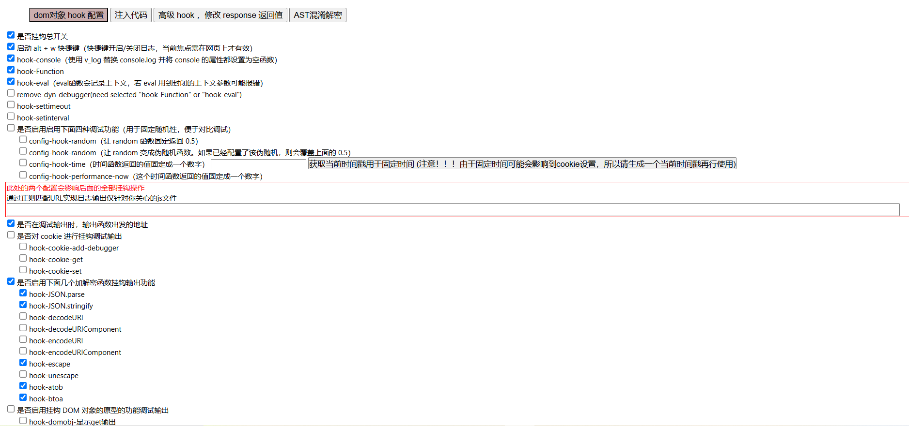
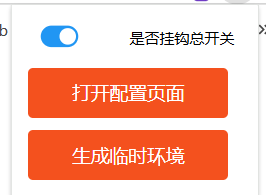
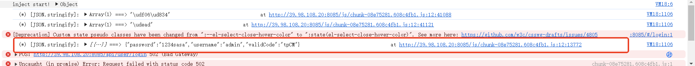
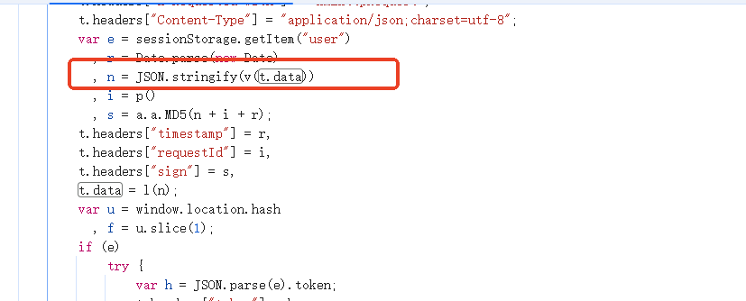
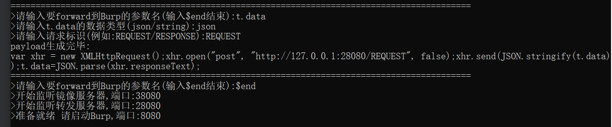
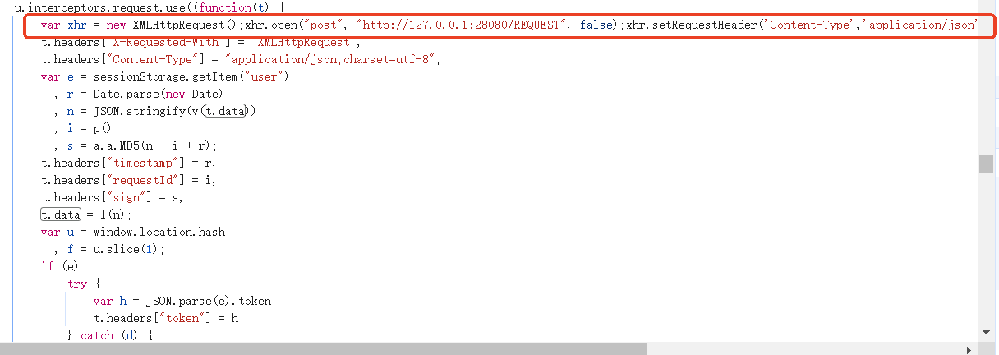
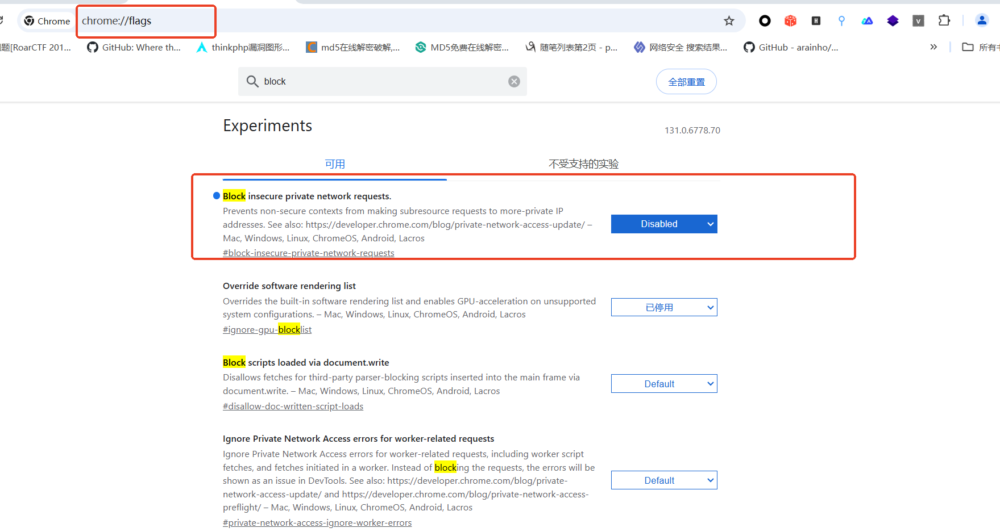
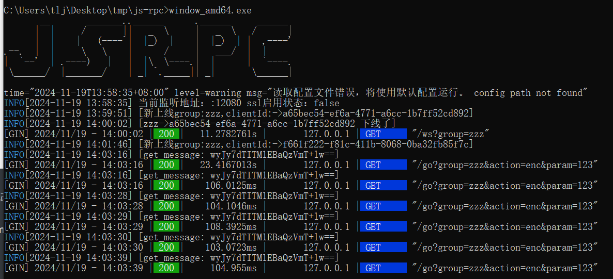
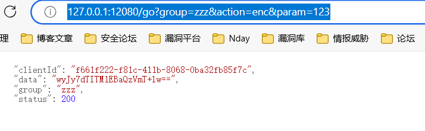

### 定位事件的JavaScript代码

#### 较麻烦但有效的方法

f12->源代码->事件侦听器断点，选择触发JavaScript的事件下断点


之后该事件便可触发JavaScript断点


#### 修改外部引用的Javascript

嵌入html页面的JavaScript很容易更改，但是浏览器一般不支持直接对引用的外部JavaScript脚本文件进行更改，此时需要将该文件替换为本地JavaScript文件，然后才能进行更改。

* 新建一个文件夹用于存放本地JS，在源代码-》覆盖/替换(cover)-》先择替代文件夹，选择后允许


* 在源代码-》页面，选择需要更改的JS文件，保存替代，之后本地JS文件夹就有了我们刚刚保存的文件，此时该JS文件就可以任意修改了


### JS-forward+v_jstools 便捷修改加密数据包（适用于抓包改包）

* 浏览器安装v_jstools插件https://pan.baidu.com/s/1gFYnVyeqCtUeC1QT4chOow?pwd=5e22，并做相应配置



打开插件



* 使用插件定位明文点，浏览器控制台点击跳转到该明文点，查看加密的变量





* 下载js-forward，https://github.com/G-Security-Team/JS-Forward.git，运行脚本

使用这个工具的方法就是在加密函数钱嵌入一段代码，将要加密的数据转发到该工具，该工具作为一个中继，再转发给burp或者其他抓包工具，我们对其进行修改后再返回给脚本，从而实现在加密前主动修改报文内容。

这里输入参数名、数据类型和请求标识（并无实际作用，仅做标识），然后脚本会生成一段js代码，我们将其嵌入加密函数前（嵌入操作见前面修改外部引用js）





如果此处出现CORS错误，以chrome浏览器为例，可以对其进行设置



* burp收包改包

### JS-RPC+Mitmproxy 便捷自动加密数据包（适用于主动发包时自动加密）

#### 配置JS-RPC

https://github.com/jxhczhl/JsRpc

* 运行JS-RPC的服务



* 控制台中粘贴代码

```javascript
function Hlclient(wsURL) {
    this.wsURL = wsURL;
    this.handlers = {
        _execjs: function (resolve, param) {
            var res = eval(param)
            if (!res) {
                resolve("没有返回值")
            } else {
                resolve(res)
            }

        }
    };
    this.socket = undefined;
    if (!wsURL) {
        throw new Error('wsURL can not be empty!!')
    }
    this.connect()
}

Hlclient.prototype.connect = function () {
    console.log('begin of connect to wsURL: ' + this.wsURL);
    var _this = this;
    try {
        this.socket = new WebSocket(this.wsURL);
        this.socket.onmessage = function (e) {
            _this.handlerRequest(e.data)
        }
    } catch (e) {
        console.log("connection failed,reconnect after 10s");
        setTimeout(function () {
            _this.connect()
        }, 10000)
    }
    this.socket.onclose = function () {
        console.log('rpc已关闭');
        setTimeout(function () {
            _this.connect()
        }, 10000)
    }
    this.socket.addEventListener('open', (event) => {
        console.log("rpc连接成功");
    });
    this.socket.addEventListener('error', (event) => {
        console.error('rpc连接出错,请检查是否打开服务端:', event.error);
    });

};
Hlclient.prototype.send = function (msg) {
    this.socket.send(msg)
}

Hlclient.prototype.regAction = function (func_name, func) {
    if (typeof func_name !== 'string') {
        throw new Error("an func_name must be string");
    }
    if (typeof func !== 'function') {
        throw new Error("must be function");
    }
    console.log("register func_name: " + func_name);
    this.handlers[func_name] = func;
    return true

}

//收到消息后这里处理，
Hlclient.prototype.handlerRequest = function (requestJson) {
    var _this = this;
    try {
        var result = JSON.parse(requestJson)
    } catch (error) {
        console.log("请求信息解析错误", requestJson);
        return
    }
    if (!result['action'] || !result["message_id"]) {
        console.warn('没有方法或者消息id,不处理');
        return
    }
    var action = result["action"], message_id = result["message_id"]
    var theHandler = this.handlers[action];
    if (!theHandler) {
        this.sendResult(action, message_id, 'action没找到');
        return
    }
    try {
        if (!result["param"]) {
            theHandler(function (response) {
                _this.sendResult(action, message_id, response);
            })
            return
        }
        var param = result["param"]
        try {
            param = JSON.parse(param)
        } catch (e) {
        }
        theHandler(function (response) {
            _this.sendResult(action, message_id, response);
        }, param)

    } catch (e) {
        console.log("error: " + e);
        _this.sendResult(action, message_id, e);
    }
}

Hlclient.prototype.sendResult = function (action, message_id, e) {
    if (typeof e === 'object' && e !== null) {
        try {
            e = JSON.stringify(e)
        } catch (v) {
            console.log(v)//不是json无需操作
        }
    }
    this.send(JSON.stringify({"action": action, "message_id": message_id, "response_data": e}));
}
```

* 建立连接

```javascript
var demo = new Hlclient("ws://127.0.0.1:12080/ws?group=zzz");
```

* 找到加密函数，并在JS-RPC中注册该函数（注册原理见项目文档）

```javascript
// "enc"是我们远程调用时使用的名称，函数是远程调用的逻辑，内部调用的enc是加密函数
demo.regAction("enc", function (resolve, param) {
    var res = enc(String(param));
    resolve(res);
})
```

* 访问`http://127.0.0.1:12080/go?group=zzz&action=enc&param=123`得到param的加密结果

