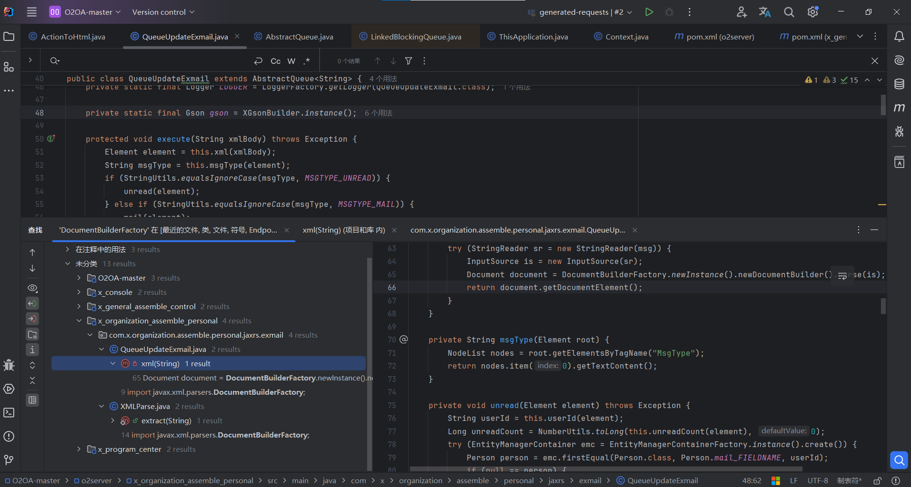

## 前期测试

### 技术栈

* 数据库OpenJPA
  * 映射支持XML和注解两种
* web框架，目前看来没有使用，直接用的servlet和Jaxrs
  * 怎么找servlet
    * 注解@webServlet
    * web.xml `<servlet>    <servlet-name>myServlet</servlet-name>    <servlet-class>com.example.MyServlet</servlet-class> </servlet>`
    * `ServletContext`动态注册`ServletContext context = getServletContext();
      context.addServlet("myServlet", new MyServlet()).addMapping("/dynamicServlet");`
    * Jaxrs的`@Path`
* 前后端分离，没用jsp，暂时没有看到模板文件

### 敏感框架和组件

依赖太多了，目前是：

* 找熟悉的依赖分析
* idea中自带的提示，找高分研究

* net.o2oa:o2server:9.0
  * 依赖项 maven:com.mchange:c3p0:0.9.5.3 为 vulnerable  XXE

### 历史漏洞

* CNVD
  * 文件上传
  * 文件读取（？[O2OA open 后台任意文件读取漏洞 | PeiQi文库](https://peiqi.wgpsec.org/wiki/oa/O2OA/O2OA open 后台任意文件读取漏洞.html)）
  * 解压覆盖命令执行
  * 逻辑缺陷
  * in***接口远程代码执行（？[O2OA-POC/POC.md 在主 ·wendell1224/O2OA-POC](https://github.com/wendell1224/O2OA-POC/blob/main/POC.md)）
* github
  * 上传通知公告（html、pdf） 存储型XSS
* 官方
  * XXE https://mp.weixin.qq.com/s/h6ZsNJrCvM26R_qSBs7EnQ
  * RCE https://mp.weixin.qq.com/s/VmOlMSQVQ9Lr03SbQUvckA
  * 组件漏洞 https://mp.weixin.qq.com/s/xSS5ySSfX9tIFOhf6ab3wg

## 深入代码

### 主要路由

### 借鉴历史漏洞审计

#### 官网XXE

* SAXReader已被修复

### 按照漏洞分类审计

#### XXE

* SAXReader已被修复

* XMLReaderFactory正在审计，发现一处后台XXE
* DocumentBuilderFactory
  * ` com. x. server. console. server. application. ApplicationServerTools#contextParamProject(Path dir)`没有处理就进行调用，但是上层调用是部署相关代码，不好利用，先略过
  * `com.x.general.assemble.control.jaxrs.office.ActionToHtml#doc(byte[] bytes)` 解析doc的一个地方调用，最上层接口未授权访问，但是该接口应该没有xxe注入问题 ，接口`/x_general_assemble_control/jaxrs/office`

**对XInclude的支持情况**

没有找到**Apache Xerces-J**和**Saxon**

### 从功能点审计

#### 文档解析引发的xxe注入

审计xxe注入关键字的时候发现有一个转换doc和docx为html的功能点，上层接口没有鉴权，深入看一下是否有xxe问题：

测试方法：

* xxe

  * 本地测试docx转html的地方已经禁用了DOCTYPE首部，其他地方不知道哟有没有

* ### ole to readfile

  * 查资料需基于libreoffice，这里看起来不是
  * 这里通过代码嵌入不好操作，还是选择解压后手动更改文件再压缩，貌似7zip的压缩格式不正确，我这里压缩和解压缩都选择python脚本
  * 直接改oleObject1.bin中的路径，怕出bug，进行等长替换，长度用`\ .`等字符凑，可以使用相对路径

### 按想法审计

#### jdbc反序列化

#### 未授权解析接口的深入研究，是否可以利用