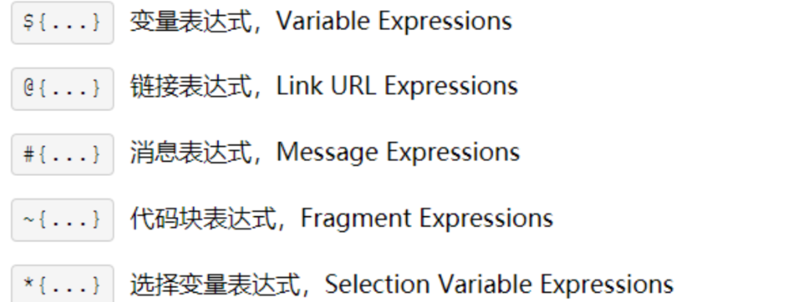
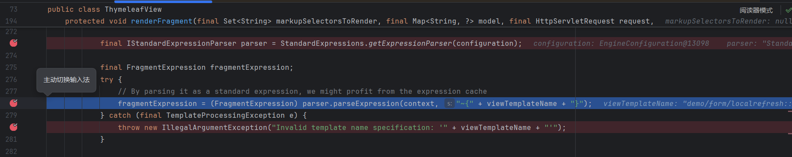
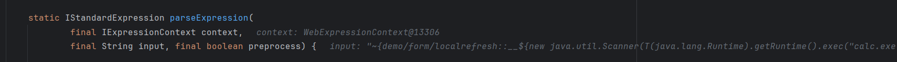
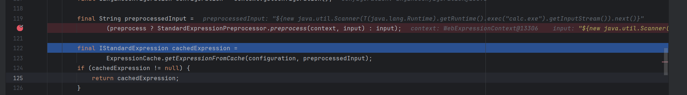
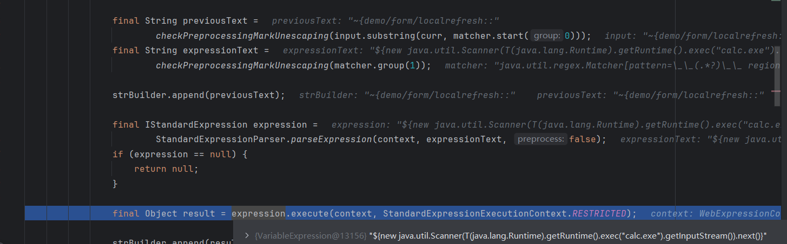
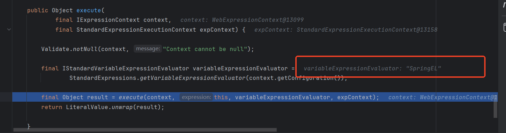
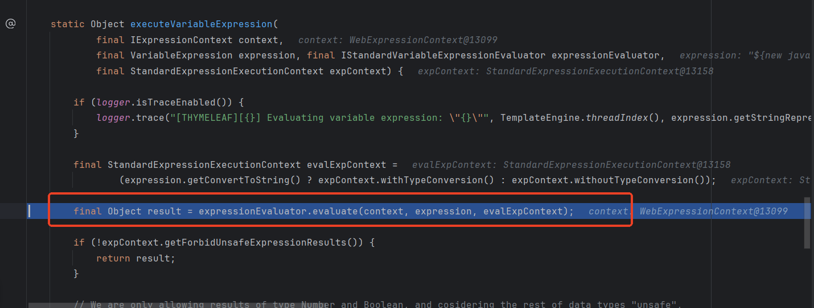

### thymeleaf简介

#### thymeleaf 中的表达式

如果使用过JSP或者任意的模板引擎，应该对模板引擎的表达式概念不陌生，简单来说它用于在模板文件（通常是 HTML）中嵌入动态数据和逻辑。这些表达式让模板能够根据传入的数据（如从服务器端传来的对象、变量等）进行定制化的内容生成。

例如一个片段：

```html
<tr th:each="user : ${userList}">
    <td th:text="${user.name}"></td>
    <td><a th:href="@{/user/{id}(id=${user.id})}">Details</a></td>
</tr>
```

这里的`th:each`等`th:`开头的是属性指令，`th:each`的作用是遍历后面的变量`userList`，这里的`${userList}`则是一个变量表达式，从Controller中传入的Model中取得`userList`对象，后面的`th:text="${user.name}"`很好理解，就是取得`user.name`作为文本，`@{/user/{id}(id=${user.id})}`则是一个链接表达式，配合`th:href`生成了一个链接。

假设`userList`中的两个用户对象信息如下：

- 用户 1：`id`为 1，`name`为 "John"
- 用户 2：`id`为 2，`name`为 "Alice"

生成的 HTML 内容可能如下：

```html
<tr>
    <td>John</td>
    <td><a href="/user/1">Details</a></td>
</tr>
<tr>
    <td>Alice</td>
    <td><a href="/user/2">Details</a></td>
</tr>
```

包括刚刚接触的两种表达式在内，thymeleaf支持以下五种表达式：



我们需要特别介绍其中的~{}（代码块表达式，更常见的说法是片段表达式）、${}和#{}，这三者都可以在RCE中发挥作用

#### 片段表达式

简单介绍一下作用：

在一个模板中，我们通过`th:fragment="copy"`定义了一个片段

```html
<!-- footer.html -->
<!DOCTYPE html>

<html xmlns:th="http://www.thymeleaf.org">

  <body>
  
    <div th:fragment="copy">
      &copy; 2011 The Good Thymes Virtual Grocery
    </div>
  
  </body>
  
</html>
```

在另一个模板中，我们通过`th:insert="~{footer :: copy}"`引用了刚刚定义的片段

```html
<body>
  ...
  <div th:insert="~{footer :: copy}"></div>
  
</body>
```

片段表达式语法：

1. **~{templatename::selector}**，会在`/WEB-INF/templates/`目录下寻找名为`templatename`的模版中定义的`fragment`，如上面的`~{footer :: copy}`
2. **~{templatename}**，引用整个`templatename`模版文件作为`fragment`
3. **~{::selector} 或 ~{this::selector}**，引用来自同一模版文件名为`selector`的`fragmnt`

其中`selector`可以是通过`th:fragment`定义的片段，也可以是类选择器、ID选择器等。

当`~{}`片段表达式中出现`::`，则`::`后需要有值，也就是`selector`。

除了在html中运用之外，springboot的Controller注解等的控制器return相当于利用这个语法直接返回资源目录中的xxx.html**(重点)**。

而在Controller return直接使用的话就不用像html文件一样用~{ }包裹起来了；在后面的源码中也可以看到源码识别到表达式会主动将其包裹起来。

#### #{}

#### thymeleaf SSTI

* thymeleaf SSTI本质上是通过spel来RCE
* 当访问模板的路径可控时，攻击者恶意构造片段表达式实现RCE
* 当模板内容可控时，攻击者构造恶意模板实现RCE

### 存在漏洞的场景

### 漏洞调试分析

#### 触发RCE的调试分析

* 在 thymeleaf 3.0.11.RELEASE下进行调试分析

##### 模板名可控

Controller如下，前端传入的参数被拼接近模板名称中：

```java
@PostMapping("/localrefresh/task")
    public String localRefreshTask(String fragment,String taskName,ModelMap mmap)
    {
    	JSONArray list = new JSONArray();
    	JSONObject item = new JSONObject();
    	item.put("name", StringUtils.defaultIfBlank(taskName, "通过电话销售过程中了解各盛市的设备仪器使用、采购情况及相关重要追踪人"));
    	item.put("type", "新增");
    	item.put("date", "2018.06.10");
    	list.add(item);
    	item = new JSONObject();
    	item.put("name", "提高自己电话营销技巧，灵活专业地与客户进行电话交流");
    	item.put("type", "新增");
    	item.put("date", "2018.06.12");
    	list.add(item);
    	mmap.put("tasks",list);
        return prefix + "/localrefresh::" + fragment;
    }
```


**在一个Controller return一个模板路径后，是如何触发漏洞的：**

触发漏洞的报文如下，我们在java.lang.Runtime类打上断点，回溯查找


定位到`org.thymeleaf.spring5.view.ThymeleafView#render`，model是Controller中的ModelMap


在抛出异常前，定位到最后运行的代码，`org.thymeleaf.spring5.view.ThymeleafView#renderFragment`内的代码



通过调试可以确定`fragmentExpression = (FragmentExpression) parser.parseExpression(context, "~{" + viewTemplateName + "}")`内执行了我们的命令

步入，来到`StandardExpressionParser#parseExpression`，context是表达式的运行环境，input的值为`~{demo/form/localrefresh::__${new java.util.Scanner(T(java.lang.Runtime).getRuntime().exec("calc.exe").getInputStream()).next()}__::.x}`，preprocess为true



经过来到下图代码位置，步入



来到`StandardExpressionPreprocessor#preprocess`，其中主要的逻辑是提取了`__(.*?)__`，我们这里的表达式变为`${new java.util.Scanner(T(java.lang.Runtime).getRuntime().exec("calc.exe").getInputStream()).next()}`



继续定位到图示代码，从`execute`这个方法名也可以看出，要执行表达式了，步入后发现获得了SpringEL相关的解析器



再步入，来到了`org.thymeleaf.standard.expression.SimpleExpression.execute`，可以看到这里根据不同的表达式类型进行不同的处理，我们这里的payload解析后为变量表达式

```java
static Object executeSimple(
            final IExpressionContext context, final SimpleExpression expression,
            final IStandardVariableExpressionEvaluator expressionEvaluator, final StandardExpressionExecutionContext expContext) {
        
        if (expression instanceof VariableExpression) {
            return VariableExpression.executeVariableExpression(context, (VariableExpression)expression, expressionEvaluator, expContext);
        }
        if (expression instanceof MessageExpression) {
            return MessageExpression.executeMessageExpression(context, (MessageExpression)expression, expContext);
        }
        if (expression instanceof TextLiteralExpression) {
            return TextLiteralExpression.executeTextLiteralExpression(context, (TextLiteralExpression)expression, expContext);
        }
        if (expression instanceof NumberTokenExpression) {
            return NumberTokenExpression.executeNumberTokenExpression(context, (NumberTokenExpression) expression, expContext);
        }
        if (expression instanceof BooleanTokenExpression) {
            return BooleanTokenExpression.executeBooleanTokenExpression(context, (BooleanTokenExpression) expression, expContext);
        }
        if (expression instanceof NullTokenExpression) {
            return NullTokenExpression.executeNullTokenExpression(context, (NullTokenExpression) expression, expContext);
        }
        if (expression instanceof LinkExpression) {
            // No expContext to be specified: link expressions always execute in RESTRICTED mode for the URL base and NORMAL for URL parameters
            return LinkExpression.executeLinkExpression(context, (LinkExpression)expression);
        }
        if (expression instanceof FragmentExpression) {
            // No expContext to be specified: fragment expressions always execute in RESTRICTED mode
            return FragmentExpression.executeFragmentExpression(context, (FragmentExpression)expression);
        }
        if (expression instanceof SelectionVariableExpression) {
            return SelectionVariableExpression.executeSelectionVariableExpression(context, (SelectionVariableExpression)expression, expressionEvaluator, expContext);
        }
        if (expression instanceof NoOpTokenExpression) {
            return NoOpTokenExpression.executeNoOpTokenExpression(context, (NoOpTokenExpression) expression, expContext);
        }
        if (expression instanceof GenericTokenExpression) {
            return GenericTokenExpression.executeGenericTokenExpression(context, (GenericTokenExpression) expression, expContext);
        }

        throw new TemplateProcessingException("Unrecognized simple expression: " + expression.getClass().getName());
        
    }
```

再后续就是对SPEL表达式的封装调用了，这里不再分析，在研究SPEL的时候再深入分析



##### URL Path型

##### 模板内容可控

#### 为什么可利用的表达式类型只有片段表达式和#{}

#### 关于回显问题

##### payload

##### 原理

#### 其他

### 高版本绕过

### payload整理

#### 各版本可用

#### 危险类整理

### 补充

#### 模板引擎是否容易造成XSS问题