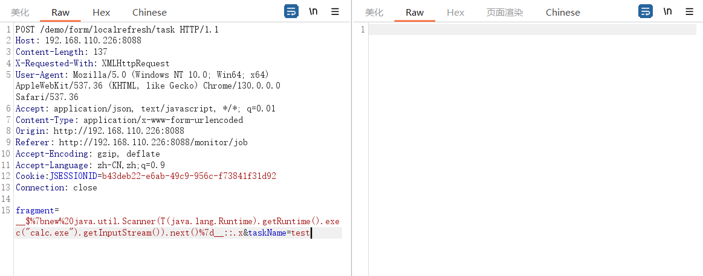
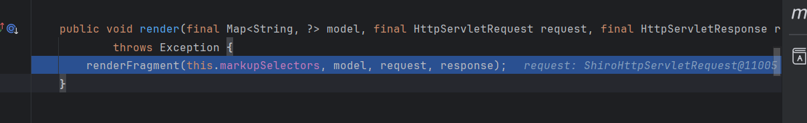

### 漏洞调试分析

#### 触发RCE的调试分析

* 在 thymeleaf 3.0.11.RELEASE下进行调试分析

Controller如下：

```java
@PostMapping("/localrefresh/task")
    public String localRefreshTask(String fragment,String taskName,ModelMap mmap)
    {
    	JSONArray list = new JSONArray();
    	JSONObject item = new JSONObject();
    	item.put("name", StringUtils.defaultIfBlank(taskName, "通过电话销售过程中了解各盛市的设备仪器使用、采购情况及相关重要追踪人"));
    	item.put("type", "新增");
    	item.put("date", "2018.06.10");
    	list.add(item);
    	item = new JSONObject();
    	item.put("name", "提高自己电话营销技巧，灵活专业地与客户进行电话交流");
    	item.put("type", "新增");
    	item.put("date", "2018.06.12");
    	list.add(item);
    	mmap.put("tasks",list);
        return prefix + "/localrefresh::" + fragment;
    }
```


**在一个Controller return一个模板路径后，是如何触发漏洞的：**

触发漏洞的报文如下，我们在java.lang.Runtime类打上断点，回溯查找



定位到`org.thymeleaf.spring5.view.ThymeleafView#render`，model是Controller中的ModelMap




#### 关于回显问题

#### 其他

### 存在漏洞的场景分析

### 高版本绕过

### payload整理

#### 各版本可用

#### 危险类整理