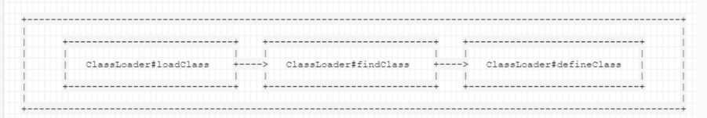

### Java字节码

* 广义的字节码——所有能够恢复成一个类并在JVM虚拟机里加载的字节序列

### 利用URLclassLoader加载远程class文件

* URLClassLoader是默认加载类AppClassLoader的父类，两者的工作流程类似
* URLClassLoader可以从远程加载.class文件

```java
// 注意这里没有package，如果限定了包名，后续url访问和loadClass也需要更改路径和指定包名
public class Hello {
    static {
        System.out.println("static");
    }
    {
        System.out.println("{}");
    }
    public Hello(){
        System.out.println("Hello");
    }
}

```

```java
// 运行和编译Hello.java的版本需要一致
import java.net.MalformedURLException;
import java.net.URL;
import java.net.URLClassLoader;

public class HelloClassLoader
{
    public static void main(String[] args) throws MalformedURLException, ClassNotFoundException, InstantiationException, IllegalAccessException {
        URL[] urls = {new URL("http://localhost:8000/")};
        System.out.println("load url");
        URLClassLoader loader = URLClassLoader.newInstance(urls);
        System.out.println("loadClass Hello");
        Class c = loader.loadClass("Hello");
        System.out.println("newInstance Hello");
        c.newInstance();

    }
}

```

运行结果


### 利用ClassLoader#defineClass直接加载字节码



加载class（远程、本地、jar）的方法调用：

* loadClass：从已加载的类缓存、父加载器等位置寻找类，在前面没有找到的情况下，执行 findClass
* findClass：根据基础URL指定的方式来加载类的字节码，就像上一节中说到的，可能会在 本地文件系统、jar包或远程http服务器上读取字节码，然后交给 defineClass

* defineClass：处理前面传入的字节码，将其处理成真正的Java类

所以可见，真正核心的部分其实是 defineClass ，他决定了如何将一段字节流转变成一个Java类，Java 默认的 ClassLoader#defineClass 是一个native方法（Native方法是Java语言中一种特殊的方法,它允许Java代码调用使用其他编程语言，ClassLoader#defineClass 的逻辑在JVM的C语言代码中）

```java
import java.lang.reflect.Method;
import java.util.Base64;

public class HelloDefineClass {
    public static void main(String[] args) throws Exception {
        Method defineClass =
                ClassLoader.class.getDeclaredMethod("defineClass", String.class,
                        byte[].class, int.class, int.class);
        defineClass.setAccessible(true);
        byte[] code =
                Base64.getDecoder().decode("yv66vgAAADQAHwoACAAQCQARABIIABMKABQAFQgAFggAFwcAFgcAGAEABjxpbml" +
                        "0PgEAAygpVgEABENvZGUBAA9MaW5lTnVtYmVyVGFibGUBAAg8Y2xpbml0PgEAClNvdXJjZUZpbGUBAApIZWxsby" +
                        "5qYXZhDAAJAAoHABkMABoAGwEAAnt9BwAcDAAdAB4BAAVIZWxsbwEABnN0YXRpYwEAEGphdmEvbGFuZy9PYmplY" +
                        "3QBABBqYXZhL2xhbmcvU3lzdGVtAQADb3V0AQAVTGphdmEvaW8vUHJpbnRTdHJlYW07AQATamF2YS9pby9Qcmlu" +
                        "dFN0cmVhbQEAB3ByaW50bG4BABUoTGphdmEvbGFuZy9TdHJpbmc7KVYAIQAHAAgAAAAAAAIAAQAJAAoAAQALAAA" +
                        "AOQACAAEAAAAVKrcAAbIAAhIDtgAEsgACEgW2AASxAAAAAQAMAAAAEgAEAAAACAAEAAYADAAJABQACgAIAA0ACgA"+
                        "BAAsAAAAlAAIAAAAAAAmyAAISBrYABLEAAAABAAwAAAAKAAIAAAADAAgABAABAA4AAAACAA8");
        System.out.println("start defineClass ------");
        Class hello = (Class) defineClass.invoke(ClassLoader.getSystemClassLoader(), "Hello", code,
                0, code.length);
        System.out.println("end defineClass ------");
        hello.newInstance();
    }
}
```

这里的decode的字符串是前面给出的示例代码编译成class后再base64编码，注意编译和运行的版本需要一致。这个例子使用java8时成功运行，11时有警告，17时无法成功（由于 Java 9 及以后的版本中引入的模块化系统带来的一个限制。在 Java 9 之前,`ClassLoader.defineClass()` 方法是 `protected` 访问权限的,可以通过反射进行访问。但在 Java 9 之后,这个方法被封装在 Java 模块系统中,默认情况下无法从未命名的模块（即你的应用程序）访问。）。

运行结果：


这里还需要介绍一下java中类的加载，类的初始化过程包括以下几个步骤:

1. 加载: 通过类加载器查找并加载类的二进制数据。
2. 链接: 验证类的字节码,准备静态变量,解析类中的符号引用。
3. 初始化: 执行类的静态初始化代码,包括静态代码块和静态变量的赋值。

而使用defineClass加载类时只完成了1 2两步，所以即使我们说static {}代码块在加载类时就会运行，defineClass也没有达到这一步，所以即使我们在某个地方可控defineClass要加载的字节码，我们也无法在static{}中写入恶意代码进行任意代码执行，**在类加载后必须得显示调用newInstance**。

### 利用TemplatesImpl加载字节码

* com.sun.org.apache.xalan.internal.xsltc.trax.TemplatesImpl$TransletClassLoader重写了defineClass方法，修饰符default
* 可以追溯的调用链，getOutputProperties()和newTransformer()是public

```txt
TemplatesImpl#getOutputProperties() -> TemplatesImpl#newTransformer() ->
TemplatesImpl#getTransletInstance() -> TemplatesImpl#defineTransletClasses()
-> TransletClassLoader#defineClass()
```

