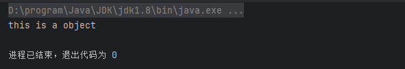

### PHP序列化的几个点

```php
<?php
 class Connection
 {
    protected $link;
    private $dsn, $username, $password;
    
    public function __construct($dsn, $username, $password)
    {
        $this->dsn = $dsn;
        $this->username = $username;
        $this->password = $password;
        $this->connect();
    }
    
    private function connect()
    {
        $this->link = new PDO($this->dsn, $this->username, $this
>password);
    }
 }
```

* 这里的$link是一个对象,没有自定义\_\_sleep函数时,$link序列化为null.个人的理解,序列化的结果是字符串,对象当然不能直接序列化.

```php
<?php
 class Connection
 {
    protected $link;
    private $dsn, $username, $password;
    
    public function __construct($dsn, $username, $password)
    {
        $this->dsn = $dsn;
        $this->username = $username;
        $this->password = $password;
        $this->connect();
    }
    
    private function connect()
    {
        $this->link = new PDO($this->dsn, $this->username, $this
>password);
    }
    
    public function __sleep()
    {
        return array('dsn', 'username', 'password');
    }
    
    public function __wakeup()
    {
        $this->connect();
    }
```

* 这里添加了一个\_\_sleep,返回由属性组成的数组,又新添了一个\_\_wakeup,这个wakeup完成了反序列化后对于$link的实例化
* P牛对于PHP反序列化的思考:\_\_wakeup的作用在反序列化后，执行一些初始化操作。但其实我们很少利用序列化数据传递资源类型 的对象，而其他类型的对象，在反序列化的时候就已经赋予其值了。 所以你会发现，PHP的反序列化漏洞，很少是由\_\_wakeup这个方法触发的，通常触发在析构函数 _\_destruct里。其实大部分PHP反序列化漏洞，都并不是由反序列化导致的，只是通过反序列化可以 控制对象的属性，进而在后续的代码中进行危险操作。

### Java反序列化入门

* 两个条件
  * 实现 java.io.Serializable 接口
  * 所有属性必须是可序列化的。如果有一个属性不是可序列化的，则该属性必须注明是短暂的
* java对象序列化后和php不同，是字节码而非字符串


* 下述代码输出了序列化后的person类

```java
package com.individuals.javaSecurity.myclass;

import java.io.IOException;
import java.io.Serializable;

public class Person implements Serializable {
    public String name;
    public int age;
    public Person(String name, int age) {
        this.name = name;
        this.age = age;
    }
    private void writeObject(java.io.ObjectOutputStream out) throws IOException {
        out.defaultWriteObject();
        out.writeObject("this is a object");
    }
    private void readObject(java.io.ObjectInputStream s)
            throws IOException, ClassNotFoundException {
        s.defaultReadObject();
        String message = (String) s.readObject();
        System.out.println(message);
    }
}
```

```java
import java.io.*;

public class SerializationUtils {

    // 序列化对象并转换为十六进制字符串
    public static String serializeObjectToHex(Serializable object) throws IOException {
        ByteArrayOutputStream byteArrayOutputStream = new ByteArrayOutputStream();
        try (ObjectOutputStream objectOutputStream = new ObjectOutputStream(byteArrayOutputStream)) {
            objectOutputStream.writeObject(object);
        }
        byte[] serializedBytes = byteArrayOutputStream.toByteArray();
        return bytesToHex(serializedBytes);
    }

    // 反序列化十六进制字符串回对象
    public static Object deserializeHexToObject(String hexString) throws IOException, ClassNotFoundException {
        byte[] bytes = hexStringToByteArray(hexString);
        try (ObjectInputStream objectInputStream = new ObjectInputStream(new ByteArrayInputStream(bytes))) {
            return objectInputStream.readObject();
        }
    }

    // 将字节数组转换为十六进制字符串
    public static String bytesToHex(byte[] bytes) {
        StringBuilder hexString = new StringBuilder();
        for (byte b : bytes) {
            hexString.append(String.format("%02X", b));
        }
        return hexString.toString();
    }

    // 将十六进制字符串转换为字节数组
    public static byte[] hexStringToByteArray(String s) {
        int len = s.length();
        byte[] data = new byte[len / 2];
        for (int i = 0; i < len; i += 2) {
            data[i / 2] = (byte) ((Character.digit(s.charAt(i), 16) << 4)
                    + Character.digit(s.charAt(i + 1), 16));
        }
        return data;
    }
}

```

```java
import java.io.IOException;

import static com.individuals.javaSecurity.utils.SerializationUtils.*;

public class TestSer {
    public static void main(String[] args) throws IOException {
        Person person = new Person("lda",123);
        System.out.println(serializeObjectToHex(person));
    }
}
```

* java -jar SerializationDumper-v1.13.jar 序列化对象.值得注意的是我们在序列化时,写入的字符串"this is a object"在objectAnnotation中

```txt
STREAM_MAGIC - 0xac ed
STREAM_VERSION - 0x00 05
Contents
  TC_OBJECT - 0x73
    TC_CLASSDESC - 0x72
      className
        Length - 43 - 0x00 2b
        Value - com.individuals.javaSecurity.myclass.Person - 0x636f6d2e696e646976696475616c732e6a61766153656375726974792e6d79636c6173732e506572736f6e
      serialVersionUID - 0xf9 30 f2 ab 12 b1 36 32
      newHandle 0x00 7e 00 00
      classDescFlags - 0x03 - SC_WRITE_METHOD | SC_SERIALIZABLE
      fieldCount - 2 - 0x00 02
      Fields
        0:
          Int - I - 0x49
          fieldName
            Length - 3 - 0x00 03
            Value - age - 0x616765
        1:
          Object - L - 0x4c
          fieldName
            Length - 4 - 0x00 04
            Value - name - 0x6e616d65
          className1
            TC_STRING - 0x74
              newHandle 0x00 7e 00 01
              Length - 18 - 0x00 12
              Value - Ljava/lang/String; - 0x4c6a6176612f6c616e672f537472696e673b
      classAnnotations
        TC_ENDBLOCKDATA - 0x78
      superClassDesc
        TC_NULL - 0x70
    newHandle 0x00 7e 00 02
    classdata
      com.individuals.javaSecurity.myclass.Person
        values
          age
            (int)123 - 0x00 00 00 7b
          name
            (object)
              TC_STRING - 0x74
                newHandle 0x00 7e 00 03
                Length - 3 - 0x00 03
                Value - lda - 0x6c6461
        objectAnnotation
          TC_STRING - 0x74
            newHandle 0x00 7e 00 04
            Length - 16 - 0x00 10
            Value - this is a object - 0x746869732069732061206f626a656374
          TC_ENDBLOCKDATA - 0x78
```

* 尝试反序列化我们的序列化对象,可以看当初写入的字符串被打印出来了

```java
import java.io.IOException;

import static com.individuals.javaSecurity.utils.SerializationUtils.deserializeHexToObject;

public class TestUnser {
    public static void main(String[] args) throws IOException, ClassNotFoundException {
        Person person = (Person)deserializeHexToObject("ACED00057372002B636F6D2E696E646976696475616C732E6A61766153656375726974792E6D79636C6173732E506572736F6EF930F2AB12B136320300024900036167654C00046E616D657400124C6A6176612F6C616E672F537472696E673B78700000007B7400036C6461740010746869732069732061206F626A65637478");
    }
}
```



* 这里借助gpt简单解释一下序列化对象中的objectAnnotation和 classAnnotations:

```txt
classAnnotations
classAnnotations 是与类相关的注解信息。在序列化过程中，Java会在序列化流中包括与类相关的注解信息，这些信息包括：

类的元数据：例如类的名称、类的签名（包括字段和方法的签名）。
类的序列化版本UID：用于验证反序列化时类版本的一致性。
类的父类信息：如果类是从其他类继承而来，这些信息也会被包含在内。
objectAnnotation
objectAnnotation 是与对象相关的注解信息。在序列化过程中，Java会在序列化流中包括与对象相关的注解信息，这些信息包括：

对象的字段值：对象的非静态和非瞬态字段的当前值。
引用的其他对象：如果对象包含对其他对象的引用，这些被引用对象也会被序列化。
对象的定制序列化数据：如果类实现了 writeObject 方法，这些方法中自定义序列化的数据也会被包含在 objectAnnotation 中。
```

### Python反序列化

* Python反序列化和Java、PHP有个显著的区别，就是Python的反序列化过程实际上是在执行一个基于 栈的虚拟机。我们可以向栈上增、删对象，也可以执行一些指令，比如函数的执行等，甚至可以用这个 虚拟机执行一个完整的应用程序。 所以，Python的反序列化可以立即导致任意函数、命令执行漏洞，与需要gadget的PHP和Java相比更加 危险。

### 总结

* 总结一下，从危害上来看，Python的反序列化危害是最大的；从应用广度上来看，Java的反序列化是最 常被用到的；从反序列化的原理上来看，PHP和Java是类似又不尽相同的。

### 补充:SerializationDumper的使用

* SerializationDumper是一个分析序列化对象的工具
* 使用方法很简单:java -jar SerializationDumper-v1.13.jar ,后面可以直接加反序列化对象的十六进制串或者从文件读取

#### 几个案例分析

* [Java Object Serialization Specification: 6 - Object Serialization Stream Protocol (oracle.com)](https://docs.oracle.com/javase/8/docs/platform/serialization/spec/protocol.html) java序列化协议文档
* 下图为java序列化对象的结构分析图

```java
public class Person implements Serializable {
    public String name;
    public int age;
    public Person(String name, int age) {
        this.name = name;
        this.age = age;
    }
    private void writeObject(java.io.ObjectOutputStream out) throws IOException {
        out.defaultWriteObject();
        out.writeObject("this is a object");
    }
    private void readObject(java.io.ObjectInputStream s)
            throws IOException, ClassNotFoundException {
        s.defaultReadObject();
        String message = (String) s.readObject();
        System.out.println(message);
    }
}
```

```java
public class TestSer {
    public static void main(String[] args) throws IOException {
        Person person = new Person("lda",123);
        System.out.println(serializeObjectToHex(person));
    }
}
```

```txt
STREAM_MAGIC - 0xac ed
STREAM_VERSION - 0x00 05
Contents
  TC_OBJECT - 0x73
    TC_CLASSDESC - 0x72
      className
        Length - 43 - 0x00 2b
        Value - com.individuals.javaSecurity.myclass.Person - 0x636f6d2e696e646976696475616c732e6a61766153656375726974792e6d79636c6173732e506572736f6e
      serialVersionUID - 0xf9 30 f2 ab 12 b1 36 32
      newHandle 0x00 7e 00 00
      classDescFlags - 0x03 - SC_WRITE_METHOD | SC_SERIALIZABLE
      fieldCount - 2 - 0x00 02
      Fields
        0:
          Int - I - 0x49
          fieldName
            Length - 3 - 0x00 03
            Value - age - 0x616765
        1:
          Object - L - 0x4c
          fieldName
            Length - 4 - 0x00 04
            Value - name - 0x6e616d65
          className1
            TC_STRING - 0x74
              newHandle 0x00 7e 00 01
              Length - 18 - 0x00 12
              Value - Ljava/lang/String; - 0x4c6a6176612f6c616e672f537472696e673b
      classAnnotations
        TC_ENDBLOCKDATA - 0x78
      superClassDesc
        TC_NULL - 0x70
    newHandle 0x00 7e 00 02
    classdata
      com.individuals.javaSecurity.myclass.Person
        values
          age
            (int)123 - 0x00 00 00 7b
          name
            (object)
              TC_STRING - 0x74
                newHandle 0x00 7e 00 03
                Length - 3 - 0x00 03
                Value - lda - 0x6c6461
        objectAnnotation
          TC_STRING - 0x74
            newHandle 0x00 7e 00 04
            Length - 16 - 0x00 10
            Value - this is a object - 0x746869732069732061206f626a656374
          TC_ENDBLOCKDATA - 0x78
```

