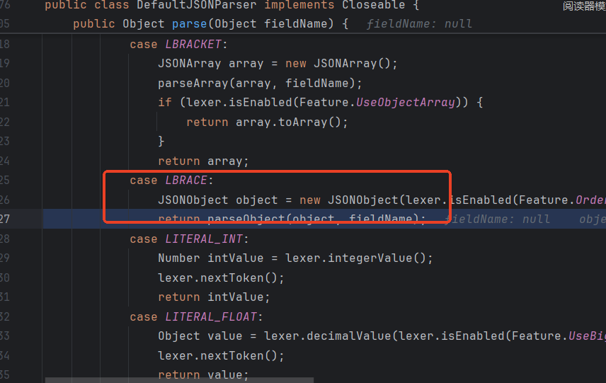
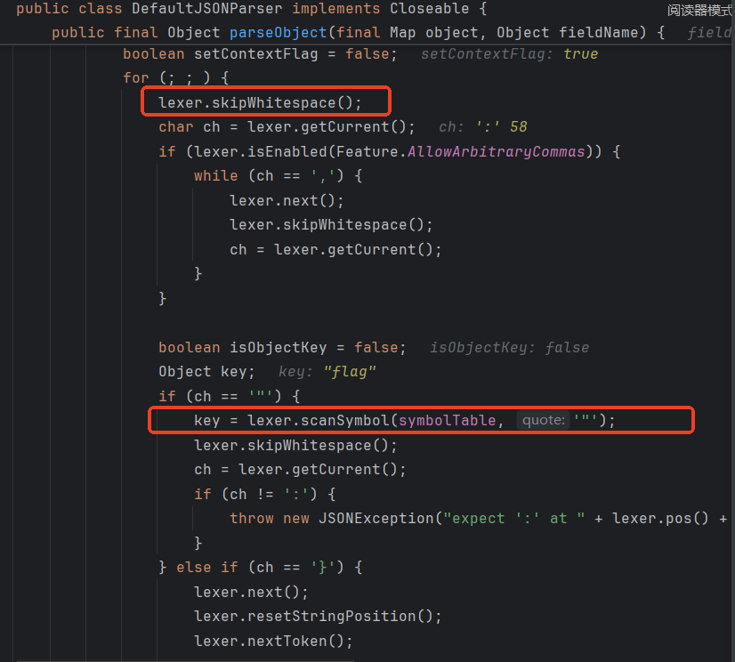

* fastjson的基本使用介绍
* fastjson反序列化的分析
* 各版本的利用和防御绕过
* 原生URL反序列化和fastjson反序列化
  * 也不能直接dnslog

* waf对抗
* fastjson组件的识别
* 利用工具
* 补充
  * 第三种写法真的无法利用吗


### fastjson的基本使用

#### 简介

* FastJson 是阿⾥巴巴的开源 JSON 解析库，它可以解析 JSON 格式的字符串，⽀持将 Java Bean 序列 化为JSON字符串，也可以从JSON字符串反序列化到 Java Bean 。

#### 序列化

* 最常用的序列化函数为JSON.toJSONString

```java
package org.example;

import com.alibaba.fastjson.JSON;
import com.alibaba.fastjson.serializer.SerializerFeature;

import java.util.Properties;

public class User {
    private String name;
    private int age;
    private Flag flag;
    public String publictest;
    private String privatetest;
    private Student student;
    public Properties prop;

    public User() {
        System.out.println("User constructor has called.");
        this.name = "p1g3";
        this.age = 19;
        this.flag = new Flag();
        this.publictest = "test";
        this.privatetest = "test";
        this.student = new Student();

        this.prop = new Properties();
        this.prop.put("name", "666");
    }

    public String getName() {
        System.out.println("getName has called.");
        return name;
    }

    public void setName(String name) {
        System.out.println("setName has called.");
        this.name = name;
    }

    public int getAge() {
        System.out.println("getAge has called.");
        return age;
    }

    public void setAge(int age) {
        System.out.println("setAge has called.");
        this.age = age;
    }

    public Flag getFlag() {
        System.out.println("getFlag has called.");
        return flag;
    }

    public void setFlag(Flag flag) {
        System.out.println("setFlag has called.");
        this.flag = flag;
    }

    @Override
    public String toString() {
        return "User{" +
                "name='" + name + '\'' +
                ", age=" + age +
                ", flag=" + flag +
                '}';
    }

    public Student getStudent() {
        System.out.println("getStudent has called.");
        return student;
    }

    public void setStudent(Student student) {
        System.out.println("setStudent has called.");
        this.student = student;
    }

    public static void main(String[] args) {
        String  serJson0 = JSON.toJSONString(new User());
        System.out.println(serJson0);
        System.out.println("----------------------------");
        String  serJson1 = JSON.toJSONString(new User(), SerializerFeature.WriteClassName);
        System.out.println(serJson1);

    }
}

class Flag{
    private String flag;

    public Flag(){
        System.out.println("Flag constructor has called.");
        this.flag = "flag{d0g3_learn_java}";
    }

    public String getFlag() {
        System.out.println("getFlag has called.");
        return flag;
    }

    public void setFlag(String flag) {
        System.out.println("setFlag has called.");
        this.flag = flag;
    }
}

```

```xml
 <dependencies>
        <dependency>
            <groupId>com.alibaba</groupId>
            <artifactId>fastjson</artifactId>
            <version>1.2.23</version>
        </dependency>
    </dependencies>
```


我们先查看`String  serJson0 = JSON.toJSONString(new User());`的结果


注意到，序列化过程中调用了属性的get方法，私有属性且没有get方法的，没有被序列化。

再看`JSON.toJSONString(new User(), SerializerFeature.WriteClassName);`


首先解释一下这里的@Type，很容易看出，这个字段标识出了对象的类型。JSON 标准是不⽀持⾃省的，也就是说根据 JSON ⽂本，不知道它包含的对象的类型。 FastJson ⽀持⾃省，在序列化时传⼊类型信息 SerializerFeature.WriteClassName ，可以得到能表明对象类型的 JSON ⽂本。但是可以发现，这里的Flag和Student（在同一个包下定义的一个简单的public类）并没有@Type，原因是在序列化的过程中，在有了`"@type":"org.example.User"`后Flag和Student的类型是明确的，在同一个包下即可找到。

#### 三种反序列化的用法

```java
public class Main {
    public static void main(String[] args) {
        String serJson0 = "{\"age\":19,\"flag\":{\"flag\":\"flag{d0g3_learn_java}\"},\"name\":\"p1g3\",\"prop\":{\"name\":\"666\"},\"publictest\":\"test\",\"student\":{\"age\":10,\"name\":\"st\"}}";
        System.out.printf("Parse had done => %s\n", JSON.parse(serJson0).getClass());
        System.out.printf("parseObject one has done => %s\n",JSON.parseObject(serJson0).getClass());
        System.out.printf("parseObject second has done => %s\n",JSON.parseObject(serJson0,User.class).getClass());

        System.out.println("------------------------------------------");

        String serJson1 = "{\"@type\":\"org.example.User\",\"age\":19,\"flag\":{\"flag\":\"flag{d0g3_learn_java}\"},\"name\":\"p1g3\",\"prop\":{\"@type\":\"java.util.Properties\",\"name\":\"666\"},\"publictest\":\"test\",\"student\":{\"age\":10,\"name\":\"st\"}}";
        System.out.printf("Parse had done => %s\n", JSON.parse(serJson1).getClass());
        System.out.printf("parseObject one has done => %s\n",JSON.parseObject(serJson1).getClass());
        System.out.printf("parseObject second has done => %s\n",JSON.parseObject(serJson1,User.class).getClass());


    }
}
```

parseObject和parse差别不大

```java
public static JSONObject parseObject(String text) {
    Object obj = parse(text);
    if (obj instanceof JSONObject) {
        return (JSONObject)obj;
    } else {
        try {
            return (JSONObject)toJSON(obj);
        } catch (RuntimeException var3) {
            RuntimeException e = var3;
            throw new JSONException("can not cast to JSONObject.", e);
        }
    }
}
```

先看`serJson0`的三种反序列化


从输出中可以看到，在调⽤parse以及第⼀种调⽤parseObject的⽅式，并没有正常的反序列化JSON数据，只有第三种使⽤⽅式才将JSON数据正确还原为⼀ 个对象。并且从输出中还可以得知，Fastjson在反序列化时主要调⽤的是每个属性的set⽅法，并且当属性为对象时会调⽤该对象的⽆参构造器去创建对象。没有反序列化成功的原因，对比第三种反序列化方式，可以很简单地推理出，显然fastjson无法确认我们反序列化的是哪个类。

再看`serJson1`的反序列化

```txt
User constructor has called.
Flag constructor has called.
setAge has called.
Flag constructor has called.
setFlag has called.
setFlag has called.
setName has called.
setStudent has called.
Parse had done => class org.example.User
User constructor has called.
Flag constructor has called.
setAge has called.
Flag constructor has called.
setFlag has called.
setFlag has called.
setName has called.
setStudent has called.
getAge has called.
getFlag has called.
getName has called.
getStudent has called.
getFlag has called.
parseObject one has done => class com.alibaba.fastjson.JSONObject
User constructor has called.
Flag constructor has called.
setAge has called.
Flag constructor has called.
setFlag has called.
setFlag has called.
setName has called.
setStudent has called.
parseObject second has done => class org.example.User
```

第二种的反序列化方式的差异在于`toJSON(obj)`。

根据上面的调试分析，不难发现这里反序列化的漏洞的产生是由于反序列化的类是可控的导致攻击者可以寻找危险的set或get⽅法去调⽤从⽽触发漏洞。

### fastjson反序列化的分析(1.2.23)

三种反序列化写法中，第三种由于限定了反序列化类，无法被我们利用进行攻击，第一种反序列化被第二种包含，所以这里仅仅对第二种反序列化写法进行调试分析。

**对不带@type的json字符串进行反序列化**

步入parse进行分析


先初始化一个用于解析的DefaultJSONParser，在初始化的过程中，获取了input的第一个字符，并根据其设置相应的token


步入parser.parse()进行解析处理


根据之前设置的token进行选择处理



继续步入，来到下图方法，其中的for循环是最主要的解析逻辑，每次循环解析一个键值对。此时的下标在`{`的下一个位置，当前字符进行判断，根据不同结果进行不同处理，这里对`"`的情况进行分析



注意到这里的`lexer.skipWhitespace()`，梳理完代码逻辑后，会发现它在几乎所有`"`的两边调用。其代码逻辑如下，是跳过了一些特殊字符，`skipComment()`则是跳过了注释，这里对于我们绕waf或者在某些情况下需要构造畸形字符很有帮助。


接下来的`if (lexer.isEnabled(Feature.AllowArbitraryCommas))`默认是true，后面的`while (ch == ',')`也跳过了一些字符，除开之前的字符外，`,`也会被跳过


接着要解析一个key，也就是将`"`之间的字符解析出来


这里代码很长，概括来说就是将`"`之间的字符解析出来，其中需要注意的是，为了支持`\`转义，对`\`需要特殊处理，特别需要注意的是，这里支持unicode编码和hex编码。


回到`parseObject`中，后面对获取的key进行判断，是否等于`@type`，且查看`!lexer.isEnabled(Feature.DisableSpecialKeyDetect)`是true还是false，默认为true。例子中解析的第一个key为`"age"`，不为`@type`，我们接着往后走


这里还有个if，是判断引用相关的内容，这里不分析


再到后面的if分支，对value进行解析，然后将解析出的key和value put进一个JSONObject中，这个过程没有加载类的操作


**带@type的json字符串进行反序列化**

前面的过程都相同，我们到对key进行判断是否等于`@Type`的地方

首先使用类加载器加载了类，这里加载的逻辑就不具体分析了


随后的if分之内有反序列化操作，但是这里实验的例子没有进入if，简单看一下，json字符串的下一个字符为`}`就会进入这个分支。我们继续往后，进行了反序列化操作


`getDeserializer`是返回了一个反序列化器，没有太多可分析的，步入`deserialze`

