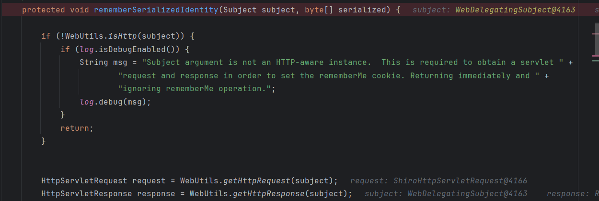
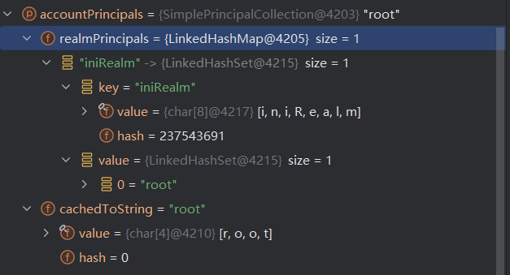
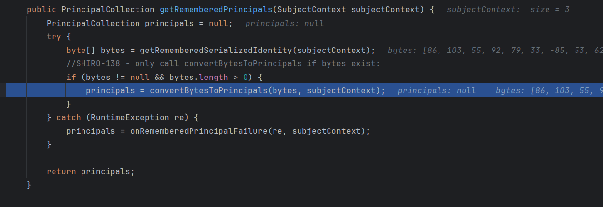

## CVE-2016-6802

### 漏洞信息

* 漏洞编号：CVE-2016-4437 / CNVD-2016-03869 / SHIRO-550
* 影响版本：shiro 1.x < 1.2.5
* 漏洞描述：利用**硬编码**的密钥构造rememberMe参数，进行**反序列化攻击**

### 漏洞详解

* 实验环境：原生shiro1.2.4（tomcat）[JavaThings/shirodemo at master · phith0n/JavaThings](https://github.com/phith0n/JavaThings/tree/master/shirodemo)

```xml
<dependency>
  <groupId>org.apache.shiro</groupId>
  <artifactId>shiro-core</artifactId>
  <version>1.2.4</version>
</dependency>
<dependency>
  <groupId>org.apache.shiro</groupId>
  <artifactId>shiro-web</artifactId>
  <version>1.2.4</version>
</dependency>
```

#### 代码分析

##### shiro cookie rememberMe的生成过程

在登陆时勾选remember me，在`CookieRememberMeManager#rememberSerializedIdentity`打上断点，对程序进行调试，

根据这个函数名称还有代码我们可以看出，第二个参数`byte[] serialized`即为cookie中的rememberMe，它在这个函数中被base64编码后添加到此次请求的response中



我们向上追溯`byte[] serialized`的生成过程，发现在`AbstractRememberMeManager#rememberIdentity`调用函数`convertPrincipalsToBytes`生成了该数组，接着分析该函数

```java
 protected byte[] convertPrincipalsToBytes(PrincipalCollection principals) {
        // serialize使用一个序列化器对principals进行序列化
        // 序列化器有一个默认的DefaultSerializer，就是通常的序列化操作；也可以手动指定序列化器
        byte[] bytes = serialize(principals);
        // 这里的if分支判断是否有加密器，有的话对序列化结果进行加密
        // 默认是采用的AesCipherService，从名字也可以看出这里是AES加密，加密器代码就不具体分析了
        if (getCipherService() != null) {
            bytes = encrypt(bytes);
        }
        return bytes;
    }

// 构造函数，设置了默认的反序列化器、加密函数和加密秘钥
// 重要的是这里的加密和解密秘钥默认是一个硬编码的秘钥kPH+bIxk5D2deZiIxcaaaA==
public AbstractRememberMeManager() {
    this.serializer = new DefaultSerializer<PrincipalCollection>();
    this.cipherService = new AesCipherService();
    setCipherKey(DEFAULT_CIPHER_KEY_BYTES);
}
```

我们稍微关注一下反序列化的对象`PrincipalCollection principals`，其实从调试的对象数据来看，看得出这是一个与用户信息相关的对象



##### shiro rememberMe 反序列化的过程

既然弄清了rememberMe实际上是一个AES加密的序列化对象，那它大概率还是要反序列化的，重要的是漏洞版本的秘钥都是硬编码的，我们可以构造出rememberMe。

接着，我们来分析rememberMe是否有反序列化的过程，具体过程是怎么样的，我们是否可以构造一个恶意的序列化对象进行攻击。

如果rememberMe需要反序列化，那么必定要先进行解密，因此可以查看`AbstractRememberMeManager`中解密秘钥的属性来确定代码，于是定位到了解密方法`AbstractRememberMeManager#decrypt`


我们向后运行，来到了`AbstractRememberMeManager#convertBytesToPrincipals`，这里的deserialize是使用序列化器进行反序列化操作，默认的反序列化器就是通常的反序列化操作，于是在这里，我们确定了反序列化点。


继续往后，反序列化后返回到了`AbstractRememberMeManager#getRememberedPrincipals`中，在这个方法里，我们也看到了反序列化字符串的来源`getRememberedSerializedIdentity`



我们现在向前追溯，查看序列化对象是否是我们可控的，在此处打上断点继续调试，进入该方法后，来到了`CookieRememberMeManager#getRememberedSerializedIdentity`，逻辑比较简单，读取http中的key为rememberMe的cookie值，将其base64解码后返回

```java
protected byte[] getRememberedSerializedIdentity(SubjectContext subjectContext) {

        if (!WebUtils.isHttp(subjectContext)) {
            if (log.isDebugEnabled()) {
                String msg = "SubjectContext argument is not an HTTP-aware instance.  This is required to obtain a " +
                        "servlet request and response in order to retrieve the rememberMe cookie. Returning " +
                        "immediately and ignoring rememberMe operation.";
                log.debug(msg);
            }
            return null;
        }

        WebSubjectContext wsc = (WebSubjectContext) subjectContext;
        if (isIdentityRemoved(wsc)) {
            return null;
        }

        HttpServletRequest request = WebUtils.getHttpRequest(wsc);
        HttpServletResponse response = WebUtils.getHttpResponse(wsc);

        String base64 = getCookie().readValue(request, response);
        // Browsers do not always remove cookies immediately (SHIRO-183)
        // ignore cookies that are scheduled for removal
        if (Cookie.DELETED_COOKIE_VALUE.equals(base64)) return null;

        if (base64 != null) {
            base64 = ensurePadding(base64);
            if (log.isTraceEnabled()) {
                log.trace("Acquired Base64 encoded identity [" + base64 + "]");
            }
            byte[] decoded = Base64.decode(base64);
            if (log.isTraceEnabled()) {
                log.trace("Base64 decoded byte array length: " + (decoded != null ? decoded.length : 0) + " bytes.");
            }
            return decoded;
        } else {
            //no cookie set - new site visitor?
            return null;
        }
    }
```

##### 没有分析的地方（TODO）

这里为了反序列化攻击分析了与序列化和反序列化相关的代码，但是没有深入去分析反序列化后的对象是如何被使用的，毕竟身份验证是通过这个对象进行的，在拿到了shiro key但是没有找到利用链的情况下，是否可以在这个对象上做做文章呢？这个问题后续再分析

#### 反序列化链的选择

反序列化攻击的前置是找到一条利用链，而且最好这条链子所需的类是仅仅依赖于出现反序列化点的库和jre的。这里也是一样的，我们不能寄希望于于存在Shiro550的目标一定引用了存在其他利用链的依赖。

##### 不依赖于CommonsCollections的CB1

见之前的文章（TODO）

##### 二次反序列化（TODO）

#### Tomcat环境下的利用链

##### Tomcat环境下使用改造CC6

见之前的文章（TODO）

##### Tomcat环境下使用JRMP

### 漏洞修复

* `Shiro` 在 `1.2.5` 中对此漏洞进行了修复。系统在启动的时候会生成一个新`key`，用户也可以手动配置一个`cipherKey`。
* 经过前面的分析，如果知道用户设置的秘钥，还是可以利用该漏洞

### 漏洞利用

* 工具 [SummerSec/ShiroAttack2: shiro反序列化漏洞综合利用,包含（回显执行命令/注入内存马）修复原版中NoCC的问题 https://github.com/j1anFen/shiro_attack](https://github.com/SummerSec/ShiroAttack2)

在高版本下，加密方式更改为了AES GCM，高版本利用时需要更改加密方式


## CVE-2019-12422

### 漏洞信息

### 漏洞详解

### 漏洞利用

### 漏洞修复