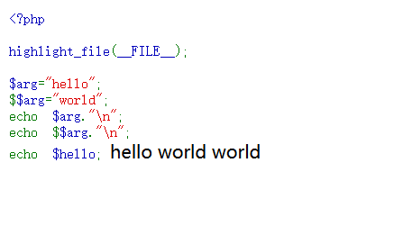

### PHP代码审计

#### 审计内容

* 工具扫描人工排查
* 一些工具无法扫描的漏洞，例如逻辑漏洞
  * 用户登录、修改密码等
  * 文件上传、管理等
  * 过滤函数，是否可以绕过

#### 常规漏洞的排查

部分常见漏洞的一些存在形式通过黑盒或者通过工具代码审计难以发现

##### SQL注入

* http头部注入
* 宽字节注入 “SET NAME”
* 二次ulrdecode，urldecode、rawurldecode函数
* 二次注入

关键函数排查

```txt
mysqli_connect()
mysqli_query()
mysqli_fetch_array()
mysqli_close()
mysqli_fetch_row()
connect()
query()
fetch_array()
close()
fetch_row()
```

##### XSS

* 敏感函数
  * echo、print系列、var_export、var_dump

##### 文件包含

* 相关设置
  * open_basedir：设置php有权限操作的目录
  * upload_tmp_dir：文件上传临时目录
  * allow_url_fopen：是否允许文件操作函数将http/ftp url当做文件打开
  * allow_url_include：是否允许远程文件包含
    * [include](https://www.php.net/manual/zh/function.include.php)、[include_once](https://www.php.net/manual/zh/function.include-once.php)、[require](https://www.php.net/manual/zh/function.require.php) 及 [require_once](https://www.php.net/manual/zh/function.require-once.php) 的使用需要上面两个都设置为On
* 敏感函数：[include](https://www.php.net/manual/zh/function.include.php)、[include_once](https://www.php.net/manual/zh/function.include-once.php)、[require](https://www.php.net/manual/zh/function.require.php) 及 [require_once](https://www.php.net/manual/zh/function.require-once.php) 

##### 文件下载和读取

* 黑盒测试比较方便，可以直接在前端查看有哪些功能点访问了文件内容，直接去尝试更改url或者其他参数

* 敏感函数
  * file_get_contents()、highlight_file()、fopen()、readfile()、fread()、fgetss()、fgets()、parse_ini_file()、show_source()、file()

##### 文件上传

* 敏感函数
  * move_uploaded_file如果是基于黑名单过滤，主要看有没有过滤到位

##### 代码执行

* 代码执行函数

  * eval、assert 执行php代码
  * call_user_func、call_user_func_array、array_map 调用函数
  * create_function
  * call_user_func、call_user_func_array
  * array_filter、array_map
  * preg_replace()
  * usort()
  * array_walk
  
  ```php
  preg_replace('正则规则','替换字符'，'目标字符')
  执行命令和上传文件参考assert函数(不需要加分号)。
  将目标字符中符合正则规则的字符替换为替换字符，此时如果正则规则中使用/e修饰符，则存在代码执行漏洞。
  <?php
      preg_replace("/test/e",$_POST["cmd"],"jutst test");
  ?>
  这里可以使用chr()函数转换ASCII编码来执行代码。
   
  #phpinfo();
  eval(chr(112).chr(104).chr(112).chr(105).chr(110).chr(102).chr(111).chr(40).chr(41).chr(59))
  ```

  
  
  * 动态函数($a($b))

##### 命令执行

* 命令执行函数
  * system
  * passthru
  * exec
  * pcntl_exec
  * shell_exec等同于反引号
  * popen
  * proc_popen

##### 变量覆盖

* 危险设置：register_globals，4.2.0之前默认开启，到5.4时默认关闭，之后移除。通常我们通过url传入的查询字符串都需要通过$\_GET获取，还有POST、Cookie等需要相应的方法获取并赋值给一个变量，但是register_gloabls开启后，传入的查询字符串直接注册为变量，不需要获取并赋值。
* 危险函数
  * int extract (array $var_array[,int $extract_type[,string $prefix]]) :从数组注册变量，安全用法，第二个参数传入EXTR_SKIP
  * void parse_str(string $str[,array &$arr])：从url查询字段注册变量，安全做法使用第二个参数存储数组
  * bool import_request_variables ( string $types [, string $prefix ] )：第二个参数选定是 从GET、POST、COOKIE中注册变量
* $$的不当使用

这里的`$$arg`相当于注册了变量`$hello`

```php
<?php

highlight_file(__FILE__);

$arg="hello";
$$arg="world";
echo $arg."\n";
echo $$arg."\n";
echo $hello;
```



一个常见的foreach循环，容易引起该问题

```php
<?php
highlight_file(__FILE__);
$num=20;
foreach ($_REQUEST as $key => $value) {    
	$value
	$$key = $value;                 
}
echo $num;
?>
```


##### 序列化漏洞

* 危险函数：


##### 弱类型

* 危险函数，在PHP版本
  * in_array() :in\_array在判断前会做自动类型转换，in_array('1sasadad',array(1,2,3))结果为true
  * is_numeric():在低版本时，参数为十六进制字符串，返回true，但是高版本已经被修复。
* ==和===：==在判断前会自动做变量类型转换，这意味着 '1sasa'==1结果为true

##### XXE注入

* libxml2.9以前，默认解析外部实体

```txt
simplexml_load_string
simplexml_load_file
simplexml_import_dom
asXML
```

##### SSRF

```txt
curl_exec
file_get_content
fopen
fsockopen
```

##### SSTI

###### smarty

###### Twig

#### 其他思路

##### 直接寻找外部输入值

  绝大多数程序都会在获取外部输入值时使用函数进行过滤和检查，就是这些函数防御了攻击，但有时开发者会忘记使用这些函数，或者使用的函数不适用于该处，所以当程序体量不太大时，直接对$\_GET、$\_POST、$\_FILE等获取外部输入值的函数进行检查也比较有效。

* 函数
  * $_GET
  * $_POST
  * $_FILE
  * $_COOKIE
  * $_SERVER
