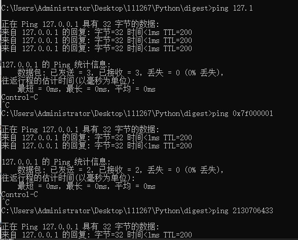

#### 限制和ByPass

- 大多数Bypass方式在url跳转中给出，这里提两个之前没有介绍过的

- 数字IP Bypass：IP地址可以写为十六进制和十进制，一些特殊的ip可以简写

* **DNS Rebinding**

#### 利用方式

- 依赖于目标的后端语言、支持的协议和存在缺陷处的功能
  
  - 内网探测
  
  - 内网应用攻击
  
  - 文件下载

#### 常见协议

* Gopher协议，curl和libcurl等库均支持
  * 协议格式：`gopher://127.0.0.1:70/+ TCP/IP数据`。TCP/IP数据将会发送给相应的端口，这些数据可以是任何内容，我们可以构造任意应用层协议
  * 实际上，`gopher://127.0.0.1:70/`等同于`telnet 127.0.0.1 70`或者`exec 3<>/dev/tcp/127.0.0.1/70`

* FIle协议，`file://文件路径`
* http协议
* dict协议，词典网络协议，实际上是弱化版gopher协议
  * `dict://ip:port/数据`，该协议会自动补充CRLF，因此dict一般来说要一条一条地执行命令

