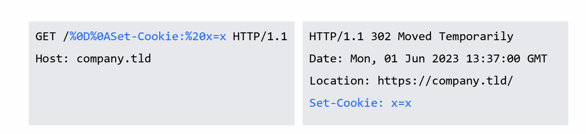

#### 简介

* HTTP报文的结构：状态行和首部中的每行以CRLF结束，首部与主体之间由一空行分隔。或者理解为首部最后一个字段有两个CRLF，首部和主体由两个CRLF分隔。
* 在客户端构造报文时，在http请求首部中恶意插入%0d%0a，如果服务端对http请求的首部字段不加检查的引用并返回，则可能造成XSS、会话固定等危害

#### 例子

* 构造恶意首部：


* 后端错误处理：不加检查的引用请求报文的首部构造返回报文的首部，如果请求报文连续注入两个回车换行，则可造成XSS


* 还有一种是服务器的错误配置造成的,例如nginx

```txt
 $uri - Normalized Request-URI value
 $document_uri - $uri alias
 Variables from regexp with an exclusive range
 location ~ /docs/([^/]*)? { … $1 … }                # vulnerable
 location ~ /docs/(.*)? { … $1 … }                   # not vulnerable
```

第一种配置方式,正则表达式匹配了换行回车,会造成下图的情况



