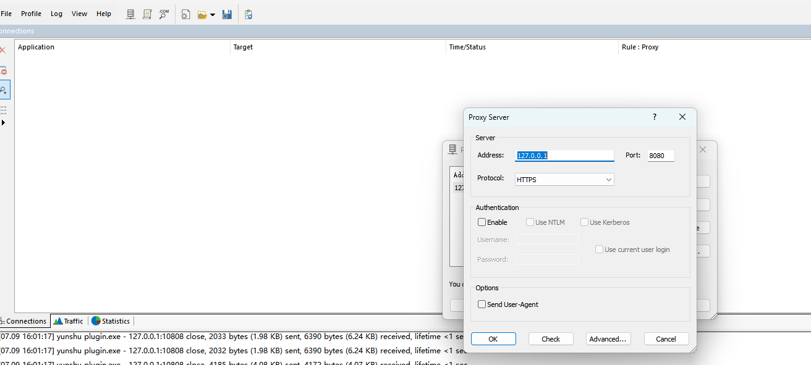
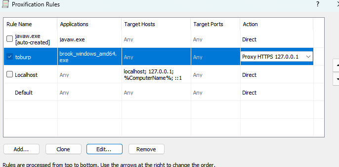
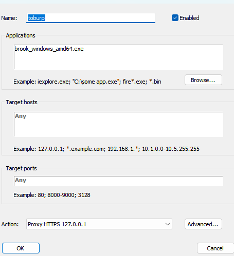

#### 场景

* burp抓取设备的流量，但是无法通过设置环境变量实现流量转发到burp

#### proxychains4配置

* https://github.com/rofl0r/proxychains-ng

```txt
strict_chain
proxy_dns
remote_dns_subnet 224
tcp_read_time_out 15000
tcp_connect_time_out 8000
[ProxyList]
socks5 x.x.x.x 1080
```

#### Brook

* https://github.com/txthinking/brook
* proxychains是sock的转发，由于burp不支持，所以需要将sock流量转为http/https
* 这里转换的核心是proxifier，但是proxifier不支持像burp监听某个端口传入的流量，它只能劫持转发某个应用的流量，因此还需要劫持Brook这个应用接收来自设备的流量，然后转发给burp

```shell
brook_windows_amd64.exe socks5 -l 127.0.0.1:1080
```

#### proxifier

* 配置代理服务，以便将流量转发给burp

profile->proxy server 注意协议选成https



* 设置应用级规则，劫持Brook的流量

profile->proxification Rules

除了我们要添加的规则，其他规则action选为direct，防止抓到其他应用的流量



application选择应用，下面根据自己的需要选取抓取的host和port

