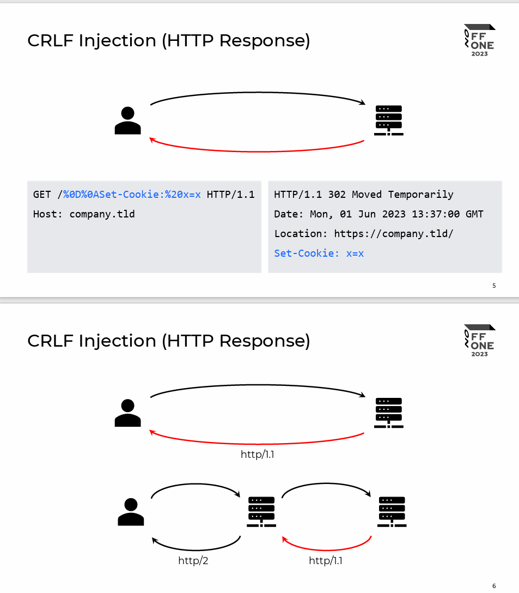
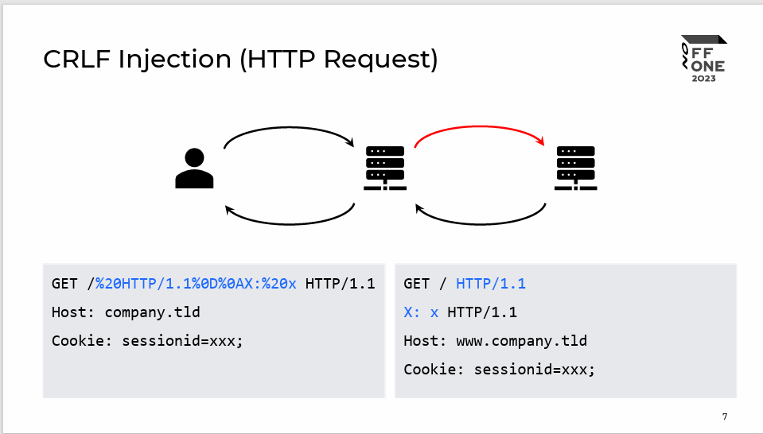
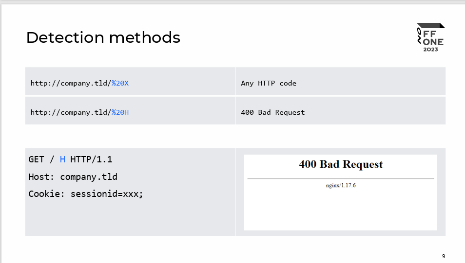
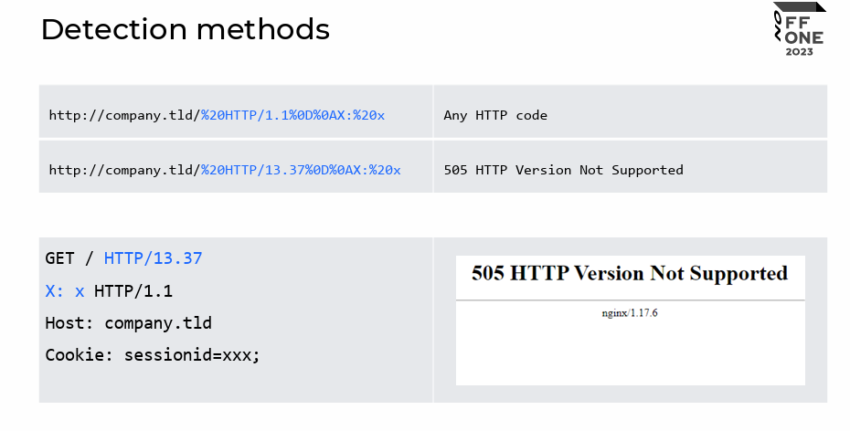
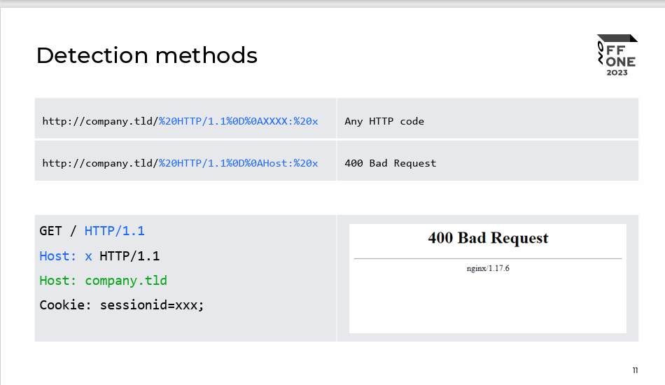

[sagouc86idiapdb8f29w41yaupqv6fwv.pdf (offzone.moscow)](https://offzone.moscow/upload/iblock/11a/sagouc86idiapdb8f29w41yaupqv6fwv.pdf)

## HTTP Request Splitting  vulnerabilities exploitation(HTTP请求分割漏洞)

### 请求分割的原因:Nginx的错误配置

```txt
$uri - Normalized Request-URI value
$document_uri - $uri alias
Variables from regexp with an exclusive range
location ~ /docs/([^/]*)? { … $1 … }                # vulnerable
location ~ /docs/(.*)? { … $1 … }                   # not vulnerable
```

* 错误的配置中,正则表达式匹配了换行符

#### 情形一



#### 情形二

* Nginx作为前端服务器配置错误



### 探测Nginx配置中正则表达式匹配的内容

* 检测url是否匹配空白字符



* 





### 一些错误配置的例子

