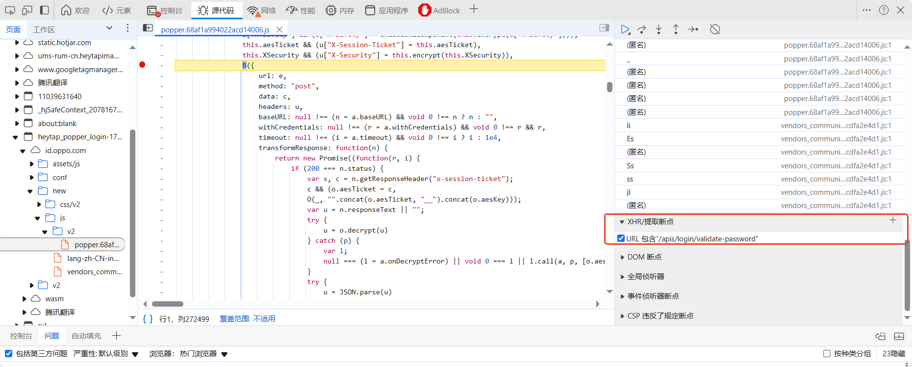

* 断点

  * 请求流程

  

  * xhr断点

  

  * 标签断点
  * 事件断点

* phantomjs.org+JsEncrypt插件

* 反调试与绕过
  * 禁用断点——但是测试人员也无法断点分析了
  * 编辑断点——false绕过
  * 永不在此处暂停
  * 函数置空
  * 本地文件替换——把反调试代码删除后，替换文件
* 混淆与解混淆
  * 开源
    * JJEncode
    * AAEncode
    * JSFuck
  * 闭源
  * 解混淆
    * 删除后面括号，输入控制台，使得`function xxx(){};xxx();`变为`function xxx(){};xxx`，即可打印出函数
    * 开源项目：[hax0r31337/JSDec: Online JavaScript decoder.Supported sojson v4/Premium/v5 and more(No longer update)](https://github.com/hax0r31337/JSDec)       [JSDec - Liulihaocai](https://jsdec.js.org/)
* 攻击面
  * 信息收集：URL、接口、敏感逻辑
  * 敏感信息：用户信息、云k、token
  * 潜在危险函数：eval
  * 开发框架历史漏洞