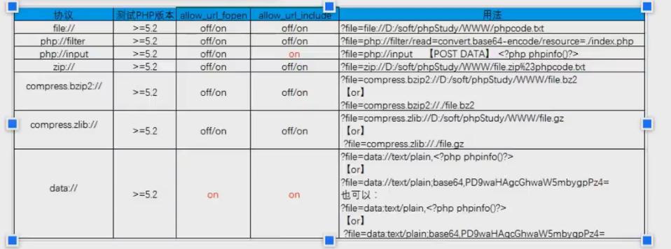

### 文件操作

* 条件竞争上传，是否需要自动写马
  * 马和访问同时intruder
* 二次渲染
  * 工具对比上传前后文件，不变部分写入shell
* move_uploaded_file
* 配置文件上传
  * .htaccess
  * .user.ini

* 文件上传分类
  * 原生态
  * 拓展
    * 中间件
    * 编辑器
    * CMS
* 其他
  * 目录权限控制
  * OSS
* 文件包含
  * 远程
  * 本地
    * 有文件利用，配合其他文件上传
    * 无文件利用
      * 日志
      * session文件
        * session值可控
        * PHP_SESSION_UPLOAD_PROGRESS+条件竞争
      * 伪协议利用

* 其他
  * 

### RCE
